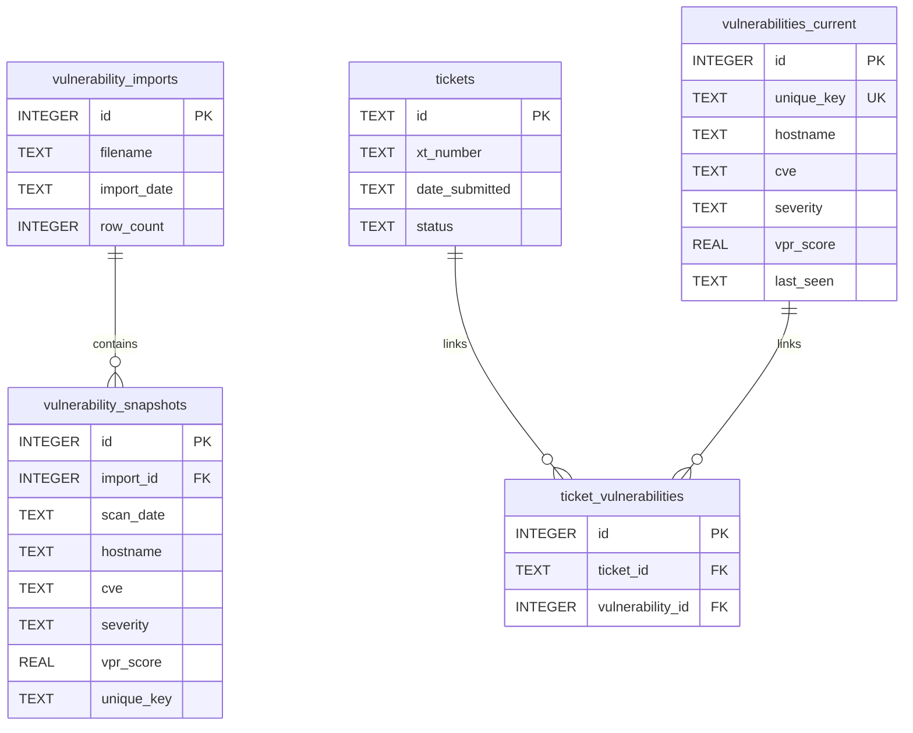

# GEMINI.md - Google Gemini CLI Instructions for HexTrackr

## Unified AI Development Workflow Integration

**Your Role**: Large context analysis and complex architectural tasks (2+ hours)

HexTrackr uses a unified AI development workflow with Claude Code as the central orchestrator. You handle tasks requiring deep codebase analysis that exceed other tools' context limits.

### Session Handoff Protocol

**CRITICAL**: Always check `/dev-docs/session-handoff.json` at session start for current context.

**At Session Start**:

1. Read `/dev-docs/session-handoff.json` for current project state
2. Review recent changes and priorities
3. Understand what task is being handed off and why

**At Session End**:

1. Update `/dev-docs/session-handoff.json` with your progress
2. Document any architectural decisions or patterns discovered
3. Note next steps or handoff requirements for other tools

### Your Specialization Areas

**Primary Tasks**:

- Major refactoring requiring full codebase analysis  
- Complex architectural changes across multiple files
- Performance optimization requiring deep system understanding
- Security audits and comprehensive code reviews
- Large-scale code migrations and modernization

**Handoff From**: Claude Code when context limits are reached
**Handoff To**: Claude Code for coordination, specialized agents for implementation

## Project Context

HexTrackr is a vulnerability and ticket management system (v1.0.4 as of September 5, 2025):

### Core Technologies

- **Backend:** Node.js/Express monolithic server (`server.js` ~1,200+ lines)
- **Database:** SQLite with rollover architecture (`data/hextrackr.db`)
- **Frontend:** Modular JavaScript, AG Grid, ApexCharts, Bootstrap 5, Tabler.io
- **Testing:** Playwright browser automation
- **Documentation:** Markdown-first with HTML generation

### Recent Achievements (v1.0.4)

- ✅ Modal layering bug fix with Bootstrap Modal.getInstance()
- ✅ Working table resizing and card pagination (6-card default)
- ✅ Version badge synchronization across components
- ✅ Enhanced agent architecture with Playwright testing

## Architecture

The application follows a monolithic architecture, with the Express.js server handling both API requests and serving frontend assets.

### Backend Architecture

The backend is a Node.js/Express monolithic server providing REST endpoints, data processing, and SQLite persistence. It also serves the static frontend assets and the documentation portal.

- **Monolithic Architecture**: A single `server.js` file (over 1,200 lines) handles all backend concerns, including routing, database interaction, and business logic.
- **Dual Purpose**: Acts as both an API server and a static file server for the UI.
- **Database**: A single SQLite database file (`data/hextrackr.db`) with a shared connection pool.
- **Security**: Includes a built-in `PathValidator` class for secure file system operations and sets standard security headers.

### Frontend Architecture

The frontend of HexTrackr is composed of two main pages, each with its own set of JavaScript modules and CSS styles. Shared components, such as the header, footer, and settings modal, are loaded dynamically on each page.

- **`tickets.html`**: Uses a combination of Bootstrap 5 and Tabler.io for its UI components.
- **`vulnerabilities.html`**: Uses the Tabler.io framework, with AG Grid for data tables and ApexCharts for visualizations.

### Database Architecture

HexTrackr uses a file-based SQLite 3 database as its primary data store.

- **Engine**: SQLite 3
- **Location**: `data/hextrackr.db`
- **Initialization**: The database is initialized by the `scripts/init-database.js` script.

#### Entity Relationship Diagram



### Vulnerability Rollover Architecture

A key feature of the backend is the **rollover architecture** for managing vulnerability data. This system processes daily scans to maintain both a current snapshot and a historical trend of vulnerabilities.

# Building and Running

## Prerequisites

- Node.js
- npm
- Docker

## Installation

1. Clone the repository.
2. Install the dependencies:

    ```bash
    npm install
    ```

## Running the Application

## This project must be run in a Docker container

To start the server in a Docker container:

```bash
docker-compose up -d
```

The application will be available at `http://localhost:8080`.

To start the server in development mode (with automatic reloading):

```bash
npm run dev
```

To start the server in production mode:

```bash
npm start
```

## Database Initialization

To initialize the database, run the following command:

```bash
npm run init-db
```

This will create the `hextrackr.db` file in the `data` directory and create the necessary tables.

# Development Conventions

## Linting

This project uses ESLint for JavaScript, Stylelint for CSS, and Markdownlint for Markdown. To run the linters, use the following commands:

- `npm run eslint`: Lint JavaScript files.
- `npm run stylelint`: Lint CSS files.
- `npm run lint:md`: Lint Markdown files.
- `npm run lint:all`: Run all linters.

To automatically fix linting errors, use the following commands:

- `npm run eslint:fix`: Fix JavaScript files.
- `npm run stylelint:fix`: Fix CSS files.
- `npm run lint:md:fix`: Fix Markdown files.
- `npm run fix:all`: Fix all files.

## Testing

This project uses Playwright for end-to-end testing. Tests are located in the `.playwright-mcp` directory.

**Important:** Restart the Docker container before running Playwright tests:

```bash
docker-compose restart
```

## Documentation

The documentation for this project is located in the `docs-source` directory and is written in Markdown. The documentation is then converted to HTML and served from the `docs-html` directory. To generate the HTML documentation, run the following command:

```bash
npm run docs:generate
```
