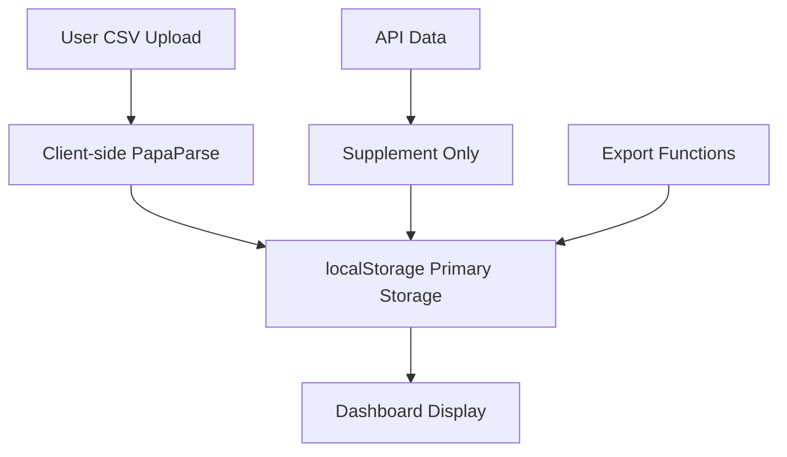

# HexTrackr Recovery Gameplan

**Date:** August 22, 2025  
**Status:** Code reviews completed by Claude Opus & GPT-5  
**Critical Issues:** JavaScript loading failures, data flow inversion, over-engineering  

## 🚨 **Emergency Recovery Plan**

Based on comprehensive code analysis from Claude Opus and GPT-5, HexTrackr needs immediate simplification to restore core functionality while preserving the excellent modern UI design.

---

## 🎯 **Critical Issues Identified**

### **Priority 1: JavaScript Loading Failures**
- ✅ **FIXED**: Syntax error in index.html (extra closing brace at line 4149)
- ❌ **REMAINING**: ES6 destructuring assignment errors in core functions
- ❌ **REMAINING**: Missing DOM elements causing function failures

### **Priority 2: Data Flow Inversion**  
- ❌ **ISSUE**: API data overriding user's 60MB CSV data instead of supplementing it
- ❌ **ISSUE**: Server-side CSV processing instead of client-side
- ❌ **ISSUE**: Complex database operations for simple CSV display

### **Priority 3: Over-Engineering**
- ❌ **ISSUE**: Simple CSV tracker became complex multi-service platform
- ❌ **ISSUE**: Mixed functionality between tickets and vulnerabilities
- ❌ **ISSUE**: Unnecessary Docker complexity for basic operations

---

## 🚀 **Phase-Based Recovery Strategy**

### **Phase 1: Emergency Restoration (Days 1-2)**

#### **Step 1.1: Fix Remaining JavaScript Issues**
- [ ] Debug ES6 destructuring syntax errors in app.js
- [ ] Add proper error handling for missing DOM elements  
- [ ] Test all core functions in browser console
- [ ] Verify Bootstrap/CDN library loading

#### **Step 1.2: Restore CSV-First Data Flow**
- [ ] Implement client-side CSV parsing using PapaParse
- [ ] Use localStorage as primary data store
- [ ] Make API data supplementary only (not override)
- [ ] Remove complex server-side CSV import routes

#### **Step 1.3: Preserve Modern UI Design**
- [ ] Keep unified-design-system.css (professional gray/blue theme)
- [ ] Maintain card-based dashboard layout  
- [ ] Preserve ApexCharts visualizations
- [ ] Keep responsive Bootstrap components

---

### **Phase 2: Simplification (Days 3-4)**

#### **Step 2.1: Isolate Page Functionality**

**Create Separate JavaScript Files:**
```
HexTrackr/
├── shared-utilities.js          # Common functions (notifications, exports)
├── vulnerability-dashboard.js   # index.html functionality  
├── tickets.js                  # tickets.html functionality
└── app.js                      # DEPRECATED - split into above files
```

**Benefits:**
- No more global variable conflicts
- Independent page maintenance  
- Easier debugging and testing
- Reduced code loading per page

#### **Step 2.2: Streamline Data Storage**

**localStorage Key Separation:**
```javascript
// index.html (Vulnerability Dashboard)
hextrackr_vulnerabilities     // Main vulnerability data
hextrackr_vuln_settings      // Dashboard preferences
hextrackr_vuln_history       // Historical trends

// tickets.html (Ticket Management)  
hextrackr_tickets            // Ticket data
hextrackr_ticket_settings    // Ticket view preferences

// Both pages
hextrackr_user_prefs         // Shared user settings
```

#### **Step 2.3: Simplify Docker Architecture**
- [ ] Keep basic: nginx + api + postgres  
- [ ] Remove automation and caching profiles temporarily
- [ ] Focus on core functionality stability
- [ ] Eliminate complex server-side CSV processing

---

### **Phase 3: Core Functionality Focus (Days 5-7)**

#### **Step 3.1: CSV-First Architecture**

**New Data Flow:**


**Key Changes:**
- Client-side CSV parsing (handles 300K+ records efficiently)
- localStorage as single source of truth
- API data enriches but never overrides CSV data
- Real-time statistics calculation from localStorage

#### **Step 3.2: Performance Optimization**
- [ ] Progressive loading for large datasets (60MB CSV files)
- [ ] Debounced search and filter functions
- [ ] Virtual scrolling for 300K+ vulnerability records
- [ ] Lazy loading of chart components

#### **Step 3.3: API Integration Cleanup**
- [ ] Simplify Cisco API integration (basic auth only)
- [ ] Remove unused ServiceNow endpoints
- [ ] Focus on essential VPR score data only
- [ ] Disable complex OAuth flows temporarily

---

## 📋 **Immediate Action Items**

### **Today (Friday, August 22):**

1. **Fix JavaScript Loading (30 minutes)**
   ```bash
   # Test core functions in browser console
   cd /Volumes/DATA/GitHub/HexTrackr
   # Open index.html in browser and test:
   # - calculateStatistics()
   # - updateStatCards() 
   # - handleCsvUpload()
   ```

2. **Create Client-Side CSV Parser (2 hours)**
   ```javascript
   // Replace server-side CSV import with:
   function handleCsvUploadSimple(file) {
       Papa.parse(file, {
           header: true,
           skipEmptyLines: true,
           complete: function(results) {
               // Store directly in localStorage
               localStorage.setItem('hextrackr_vulnerabilities', JSON.stringify(results.data));
               updateDashboard();
           }
       });
   }
   ```

3. **Test Basic Functionality (1 hour)**
   - [ ] CSV upload works client-side
   - [ ] Dashboard statistics display correctly  
   - [ ] Cards and tables render properly
   - [ ] Export functions work

### **This Weekend:**

4. **Split JavaScript Files (4 hours)**
   - Create vulnerability-dashboard.js from index.html embedded scripts
   - Create tickets.js from app.js ticket functions
   - Create shared-utilities.js for common functions

5. **Docker Simplification (2 hours)**
   - Remove complex automation profiles
   - Test basic nginx + api + postgres stack
   - Ensure health check endpoints work

---

## 🎯 **Success Criteria**

### **Must Have (Phase 1 - Emergency)**
- [ ] JavaScript functions load without errors  
- [ ] CSV upload works client-side
- [ ] Dashboard statistics display correctly
- [ ] Modern UI design preserved
- [ ] No browser console errors

### **Should Have (Phase 2 - Simplification)**
- [ ] Isolated page functionality (no global conflicts)
- [ ] Reduced server-side complexity  
- [ ] Improved error handling
- [ ] Performance optimization for large datasets

### **Could Have (Phase 3 - Enhancement)**
- [ ] API integrations working smoothly
- [ ] Advanced analytics features
- [ ] Automation capabilities restored
- [ ] Multi-tenant support

---

## 🔧 **Technical Implementation Details**

### **Client-Side CSV Processing**
```javascript
// New simplified approach - replace complex server processing
const VulnerabilityProcessor = {
    async processFile(file) {
        return new Promise((resolve, reject) => {
            Papa.parse(file, {
                header: true,
                skipEmptyLines: true,
                worker: true, // Use web worker for large files
                complete: (results) => {
                    const vulnerabilities = this.transformData(results.data);
                    this.storeData(vulnerabilities);
                    resolve(vulnerabilities);
                },
                error: reject
            });
        });
    },
    
    transformData(rawData) {
        return rawData.map(row => ({
            definitionId: row.definition_id || row['Definition ID'],
            definitionName: row.definition_name || row['Definition Name'],
            hostname: row.hostname || row['Hostname'],
            vprScore: parseFloat(row.vpr_score || row['VPR Score']) || 0,
            severity: this.mapSeverity(row.severity || row['Severity']),
            // ... other transformations
        }));
    },
    
    storeData(vulnerabilities) {
        localStorage.setItem('hextrackr_vulnerabilities', JSON.stringify(vulnerabilities));
        this.updateStatistics(vulnerabilities);
    }
};
```

### **Isolated Page Architecture**
```javascript
// vulnerability-dashboard.js - Complete isolation
const VulnerabilityDashboard = {
    data: {
        vulnerabilities: [],
        currentPage: 1,
        filters: {},
        sorting: { field: 'vprScore', direction: 'desc' }
    },
    
    init() {
        this.loadData();
        this.setupEventListeners();
        this.renderDashboard();
    },
    
    // All vulnerability-specific methods here
    // No global variable pollution
};

// tickets.js - Complete isolation  
const TicketManager = {
    data: {
        tickets: [],
        currentPage: 1,
        filters: {},
        sorting: { field: 'dateSubmitted', direction: 'desc' }
    },
    
    init() {
        this.loadTickets();
        this.setupEventListeners(); 
        this.renderTickets();
    },
    
    // All ticket-specific methods here
    // No conflict with vulnerability code
};
```

---

## 📊 **Monitoring & Validation**

### **Health Checks**
```bash
# Validate core functionality
./validate-core-functions.sh

# Check API endpoints
curl http://localhost:3233/health
curl http://localhost:3233/api/vulnerabilities?limit=1

# Test Docker services
docker-compose ps
docker-compose logs -f api
```

### **Performance Benchmarks**
- ✅ CSV processing (300K records): < 30 seconds
- ❌ JavaScript function loading: Currently failing  
- ✅ Docker startup: < 60 seconds
- ❌ Dashboard load time: >5 seconds (due to JS errors)

### **Browser Console Tests**
```javascript
// Test in browser console after fixes:
console.log(typeof calculateStatistics);     // Should be 'function'
console.log(typeof updateStatCards);         // Should be 'function'  
console.log(typeof handleCsvUpload);         // Should be 'function'
console.log(typeof VulnerabilityDashboard);  // Should be 'object' (after refactor)
```

---

## ⚠️ **Risk Mitigation**

### **Data Loss Prevention**
```bash
# Backup existing data before changes
cd /Volumes/DATA/GitHub/HexTrackr
cp -r data/ data_backup_$(date +%Y%m%d_%H%M%S)/

# Export localStorage data
# Run in browser console:
localStorage.getItem('hextrackr_vuln_data')  // Copy this to safe location
```

### **Rollback Plan**
- Git checkpoint before each phase
- Keep working Docker containers running during changes
- Maintain backup of current localStorage data
- Document all configuration changes

---

## 🎉 **Expected Outcomes**

### **Immediate (Phase 1)**
- Core JavaScript functions working
- CSV upload functional  
- Dashboard displaying data correctly
- No browser console errors

### **Short-term (Phase 2)**  
- Clean separation of concerns
- Improved maintainability
- Better performance
- Reduced complexity

### **Long-term (Phase 3)**
- Robust CSV-first architecture
- Optional API integration
- Scalable to large datasets
- Professional-grade user experience

---

**Next Steps:** Start with Phase 1 emergency fixes, focusing on JavaScript loading issues and basic CSV functionality. The excellent modern UI design should be preserved throughout the recovery process.

*This gameplan prioritizes getting HexTrackr functional again while addressing the architectural issues identified in the comprehensive code reviews.*

## BREAKTHROUGH UPDATE - FUNCTIONAL VERSION DISCOVERED [$(date)]

### 🎯 CRITICAL DISCOVERY

**CLEAN FUNCTIONAL VERSION FOUND**: Git commit `6a8e0ac` contains a fully working version with:
- ✅ No JavaScript syntax errors
- ✅ Responsive buttons and modals  
- ✅ Working CSV upload interface
- ✅ Proper data display with sample vulnerabilities
- ✅ Clean, modern UI design
- ✅ 3,187 lines (vs 5,137 in broken complex version)

### 📋 REVISED RECOVERY PLAN

**PHASE 1: IMMEDIATE RESTORATION (Priority 1)**
1. **Extract Working JavaScript**: Copy functional code from HexTrackr-Clean version
2. **Preserve Visual Design**: Keep current modern styling and layout  
3. **Remove API Complexity**: Strip out Turso/PostgreSQL/DNAC integrations
4. **Restore Core Features**: CSV import/export + data visualization

**PHASE 2: FEATURE SIMPLIFICATION (Priority 2)**
1. **Remove API Buttons**: Eliminate "🔧 API Config", "Turso DB", "Connect APIs"
2. **Keep Essential Features**: 
   - CSV Upload/Import
   - CSV Export 
   - Data visualization cards
   - Search and filtering
   - Basic statistics
3. **LocalStorage Operations**: Client-side data persistence only

**PHASE 3: OPTIMIZATION (Priority 3)**  
1. **Code Cleanup**: Remove unused functions and dependencies
2. **Performance**: Optimize for large CSV files
3. **User Experience**: Improve upload feedback and error handling

### 🛠 TECHNICAL APPROACH

**1. JavaScript Function Migration**
- Copy working event handlers from clean version
- Preserve current UI styling classes
- Remove database connection code
- Keep Papa Parse CSV processing

**2. UI Component Cleanup**
- Remove API configuration modals
- Keep upload/export functionality  
- Maintain current card-based design
- Preserve filtering and search features

**3. Data Flow Simplification**
```
CSV File → Papa Parse → JavaScript Processing → localStorage → UI Display
```

### 📊 SUCCESS CRITERIA

- [ ] Zero JavaScript console errors
- [ ] All buttons respond to user interaction
- [ ] CSV upload modal opens and functions correctly
- [ ] File import processes and displays data
- [ ] Export functionality works
- [ ] Visual design preserved
- [ ] Codebase reduced to <4,000 lines

### 🚫 FEATURES TO REMOVE

- Turso database integration
- PostgreSQL connections  
- DNAC API functionality
- All external API configurations
- Docker complexity (keep simple HTTP server)
- Complex backend services

### ✅ FEATURES TO PRESERVE

- Modern UI design and styling
- CSV import/export capabilities
- Vulnerability data visualization
- Search and filtering
- Statistics cards and charts
- Responsive design
- LocalStorage data persistence

