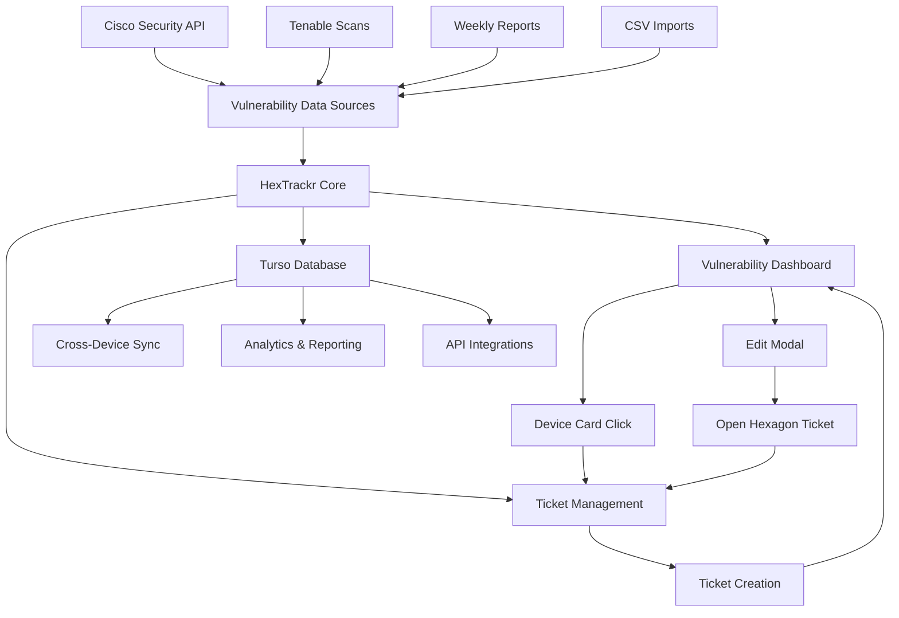
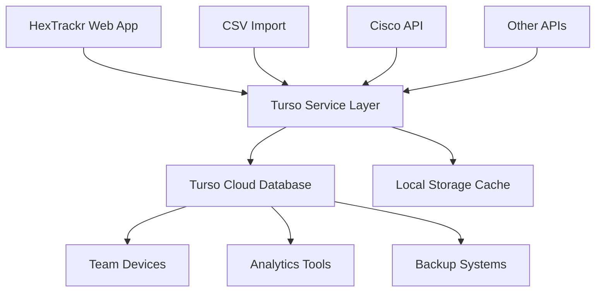

# HexTrackr Turso Database Integration & Workflow Management

## Overview

HexTrackr integrates with Turso, a distributed SQLite database platform, to provide cloud storage and synchronization capabilities for vulnerability and ticket data. This integration enables seamless workflow management between vulnerability tracking and ticket generation, solving browser localStorage limitations while handling large datasets.

## Workflow Architecture

### 🔄 **Vulnerability-to-Ticket Pipeline**



### 🎯 **Integration Workflow**

1. **Data Ingestion**
   - Weekly management reports → CSV processing → Vulnerability dashboard
   - Cisco/Tenable APIs → Real-time CVE/VPR data → Auto-enrichment
   - Manual imports → Large dataset handling via Turso

2. **Vulnerability-to-Ticket Flow**
   - Vulnerability card → Edit modal → "Open Hexagon Ticket" → Auto-populate ticket form
   - Device click in tickets → Navigate to vulnerability dashboard device view
   - Ticket creation → Auto-sync to vulnerability system with cross-references

3. **Template Generation**
   - Vulnerability data → Easy-copy remediation templates
   - Standardized ticket formats for network admin workflows
   - Automated severity-based template selection

## Key Features

### 🚀 **Performance Benefits**

- **Large File Processing**: Handle CSV files with 100,000+ vulnerability records
- **Memory Optimization**: Offload data processing to cloud database
- **Fast Queries**: SQLite performance with cloud accessibility
- **Batch Operations**: Efficient bulk data operations

### 🔄 **Synchronization**

- **Cross-Device Access**: Access data from multiple browsers/devices
- **Team Collaboration**: Share vulnerability data across team members
- **Automatic Backup**: Cloud storage prevents data loss
- **Version Control**: Track data changes over time
- **Bi-directional Sync**: Changes in tickets automatically reflect in vulnerability dashboard

### 📊 **Analytics & Reporting**
- **Custom Queries**: Run SQL queries on vulnerability data
- **Historical Analysis**: Track vulnerability trends over time
- **Export Capabilities**: Export to CSV, JSON, or other formats
- **Integration Ready**: Connect to BI tools and reporting systems

## Architecture



## Implementation Details

### Service Layer (`turso-service.js`)

The `TursoService` class provides the core database operations:

```javascript
class TursoService {
    // Connection management
    async initialize(config)
    async testConnection()
    
    // Schema management
    async initializeSchema()
    
    // Data operations
    async syncVulnerabilities(vulnerabilities)
    async loadVulnerabilities()
    async syncTickets(tickets)
    async loadTickets()
    
    // Utilities
    async getStatistics()
    async query(sql, args)
}
```

### Configuration Manager (`turso-config.js`)

The `TursoConfigManager` class handles UI and configuration:

```javascript
class TursoConfigManager {
    // UI management
    setupUI()
    openModal()
    
    // Configuration
    saveConfig()
    testConnection()
    
    // Synchronization
    syncVulnerabilities()
    syncTickets()
    restoreVulnerabilities()
    restoreTickets()
}
```

## Database Schema

### Vulnerabilities Table
Stores vulnerability scan results with optimized indexing:
- **Primary Key**: Auto-incrementing ID
- **Unique Constraint**: hostname + definition_id
- **Indexes**: severity, vendor, date_created

### Tickets Table
Stores Hexagon ticket information:
- **Primary Key**: Auto-incrementing ID
- **Unique Constraint**: hexagon_ticket number
- **JSON Field**: devices (array of device names)

### Sync Metadata Table
Tracks synchronization status and statistics:
- **Sync Status**: pending, in_progress, completed, error
- **Record Counts**: for validation and reporting
- **Timestamps**: for sync scheduling and troubleshooting

## Data Flow

### Import Process
1. **CSV Upload** → Browser parsing
2. **Batch Processing** → Memory-efficient processing
3. **Data Transformation** → Standardized format
4. **Local Storage** → Immediate availability
5. **Cloud Sync** → Background upload to Turso

### API Integration
1. **API Authentication** → Secure credential storage
2. **Data Fetching** → Rate-limited API calls
3. **Data Transformation** → Vendor-specific mapping
4. **Merge Operations** → Deduplication and updates
5. **Dual Storage** → Local cache + cloud persistence

### Synchronization
1. **Change Detection** → Monitor data modifications
2. **Conflict Resolution** → Last-write-wins strategy
3. **Batch Uploads** → Efficient network usage
4. **Progress Tracking** → User feedback and monitoring
5. **Error Handling** → Retry mechanisms and rollback

## Performance Optimizations

### Memory Management
- **Streaming Processing**: Process large files in chunks
- **Memory Monitoring**: Track browser memory usage
- **Garbage Collection**: Explicit cleanup of large objects
- **Progressive Loading**: Load data as needed

### Network Efficiency
- **Batch Operations**: Combine multiple operations
- **Compression**: Minimize data transfer
- **Connection Pooling**: Reuse database connections
- **Retry Logic**: Handle network interruptions

### Caching Strategy
- **Local Cache**: Immediate data access
- **Smart Sync**: Only sync changed data
- **Offline Support**: Work without internet connection
- **Background Sync**: Non-blocking operations

## Security Implementation

### Authentication
- **OAuth 2.0**: Secure API authentication
- **Token Management**: Automatic token refresh
- **Credential Encryption**: Browser-based encryption
- **Secure Storage**: Protected credential storage

### Data Protection
- **Encryption in Transit**: TLS/SSL for all connections
- **Access Control**: Token-based authorization
- **Audit Logging**: Track all database operations
- **Data Validation**: Input sanitization and validation

### Privacy Compliance
- **Data Minimization**: Store only necessary fields
- **Retention Policies**: Configurable data lifecycle
- **Export Controls**: User data portability
- **Deletion Capabilities**: Complete data removal

## Monitoring & Observability

### Performance Metrics
- **Sync Duration**: Track operation performance
- **Data Volume**: Monitor transfer sizes
- **Error Rates**: Identify issues early
- **User Activity**: Usage patterns and bottlenecks

### Health Checks
- **Connection Status**: Database availability
- **Schema Validation**: Data integrity checks
- **Sync Status**: Operation completion tracking
- **Resource Usage**: Memory and storage monitoring

### Alerting
- **Sync Failures**: Immediate notification
- **Storage Limits**: Quota warnings
- **Performance Degradation**: Threshold alerts
- **Security Events**: Access anomalies

## Scaling Considerations

### Data Volume
- **Partitioning**: Distribute large datasets
- **Archiving**: Move old data to cold storage
- **Indexing**: Optimize query performance
- **Compression**: Reduce storage requirements

### Concurrent Users
- **Connection Pooling**: Handle multiple users
- **Load Balancing**: Distribute database load
- **Caching**: Reduce database pressure
- **Rate Limiting**: Prevent abuse

### Geographic Distribution
- **Multi-Region**: Reduce latency
- **Data Locality**: Store data near users
- **Replication**: High availability setup
- **Edge Caching**: Faster data access

## Troubleshooting Guide

### Common Issues

**Connection Failures**
- Verify database URL and token
- Check network connectivity
- Validate credentials format
- Test with CLI tools

**Sync Errors**
- Monitor browser console
- Check data format compatibility
- Verify schema integrity
- Review error logs

**Performance Issues**
- Monitor memory usage
- Check network speed
- Optimize data size
- Use batch operations

### Debugging Tools
- **Browser DevTools**: Network and console monitoring
- **Turso CLI**: Direct database access
- **Performance API**: Memory and timing metrics
- **Error Tracking**: Comprehensive error logging

## Future Enhancements

### Planned Features
- **Real-time Sync**: WebSocket-based updates
- **Conflict Resolution**: Advanced merge strategies
- **Data Versioning**: Track data history
- **Advanced Analytics**: Built-in reporting tools

### Integration Opportunities
- **Webhook Support**: External system notifications
- **API Extensions**: RESTful data access
- **Mobile Apps**: Native mobile clients
- **Desktop Sync**: Offline-capable desktop app

## Best Practices

### Development
1. Test with large datasets during development
2. Implement comprehensive error handling
3. Use TypeScript for better type safety
4. Follow security best practices

### Deployment
1. Monitor performance metrics
2. Set up automated backups
3. Configure proper access controls
4. Plan for disaster recovery

### Maintenance
1. Regular database optimization
2. Monitor storage usage
3. Update security credentials
4. Review access logs regularly

This integration provides HexTrackr with enterprise-grade data management capabilities while maintaining the simplicity and flexibility of the original application.
