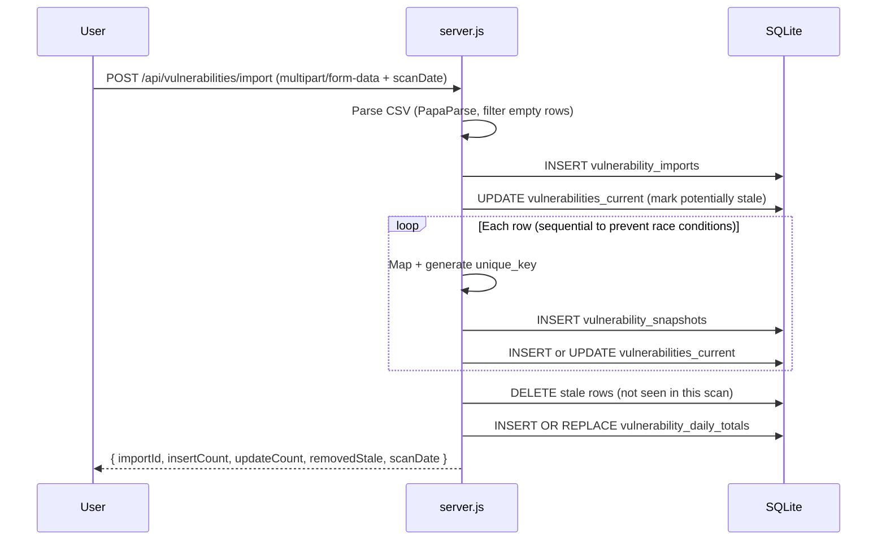
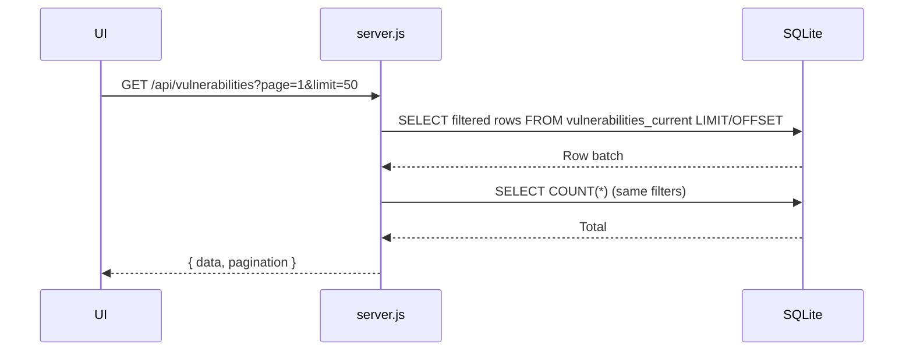

# Backend Architecture

The backend is a Node.js/Express monolith providing REST endpoints, rollover ingestion, documentation delivery, and SQLite persistence. It serves the static frontend pages (`tickets.html`, `vulnerabilities.html`) and the generated documentation portal (`/docs-html`).

---

## Key Characteristics

- **Monolithic File**: `server.js` (≈1,700+ lines) – routes, DB init, rollover logic, backups, static serving.
- **Unified Delivery**: API + static assets + docs from one process.
- **Embedded DB**: Single SQLite file (`data/hextrackr.db`). No external service dependency.
- **Security Utilities**: In‑process `PathValidator` for safe file operations + security headers.

---

## Core Components

| Component | Purpose |
| --------- | ------- |
| `server.js` | Main application runtime (all routes + logic) |
| `scripts/init-database.js` | Bootstrap base schema & indexes (legacy + foundational tables) |
| Rollover Functions | Sequential import processing & aggregation (`processVulnerabilityRowsWithRollover`) |
| `PathValidator` | Normalizes & validates file paths (defense-in-depth) |
| Docs Portal Logic | Dynamic redirect + stats endpoint (`/api/docs/stats`) |

---

## Middleware & Infrastructure

| Concern | Implementation |
| ------- | -------------- |
| CORS | `cors()` (open by default) |
| Compression | `compression()` |
| Parsing | `express.json` & `express.urlencoded` (100MB limit) |
| Uploads | `multer` (CSV import; 100MB cap) |
| Security Headers | `X-Content-Type-Options`, `X-Frame-Options`, `X-XSS-Protection` |
| Static Assets | `express.static` (root + `docs-html/`) |

---

## Persistence & Schema Evolution

- **Initialization**: If DB missing, runs `scripts/init-database.js`.
- **Runtime Evolution**: Idempotent `ALTER TABLE` adds new columns (`vendor`, `vulnerability_date`, `state`, `import_date`, etc.) to legacy tables for backward compatibility.
- **Rollover Tables**: Created on startup if absent (`vulnerability_snapshots`, `vulnerabilities_current`, `vulnerability_daily_totals`).

See: [Data Model](./data-model.md) for exhaustive schema & index inventory.

---

## Vulnerability Rollover Workflow

Purpose: Maintain real‑time deduplicated active set + full historical timeline + fast daily aggregates.

### CSV Import (Rollover Path)

### Key Safeguards

| Risk | Mitigation |
| ---- | ---------- |
| Row duplication in batch | In‑memory `Set` of processed unique_keys |
| Race conditions | Explicit sequential loop instead of `forEach` callbacks |
| Data drift | Historical record preserved in snapshots before updates |
| Performance | Indexes on `unique_key`, `scan_date`, severities |

---

## API Surface (High-Level)

| Domain | Endpoints (Examples) |
| ------ | -------------------- |
| Health | `GET /health` |
| Vulnerabilities (Current) | `GET /api/vulnerabilities`, `/stats`, `/recent-trends`, `/trends` |
| Vulnerability Import | `POST /api/vulnerabilities/import` (rollover), `POST /api/import/vulnerabilities` (legacy) |
| Tickets | `GET/POST/PUT/DELETE /api/tickets`, `POST /api/tickets/migrate`, `POST /api/import/tickets` |
| Reference | `GET /api/sites`, `GET /api/locations` |
| Backup/Restore | `GET /api/backup/stats`, `GET /api/backup/all`, `POST /api/restore`, clear endpoints |
| Documentation | `GET /api/docs/stats`, `/docs-html` SPA shell & hash routing |

---

## Real-time Communication (WebSocket)

In addition to the REST API, HexTrackr utilizes a WebSocket server for real-time communication with clients.

- **Port**: 8080
- **Library**: Socket.io

The WebSocket server is primarily used to provide real-time feedback on long-running processes, such as data imports. It emits events to the client to indicate progress, completion, or errors.

For more details, see the [WebSocket API documentation](../api-reference/websocket-api.md).

---

## Pagination Flow (Current Vulnerabilities)

---

## Legacy vs Rollover Paths

| Aspect | Legacy `vulnerabilities` | Rollover Tables |
| ------ | ------------------------ | --------------- |
| Purpose | Early ingestion & export | Current production analytics |
| Dedupe | Unique per (hostname, cve, import_date) index | Algorithmic unique_key with hostname normalization |
| History | Implicit (one row per scan) | Explicit snapshots + daily aggregates |
| Future | To be deprecated | Strategic direction |

---

## Utility Endpoints

- **`GET /health`**: `{ status, version, db, uptime }`
- **`GET /api/docs/stats`**: Counts routes + approximates function definitions.
- **Backup**: Returns structured JSON (vulnerabilities legacy + tickets) or combined.

---

## Security & Hardening

| Concern | Current | Planned |
| ------- | ------- | ------- |
| File access | `PathValidator` | Central audit logging of rejections |
| Upload size | 100MB cap | Configurable env var (`HEXTRACKR_MAX_UPLOAD_MB`) |
| TLS | External termination | Compose example with Caddy / nginx |
| Input validation | Minimal (mapping layer) | JSON schema (Ajv) enforcement |
| Logging | Console + stderr | Structured JSON + request IDs |

---

## Planned Enhancements

| Area | Enhancement |
| ---- | ---------- |
| Observability | Prometheus metrics (import latency, row counts) |
| Modularization | Extract rollover & backup modules |
| Validation | Enforce severity enumeration + CVE format checks |
| Migration | Retire legacy vulnerabilities pathway |
| Testing | Playwright + API contract tests for import & pagination |

---

## Summary

The backend favors simplicity (single process, embedded DB) while implementing a robust rollover pipeline for vulnerability lifecycle tracking. Incremental improvements will focus on modularity, observability, and deprecating legacy ingestion paths.
