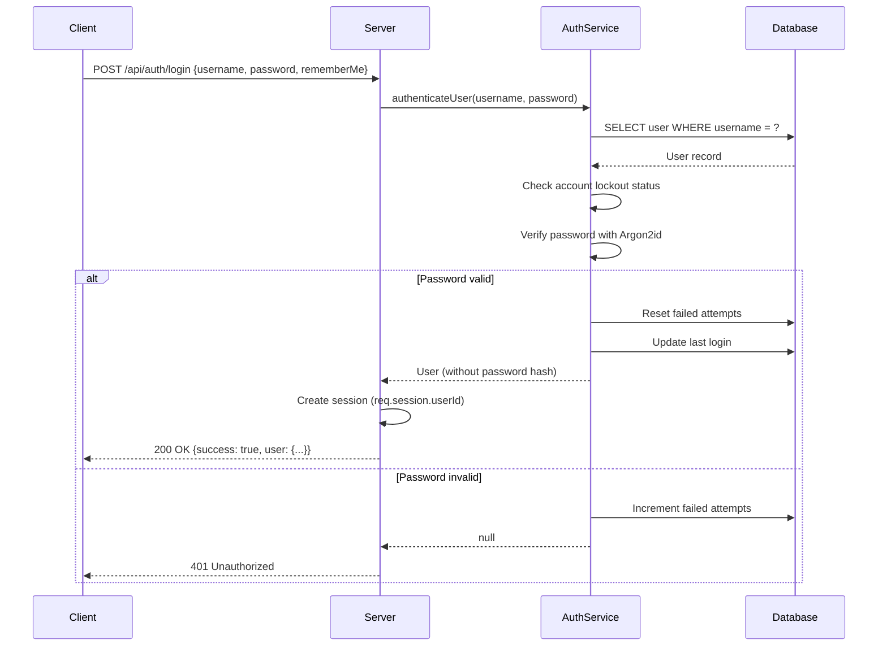
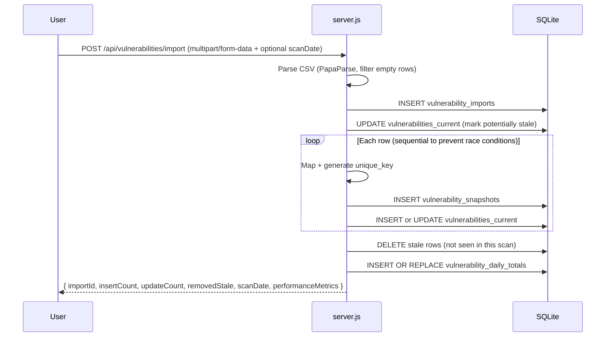
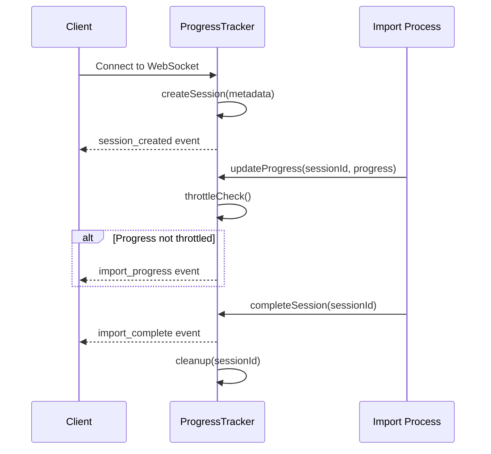
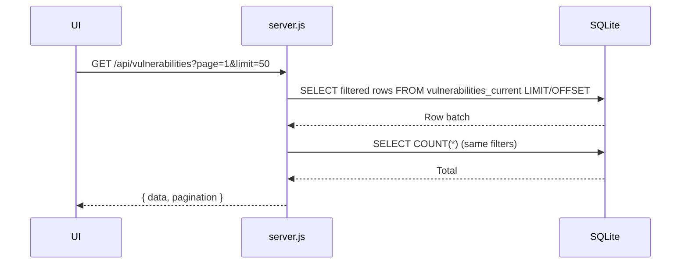

# Backend Architecture

The backend is a modular Node.js/Express application providing REST endpoints, rollover ingestion, documentation delivery, and SQLite persistence. It serves the static frontend pages (`tickets.html`, `vulnerabilities.html`) and the generated documentation portal (`/docs-html`).

---

## Key Characteristics

- **Modular Architecture**: `server.js` (~831 lines) orchestrates modular components across multiple directories.
- **Separation of Concerns**: Controllers, services, routes, and configuration are cleanly separated.
- **Unified Delivery**: API + static assets + docs from one process.
- **Embedded DB**: Single SQLite file (`data/hextrackr.db`). No external service dependency.
- **Security Utilities**: Extracted `PathValidator` class for safe file operations + security headers.

---

## Core Components

| Component | Purpose | Location |
| --------- | ------- | -------- |
| `server.js` (~831 lines) | Main application runtime (orchestration + initialization) | `/app/public/` |
| **Controllers** | Business logic (mixed patterns - see Controller Patterns section) | `/app/controllers/` |
| **Services** | Data access and business services | `/app/services/` |
| **Routes** | Express route definitions | `/app/routes/` |
| **Configuration** | Database, middleware, websocket configs | `/app/config/` |
| **Utilities** | PathValidator, ProgressTracker, helpers, seedEmailTemplates | `/app/utils/` |
| `init-database.js` | Bootstrap base schema & indexes | `/app/public/scripts/` |
| Rate Limiting | Cache-aware throttling (60 req/15min prod, 10,000 req/1min dev) | Express middleware |

### Module Organization

| Directory | Contents | Pattern |
| --------- | -------- | ------- |
| `/app/controllers/` | 13 controller modules | Singleton (8), Constructor (3), Module Exports (1), Functional (1) |
| `/app/services/` | 20 service modules | Functional exports with dependency injection |
| `/app/routes/` | 15 route definition files | Express router pattern |
| `/app/config/` | 5 configuration modules | Module exports |
| `/app/middleware/` | 5 middleware modules | Express middleware pattern |
| `/app/utils/` | 5 utility modules | Static class methods and helper functions |

### Controller Files

| Controller | Pattern | Methods | Dependency Injection |
| ---------- | ------- | ------- | -------------------- |
| `vulnerabilityController.js` | Singleton | 14 static methods | `initialize(db, progressTracker)` |
| `ticketController.js` | Singleton | 7 static methods | `initialize(db)` |
| `backupController.js` | Singleton | 6 static methods | `initialize(db)` |
| `templateController.js` | Singleton | 7 static methods | `initialize(db)` |
| `authController.js` | Singleton | 5 static methods | `initialize(db)` |
| `preferencesController.js` | Singleton | 7 static methods | `initialize(db)` |
| `kevController.js` | Constructor | 7 instance methods | `constructor(db)` |
| `ciscoController.js` | Constructor | 6 instance methods | `constructor(db, preferencesService)` |
| `paloAltoController.js` | Constructor | 6 instance methods | `constructor(db, preferencesService)` |
| `docsController.js` | Module Exports | 2 exported functions | Instance created internally, methods exported as wrappers |
| `importController.js` | Functional | 6 exported functions | `setProgressTracker(tracker)` |
| `locationController.js` | Singleton | 3 static methods | `initialize(db)` |
| `auditLogController.js` | Singleton | 3 static methods | `initialize()` |

### Service Files

| Service | Purpose | Key Methods |
| ------- | ------- | ----------- |
| `databaseService.js` | Core database operations | `getDb()`, `runQuery()`, `transaction()`, `startAutoVacuum()` |
| `authService.js` *(v1.0.46+)* | Authentication and session management | `authenticateUser()`, `validateSession()`, `changePassword()` |
| `vulnerabilityService.js` | Vulnerability CRUD operations | `getVulnerabilities()`, `createVulnerability()`, `streamExport()` |
| `vulnerabilityStatsService.js` | Statistics and aggregations | `getStats()`, `getTrends()`, `getVendorStats()` |
| `ticketService.js` | Ticket CRUD operations | `getTickets()`, `createTicket()`, `updateTicket()` |
| `templateService.js` *(v1.0.46+)* | Email template management | `getTemplates()`, `createTemplate()`, `updateTemplate()` |
| `preferencesService.js` *(v1.0.46+)* | User preferences CRUD | `getPreferences()`, `updatePreferences()`, `getPreference()`, `setPreference()` |
| `kevService.js` *(v1.0.22+)* | CISA KEV integration | `syncKevData()`, `getSyncStatus()`, `getKevByCve()` |
| `ciscoAdvisoryService.js` *(v1.0.63+, HEX-141)* | Cisco PSIRT advisory integration | `syncCiscoAdvisories()`, `getSyncStatus()`, `getCiscoCredentials()` |
| `paloAltoService.js` *(v1.0.63+, HEX-209)* | Palo Alto Security Advisory integration | `syncPaloAdvisories()`, `getSyncStatus()`, `fetchPaloAdvisories()` |
| `hostnameParserService.js` | Hostname parsing and normalization | `parseHostname()`, `extractDomain()`, `normalizeHostname()` |
| `importService.js` | Import business logic | `processVulnerabilitiesWithLifecycle()`, `bulkLoadToStagingTable()` |
| `backupService.js` | Backup/restore operations | `getBackupStats()`, `restoreBackup()`, `exportData()` |
| `docsService.js` | Documentation statistics | `computeStats()`, `computeApiEndpoints()` |
| `fileService.js` | File system operations | `readFile()`, `writeFile()`, `validatePath()` |
| `progressService.js` | WebSocket progress tracking | `createSession()`, `updateProgress()`, `completeSession()` |
| `validationService.js` | Input validation and sanitization | `validateVulnerability()`, `sanitizeInput()`, `validateTicket()` |
| `loggingService.js` *(v1.0.67+, HEX-254)* | Centralized logging with encrypted audit trail | `initialize()`, `info()`, `warn()`, `error()`, `audit()`, `debug()` |
| `cacheService.js` *(v1.0.46+)* | Server-side caching with TTL | `withCaching()`, `invalidateCache()`, `getCacheStats()` |

---

## Controller Patterns

The backend uses three distinct controller patterns, balancing consistency with flexibility based on controller requirements:

### Singleton Pattern Controllers

Eight controllers implement the singleton pattern (`VulnerabilityController`, `TicketController`, `BackupController`, `TemplateController`, `AuthController`, `PreferencesController`, `LocationController`, `AuditLogController`):

```javascript
class VulnerabilityController {
    static instance = null;

    static initialize(database, progressTracker) {
        if (!VulnerabilityController.instance) {
            VulnerabilityController.instance = new VulnerabilityController();
        }
        VulnerabilityController.instance.db = database;
        VulnerabilityController.instance.progressTracker = progressTracker;
        return VulnerabilityController.instance;
    }

    static getInstance() {
        if (!VulnerabilityController.instance) {
            throw new Error("Controller not initialized. Call initialize() first.");
        }
        return VulnerabilityController.instance;
    }

    // All route methods are static and use getInstance()
    static async getStats(req, res) {
        const controller = VulnerabilityController.getInstance();
        // Implementation...
    }
}
```

**Characteristics:**

- Static `initialize()` method for dependency injection
- Static `getInstance()` method for retrieving singleton
- All route methods are static
- Throws error if accessed before initialization

### Constructor Pattern Controllers

Three controllers use the constructor pattern (`KevController`, `CiscoController`, `PaloAltoController`). These controllers instantiate new instances via routes, providing flexibility for dependency injection:

**KevController (Constructor with factory function in routes):**

```javascript
class KevController {
    constructor(db) {
        this.kevService = new KevService(db);
    }

    async syncKevData(req, res) {
        // Instance method implementation
    }
}

// Route file uses factory function
module.exports = (db) => {
    const controller = new KevController(db);
    const router = express.Router();
    router.post("/sync", controller.syncKevData.bind(controller));
    return router;
};
```

**CiscoController & PaloAltoController (Constructor with multiple dependencies):**

```javascript
class CiscoController {
    constructor(db, preferencesService) {
        this.ciscoAdvisoryService = new CiscoAdvisoryService(db, preferencesService);
    }

    async syncCiscoAdvisories(req, res) {
        // Instance method implementation
    }
}

// Route file instantiates with dependencies
module.exports = (db, preferencesService) => {
    const controller = new CiscoController(db, preferencesService);
    const router = express.Router();
    router.post("/sync", controller.syncCiscoAdvisories.bind(controller));
    return router;
};
```

**Characteristics:**

- Constructor-based dependency injection
- Instance methods (not static)
- Route files use factory functions that return configured routers
- Flexible for controllers with varying dependencies

### Module Exports Pattern Controllers

One controller (`DocsController`) uses the module exports with internal instance pattern:

**DocsController (Module Exports with Internal Instance):**

```javascript
class DocsController {
    async getStats() {
        try {
            const stats = await docsService.computeStats();
            return {
                apiEndpoints: stats.apiEndpoints,
                jsFunctions: stats.jsFunctions,
                frameworks: stats.frameworks,
                computedAt: new Date().toISOString()
            };
        } catch (error) {
            console.error("DocsController.getStats failed:", error);
            throw new Error("Failed to compute documentation statistics");
        }
    }
}

// Export controller instance for route handlers
const docsController = new DocsController();

module.exports = {
    getStats: () => docsController.getStats(),
    findDocsSectionForFilename
};
```

**Route Usage:**

```javascript
const DocsController = require("../controllers/docsController");

router.get("/stats", requireAuth, async (req, res) => {
    const stats = await DocsController.getStats();
    res.json(stats);
});
```

**Characteristics:**

- Class-based internally but exports wrapper functions
- Single instance created within the module
- Routes import and call exported functions directly (no factory pattern)
- Simpler than constructor pattern when no dynamic dependencies needed
- Hybrid approach: object-oriented internally, functional externally

### Functional Pattern Controllers

One controller (`ImportController`) uses functional exports:

**ImportController (Functional exports):**

```javascript
let progressTracker = null;

function setProgressTracker(tracker) {
    progressTracker = tracker;
}

async function importVulnerabilities(req, res) {
    // Direct function implementation
}

module.exports = {
    setProgressTracker,
    importVulnerabilities,
    // Other functions...
};
```

**Pattern Selection Guidelines:**

- **Singleton**: Use for stateless controllers with global dependencies (database, progress tracker)
- **Constructor**: Use for controllers with varying dependencies or requiring multiple instances
- **Functional**: Legacy pattern retained for compatibility (ImportController)

---

## Initialization Sequence

**CRITICAL**: The initialization order is crucial for proper dependency injection. Controllers must be initialized BEFORE routes are imported.

```javascript
async function initializeApplication() {
    // 1. Initialize database FIRST
    await databaseService.initialize();
    const db = databaseService.db;
    global.db = db;  // Maintain compatibility

    // 2. Start auto-VACUUM scheduler (HEX-250: Database bloat prevention)
    await databaseService.startAutoVacuum();

    // 3. Initialize utilities
    const progressTracker = new ProgressTracker(io);

    // 4. Initialize ALL controllers with dependencies
    // ORDER MATTERS - initialize before importing routes!
    // Singleton pattern controllers
    VulnerabilityController.initialize(db, progressTracker);
    TicketController.initialize(db);
    BackupController.initialize(db);
    TemplateController.initialize(db);
    AuthController.initialize(db);
    PreferencesController.initialize(db);

    // Functional controllers
    ImportController.setProgressTracker(progressTracker);

    // NOTE: Constructor pattern controllers (KEV, Cisco, Palo Alto, Docs)
    // are instantiated directly in their route files, not here

    // 5. Seed data (if needed)
    await seedAllTemplates(db);

    // 6. Import route modules (loaded at top of file)
    // Routes are already imported as module dependencies:
    // const vulnerabilityRoutes = require("../routes/vulnerabilities");
    // const ticketRoutes = require("../routes/tickets");
    // const backupRoutes = require("../routes/backup");
    // const templateRoutes = require("../routes/templates");
    // const authRoutes = require("../routes/auth");
    // const preferencesRoutes = require("../routes/preferences");
    // const kevRoutes = require("../routes/kev");  // Factory function
    // const ciscoRoutes = require("../routes/cisco");  // Factory function (HEX-141)
    // const paloRoutes = require("../routes/palo-alto");  // Factory function (HEX-209)
    // const importRoutes = require("../routes/imports");
    // const docsRoutes = require("../routes/docs");
    // const deviceRoutes = require("../routes/devices");

    // 7. Mount routes on Express app
    app.use("/api/docs", docsRoutes);
    app.use("/api/backup", backupRoutes);
    app.use("/api/vulnerabilities", vulnerabilityRoutes);
    app.use("/api", importRoutes);  // Import routes at root API level
    app.use("/api/tickets", ticketRoutes);
    app.use("/api/templates", templateRoutes);
    app.use("/api/kev", kevRoutes(db));  // Factory function with db
    app.use("/api/cisco", ciscoRoutes(db, PreferencesController.getInstance().preferencesService));  // HEX-141
    app.use("/api/palo", paloRoutes(db, PreferencesController.getInstance().preferencesService));  // HEX-209
    app.use("/api/devices", deviceRoutes);  // HEX-101
    app.use("/api/auth", authRoutes);
    app.use("/api/preferences", preferencesRoutes);

    // 8. Start server
    server.listen(PORT, "0.0.0.0", () => {
        console.log(`Server running on port ${PORT}`);
    });

    // 9. Start background sync workers (HEX-141, HEX-209)
    startCiscoBackgroundSync(db);  // Cisco PSIRT advisory sync
    // Palo Alto sync is started within startCiscoBackgroundSync()
}
```

### Common Initialization Errors

| Error | Cause | Solution |
| ----- | ----- | -------- |
| "Controller not initialized" | Routes imported before controller initialization | Follow initialization sequence |
| "Cannot read property 'db' of undefined" | Controller accessed before `initialize()` called | Ensure `initialize()` called first |
| "progressTracker is null" | ImportController used before `setProgressTracker()` | Call `setProgressTracker()` during init |
| Empty API responses | Database not initialized before controllers | Await database initialization |

### PathValidator Security Class

```javascript
class PathValidator {
  static validatePath(filePath) {
    // Path normalization
    const normalizedPath = path.normalize(filePath);

    // Traversal attack prevention
    if (normalizedPath.includes("../") || normalizedPath.includes("..\\")) {
      throw new Error("Path traversal detected");
    }

    // Component validation
    const pathComponents = normalizedPath.split(path.sep);
    for (const component of pathComponents) {
      if (component === ".." || (component === "." && pathComponents.length > 1)) {
        throw new Error("Invalid path component");
      }
    }

    return normalizedPath;
  }
}
```

**Security Features**:

- Path normalization before validation
- Directory traversal attack prevention
- Component-level validation
- Safe file operation wrappers
- Exception-based error handling

---

## Middleware & Infrastructure

| Concern | Implementation | Details |
| ------- | -------------- | ------- |
| **Trust Proxy** *(CRITICAL)* | `app.set("trust proxy", true)` | **ALWAYS enabled** - Required for nginx reverse proxy, enables HTTPS detection |
| **Session Management** *(v1.0.46+)* | `express-session` + SQLite store | 24-hour expiry (30 days with Remember Me), HTTPS-only cookies |
| **Authentication** *(v1.0.46+)* | Argon2id + `requireAuth` middleware | 46+ protected endpoints, account lockout after 5 failed attempts |
| **CSRF Protection** *(v1.0.46+)* | `csrf-sync` (Synchronizer Token Pattern) | Token-based protection for all state-changing requests |
| **CORS** | `cors()` with dynamic validation | **HTTPS-only** - Rejects HTTP origins, allows same-origin requests |
| **Rate Limiting** | `express-rate-limit` with cache awareness | **Production**: 60 req/15min per IP, **Development**: 10,000 req/1min (cache hits excluded). **Note**: Current production deployment uses development limits pending performance testing. |
| **Compression** | `compression()` | **Conditional**: Only if `TRUST_PROXY !== "true"` (avoids double compression with nginx) |
| **Parsing** | `express.json` & `express.urlencoded` | 100MB limit for request bodies (CSV imports) |
| **Uploads** | `multer` | CSV import only, 100MB cap, MIME type validation (`text/csv`) |
| **Security Headers** | Custom middleware | `X-Content-Type-Options: nosniff`, `X-Frame-Options: DENY`, `X-XSS-Protection: 1; mode=block` |
| **Static Assets** | `express.static` | Serves root, `docs-html/`, `dev-docs-html/`, and `/config` directories |
| **Error Handling** | Global error handler | Catches unhandled errors, formats responses, logs details |

---

## Authentication & Security *(v1.0.46+)*

### Authentication System

HexTrackr implements enterprise-grade authentication with Argon2id password hashing and SQLite session storage.

**Key Features**:
- **Password Hashing**: Argon2id (timing-safe comparison) - industry standard for password security
- **Session Storage**: SQLite-backed sessions with 24-hour expiry (30 days with Remember Me)
- **Account Lockout**: 5 failed attempts triggers 15-minute lockout
- **Secure Cookies**: HTTPS-only, HttpOnly, SameSite=lax
- **Session Validation**: Every protected request validates session

**Authentication Flow**:



**Protected Routes**:

```javascript
// Middleware protects 46 endpoints
router.get("/stats", requireAuth, VulnerabilityController.getStats);
router.post("/import", requireAuth, upload.single("csvFile"), VulnerabilityController.importCSV);
```

**requireAuth Middleware**:

```javascript
function requireAuth(req, res, next) {
    if (!req.session || !req.session.userId) {
        return res.status(401).json({
            error: "Authentication required",
            authenticated: false
        });
    }
    req.user = {
        id: req.session.userId,
        username: req.session.username,
        role: req.session.role
    };
    next();
}
```

### CSRF Protection

HexTrackr implements CSRF protection using the Synchronizer Token Pattern via `csrf-sync`.

**Configuration**:
```javascript
const { csrfSynchronisedProtection, generateToken } = csrfSync({
    getTokenFromRequest: (req) => {
        return req.headers["x-csrf-token"] ||
               req.body?._csrf ||
               req.query?._csrf;
    },
    ignoredMethods: ["GET", "HEAD", "OPTIONS"],
    getTokenFromState: (req) => req.session.csrfToken,
    storeTokenInState: (req, token) => { req.session.csrfToken = token; },
    size: 128  // Token size in bits
});
```

**Public Endpoints** (Excluded from CSRF):
- `/api/auth/login` - Login endpoint (needs token before auth)
- `/api/auth/csrf` - Token retrieval endpoint
- `/api/auth/status` - Status check endpoint

**Client-Side Usage**:

```javascript
// 1. Fetch CSRF token
const response = await fetch("/api/auth/csrf", { credentials: "include" });
const { csrfToken } = await response.json();

// 2. Include in request headers
fetch("/api/vulnerabilities", {
    method: "POST",
    headers: { "X-CSRF-Token": csrfToken },
    credentials: "include",
    body: JSON.stringify(data)
});
```

### Trust Proxy Configuration

**Setting**: `app.set("trust proxy", true)` - **ALWAYS ENABLED**

**Critical Importance**:
- Allows Express to read `X-Forwarded-Proto` header from nginx
- Enables secure cookies with HTTPS termination at nginx
- Required for authentication system to function correctly
- **WITHOUT THIS**: Authentication will fail (cookies not set over HTTP)

**Network Flow**:
```
Client → HTTPS (443) → nginx → HTTP (8080) → Express
         Sets header:    Reads header:
         X-Forwarded-Proto: https
```

### Session Configuration

**Backend** (`app/middleware/auth.js`):

```javascript
session({
    store: new SQLiteStore({
        client: new Database("app/data/sessions.db"),
        expired: { clear: true, intervalMs: 900000 }  // 15-min cleanup
    }),
    secret: process.env.SESSION_SECRET,  // REQUIRED (32+ chars)
    name: "hextrackr.sid",
    resave: false,
    saveUninitialized: false,
    cookie: {
        secure: true,        // HTTPS only (browsers enforce)
        httpOnly: true,      // No JavaScript access
        sameSite: "lax",     // Allow top-level navigation
        maxAge: 24 * 60 * 60 * 1000  // 24 hours (30 days with Remember Me)
    },
    proxy: true  // ALWAYS true - required for nginx reverse proxy
})
```

**Environment Variable Validation** (`app/middleware/auth.js:13-22`):

```javascript
if (!process.env.SESSION_SECRET || process.env.SESSION_SECRET.length < 32) {
    console.error("❌ CRITICAL: SESSION_SECRET is missing or too short!");
    process.exit(1);  // Server refuses to start
}
```

**Generate SESSION_SECRET**:
```bash
node -e "console.log(require('crypto').randomBytes(32).toString('hex'))"
```

---

## Persistence & Schema Evolution

- **Initialization**: If DB missing, runs `scripts/init-database.js`.
- **Runtime Evolution**: Idempotent `ALTER TABLE` adds new columns (`vendor`, `vulnerability_date`, `state`, `import_date`, etc.) to legacy tables for backward compatibility.
- **Rollover Tables**: Created on startup if absent (`vulnerability_snapshots`, `vulnerabilities_current`, `vulnerability_daily_totals`).

See: [Data Model](./data-model.md) for exhaustive schema & index inventory.

---

## Vulnerability Rollover Workflow

Purpose: Maintain real-time deduplicated active set + full historical timeline + fast daily aggregates.

### CSV Import (Rollover Path)



> **Staging importer**: `POST /api/vulnerabilities/import-staging` follows the same steps but first bulk loads data into `vulnerability_staging` and streams `ProgressTracker` events (`progress-update`, `progress-complete`, `progress-error`).

### Enhanced Deduplication System

HexTrackr implements a sophisticated 4-tier unique key generation strategy:

**Tier 1: Asset ID + Plugin ID** (Highest Reliability)

```javascript
if (mapped.assetId && mapped.pluginId) {
  return `asset:${mapped.assetId}|plugin:${mapped.pluginId}`;
}
```

**Tier 2: CVE + Hostname/IP** (CVE-based)

```javascript
if (mapped.cve && mapped.cve.trim()) {
  const hostIdentifier = normalizedIP || normalizedHostname;
  return `cve:${mapped.cve.trim()}|host:${hostIdentifier}`;
}
```

**Tier 3: Plugin ID + Hostname/IP + Vendor** (User-requested approach)

```javascript
if (mapped.pluginId && mapped.pluginId.trim()) {
  const hostIdentifier = normalizedIP || normalizedHostname;
  const vendor = mapped.vendor || "unknown";
  return `plugin:${mapped.pluginId.trim()}|host:${hostIdentifier}|vendor:${vendor}`;
}
```

**Tier 4: Description Hash + Hostname/IP** (Fallback)

```javascript
const descriptionHash = createDescriptionHash(mapped.description);
const hostIdentifier = normalizedIP || normalizedHostname;
return `desc:${descriptionHash}|host:${hostIdentifier}`;
```

### Key Safeguards

| Risk | Mitigation |
| ---- | ---------- |
| Row duplication in batch | In-memory `Set` of processed unique_keys |
| Race conditions | Explicit sequential loop with `processNextRow(index)` pattern |
| Data drift | Historical record preserved in snapshots before updates |
| Performance | Indexes on `unique_key`, `scan_date`, severities |
| **Key conflicts** | **4-tier unique key generation with reliability scoring** |
| **Memory leaks** | **Session-based processing with automatic cleanup** |
| **Hostname variations** | **Hostname normalization (domain stripping, case insensitive)** |
| **IP address formats** | **IP normalization and validation** |

---

## API Surface (High-Level)

| Domain | Endpoints | Authentication | Documentation |
| ------ | --------- | -------------- | ------------- |
| Health | 1 endpoint | Public | System health check |
| Authentication *(v1.0.46+)* | 6 endpoints | Mixed | Login, logout, status, CSRF, profile, password change |
| Vulnerabilities | 18+ endpoints | `requireAuth` | CRUD, stats, trends, import/export, vendor stats |
| Imports | 13+ endpoints | `requireAuth` | CSV/JSON imports, progress tracking |
| Tickets | 5+ endpoints | `requireAuth` | Ticket CRUD operations |
| Backup/Restore | 9+ endpoints | `requireAuth` | Backup, restore, JSON/ZIP exports |
| KEV *(v1.0.22+)* | 7+ endpoints | `requireAuth` | CISA KEV sync, status, lookup |
| Cisco PSIRT *(v1.0.63+, HEX-141)* | 6+ endpoints | `requireAuth` | Cisco advisory sync, status, credentials, lookup |
| Palo Alto Security *(v1.0.63+, HEX-209)* | 6+ endpoints | `requireAuth` | Palo Alto advisory sync, status, lookup |
| Templates *(v1.0.46+)* | 7+ endpoints | `requireAuth` | Email template management |
| Preferences *(v1.0.46+)* | 7+ endpoints | `requireAuth` | User preferences CRUD |
| Devices *(HEX-101)* | 1 endpoint | `requireAuth` | Device statistics with vendor breakdown |
| Documentation | 2 endpoints | Public | Stats and portal delivery |

### API Endpoint Summary

- **Total Endpoints**: 85+ REST endpoints across 15 route modules
- **Protected Endpoints**: 46+ endpoints with `requireAuth` middleware
- **Public Endpoints**: 9+ endpoints (health, auth, docs)
- **Import System**: 13+ dedicated import endpoints with progress tracking
- **External Integrations**: CISA KEV, Cisco PSIRT, Palo Alto Security advisories
- **WebSocket**: Real-time progress tracking on same port as REST API (8080)
- **Rate Limited**: Production: 60 req/15min (standard), Development: 10,000 req/1min (cache hits excluded)
- **Current State**: Production deployment uses development limits (10,000 req/1min) due to card view data loading requirements. Performance testing planned to determine optimal production limits.

---

## Real-time Communication (WebSocket)

### ProgressTracker Architecture

HexTrackr implements a sophisticated WebSocket-based progress tracking system through the `ProgressTracker` class:

- **Port**: Same as REST API (8080) - WebSocket runs on the same HTTP/HTTPS server instance
- **Library**: Socket.io with enhanced session management and authentication
- **Session Management**: UUID-based sessions with metadata tracking
- **Authentication**: WebSocket handshake validates Express session cookies
- **Throttling**: 100ms minimum interval between progress events
- **Auto-cleanup**: 30-minute session timeout with automatic garbage collection

**Note**: `WEBSOCKET_PORT = 8988` in constants.js is a planned/legacy value, not currently used. The WebSocket server shares the same port as the REST API.

### ProgressTracker Features

```javascript
class ProgressTracker {
  constructor(io) {
    this.sessions = new Map();
    this.eventThrottle = new Map();
    this.THROTTLE_INTERVAL = 100;
    this.SESSION_CLEANUP_INTERVAL = 30 * 60 * 1000;
  }
}
```

**Key Capabilities**:

- Session-based progress tracking with unique identifiers
- Throttled event emission to prevent client overload
- Metadata persistence for operation context
- Automatic session cleanup for memory management
- Error handling with graceful degradation

### WebSocket Events

| Event Type | Purpose | Throttled |
|------------|---------|----------|
| `import_progress` | CSV import progress updates | Yes (100ms) |
| `import_complete` | Import operation completion | No |
| `import_error` | Import operation errors | No |
| `session_created` | New session establishment | No |
| `session_cleanup` | Session removal notification | No |

### Session Lifecycle



For more details, see the [WebSocket Protocol documentation](../reference/websocket.md).

---

## Pagination Flow (Current Vulnerabilities)



---

## Legacy vs Rollover Paths

| Aspect | Legacy `vulnerabilities` | Rollover Tables |
| ------ | ------------------------ | --------------- |
| Purpose | Early ingestion & export | Current production analytics |
| Dedupe | Unique per (hostname, cve, import_date) index | Algorithmic unique_key with hostname normalization |
| History | Implicit (one row per scan) | Explicit snapshots + daily aggregates |
| Future | To be deprecated | Strategic direction |

---

## Utility Endpoints

- **`GET /health`**: `{ status, version, db, uptime }`
- **`GET /api/docs/stats`**: Counts routes + approximates function definitions.
- **Backup**: Returns structured JSON (vulnerabilities legacy + tickets) or combined.

---

## Security & Hardening

### Current Security Implementations

| Concern | Implementation | Details |
| ------- | -------------- | ------- |
| **Path Traversal** | `PathValidator` class | Comprehensive path validation and safe file operations |
| **Rate Limiting** | Express rate limit middleware | 60 requests per 15-minute window (production standard), 10,000 requests per 1-minute window (development), cache hits excluded. Production currently uses development limits pending optimization. |
| **Upload Security** | Multer with size limits | 50MB cap with file type validation |
| **XSS Prevention** | Security headers | `X-Content-Type-Options`, `X-Frame-Options`, `X-XSS-Protection` |
| **SQL Injection** | Parameterized queries | All database operations use prepared statements |
| **CORS Protection** | Configurable CORS | Default: all origins (configurable for production) |
| **Input Sanitization** | DOMPurify integration | Client-side XSS prevention |

### PathValidator Security Features

```javascript
// Safe file operations with built-in validation
PathValidator.safeReadFileSync(filePath, options)
PathValidator.safeWriteFileSync(filePath, data, options)
PathValidator.safeReaddirSync(dirPath, options)
PathValidator.safeStatSync(filePath)
PathValidator.safeExistsSync(filePath)
PathValidator.safeUnlinkSync(filePath)
```

**Protection Mechanisms**:

- Path normalization before validation
- Directory traversal detection (`../`, `..\\`)
- Component-level path validation
- Exception-based error handling
- Graceful fallbacks for invalid paths

### Rate Limiting Configuration

**Configuration** (`app/config/middleware.js`):

```javascript
const rateLimit = {
    windowMs: RATE_LIMIT_WINDOW_MS,  // Dynamic: 15min (prod) / 1min (dev)
    max: RATE_LIMIT_MAX_REQUESTS,    // 60 (prod) / 10000 (dev)
    message: RATE_LIMIT_MESSAGE,
    standardHeaders: true,
    legacyHeaders: false,
    validate: { trustProxy: false }  // Disable validation - we trust nginx reverse proxy
};
```

**Constants** (`app/utils/constants.js`):

```javascript
const IS_PRODUCTION = process.env.NODE_ENV === "production";
const RATE_LIMIT_WINDOW_MS = IS_PRODUCTION ? 15 * 60 * 1000 : 1 * 60 * 1000; // 15 min (prod) / 1 min (dev)
const RATE_LIMIT_MAX_REQUESTS = IS_PRODUCTION ? 60 : 10000; // 60 (prod) / 10000 (dev) - cache HITs excluded
```

**Cache-Aware Rate Limiting**: With the introduction of `cacheService.js` (v1.0.46+), rate limits were reduced from 100 to 60 requests per window (40% reduction) because cached responses are excluded from rate limiting.

**Current Production Configuration**: Production deployment currently uses development limits (10,000 req/1min) due to high data volume requirements from card view components. Performance testing is planned to determine optimal production limits without impacting user experience.

### Future Security Enhancements

| Concern | Status | Planned Enhancement |
| ------- | ------ | ------------------- |
| ~~Authentication~~ | ✅ **IMPLEMENTED (v1.0.46+)** | Session-based auth with Argon2id, SQLite sessions, 46+ protected endpoints |
| API Security | Planned | API key authentication for external integrations |
| Audit Logging | Planned | Central audit logging of security events and rejections |
| ~~TLS/HTTPS~~ | ✅ **IMPLEMENTED** | HTTPS support via nginx reverse proxy with X-Forwarded-Proto |
| Input Validation | Partial | JSON schema (Ajv) enforcement for all API endpoints |
| Structured Logging | Planned | Structured JSON logging with request IDs and correlation |
| Vulnerability Scanning | Planned | Automated dependency vulnerability scanning (Codacy integration available) |
| Secret Management | Partial | Environment-based secrets via `.env` (rotation not automated) |

---

## Planned Enhancements

### Observability & Monitoring

| Area | Enhancement | Priority |
| ---- | ---------- | -------- |
| **Metrics** | Prometheus metrics (import latency, row counts, session tracking) | High |
| **Tracing** | OpenTelemetry integration for distributed tracing | Medium |
| **Health Checks** | Enhanced health endpoints with dependency checking | High |
| **Performance** | APM integration for bottleneck identification | Medium |

### Architecture & Modularity

| Area | Enhancement | Priority |
| ---- | ---------- | -------- |
| **Modularization** | Extract ProgressTracker, PathValidator, and rollover modules | High |
| **Microservices** | Split WebSocket server into separate service | Medium |
| **Database** | PostgreSQL migration for scalability | Low |
| **Caching** | Redis integration for session and data caching | Medium |

### Data Quality & Validation

| Area | Enhancement | Priority |
| ---- | ---------- | -------- |
| **Schema Validation** | JSON schema (Ajv) enforcement for all API endpoints | High |
| **CVE Validation** | Real-time CVE format and existence validation | Medium |
| **Severity Normalization** | Automatic severity enumeration mapping | High |
| **Data Quality Scoring** | Automated data quality metrics and reporting | Medium |

### Legacy Migration

| Area | Enhancement | Status | Priority |
| ---- | ---------- | ------ | -------- |
| **Legacy Deprecation** | Retire legacy vulnerabilities table and endpoints | On Hold | Low |
| **Data Migration** | Automated migration from legacy to rollover architecture | On Hold | Low |
| **API Versioning** | Implement API versioning for backward compatibility | Not Started | Medium |

**Note**: Legacy `vulnerabilities` table remains in active use alongside the rollover architecture (`vulnerabilities_current`, `vulnerability_snapshots`). Full deprecation requires careful migration planning to ensure data continuity.

### Testing & Quality Assurance

| Area | Enhancement | Priority |
| ---- | ---------- | -------- |
| **E2E Testing** | Playwright integration tests for all major workflows | High |
| **API Contract Testing** | OpenAPI-based contract validation | High |
| **Load Testing** | Automated performance testing with realistic data volumes | Medium |
| **Security Testing** | Automated security scanning and penetration testing | High |

---

## Summary

The backend favors simplicity (single process, embedded DB) while implementing a robust rollover pipeline for vulnerability lifecycle tracking. Incremental improvements will focus on modularity, observability, and deprecating legacy ingestion paths.
