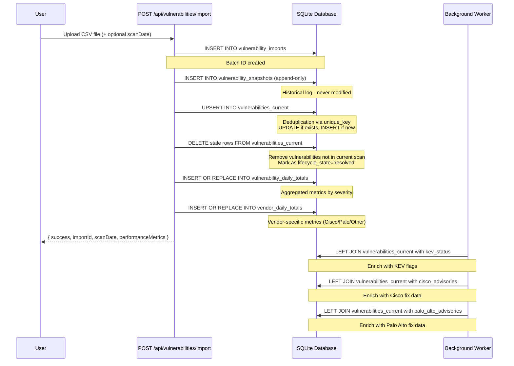
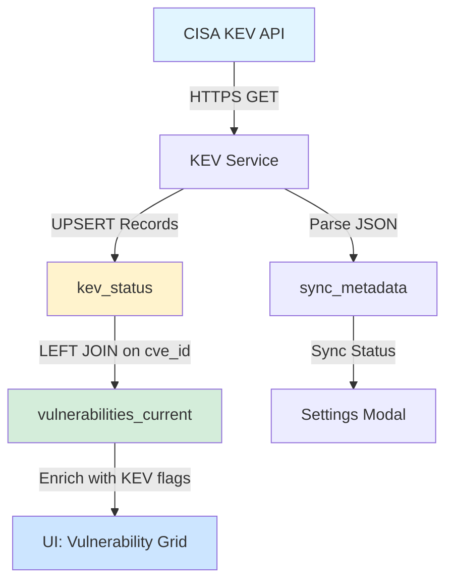
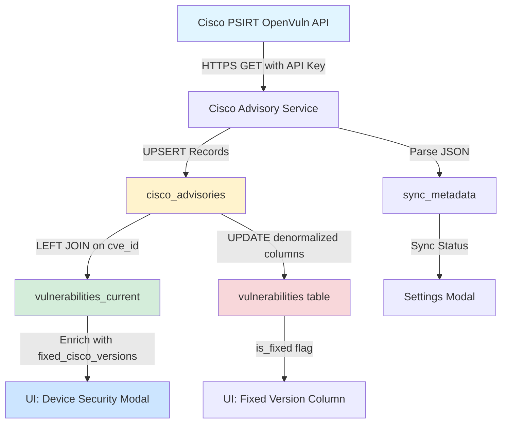
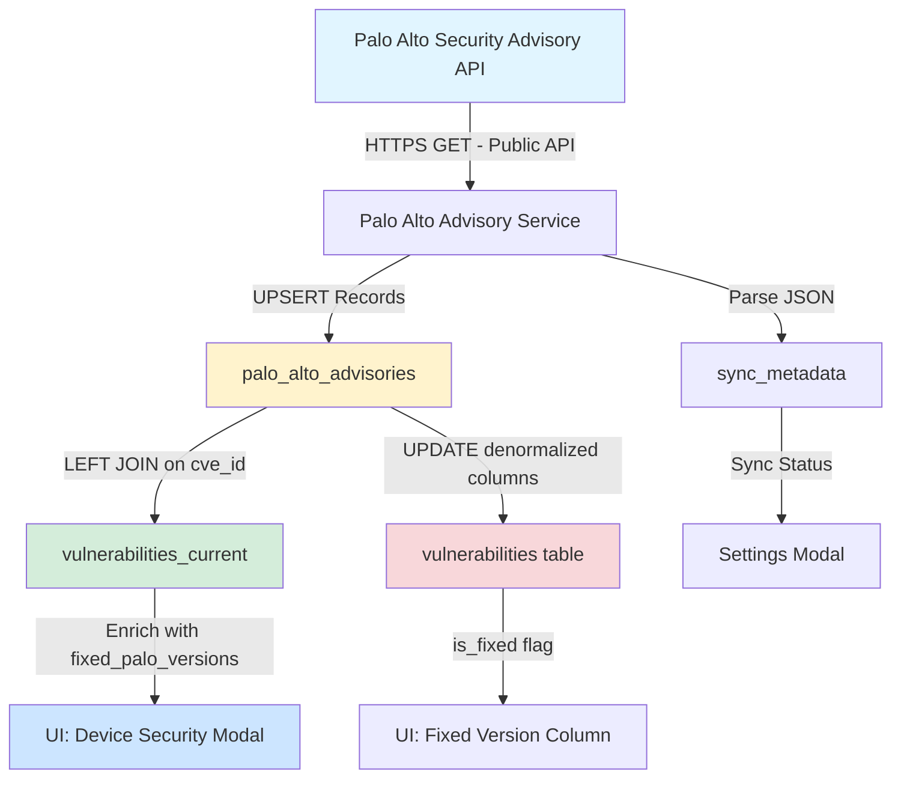
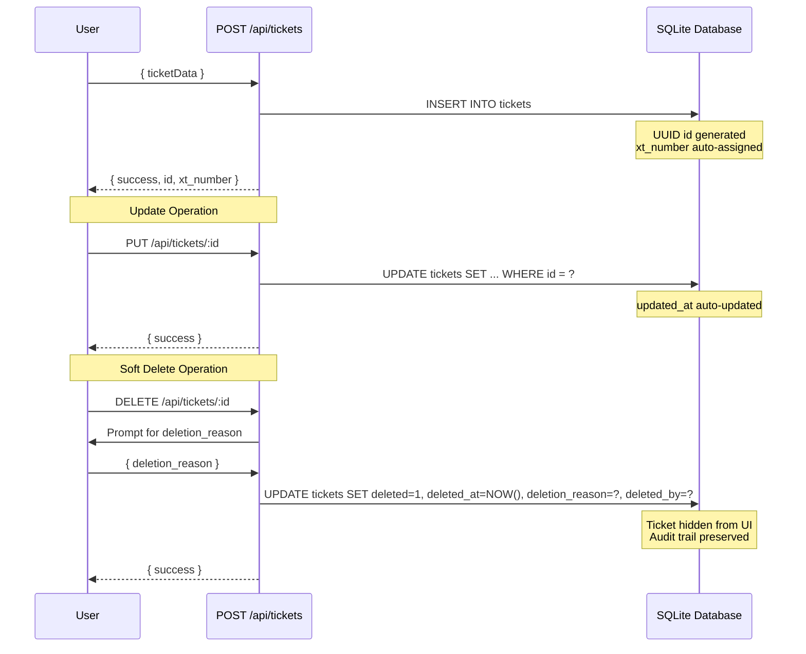

# Database Architecture

HexTrackr uses a file-based SQLite 3 database as its primary data store. This document provides a comprehensive overview of the current database architecture, including all 21 tables, vendor advisory integrations, and optimized performance configurations.

## Engine

- **Type**: SQLite 3
- **Location**: `/app/data/hextrackr.db` (absolute path inside Docker container)
- **Docker Volume**: `hextrackr-database` (named volume for SQLite integrity)
- **Initialization**: `app/public/scripts/init-database.js`
- **Driver**: `better-sqlite3` (Node.js)
- **Session Store**: `better-sqlite3-session-store`

---

## Schema Overview (v1.1.3)

**Tables**: 21 total
- **Vulnerability Management**: 7 tables (vulnerabilities, vulnerabilities_current, vulnerability_snapshots, vulnerability_staging, vulnerability_imports, vulnerability_daily_totals, vendor_daily_totals)
- **Vendor Advisories**: 4 tables (kev_status, cisco_advisories, cisco_fixed_versions, palo_alto_advisories)
- **Ticket Management**: 2 tables (tickets, ticket_vulnerabilities)
- **Template System**: 3 tables (email_templates, ticket_templates, vulnerability_templates)
- **Authentication**: 2 tables (users, user_preferences)
- **Audit & System**: 3 tables (audit_logs, audit_log_config, sync_metadata)
- **Sessions**: 1 table (sessions)

**Indexes**: 72 total (59 user-created + 13 auto-generated)

**Key Features**:
- 4-tier deduplication system with confidence scoring
- Multi-vendor advisory integration (KEV, Cisco PSIRT, Palo Alto)
- Lifecycle state management (active/resolved/reopened)
- Soft delete support for tickets
- Cross-device user preference synchronization
- Automated VACUUM scheduler for space reclamation

---

## Entity Relationship Diagram

The diagram below shows all 21 tables and their key relationships in the production database.

<div style="text-align: center; margin: 1.5rem 0;">
  <a href="/docs-html/database-erd-full.html" target="_blank" rel="noopener noreferrer" class="btn btn-primary" style="display: inline-block; padding: 0.75rem 1.5rem; background: linear-gradient(135deg, #3d5afe 0%, #5c7cfa 100%); color: white; text-decoration: none; border-radius: 8px; font-weight: 600; box-shadow: 0 4px 12px rgba(61, 90, 254, 0.3); transition: all 0.3s ease;">
    🗺️ View Full-Size Interactive Map
  </a>
  <p style="margin-top: 0.75rem; font-size: 0.9rem; color: #888;">
    Opens in new window with zoom controls and full navigation

```mermaid
erDiagram
    %% Vulnerability Management Core
    vulnerability_imports ||--o{ vulnerability_snapshots : "batches"
    vulnerability_imports ||--o{ vulnerabilities_current : "source"
    vulnerability_imports ||--o{ vulnerabilities : "legacy"
    vulnerability_imports ||--o{ vulnerability_staging : "staging"
    vulnerability_imports ||--o{ vulnerability_daily_totals : "aggregates"
    vulnerability_imports ||--o{ vendor_daily_totals : "vendor_aggregates"

    %% Vendor Advisory Enrichment (LEFT JOIN)
    vulnerabilities_current }o..o| kev_status : "LEFT JOIN on cve"
    vulnerabilities_current }o..o| cisco_advisories : "LEFT JOIN on cve"
    vulnerabilities_current }o..o| palo_alto_advisories : "LEFT JOIN on cve"
    vulnerabilities }o..o| cisco_advisories : "LEFT JOIN on cve"
    vulnerabilities }o..o| palo_alto_advisories : "LEFT JOIN on cve"

    %% Ticket-Vulnerability Junction
    tickets ||--o{ ticket_vulnerabilities : "links"
    vulnerabilities_current ||--o{ ticket_vulnerabilities : "links"

    %% Authentication
    users ||--o{ user_preferences : "owns"

    %% Sync Tracking
    sync_metadata ||--o{ kev_status : "tracks_kev_sync"
    sync_metadata ||--o{ cisco_advisories : "tracks_cisco_sync"
    sync_metadata ||--o{ palo_alto_advisories : "tracks_palo_sync"
    sync_metadata ||--o{ vulnerability_imports : "tracks_auto_vacuum"

    vulnerability_imports {
        INTEGER id
        TEXT filename
        TEXT import_date
        INTEGER row_count
        TEXT vendor
        INTEGER file_size
        INTEGER processing_time
        TEXT raw_headers
        DATETIME created_at
    }

    vulnerabilities {
        INTEGER id
        INTEGER import_id
        TEXT hostname
        TEXT ip_address
        TEXT cve
        TEXT severity
        REAL vpr_score
        REAL cvss_score
        TEXT first_seen
        TEXT last_seen
        TEXT plugin_id
        TEXT plugin_name
        TEXT description
        TEXT solution
        TEXT vendor_reference
        TEXT vendor
        TEXT vulnerability_date
        TEXT state
        TEXT import_date
        TEXT operating_system
        TEXT solution_text
        INTEGER is_fixed
        TEXT fixed_cisco_versions
        TEXT fixed_cisco_url
        DATETIME cisco_synced_at
        TEXT fixed_palo_versions
        TEXT fixed_palo_url
        DATETIME palo_synced_at
        DATETIME created_at
    }

    vulnerability_snapshots {
        INTEGER id
        INTEGER import_id
        TEXT scan_date
        TEXT hostname
        TEXT ip_address
        TEXT cve
        TEXT severity
        REAL vpr_score
        REAL cvss_score
        TEXT first_seen
        TEXT last_seen
        TEXT plugin_id
        TEXT plugin_name
        TEXT description
        TEXT solution
        TEXT vendor_reference
        TEXT vendor
        TEXT vulnerability_date
        TEXT state
        TEXT unique_key
        INTEGER confidence_score
        INTEGER dedup_tier
        TEXT enhanced_unique_key
        TEXT operating_system
        TEXT solution_text
        DATETIME created_at
    }

    vulnerabilities_current {
        INTEGER id
        INTEGER import_id
        TEXT scan_date
        TEXT hostname
        TEXT ip_address
        TEXT cve
        TEXT severity
        REAL vpr_score
        REAL cvss_score
        TEXT first_seen
        TEXT last_seen
        TEXT plugin_id
        TEXT plugin_name
        TEXT description
        TEXT solution
        TEXT vendor_reference
        TEXT vendor
        TEXT vulnerability_date
        TEXT state
        TEXT unique_key
        TEXT lifecycle_state
        TEXT resolved_date
        TEXT resolution_reason
        INTEGER confidence_score
        INTEGER dedup_tier
        TEXT enhanced_unique_key
        TEXT operating_system
        TEXT solution_text
        INTEGER is_fix_available
        DATETIME created_at
        DATETIME updated_at
    }

    vulnerability_daily_totals {
        INTEGER id
        TEXT scan_date
        INTEGER critical_count
        REAL critical_total_vpr
        INTEGER high_count
        REAL high_total_vpr
        INTEGER medium_count
        REAL medium_total_vpr
        INTEGER low_count
        REAL low_total_vpr
        INTEGER total_vulnerabilities
        REAL total_vpr
        INTEGER resolved_count
        INTEGER reopened_count
        DATETIME created_at
        DATETIME updated_at
    }

    vendor_daily_totals {
        INTEGER id
        TEXT vendor
        TEXT scan_date
        INTEGER critical_count
        REAL critical_total_vpr
        INTEGER high_count
        REAL high_total_vpr
        INTEGER medium_count
        REAL medium_total_vpr
        INTEGER low_count
        REAL low_total_vpr
        INTEGER total_vulnerabilities
        REAL total_vpr
        DATETIME created_at
    }

    vulnerability_staging {
        INTEGER id
        INTEGER import_id
        TEXT hostname
        TEXT ip_address
        TEXT cve
        TEXT severity
        REAL vpr_score
        REAL cvss_score
        TEXT plugin_id
        TEXT plugin_name
        TEXT description
        TEXT solution
        TEXT vendor_reference
        TEXT vendor
        TEXT vulnerability_date
        TEXT state
        TEXT enhanced_unique_key
        REAL confidence_score
        INTEGER dedup_tier
        TEXT lifecycle_state
        JSON raw_csv_row
        BOOLEAN processed
        INTEGER batch_id
        TEXT processing_error
        TEXT operating_system
        TEXT solution_text
        DATETIME created_at
        DATETIME processed_at
    }

    kev_status {
        TEXT cve_id
        DATE date_added
        TEXT vulnerability_name
        TEXT vendor_project
        TEXT product
        TEXT required_action
        DATE due_date
        BOOLEAN known_ransomware_use
        TEXT notes
        TIMESTAMP last_synced
    }

    cisco_advisories {
        TEXT cve_id
        TEXT advisory_id
        TEXT advisory_title
        TEXT severity
        TEXT cvss_score
        TEXT first_fixed
        TEXT affected_releases
        TEXT product_names
        TEXT publication_url
        TIMESTAMP last_synced
    }

    palo_alto_advisories {
        TEXT cve_id
        TEXT advisory_id
        TEXT advisory_title
        TEXT severity
        TEXT cvss_score
        TEXT first_fixed
        TEXT affected_versions
        TEXT product_name
        TEXT publication_url
        TIMESTAMP last_synced
    }

    tickets {
        TEXT id
        TEXT xt_number
        TEXT date_submitted
        TEXT date_due
        TEXT hexagon_ticket
        TEXT service_now_ticket
        TEXT location
        TEXT devices
        TEXT supervisor
        TEXT tech
        TEXT status
        TEXT notes
        TEXT attachments
        TEXT site
        TEXT site_id
        TEXT location_id
        TEXT job_type
        TEXT tracking_number
        TEXT outbound_tracking
        TEXT return_tracking
        TEXT shipping_line1
        TEXT shipping_line2
        TEXT shipping_city
        TEXT shipping_state
        TEXT shipping_zip
        TEXT return_line1
        TEXT return_line2
        TEXT return_city
        TEXT return_state
        TEXT return_zip
        TEXT site_address
        TEXT return_address
        TEXT software_versions
        TEXT mitigation_details
        INTEGER deleted
        TEXT deleted_at
        TEXT deletion_reason
        TEXT deleted_by
        DATETIME created_at
        DATETIME updated_at
    }

    ticket_vulnerabilities {
        INTEGER id
        TEXT ticket_id
        INTEGER vulnerability_id
        TEXT relationship_type
        TEXT notes
        DATETIME created_at
    }

    sync_metadata {
        INTEGER id
        TEXT sync_type
        TIMESTAMP sync_time
        TEXT version
        INTEGER record_count
        TEXT status
        TEXT error_message
        TIMESTAMP created_at
    }

    users {
        TEXT id
        TEXT username
        TEXT email
        TEXT password_hash
        TEXT role
        INTEGER is_active
        DATETIME last_login
        INTEGER failed_attempts
        DATETIME failed_login_timestamp
        DATETIME created_at
        DATETIME updated_at
    }

    user_preferences {
        INTEGER id
        TEXT user_id
        TEXT preference_key
        TEXT preference_value
        DATETIME created_at
        DATETIME updated_at
    }

    email_templates {
        INTEGER id
        TEXT name
        TEXT description
        TEXT template_content
        TEXT default_content
        TEXT variables
        TEXT category
        BOOLEAN is_active
        DATETIME created_at
        DATETIME updated_at
    }

    ticket_templates {
        INTEGER id
        TEXT name
        TEXT description
        TEXT template_content
        TEXT default_content
        TEXT variables
        TEXT category
        BOOLEAN is_active
        DATETIME created_at
        DATETIME updated_at
    }

    vulnerability_templates {
        INTEGER id
        TEXT name
        TEXT description
        TEXT template_content
        TEXT default_content
        TEXT variables
        TEXT category
        BOOLEAN is_active
        DATETIME created_at
        DATETIME updated_at
    }

    sessions {
        TEXT sid
        TEXT sess
        DATETIME expired
    }
```

  </p>
</div>



---

## Core Tables - Detailed Schemas

### Ticket Management

#### `tickets` (40 columns)

Complete ticketing system with shipping addresses, soft delete, and job type categorization.

| Column | Type | Constraints | Description |
|--------|------|-------------|-------------|
| `id` | TEXT | PRIMARY KEY | Stable unique identifier (UUID format) |
| `xt_number` | TEXT | UNIQUE | XactTrackr ticket number (e.g., "XT-0042") |
| `date_submitted` | TEXT | | Submission date (ISO 8601) |
| `date_due` | TEXT | | Due date (ISO 8601) |
| `hexagon_ticket` | TEXT | | External Hexagon reference |
| `service_now_ticket` | TEXT | | External ServiceNow reference |
| `location` | TEXT | NOT NULL | Human-readable location label |
| `devices` | TEXT | | Semicolon-delimited device names |
| `supervisor` | TEXT | | Supervisor name(s) in normalized format: "First Last; First Last" (semicolon-delimited for multiple supervisors) |
| `tech` | TEXT | | Assigned technician in normalized format: "First Last; First Last" (semicolon-delimited for multiple techs) |
| `status` | TEXT | DEFAULT 'Open' | Workflow status |
| `notes` | TEXT | | Free-form notes |
| `attachments` | TEXT | | JSON array of attachment metadata |
| `site` | TEXT | | Higher-level site grouping |
| `site_id` | TEXT | | Optional site identifier |
| `location_id` | TEXT | | Optional location identifier |
| `job_type` | TEXT | DEFAULT 'Upgrade' | Work categorization (Upgrade, Replace, Refresh, Mitigate, Other) |
| `tracking_number` | TEXT | | Legacy combined tracking (for templates) |
| `outbound_tracking` | TEXT | | Outbound shipment tracking number |
| `return_tracking` | TEXT | | Return shipment tracking number |
| `shipping_line1` | TEXT | | Shipping address line 1 |
| `shipping_line2` | TEXT | | Shipping address line 2 |
| `shipping_city` | TEXT | | Shipping city |
| `shipping_state` | TEXT | | Shipping state |
| `shipping_zip` | TEXT | | Shipping ZIP code |
| `return_line1` | TEXT | | Return address line 1 |
| `return_line2` | TEXT | | Return address line 2 |
| `return_city` | TEXT | | Return city |
| `return_state` | TEXT | | Return state |
| `return_zip` | TEXT | | Return ZIP code |
| `site_address` | TEXT | | Site location address |
| `return_address` | TEXT | | Return facility address |
| `software_versions` | TEXT | | Software version info (Upgrade job type) |
| `mitigation_details` | TEXT | | Mitigation plan details (Mitigate job type) |
| `deleted` | INTEGER | DEFAULT 0 | Soft delete flag (0 = active, 1 = deleted) |
| `deleted_at` | TEXT | | Soft delete timestamp |
| `deletion_reason` | TEXT | | User-provided deletion reason (HEX-248) |
| `deleted_by` | TEXT | | Username who deleted the ticket (HEX-248) |
| `created_at` | DATETIME | DEFAULT CURRENT_TIMESTAMP | Creation timestamp |
| `updated_at` | DATETIME | DEFAULT CURRENT_TIMESTAMP | Last modification timestamp |

**Indexes**: 10 indexes on location, status, dates, external references, site fields, xt_number, deleted, job_type

**Migration Files**:
- `004-soft-delete-tickets.sql` (soft delete columns)
- `007-add-job-type.sql` (job_type column)
- `009-add-job-type-fields.sql` (tracking, software_versions, mitigation_details)
- `010-restructure-address-fields.sql` (structured address components)
- `011-add-ticket-deletion-reason.sql` (deletion audit trail)

---

#### `ticket_vulnerabilities` (6 columns)

Junction table linking tickets to vulnerabilities with relationship metadata.

| Column | Type | Constraints | Description |
|--------|------|-------------|-------------|
| `id` | INTEGER | PRIMARY KEY AUTOINCREMENT | Junction record ID |
| `ticket_id` | TEXT | NOT NULL, FK → tickets.id | Ticket identifier |
| `vulnerability_id` | INTEGER | NOT NULL, FK → vulnerabilities_current.id | Vulnerability identifier |
| `relationship_type` | TEXT | DEFAULT 'remediation' | Relationship classification (remediation, investigation, etc.) |
| `notes` | TEXT | | Additional context for the relationship |
| `created_at` | DATETIME | DEFAULT CURRENT_TIMESTAMP | Link creation timestamp |

**Indexes**: 2 indexes (ticket_id, vulnerability_id) for bidirectional lookups

---

### Vulnerability Management

#### `vulnerabilities` (29 columns)

Legacy vulnerability table with Cisco and Palo Alto fix tracking columns. Still used for backup/export compatibility.

| Column | Type | Description |
|--------|------|-------------|
| `id` | INTEGER PRIMARY KEY | Auto-incrementing ID |
| `import_id` | INTEGER FK | References vulnerability_imports.id |
| `hostname` | TEXT | Device hostname |
| `ip_address` | TEXT | Device IP address |
| `cve` | TEXT | CVE identifier |
| `severity` | TEXT | Severity rating (Critical, High, Medium, Low) |
| `vpr_score` | REAL | Vulnerability Priority Rating |
| `cvss_score` | REAL | CVSS score |
| `first_seen` | TEXT | First detection date |
| `last_seen` | TEXT | Most recent detection |
| `plugin_id` | TEXT | Scanner plugin ID |
| `plugin_name` | TEXT | Scanner plugin name |
| `description` | TEXT | Vulnerability description |
| `solution` | TEXT | Remediation guidance |
| `vendor_reference` | TEXT | Scanner tool identifier |
| `vendor` | TEXT | Normalized vendor (CISCO, Palo Alto, Other) |
| `vulnerability_date` | TEXT | Vulnerability publication date |
| `state` | TEXT | Vulnerability state (open/closed) |
| `import_date` | TEXT | Import timestamp |
| `operating_system` | TEXT | Device OS (Migration 006) |
| `solution_text` | TEXT | Additional solution details (Migration 006) |
| `is_fixed` | INTEGER | Vendor-neutral fix flag (0/1) - ANY vendor has fix |
| `fixed_cisco_versions` | TEXT | Display string: "15.2(4)M11, 16.3.1" |
| `fixed_cisco_url` | TEXT | Link to Cisco advisory |
| `cisco_synced_at` | DATETIME | Last Cisco data sync timestamp |
| `fixed_palo_versions` | TEXT | Display string: "10.2.0-h3, 11.0.0" |
| `fixed_palo_url` | TEXT | Link to Palo Alto advisory |
| `palo_synced_at` | DATETIME | Last Palo Alto data sync timestamp |
| `created_at` | DATETIME | Record creation timestamp |

**Pattern**: Denormalized vendor fix columns enable fast queries without JOINs

---

#### `vulnerabilities_current` (30 columns)

Active vulnerability dataset with lifecycle state tracking and fix availability flag.

| Column | Type | Description |
|--------|------|-------------|
| `id` | INTEGER PRIMARY KEY | Auto-incrementing ID |
| `import_id` | INTEGER FK | References vulnerability_imports.id |
| `scan_date` | TEXT NOT NULL | Scan execution date |
| `hostname` | TEXT | Device hostname |
| `ip_address` | TEXT | Device IP address |
| `cve` | TEXT | CVE identifier |
| `severity` | TEXT | Severity rating |
| `vpr_score` | REAL | Vulnerability Priority Rating |
| `cvss_score` | REAL | CVSS score |
| `first_seen` | TEXT | First detection date |
| `last_seen` | TEXT | Most recent detection |
| `plugin_id` | TEXT | Scanner plugin ID |
| `plugin_name` | TEXT | Scanner plugin name |
| `description` | TEXT | Vulnerability description |
| `solution` | TEXT | Remediation guidance |
| `vendor_reference` | TEXT | Scanner tool identifier |
| `vendor` | TEXT | Normalized vendor (CISCO, Palo Alto, Other) |
| `vulnerability_date` | TEXT | Vulnerability publication date |
| `state` | TEXT | Vulnerability state |
| `unique_key` | TEXT | UNIQUE constraint for deduplication |
| `lifecycle_state` | TEXT | Active/resolved/reopened tracking |
| `resolved_date` | TEXT | Resolution timestamp |
| `resolution_reason` | TEXT | Reason for resolution |
| `confidence_score` | INTEGER | Deduplication confidence (0-100) |
| `dedup_tier` | INTEGER | Deduplication tier (1-4) |
| `enhanced_unique_key` | TEXT | 4-tier deduplication key |
| `operating_system` | TEXT | Device OS |
| `solution_text` | TEXT | Additional solution details |
| `is_fix_available` | INTEGER | Vendor-neutral fix availability flag (0/1) |
| `created_at` | DATETIME | Record creation timestamp |
| `updated_at` | DATETIME | Last modification timestamp |

**Key Feature**: `is_fix_available` flag enables instant filtering for vulnerabilities with vendor fixes (indexed)

**Lifecycle States**:
- `active`: Currently detected vulnerability
- `resolved`: No longer detected (with resolved_date)
- `reopened`: Previously resolved, reappeared

---

#### `vulnerability_snapshots` (26 columns)

Historical append-only log of all vulnerability detections. Never modified, only inserted.

| Column | Type | Description |
|--------|------|-------------|
| `id` | INTEGER PRIMARY KEY | Auto-incrementing ID |
| `import_id` | INTEGER FK | References vulnerability_imports.id |
| `scan_date` | TEXT NOT NULL | Scan execution date |
| `hostname` | TEXT | Device hostname |
| `ip_address` | TEXT | Device IP address |
| `cve` | TEXT | CVE identifier |
| `severity` | TEXT | Severity rating |
| `vpr_score` | REAL | Vulnerability Priority Rating |
| `cvss_score` | REAL | CVSS score |
| `first_seen` | TEXT | First detection date |
| `last_seen` | TEXT | Most recent detection |
| `plugin_id` | TEXT | Scanner plugin ID |
| `plugin_name` | TEXT | Scanner plugin name |
| `description` | TEXT | Vulnerability description |
| `solution` | TEXT | Remediation guidance |
| `vendor_reference` | TEXT | Scanner tool identifier |
| `vendor` | TEXT | Normalized vendor |
| `vulnerability_date` | TEXT | Vulnerability publication date |
| `state` | TEXT | Vulnerability state |
| `unique_key` | TEXT | Deduplication key |
| `confidence_score` | INTEGER | Deduplication confidence |
| `dedup_tier` | INTEGER | Deduplication tier |
| `enhanced_unique_key` | TEXT | 4-tier deduplication key |
| `operating_system` | TEXT | Device OS |
| `solution_text` | TEXT | Additional solution details |
| `created_at` | DATETIME | Record creation timestamp |

**Cleanup Policy**: Retains last 3 scan dates for rollback capability (managed by `db-snapshot-cleanup.js`)

---

#### `vulnerability_staging` (28 columns)

High-performance bulk import staging area with enhanced deduplication preprocessing.

**Key Features**:
- 4-tier deduplication scoring (0.95, 0.75, 0.50, 0.25 confidence)
- Bulk loading for 10k+ row imports
- Error tracking per row
- Raw CSV preservation for audit

**Notable Columns**:
- `enhanced_unique_key`: 4-tier deduplication identifier
- `confidence_score`: Match reliability (0.0-1.0)
- `dedup_tier`: Tier level (1=highest, 4=lowest)
- `processed`: Boolean migration flag
- `raw_csv_row`: JSON preservation of original data
- `processing_error`: Error message for failed rows

---

#### `vulnerability_imports` (8 columns)

Audit log tracking each CSV import batch.

| Column | Type | Description |
|--------|------|-------------|
| `id` | INTEGER PRIMARY KEY | Auto-incrementing batch ID |
| `filename` | TEXT NOT NULL | Uploaded file name |
| `import_date` | TEXT NOT NULL | Import execution timestamp |
| `row_count` | INTEGER NOT NULL | Number of rows processed |
| `vendor` | TEXT | Vendor classification (Cisco, Tenable, Qualys) |
| `file_size` | INTEGER | File size in bytes |
| `processing_time` | INTEGER | Processing duration (milliseconds) |
| `raw_headers` | TEXT | JSON array of CSV column headers |
| `created_at` | DATETIME | Record creation timestamp |

---

#### `vulnerability_daily_totals` (15 columns)

Aggregated vulnerability metrics by scan date for trend analysis.

| Column | Type | Description |
|--------|------|-------------|
| `id` | INTEGER PRIMARY KEY | Auto-incrementing ID |
| `scan_date` | TEXT | UNIQUE constraint - scan date |
| `critical_count` | INTEGER | Count of Critical severity |
| `critical_total_vpr` | REAL | Sum of VPR for Critical |
| `high_count` | INTEGER | Count of High severity |
| `high_total_vpr` | REAL | Sum of VPR for High |
| `medium_count` | INTEGER | Count of Medium severity |
| `medium_total_vpr` | REAL | Sum of VPR for Medium |
| `low_count` | INTEGER | Count of Low severity |
| `low_total_vpr` | REAL | Sum of VPR for Low |
| `total_vulnerabilities` | INTEGER | Total vulnerability count |
| `total_vpr` | REAL | Sum of all VPR scores |
| `resolved_count` | INTEGER | Count of resolved vulnerabilities |
| `reopened_count` | INTEGER | Count of reopened vulnerabilities |
| `created_at` | DATETIME | Record creation timestamp |
| `updated_at` | DATETIME | Last modification timestamp |

**Unique Constraint**: `scan_date` (idempotent aggregates - safe to re-run)

---

#### `vendor_daily_totals` (14 columns)

Vendor-specific aggregated metrics (Cisco, Palo Alto, Other). Never cleaned up - permanent historical storage.

**Migration**: 008-vendor-daily-totals.sql

| Column | Type | Description |
|--------|------|-------------|
| `id` | INTEGER PRIMARY KEY | Auto-incrementing ID |
| `scan_date` | TEXT NOT NULL | Scan date |
| `vendor` | TEXT NOT NULL | Vendor classification |
| `critical_count` | INTEGER | Critical severity count |
| `critical_total_vpr` | REAL | Critical VPR sum |
| `high_count` | INTEGER | High severity count |
| `high_total_vpr` | REAL | High VPR sum |
| `medium_count` | INTEGER | Medium severity count |
| `medium_total_vpr` | REAL | Medium VPR sum |
| `low_count` | INTEGER | Low severity count |
| `low_total_vpr` | REAL | Low VPR sum |
| `total_vulnerabilities` | INTEGER | Total count |
| `total_vpr` | REAL | Total VPR sum |
| `created_at` | DATETIME | Record creation timestamp |

**Unique Constraint**: `(scan_date, vendor)` composite key

**Purpose**: Fixes issue where vendor filters only showed 3 dates (snapshot cleanup period) while "All Vendors" showed complete history.

---

### Vendor Advisory Integration

#### `kev_status` (10 columns)

CISA Known Exploited Vulnerabilities catalog data (v1.0.22+).

| Column | Type | Constraints | Description |
|--------|------|-------------|-------------|
| `cve_id` | TEXT | PRIMARY KEY | CVE identifier (e.g., CVE-2021-44228) |
| `date_added` | DATE | NOT NULL | Date CISA added to KEV catalog |
| `vulnerability_name` | TEXT | | CISA-provided vulnerability name |
| `vendor_project` | TEXT | | Affected vendor or project |
| `product` | TEXT | | Specific product affected |
| `required_action` | TEXT | | CISA-mandated remediation action |
| `due_date` | DATE | | Federal agency remediation deadline |
| `known_ransomware_use` | BOOLEAN | DEFAULT 0 | Ransomware campaign usage flag (1=Yes, 0=No) |
| `notes` | TEXT | | Additional CISA context and guidance |
| `last_synced` | TIMESTAMP | DEFAULT CURRENT_TIMESTAMP | Last synchronization timestamp |

**Relationship**: LEFT JOIN with `vulnerabilities_current` on `cve` = `cve_id` to enrich vulnerability data

**API Source**: https://www.cisa.gov/known-exploited-vulnerabilities-catalog

---

#### `cisco_advisories` (10 columns)

Cisco PSIRT advisory data with fixed software versions (v1.0.63+).

**Migration**: 005-cisco-advisories.sql (HEX-141)

| Column | Type | Description |
|--------|------|-------------|
| `cve_id` | TEXT PRIMARY KEY | CVE identifier |
| `advisory_id` | TEXT | Cisco advisory ID (e.g., "cisco-sa-20241001-xyz") |
| `advisory_title` | TEXT | Human-readable advisory title |
| `severity` | TEXT | Cisco severity rating (Critical, High, Medium, Low) |
| `cvss_score` | TEXT | CVSS score from Cisco advisory |
| `first_fixed` | TEXT | JSON array: ["15.2(4)M11", "16.3.1", "17.1.1"] |
| `affected_releases` | TEXT | JSON array of affected software versions |
| `product_names` | TEXT | JSON array of affected Cisco products |
| `publication_url` | TEXT | Direct link to Cisco advisory page |
| `last_synced` | TIMESTAMP | Last synchronization timestamp |

**Relationship**: LEFT JOIN with `vulnerabilities_current` and `vulnerabilities` on `cve` = `cve_id`

**API Source**: Cisco PSIRT OpenVuln API

**Pattern**: Mirrors KEV implementation - separate table for rich metadata, denormalized columns in vulnerabilities table for fast queries

---

#### `palo_alto_advisories` (10 columns)

Palo Alto Networks security advisory data with fixed PAN-OS versions (v1.0.63+).

**Migration**: 006-palo-alto-advisories.sql (HEX-209)

| Column | Type | Description |
|--------|------|-------------|
| `cve_id` | TEXT PRIMARY KEY | CVE identifier |
| `advisory_id` | TEXT | Palo Alto advisory ID (same as CVE) |
| `advisory_title` | TEXT | Human-readable advisory title |
| `severity` | TEXT | Severity rating from CVSS metrics |
| `cvss_score` | TEXT | CVSS score |
| `first_fixed` | TEXT | JSON array: ["10.2.0-h3", "10.2.1-h2", "11.0.0"] |
| `affected_versions` | TEXT | JSON array from x_affectedList |
| `product_name` | TEXT | Affected product (always "PAN-OS" for v1) |
| `publication_url` | TEXT | Constructed: https://security.paloaltonetworks.com/{cve_id} |
| `last_synced` | TIMESTAMP | Last synchronization timestamp |

**Relationship**: LEFT JOIN with `vulnerabilities_current` and `vulnerabilities` on `cve` = `cve_id`

**API Source**: https://security.paloaltonetworks.com/json/{CVE-ID} (public API)

**Version Matching**: Smart major.minor family matching with Azure Marketplace format handling

---

#### `sync_metadata` (9 columns)

Multi-purpose synchronization tracking for KEV, Cisco, Palo Alto, and auto-VACUUM operations.

| Column | Type | Constraints | Description |
|--------|------|-------------|-------------|
| `id` | INTEGER | PRIMARY KEY AUTOINCREMENT | Sync record identifier |
| `sync_type` | TEXT | NOT NULL | Sync operation type |
| `sync_time` | TIMESTAMP | NOT NULL | Sync execution timestamp |
| `version` | TEXT | | Catalog version or timestamp (KEV only) |
| `record_count` | INTEGER | | Number of records synced |
| `status` | TEXT | DEFAULT 'completed' | Sync status (completed/failed/in_progress) |
| `error_message` | TEXT | | Error details if sync failed |
| `created_at` | TIMESTAMP | DEFAULT CURRENT_TIMESTAMP | Record creation timestamp |
| `next_sync_time` | TEXT | | Next scheduled sync timestamp (ISO 8601 format) |

**Supported sync_type Values**:
- `kev_catalog` - CISA KEV synchronization
- `cisco` - Cisco PSIRT advisory sync
- `palo_alto` - Palo Alto advisory sync
- `auto_vacuum` - Automated database VACUUM operations (HEX-250)

**Purpose**: Audit trail for sync operations, enables monitoring and troubleshooting

---

### Authentication & User Management

#### `users` (11 columns)

User accounts with Argon2id password hashing and account lockout protection (v1.0.46+).

| Column | Type | Constraints | Description |
|--------|------|-------------|-------------|
| `id` | TEXT | PRIMARY KEY | User identifier (UUID format) |
| `username` | TEXT | UNIQUE NOT NULL | Login username |
| `email` | TEXT | | User email address |
| `password_hash` | TEXT | NOT NULL | Argon2id hash (never plaintext) |
| `role` | TEXT | DEFAULT 'superadmin' | User role (superadmin/admin/user) |
| `is_active` | INTEGER | DEFAULT 1 | Account active flag (0=disabled, 1=active) |
| `last_login` | DATETIME | | Last successful login timestamp |
| `failed_attempts` | INTEGER | DEFAULT 0 | Consecutive failed login count |
| `failed_login_timestamp` | DATETIME | | Last failed login timestamp |
| `created_at` | DATETIME | DEFAULT CURRENT_TIMESTAMP | Account creation timestamp |
| `updated_at` | DATETIME | DEFAULT CURRENT_TIMESTAMP | Last modification timestamp |

**Security Features**:
- Argon2id password hashing (memoryCost: 19456, timeCost: 2, parallelism: 1)
- Account lockout after 5 failed attempts
- 15-minute lockout duration

---

#### `user_preferences` (6 columns)

User-specific UI preferences with cross-device synchronization (HEX-138).

| Column | Type | Constraints | Description |
|--------|------|-------------|-------------|
| `id` | INTEGER | PRIMARY KEY AUTOINCREMENT | Preference record ID |
| `user_id` | TEXT | NOT NULL FK → users.id | User identifier (CASCADE DELETE) |
| `preference_key` | TEXT | NOT NULL | Setting identifier (e.g., 'theme', 'dashboard_layout') |
| `preference_value` | TEXT | NOT NULL | Setting value (JSON or plain text) |
| `created_at` | DATETIME | DEFAULT CURRENT_TIMESTAMP | Record creation timestamp |
| `updated_at` | DATETIME | DEFAULT CURRENT_TIMESTAMP | Last modification timestamp |

**Unique Constraint**: `(user_id, preference_key)` composite key

**Trigger**: `user_preferences_updated_at` auto-updates `updated_at` on modification

---

#### `sessions`

Auto-created by `better-sqlite3-session-store`. Not explicitly defined in schema.

| Column | Type | Description |
|--------|------|-------------|
| `sid` | TEXT PRIMARY KEY | Session identifier |
| `sess` | TEXT | Serialized session data (JSON) |
| `expired` | DATETIME | Session expiration timestamp |

**Automatic Cleanup**: Expired sessions purged by session store middleware

---

### Template System

#### `email_templates`, `ticket_templates`, `vulnerability_templates`

All three template tables share identical schema (10 columns each).

| Column | Type | Constraints | Description |
|--------|------|-------------|-------------|
| `id` | INTEGER | PRIMARY KEY AUTOINCREMENT | Template record ID |
| `name` | TEXT | NOT NULL UNIQUE | Template identifier |
| `description` | TEXT | | Template description |
| `template_content` | TEXT | NOT NULL | Customized template (user-modified) |
| `default_content` | TEXT | NOT NULL | Original default (for reset) |
| `variables` | TEXT | NOT NULL | JSON array of supported variables |
| `category` | TEXT | DEFAULT varies | Template category |
| `is_active` | BOOLEAN | DEFAULT 1 | Template enabled flag (0=disabled, 1=active) |
| `created_at` | DATETIME | DEFAULT CURRENT_TIMESTAMP | Record creation timestamp |
| `updated_at` | DATETIME | DEFAULT CURRENT_TIMESTAMP | Last modification timestamp |

**Variable Substitution**: Mustache-style variables like `{{ticket_id}}`, `{{severity}}`, `{{vpr_score}}` replaced at runtime

**Supported Variables Examples**:
- Email: `{{recipient}}`, `{{subject}}`, `{{cve}}`, `{{severity}}`
- Ticket: `{{ticket_id}}`, `{{location}}`, `{{devices}}`, `{{status}}`
- Vulnerability: `{{cve}}`, `{{hostname}}`, `{{vpr_score}}`, `{{description}}`

---

## Data Flows

### Vulnerability CSV Import (Rollover Pipeline)

This flow shows the complete CSV import process using the rollover architecture.



**Fast-Path Alternative**: `POST /api/vulnerabilities/import-staging` uses `vulnerability_staging` table for bulk loading with Socket.io progress streaming.

---

### KEV Catalog Sync Data Flow



**API Endpoint**: https://www.cisa.gov/sites/default/files/feeds/known_exploited_vulnerabilities.json

**Sync Frequency**: Daily background sync + manual trigger

---

### Cisco PSIRT Advisory Sync Data Flow



**API Authentication**: Requires Cisco API key + secret (stored in `user_preferences`)

**Sync Frequency**: Daily background sync + manual trigger

**Version Matching**: Smart matching for IOS, IOS XE, IOS XR, NX-OS versions

---

### Palo Alto Advisory Sync Data Flow



**API Endpoint**: https://security.paloaltonetworks.com/json/{CVE-ID}

**No Authentication Required**: Public API (highly reliable)

**Sync Frequency**: Daily background sync + manual trigger

**Version Matching**: Major.minor family matching with Azure Marketplace format normalization

---

### Ticket Creation / Update

Simple ticket CRUD operations with soft delete support.



---

## Index Inventory (72 Total)

### Vulnerability Tables (23 indexes)

| Table | Index Name | Columns | Type | Purpose |
|-------|-----------|---------|------|---------|
| `vulnerabilities` | `idx_vulnerabilities_hostname` | hostname | Standard | Device-based queries |
| | `idx_vulnerabilities_severity` | severity | Standard | Severity filtering |
| | `idx_vulnerabilities_cve` | cve | Standard | CVE lookups |
| | `idx_vulnerabilities_import` | import_id | Standard | Batch tracking |
| | `idx_vulnerabilities_is_fixed` | is_fixed | Partial (WHERE is_fixed=1) | Fixed vulnerability queries |
| `vulnerability_snapshots` | `idx_snapshots_scan_date` | scan_date | Standard | Historical date filtering |
| | `idx_snapshots_hostname` | hostname | Standard | Device queries |
| | `idx_snapshots_severity` | severity | Standard | Severity filtering |
| | `idx_snapshots_enhanced_key` | enhanced_unique_key | Standard | 4-tier deduplication |
| | `idx_snapshots_cve` | cve | Standard | CVE lookups |
| | `idx_snapshots_import_id` | import_id | Standard | Batch tracking |
| `vulnerabilities_current` | `idx_current_unique_key` | unique_key | Standard | Fast deduplication |
| | `idx_current_scan_date` | scan_date | Standard | Date filtering |
| | `idx_current_enhanced_unique_key` | enhanced_unique_key | Standard | 4-tier deduplication |
| | `idx_current_lifecycle_scan` | lifecycle_state, scan_date | Composite | Lifecycle queries |
| | `idx_current_confidence_tier` | confidence_score, dedup_tier | Composite | Quality filtering |
| | `idx_current_active_severity` | lifecycle_state, severity | Composite | Active vulnerability reports |
| | `idx_current_resolved_date` | resolved_date | Standard | Resolution tracking |
| | `idx_current_cve` | cve | Standard | CVE searches |
| | `idx_current_vendor` | vendor | Standard | Vendor filtering (HEX-101) |
| `vulnerability_daily_totals` | `idx_daily_totals_scan_date` | scan_date | UNIQUE | Idempotent aggregates |
| `vendor_daily_totals` | `idx_vendor_daily_scan_date` | scan_date | Standard | Date filtering |
| | `idx_vendor_daily_vendor` | vendor | Standard | Vendor filtering |
| | `idx_vendor_daily_composite` | vendor, scan_date | UNIQUE Composite | Vendor trend analysis |

### Staging Tables (4 indexes)

| Table | Index Name | Columns | Purpose |
|-------|-----------|---------|---------|
| `vulnerability_staging` | `idx_staging_import_id` | import_id | Import batch association |
| | `idx_staging_processed` | processed | Batch migration tracking |
| | `idx_staging_batch_id` | batch_id | Batch grouping |
| | `idx_staging_unprocessed_batch` | processed, batch_id | Composite - unprocessed batch queries |

### Import Tracking (4 indexes)

| Table | Index Name | Columns | Purpose |
|-------|-----------|---------|---------|
| `vulnerability_imports` | `idx_imports_import_date` | import_date | Import history queries |
| | `idx_imports_vendor` | vendor | Vendor-specific tracking |
| | `idx_imports_filename` | filename | File-based lookups |
| | `idx_imports_created_at` | created_at | Chronological sorting |

### KEV Integration (5 indexes)

| Table | Index Name | Columns | Type | Purpose |
|-------|-----------|---------|------|---------|
| `kev_status` | PRIMARY KEY | cve_id | Primary | Fast KEV lookups during JOIN |
| | `idx_kev_status_date_added` | date_added | Standard | CISA timeline queries |
| | `idx_kev_status_cve_id` | cve_id | Standard | CVE lookups |
| | `idx_kev_status_due_date` | due_date | Standard | Deadline tracking |
| | `idx_kev_status_ransomware` | known_ransomware_use | Partial (WHERE known_ransomware_use=1) | Ransomware campaign tracking |

### Vendor Advisory Integration (5 indexes)

| Table | Index Name | Columns | Purpose |
|-------|-----------|---------|---------|
| `cisco_advisories` | PRIMARY KEY | cve_id | Fast Cisco advisory lookups |
| | `idx_cisco_advisories_cve` | cve_id | CVE searches |
| | `idx_cisco_advisories_synced` | last_synced | Sync tracking |
| `palo_alto_advisories` | PRIMARY KEY | cve_id | Fast Palo Alto advisory lookups |
| | `idx_palo_advisories_cve` | cve_id | CVE searches |
| | `idx_palo_advisories_synced` | last_synced | Sync tracking |

### Sync Metadata (1 index)

| Table | Index Name | Columns | Purpose |
|-------|-----------|---------|---------|
| `sync_metadata` | `idx_sync_metadata_type_time` | sync_type, sync_time DESC | Sync history queries |

### Ticket Management (11 indexes)

| Table | Index Name | Columns | Type | Purpose |
|-------|-----------|---------|------|---------|
| `tickets` | `idx_tickets_location` | location | Standard | Location filtering |
| | `idx_tickets_status` | status | Standard | Status-based queries |
| | `idx_tickets_date_submitted` | date_submitted | Standard | Submission timeline |
| | `idx_tickets_date_due` | date_due | Standard | Due date tracking |
| | `idx_tickets_hexagon` | hexagon_ticket | Standard | External reference lookup |
| | `idx_tickets_service_now` | service_now_ticket | Standard | ServiceNow integration |
| | `idx_tickets_xt` | xt_number | UNIQUE | XactTrackr ticket lookup |
| | `idx_tickets_site` | site | Standard | Site filtering |
| | `idx_tickets_deleted` | deleted | Standard | Soft delete queries |
| | `idx_tickets_job_type` | job_type | Standard | Job type filtering |
| `ticket_vulnerabilities` | `idx_ticket_vulns_ticket` | ticket_id | Standard | Ticket → vulnerability joins |
| | `idx_ticket_vulns_vuln` | vulnerability_id | Standard | Vulnerability → ticket joins |

### Template System (9 indexes)

| Table | Index Name | Columns | Type | Purpose |
|-------|-----------|---------|------|---------|
| `email_templates` | `idx_email_templates_name` | name | UNIQUE | Template name lookups |
| | `idx_email_templates_category` | category | Standard | Category filtering |
| | `idx_email_templates_active` | is_active | Standard | Active template queries |
| `ticket_templates` | `idx_ticket_templates_name` | name | UNIQUE | Template name lookups |
| | `idx_ticket_templates_category` | category | Standard | Category filtering |
| | `idx_ticket_templates_active` | is_active | Standard | Active template queries |
| `vulnerability_templates` | `idx_vuln_templates_name` | name | UNIQUE | Template name lookups |
| | `idx_vuln_templates_category` | category | Standard | Category filtering |
| | `idx_vuln_templates_active` | is_active | Standard | Active template queries |

### Authentication (5 indexes)

| Table | Index Name | Columns | Type | Purpose |
|-------|-----------|---------|------|---------|
| `users` | `idx_users_username` | username | UNIQUE | Login username lookups |
| | `idx_users_email` | email | Standard | Email-based queries |
| `user_preferences` | Composite UNIQUE | user_id, preference_key | UNIQUE | Preference uniqueness constraint |
| | `idx_user_preferences_user_id` | user_id | Standard (FK) | CASCADE DELETE performance |
| | `idx_user_preferences_key` | user_id, preference_key | Composite | Preference lookups |

### Auto-Generated Indexes (13 indexes)

SQLite auto-creates indexes for:
- PRIMARY KEY constraints (not explicitly named)
- UNIQUE constraints (named `sqlite_autoindex_*`)

---

## Database Configuration & Performance

### PRAGMA Settings

The database is initialized with optimized performance and safety settings:

| Setting | Value | Purpose |
|---------|-------|---------|
| `foreign_keys` | `ON` | Enable foreign key constraints for referential integrity |
| `journal_mode` | `WAL` | Write-Ahead Logging for better concurrency and crash recovery |
| `synchronous` | `NORMAL` | Balance between safety and performance (safe with WAL mode) |

**Implementation**: `app/public/scripts/init-database.js` and `app/config/database.js`

---

### Cache Configuration

| Setting | Value | Description |
|---------|-------|-------------|
| `cache_size` | `-64000` | 64MB page cache for improved query performance |
| `timeout` | `30000ms` | Database lock timeout (30 seconds) |

**Page Size**: SQLite default (4KB pages)

**Memory Usage**: ~64MB for page cache + connection overhead

---

### Auto-VACUUM Scheduler

**Status**: Fully Implemented (HEX-250, v1.0.62)

Automatic database optimization runs on a scheduled basis to reclaim unused space and optimize indexes.

**Configuration**:
- **Frequency**: Every 7 days
- **Schedule**: Daily check at 2:00 AM
- **Operation**: Full VACUUM (rebuilds entire database file)
- **Tracking**: Execution history stored in `sync_metadata` table (`sync_type = 'auto_vacuum'`)
- **Config File**: `app/config/database.js`
- **Settings**: `enableAutoVacuum: true`, `vacuumIntervalDays: 7`

**Performance Impact**:
- **Duration**: 30-60 seconds for typical database sizes
- **Locking**: Exclusive lock during VACUUM (blocks all queries)
- **Space Reclamation**: HEX-250 reclaimed 286MB (50% reduction) in production

**Example sync_metadata Record**:
```json
{
  "sync_type": "auto_vacuum",
  "sync_time": "2025-10-16T02:00:00.000Z",
  "version": null,
  "record_count": null,
  "status": "completed",
  "error_message": null
}
```

**Manual Trigger**: `POST /api/database/vacuum` (admin only)

---

## Data Integrity & Constraints

### Current Implementation

| Area | Implementation | Details |
|------|----------------|---------|
| Severity values | Free text (TEXT) | Accepted: Critical, High, Medium, Low (enforced in application layer) |
| Deduplication | 4-tier confidence scoring | Tier 1 (0.95), Tier 2 (0.75), Tier 3 (0.50), Tier 4 (0.25) |
| Vendor fields | Dual tracking | `vendor_reference` (scan tool ID) + `vendor` (normalized name) |
| Unique constraints | Database-enforced | `xt_number` (tickets), `username` (users), `scan_date` (daily totals), `(user_id, preference_key)` (user_preferences) |
| Foreign keys | PRAGMA-enabled | `PRAGMA foreign_keys = ON` enforced at connection level |
| Orphan cleanup | Application logic | Manual cleanup routines (future: ON DELETE CASCADE for RDBMS migration) |

---

### Deduplication System (4-Tier)

The enhanced deduplication system uses `enhanced_unique_key` + `confidence_score` + `dedup_tier` for intelligent vulnerability matching across scanner reconfigurations and network changes.

**Tier Definitions**:

| Tier | Confidence | Match Criteria | Use Case |
|------|-----------|----------------|----------|
| **Tier 1** | 0.95 | CVE + hostname + IP | Exact device match (highest confidence) |
| **Tier 2** | 0.75 | CVE + hostname | IP address changed (DHCP, network reconfiguration) |
| **Tier 3** | 0.50 | CVE + IP | Hostname changed (device renamed) |
| **Tier 4** | 0.25 | CVE only | Device variation (multiple affected devices) |

**Key Generation**:
```javascript
// Tier 1: CVE + hostname + IP
enhanced_unique_key = `${cve}_${hostname}_${ip_address}`;

// Tier 2: CVE + hostname
enhanced_unique_key = `${cve}_${hostname}_NOIP`;

// Tier 3: CVE + IP
enhanced_unique_key = `${cve}_NOHOSTNAME_${ip_address}`;

// Tier 4: CVE only
enhanced_unique_key = `${cve}_NODEVICE`;
```

**Benefits**:
- Accurate tracking across scanner reconfigurations
- Handles DHCP IP changes gracefully
- Prevents false "resolved" detections
- Enables confidence-based filtering

---

### Lifecycle State Management

The `vulnerabilities_current` table tracks vulnerability lifecycle with three states:

| State | Description | Transition |
|-------|-------------|------------|
| `active` | Currently detected in latest scan | Default state on INSERT |
| `resolved` | No longer detected (remediated) | Set when vulnerability absent from new scan |
| `reopened` | Previously resolved, now detected again | Set when resolved vulnerability reappears |

**Resolution Process**:
1. Import new scan (scan_date = 2025-10-16)
2. Compare with previous scan (scan_date = 2025-10-15)
3. Vulnerabilities in 2025-10-15 but NOT in 2025-10-16:
   - `lifecycle_state` = 'resolved'
   - `resolved_date` = '2025-10-16'
   - `resolution_reason` = 'not_detected_in_scan'

**Reopening Process**:
1. Vulnerability was `lifecycle_state` = 'resolved'
2. Reappears in new scan
3. Update to `lifecycle_state` = 'reopened'
4. Clear `resolved_date` and `resolution_reason`

**Metrics Tracking**:
- `vulnerability_daily_totals.resolved_count` - vulnerabilities resolved on that scan date
- `vulnerability_daily_totals.reopened_count` - vulnerabilities reopened on that scan date

---

## Legacy Table Notice

The original `vulnerabilities` table (29 columns) remains in the database to support existing backup endpoints:
- `GET /api/backup/vulnerabilities`
- `GET /api/backup/all`

**Current Usage**: Export-only (not used for analytics or UI)

**Rollover Architecture** (active system):
- `vulnerability_snapshots` - Historical append-only log
- `vulnerabilities_current` - Deduplicated active set with lifecycle tracking
- `vulnerability_daily_totals` - Aggregated trend data
- `vendor_daily_totals` - Vendor-specific trend data

**Migration Status**: Tracked in roadmap - will eventually unify export logic on rollover schema

---

## Vendor Advisory Data Flow Patterns

### Common Pattern: Denormalized + Enrichment

All three vendor advisory integrations (KEV, Cisco, Palo Alto) follow the same architectural pattern:

1. **Separate Advisory Table**: Rich metadata storage
   - `kev_status` (CISA)
   - `cisco_advisories` (Cisco PSIRT)
   - `palo_alto_advisories` (Palo Alto)

2. **Denormalized Columns**: Fast query performance
   - `vulnerabilities.is_fixed` (vendor-neutral boolean)
   - `vulnerabilities.fixed_cisco_versions` (display string)
   - `vulnerabilities.fixed_palo_versions` (display string)
   - `vulnerabilities_current.is_fix_available` (indexed boolean)

3. **LEFT JOIN Enrichment**: UI data loading
   ```sql
   SELECT v.*, k.date_added AS kev_date_added,
          c.first_fixed AS cisco_fixed_versions,
          p.first_fixed AS palo_fixed_versions
   FROM vulnerabilities_current v
   LEFT JOIN kev_status k ON v.cve = k.cve_id
   LEFT JOIN cisco_advisories c ON v.cve = c.cve_id
   LEFT JOIN palo_alto_advisories p ON v.cve = p.cve_id
   WHERE v.lifecycle_state = 'active';
   ```

4. **Background Sync**: Daily updates via `sync_metadata`

**Benefits**:
- Fast queries (no JOIN required for boolean flags)
- Rich metadata available when needed (LEFT JOIN)
- Auditability (sync_metadata tracks all operations)
- Scalability (add new vendors without schema redesign)

---

## Migration History

Tracked in `/app/public/scripts/migrations/` directory:

| Migration | Version | Issue | Description |
|-----------|---------|-------|-------------|
| `004-soft-delete-tickets.sql` | v1.0.x | HEX-196 | Add soft delete support to tickets table |
| `005-cisco-advisories.sql` | v1.0.63 | HEX-141 | Cisco PSIRT advisory infrastructure |
| `005-remove-xt-unique-constraint.sql` | v1.0.x | HEX-196 | Remove UNIQUE constraint on xt_number |
| `006-add-os-solution-columns.sql` | v1.0.x | - | Add operating_system and solution_text columns |
| `006-palo-alto-advisories.sql` | v1.0.63 | HEX-209 | Palo Alto advisory infrastructure |
| `006-user-preferences.sql` | v1.0.46 | HEX-138 | User preferences for cross-device sync |
| `007-add-job-type.sql` | v1.0.57 | HEX-203 | Add job_type field for work categorization |
| `007-normalize-palo-vendors.sql` | v1.0.63 | - | Normalize Palo Alto vendor names |
| `008-create-job-type-templates.sql` | v1.0.57 | - | Job type-specific ticket templates |
| `008-vendor-daily-totals.sql` | v1.0.x | - | Vendor-specific daily aggregation table |
| `009-add-job-type-fields.sql` | v1.0.57 | - | Tracking numbers and job-specific fields |
| `010-restructure-address-fields.sql` | v1.0.57 | - | Structured address components (line1, line2, city, state, zip) |
| `011-add-ticket-deletion-reason.sql` | v1.0.66 | HEX-248 | Deletion audit trail (deletion_reason, deleted_by) |
| `012-create-audit-logs.sql` | v1.0.67+ | HEX-254 | Unified logging system with audit trail |
| `013-fix-truncated-markdown-templates.sql` | v1.0.79 | HEX-286 | Restore truncated ticket markdown templates |
| `014-normalize-supervisor-tech.js` | v1.0.94 | HEX-267 | Normalize supervisor/tech fields from "LAST,FIRST" to "First Last" format (Node.js migration) |

**Migration Strategy**: Idempotent ALTER TABLE statements executed at runtime (no down migrations). Migration 014 is a Node.js script for data transformation.

---

## Database Size & Performance Metrics

**Typical Production Database**:
- **File Size**: ~500MB (pre-VACUUM), ~214MB (post-VACUUM with HEX-250)
- **Row Counts**:
  - `vulnerabilities_current`: ~50,000 active vulnerabilities
  - `vulnerability_snapshots`: ~150,000 historical records (last 3 scans)
  - `vulnerability_daily_totals`: ~365 days of trend data
  - `vendor_daily_totals`: ~1,095 records (365 days × 3 vendors)
  - `tickets`: ~500-1,000 tickets
  - `kev_status`: ~1,000 CISA KEV records
  - `cisco_advisories`: ~500 Cisco advisories
  - `palo_alto_advisories`: ~50 Palo Alto advisories

**Query Performance** (production benchmarks):
- `SELECT * FROM vulnerabilities_current WHERE lifecycle_state = 'active'`: ~50ms (50k rows)
- `SELECT * FROM vulnerabilities_current WHERE cve = ?`: ~1ms (indexed)
- `SELECT * FROM tickets WHERE deleted = 0`: ~10ms (500 rows)
- KEV/Cisco/Palo enrichment LEFT JOIN: ~100ms (50k rows)

**Import Performance**:
- CSV import (10k rows): ~30-45 seconds
- Staging fast-path (10k rows): ~20-30 seconds
- VACUUM operation: ~30-60 seconds (blocking)

---

## Future Enhancements

**Planned Improvements** (from roadmap):

1. **Additional Vendor Integrations**:
   - Microsoft Security Response Center (MSRC)
   - Juniper SIRT
   - Fortinet PSIRT

2. **Enhanced Deduplication**:
   - Machine learning-based confidence scoring
   - Multi-vendor correlation (same CVE across vendors)

3. **Performance Optimizations**:
   - Incremental VACUUM (SQLite 3.40+ feature)
   - Materialized views for complex queries
   - Read replicas for reporting

4. **Data Retention Policies**:
   - Configurable snapshot retention (currently hardcoded to 3)
   - Automatic archival of old tickets
   - Compliance-driven retention rules

---

This document reflects the database schema as of **v1.1.3**. Schema structure was last modified in v1.0.66 (subsequent versions include data migrations only). Re-run architecture analysis after structural migrations or table additions.

**Last Updated**: 2025-10-23
