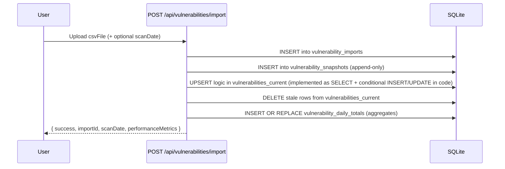

# Database Architecture

HexTrackr uses a file-based SQLite 3 database as its primary data store. This document provides an updated overview of the current (live) database architecture, including rollover vulnerability tables, normalization references, and key data flows.

## Engine

- **Type**: SQLite 3
- **Location**: `data/hextrackr.db`
- **Initialization**: The database is initialized by the `scripts/init-database.js` script.

---

## Entity Relationship Diagram (Current)

The diagram below reflects the active tables used by the rollover ingestion pipeline and ticketing system. The legacy `vulnerabilities` table still exists (for backup/export compatibility) but is not part of the primary analytics path.


---

## Data Flows

### Vulnerability CSV Import (Rollover Pipeline)

This flow shows how a CSV file upload is processed and stored in the database using the rollover architecture.



> **Staging fast-path**: `POST /api/vulnerabilities/import-staging` executes the same workflow but bulk loads into `vulnerability_staging` first and streams session progress through Socket.io.

### Ticket Creation / Update

This flow shows the simple process of creating a new ticket.

```mermaid
sequenceDiagram
    participant User
    participant API as POST /api/tickets
    participant DB as SQLite

    User->>API: { ticketData }
    API->>DB: INSERT (or UPDATE for modifications) into tickets
    API-->>User: { success, id }

---

## Legacy Table Notice

The original `vulnerabilities` table remains in the database to support existing backup endpoints (`/api/backup/vulnerabilities`, `/api/backup/all`). This table is used ONLY for exports - all new imports and analytics use the rollover architecture. New analytics and UI panels rely exclusively on the rollover trio:

- `vulnerability_snapshots` (historical log)
- `vulnerabilities_current` (deduplicated active set)
- `vulnerability_daily_totals` (aggregated trends)

Migration plan (tracked in roadmap) will eventually deprecate the legacy ingestion path and unify export logic on the rollover schema.

---

## Lifecycle State Management

The `vulnerabilities_current` table uses a `lifecycle_state` column to track vulnerability status:

- **active**: Currently detected vulnerability
- **resolved**: Vulnerability no longer detected (marked with resolved_date)
- **reopened**: Previously resolved vulnerability that reappeared

This enables accurate tracking of vulnerability remediation and regression.

---

## Index Overview

| Table | Index | Purpose |
| ----- | ----- | ------- |
| vulnerability_snapshots | scan_date, hostname, severity | Historical filtering & trends |
| vulnerabilities_current | unique_key, scan_date | Fast dedupe lookups & date filtering |
| vulnerability_daily_totals | scan_date (UNIQUE) | Idempotent aggregates |
| tickets | multiple (location, status, date_submitted, date_due, external refs) | UI filtering & reporting |
| sites / locations | code (UNIQUE) | Lookup by code |

---

## Staging Tables

HexTrackr uses staging tables to process new data before it is moved into the production tables. This allows for data validation and transformation without affecting the live data.

- `vulnerabilities_staging`: Used for staging new vulnerability data.

For more information on the data lifecycle, see the [Data Lifecycle and Rollover Mechanism](./data-lifecycle.md) documentation.

---

## Database Migrations

Database migrations are handled automatically by the application through runtime schema evolution using idempotent ALTER TABLE statements.

---

## KEV Integration Tables (v1.0.22)

The CISA Known Exploited Vulnerabilities (KEV) integration introduces dedicated tables for tracking exploited vulnerabilities.

### kev_status

Stores Known Exploited Vulnerabilities metadata from CISA's KEV catalog.

| Column | Type | Description |
|--------|------|-------------|
| cve_id | TEXT | Primary key, matches CVE ID from vulnerabilities table |
| date_added | DATE | When CISA added vulnerability to KEV catalog |
| vulnerability_name | TEXT | CISA's descriptive vulnerability name |
| vendor_project | TEXT | Affected vendor or project |
| product | TEXT | Specific product affected |
| required_action | TEXT | CISA recommended remediation action |
| due_date | DATE | Federal agency remediation deadline |
| known_ransomware_use | BOOLEAN | Indicates use in ransomware campaigns |
| notes | TEXT | Additional CISA context and guidance |
| short_description | TEXT | Brief vulnerability description |
| catalog_version | TEXT | CISA catalog version when added |
| cisa_date_released | TIMESTAMP | When CISA released this catalog version |
| created_at | TIMESTAMP | Record creation timestamp |
| updated_at | TIMESTAMP | Last update timestamp |

**Foreign Key**: `cve_id` references `vulnerabilities(cve_id)` with CASCADE delete

### kev_sync_log

Tracks KEV synchronization operations and status.

| Column | Type | Description |
|--------|------|-------------|
| id | INTEGER | Primary key |
| sync_started_at | TIMESTAMP | When synchronization began |
| sync_completed_at | TIMESTAMP | When synchronization finished |
| status | TEXT | Sync status (success, error, in_progress) |
| total_kevs | INTEGER | Total KEV records processed |
| matched_count | INTEGER | Vulnerabilities matched with KEV status |
| error_message | TEXT | Error details if sync failed |
| catalog_version | TEXT | CISA catalog version synchronized |

### Enhanced Vulnerability Table

The main `vulnerabilities` table now includes KEV integration:

**New Column:**
- `isKev` TEXT - KEV status ('Yes'/'No') for filtering and display

**Performance Indexes:**
- `idx_vulnerabilities_kev` ON `vulnerabilities(isKev)`
- `idx_kev_status_cve` ON `kev_status(cve_id)`
- `idx_kev_sync_log_status` ON `kev_sync_log(status)`

### KEV Data Flow

```mermaid
graph TD
    A[CISA KEV API] -->|Daily Sync| B[kev_sync_log]
    A -->|Catalog Data| C[kev_status]
    C -->|CVE Matching| D[vulnerabilities.isKev]
    D -->|Display| E[UI Components]
    B -->|Status| F[Settings Modal]
```

---

## Data Integrity & Future Enhancements

| Area | Current | Planned |
| ---- | ------- | ------- |
| Severity values | Free text | Add CHECK constraint / normalization table |
| Vendor fields | vendor_reference + vendor | Consolidate and document mapping rules |
| Orphan cleanup | Manual (app logic) | ON DELETE CASCADE for future RDBMS migration |
| Performance | Basic single-file SQLite | WAL mode + scheduled VACUUM (future) |

---

This document reflects the schema as of the current release cycle. Re-run architecture analysis after structural migrations or table additions.
```
