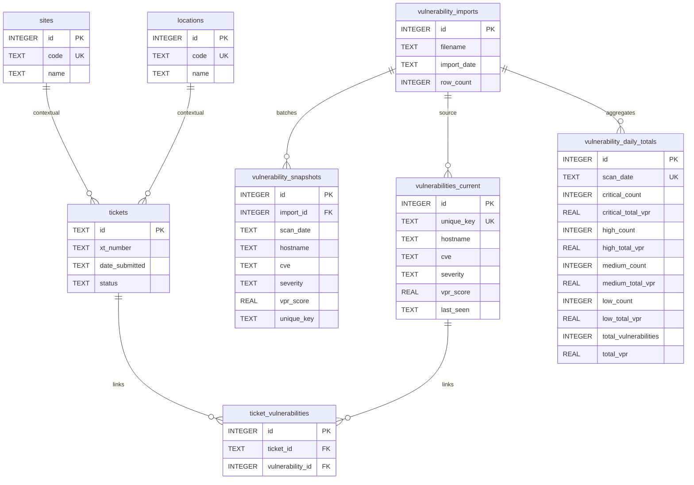

# Database Architecture

HexTrackr uses a file-based SQLite 3 database as its primary data store. This document provides an updated overview of the current (live) database architecture, including rollover vulnerability tables, normalization references, and key data flows.

## Engine

- **Type**: SQLite 3
- **Location**: `data/hextrackr.db`
- **Initialization**: The database is initialized by the `scripts/init-database.js` script.

---

## Entity Relationship Diagram (Current)

The diagram below reflects the active tables used by the rollover ingestion pipeline and ticketing system. The legacy `vulnerabilities` table still exists (for backup/export compatibility) but is not part of the primary analytics path.



---

## Data Flows

### Vulnerability CSV Import (Rollover Pipeline)

This flow shows how a CSV file upload is processed and stored in the database using the rollover architecture.


### Ticket Creation / Update

This flow shows the simple process of creating a new ticket.

```mermaid
sequenceDiagram
    participant User
    participant API as POST /api/tickets
    participant DB as SQLite

    User->>API: { ticketData }
    API->>DB: INSERT (or UPDATE for modifications) into tickets
    API-->>User: { success, id }

---

## Legacy Table Notice

The original `vulnerabilities` table (pre-rollover) remains in the database to support existing backup endpoints (`/api/backup/vulnerabilities`, `/api/backup/all`) and legacy imports (`POST /api/import/vulnerabilities`). New analytics and UI panels rely exclusively on the rollover trio:

- `vulnerability_snapshots` (historical log)
- `vulnerabilities_current` (deduplicated active set)
- `vulnerability_daily_totals` (aggregated trends)

Migration plan (tracked in roadmap) will eventually deprecate the legacy ingestion path and unify export logic on the rollover schema.

---

## Index Overview

| Table | Index | Purpose |
| ----- | ----- | ------- |
| vulnerability_snapshots | scan_date, hostname, severity | Historical filtering & trends |
| vulnerabilities_current | unique_key, scan_date | Fast dedupe lookups & date filtering |
| vulnerability_daily_totals | scan_date (UNIQUE) | Idempotent aggregates |
| tickets | multiple (location, status, date_submitted, date_due, external refs) | UI filtering & reporting |
| sites / locations | code (UNIQUE) | Lookup by code |

---

## Data Integrity & Future Enhancements

| Area | Current | Planned |
| ---- | ------- | ------- |
| Severity values | Free text | Add CHECK constraint / normalization table |
| Vendor fields | vendor_reference + vendor | Consolidate and document mapping rules |
| Orphan cleanup | Manual (app logic) | ON DELETE CASCADE for future RDBMS migration |
| Performance | Basic single-file SQLite | WAL mode + scheduled VACUUM (future) |

---

This document reflects the schema as of the current release cycle. Re-run architecture analysis after structural migrations or table additions.
```
