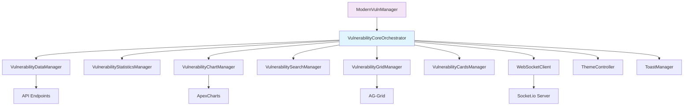
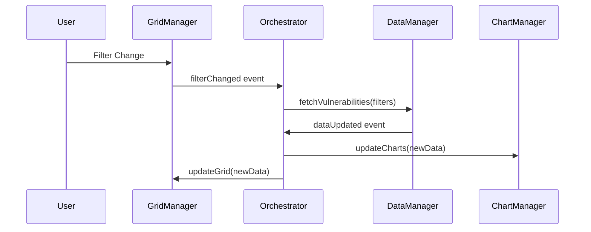

# Frontend Architecture

The HexTrackr frontend employs a sophisticated **modular orchestrator pattern** that provides clean separation of concerns, event-driven communication, and maintainable code organization. The architecture has evolved from a monolithic structure to a fully modular system coordinated by the `VulnerabilityCoreOrchestrator`.

---

## Architecture Overview



---

## Core Orchestrator Pattern

### VulnerabilityCoreOrchestrator

The central coordination hub that manages all specialized modules and their interactions:

```javascript
export class VulnerabilityCoreOrchestrator {
    constructor() {
        this.managers = new Map();
        this.eventBus = new EventTarget();
        this.initialized = false;
    }

    async initializeAllModules(parentManager) {
        // Create and wire all specialized managers
        this.dataManager = new VulnerabilityDataManager(this);
        this.statisticsManager = new VulnerabilityStatisticsManager(this);
        this.chartManager = new VulnerabilityChartManager(this);
        // ... other managers
    }
}
```

**Key Responsibilities**:

- Module lifecycle management
- Inter-module communication coordination
- Event-driven architecture implementation
- State synchronization across modules
- Error handling and recovery

---

## Specialized Manager Modules

### 1. VulnerabilityDataManager

**Location**: `/app/public/scripts/shared/vulnerability-data.js`

**Responsibilities**:

- API communication and data fetching
- Data caching and invalidation
- Response transformation and normalization
- Error handling for network operations

**Key Methods**:

```javascript
async fetchVulnerabilities(params)
async fetchStatistics()
async importCSV(file, options)
clearCache()
```

### 2. VulnerabilityStatisticsManager

**Location**: `/app/public/scripts/shared/vulnerability-statistics.js`

**Responsibilities**:

- Statistical calculations and aggregations
- Trend analysis and metric computation
- Performance optimization for large datasets
- Real-time statistics updates

**Key Features**:

- Severity distribution calculations
- Temporal trend analysis
- Device impact metrics
- Performance-optimized aggregations

### 3. VulnerabilityChartManager

**Location**: `/app/public/scripts/shared/vulnerability-chart-manager.js`

**Responsibilities**:

- ApexCharts integration and management
- Theme-aware chart configuration
- Real-time chart updates
- Chart lifecycle management

**Chart Types**:

- Temporal trends (line charts) - Severity breakdown over time with zoom/pan capabilities

**Theme Integration**:

```javascript
// Sophisticated theme-aware initialization
async initializeCharts() {
    // Approach 1: Immediate initialization
    if (window.headerThemeManager?.getThemeController) {
        const theme = window.headerThemeManager.getThemeController().getTheme();
        this.createChartsWithTheme(theme);
        return;
    }

    // Approach 2: Event-based initialization
    window.addEventListener('themeInitialized', (event) => {
        this.createChartsWithTheme(event.detail.theme);
    });

    // Approach 3: Fallback with timeout
    setTimeout(() => {
        this.createChartsWithTheme('light');
    }, 500);
}
```

### 4. VulnerabilitySearchManager

**Location**: `/app/public/scripts/shared/vulnerability-search.js`

**Responsibilities**:

- Search functionality implementation
- Filter management and application
- CVE lookup and validation
- Search optimization and indexing

### 5. VulnerabilityGridManager

**Location**: `/app/public/scripts/shared/vulnerability-grid.js`

**Responsibilities**:

- AG-Grid configuration and management
- Column definitions and cell renderers
- Pagination and virtual scrolling
- Export functionality

**AG-Grid Features**:

- Virtual scrolling for performance
- Custom cell renderers for CVE links
- Responsive column management
- Advanced filtering and sorting

### 6. VulnerabilityCardsManager

**Location**: `/app/public/scripts/shared/vulnerability-cards.js`

**Responsibilities**:

- Card-based view rendering with distinct device and vulnerability card types
- Pagination for card layouts (6 cards per page default)
- Device grouping and organization
- Interactive card actions with modal integration
- **v1.0.24 Enhancements**:
  - Streamlined vulnerability cards without redundant VPR mini-cards
  - Enhanced device display component with larger icons and text
  - KEV (Known Exploited Vulnerabilities) indicator badges
  - Theme-aware styling with CSS variable integration
  - Improved visual hierarchy and reduced DOM complexity (40% element reduction)

---

## Real-time Communication

### WebSocketClient Architecture

**Location**: `/app/public/scripts/shared/websocket-client.js`

```javascript
class WebSocketClient {
    constructor() {
        this.socket = null;
        this.isConnected = false;
        this.reconnectAttempts = 0;
        this.maxReconnectAttempts = 5;
        this.heartbeatInterval = null;
        this.eventCallbacks = new Map();
        this.progressThrottleTimers = new Map();
    }
}
```

**Key Features**:

- Automatic reconnection with exponential backoff
- Heartbeat monitoring for connection health
- Progress event throttling (100ms minimum interval)
- Event callback management
- Connection timeout handling

**Real-time Events**:

- Import progress tracking
- Data update notifications
- System alerts and warnings
- Connection status changes

---

## Theme System Integration

### ThemeController Integration

**Location**: `/app/public/scripts/shared/theme-controller.js`

The frontend integrates with a sophisticated theme system providing:

- **Dark/Light Mode**: Complete theme switching
- **WCAG Compliance**: AA-level accessibility standards
- **Cross-tab Synchronization**: Theme state shared across browser tabs
- **Component Awareness**: All UI components respect theme settings

**Chart Theme Adaptation**:

```javascript
// Dynamic theme application for charts
applyThemeToChart(chartInstance, theme) {
    const themeConfig = this.getChartThemeConfig(theme);
    chartInstance.updateOptions({
        theme: {
            mode: theme,
            palette: themeConfig.palette
        },
        colors: themeConfig.colors,
        stroke: {
            ...chartOptions.stroke,
            ...(themeConfig.stroke?.colors ? { colors: themeConfig.stroke.colors } : {})
        }
    });
}
```

---

## Modal System Architecture

### Modal Management

**Location**: `/app/public/scripts/shared/` (various modal files)

**Available Modals**:

- `vulnerability-details-modal.js` - Vulnerability information display
- `device-security-modal.js` - Device-specific security details
- `settings-modal.js` - Application configuration
- `progress-modal.js` - Import progress tracking

**Modal Features**:

- Bootstrap 5 integration
- Proper modal lifecycle management
- State preservation during navigation
- Accessibility compliance

### Universal Aggregation System

HexTrackr implements description-field-based aggregation for consistent modal relationships:

**Vulnerability Modals**: Aggregate all devices affected by specific vulnerabilities
**Device Modals**: Aggregate all vulnerabilities affecting specific devices

---

## Page-Specific Architecture

### Vulnerabilities Page (`vulnerabilities.html`)

**Main Controller**: `/app/public/scripts/pages/vulnerabilities.js`

```javascript
export class ModernVulnManager {
    constructor() {
        this.initializeModules();
    }

    async initializeModules() {
        // Delegate to orchestrator
        this.coreOrchestrator = new VulnerabilityCoreOrchestrator();
        await this.coreOrchestrator.initializeAllModules(this);

        // Get module references for delegation
        this.dataManager = this.coreOrchestrator.dataManager;
        this.statisticsManager = this.coreOrchestrator.statisticsManager;
        // ... other managers
    }
}
```

**Page Features**:

- Real-time vulnerability dashboard
- Interactive severity and temporal charts
- Dynamic AG-Grid with virtual scrolling
- CSV import with progress tracking
- Multiple export formats (CSV, HTML, PDF)
- Advanced search and filtering

### Tickets Page (`tickets.html`)

**Main Controller**: `/app/public/scripts/pages/tickets.js`

**Features**:

- Complete CRUD operations for tickets
- Device assignment and tracking
- ServiceNow/Hexagon integration
- Bulk operations and reporting
- Audit trail management

---

## Shared Infrastructure

### Utility Modules

**Location**: `/app/public/scripts/utils/`

- `accessibility-announcer.js` - Screen reader support
- `security.js` - XSS prevention and input sanitization
- `theme-contrast-tester.js` - WCAG compliance validation
- `wcag-contrast-validator.js` - Color contrast validation

### Shared Components

**Location**: `/app/public/scripts/shared/`

- `header-loader.js` - Dynamic header management
- `footer-loader.js` - Footer content loading
- `toast-manager.js` - Notification system
- `config-loader.js` - Configuration management
- `cve-utilities.js` - CVE validation and formatting

---

## Event-Driven Communication

### Event Flow Architecture



**Event Types**:

- `dataUpdated` - New data available
- `filterChanged` - Search/filter modifications
- `themeChanged` - Theme switch events
- `importProgress` - CSV import updates
- `exportComplete` - Export operation finished

---

## Performance Optimizations

### Data Management

- **Caching Strategy**: Intelligent cache invalidation
- **Virtual Scrolling**: AG-Grid virtualization for large datasets
- **Lazy Loading**: Progressive data loading
- **Debounced Operations**: Search and filter debouncing

### Rendering Optimizations

- **Chart Throttling**: Progress update throttling (100ms)
- **DOM Optimization**: Minimal DOM manipulation
- **Event Delegation**: Efficient event handling
- **Memory Management**: Proper cleanup and disposal

### Network Optimization

- **Request Batching**: Combined API requests
- **Response Compression**: Gzip/deflate support
- **Connection Pooling**: WebSocket connection reuse
- **Progressive Enhancement**: Graceful degradation

---

## Error Handling & Recovery

### Graceful Degradation

```javascript
// Example error handling in orchestrator
async handleModuleError(moduleName, error) {
    console.error(`Module ${moduleName} error:`, error);

    // Attempt recovery
    if (this.canRecover(moduleName, error)) {
        await this.recoverModule(moduleName);
    } else {
        // Fallback to basic functionality
        this.enableFallbackMode(moduleName);
    }

    // Notify user if necessary
    this.showErrorToast(moduleName, error);
}
```

**Error Recovery Features**:

- Module-level error isolation
- Automatic recovery attempts
- Fallback functionality modes
- User notification system
- Error logging and reporting

---

## Development & Testing

### Module Testing Strategy

- **Unit Tests**: Individual manager testing
- **Integration Tests**: Orchestrator communication testing
- **E2E Tests**: Playwright automation for workflows
- **Performance Tests**: Load testing with large datasets

### Development Tools

- **ES6 Modules**: Native module system
- **Hot Reloading**: Development server support
- **Source Maps**: Debugging support
- **Code Splitting**: Optimized loading

---

## Future Enhancements

### Planned Improvements

| Area | Enhancement | Priority |
|------|-------------|----------|
| **State Management** | Implement Redux-like state management | Medium |
| **Component System** | Web Components migration | Low |
| **PWA Features** | Service worker and offline support | Medium |
| **Micro-frontends** | Module federation implementation | Low |
| **Performance** | Further bundle optimization | High |
| **Testing** | Increased test coverage to 90%+ | High |

### Architecture Evolution

- **TypeScript Migration**: Gradual TypeScript adoption
- **Framework Integration**: Consider React/Vue integration
- **API Standardization**: GraphQL implementation
- **Real-time Enhancements**: Enhanced WebSocket features

---

## Summary

The HexTrackr frontend demonstrates a mature, modular architecture that prioritizes:

- **Separation of Concerns**: Each module has distinct responsibilities
- **Event-Driven Communication**: Loose coupling between components
- **Performance**: Optimized for large datasets and real-time updates
- **Maintainability**: Clean, testable, and extensible code structure
- **Accessibility**: WCAG AA compliance throughout
- **Theme Integration**: Comprehensive dark/light mode support

This architecture provides a solid foundation for future enhancements while maintaining excellent performance and user experience.
