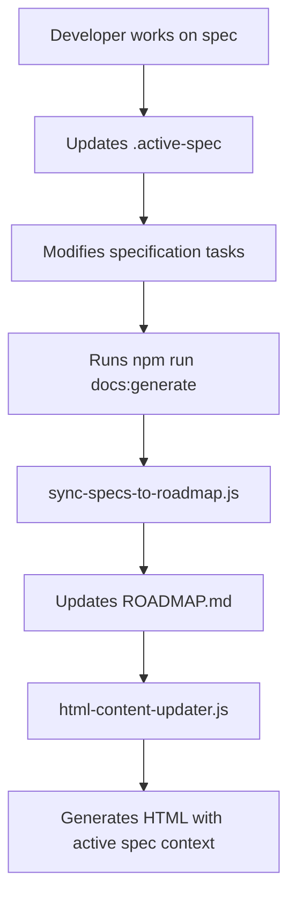

# Spec-Kit Integration Architecture

This document details how HexTrackr integrates with the Spec-Kit framework for specification-driven development, providing a seamless connection between formal specifications and the documentation portal.

## Overview

The Spec-Kit integration eliminates redundancy between separate documentation systems and the formal specification framework. Instead of maintaining parallel SPRINT.md files, all project management information flows directly from the spec-kit framework into the documentation portal.

## Architecture Components

### 1. Active Specification Tracking

**File**: `.active-spec`  
**Purpose**: Contains the currently active specification identifier  
**Format**: Simple text file with spec slug (e.g., "022-documentation-portal-rebuild")

```bash

# Example .active-spec content

022-documentation-portal-rebuild
```

### 2. Specification Synchronizer

**Script**: `scripts/sync-specs-to-roadmap.js`  
**Purpose**: Scans all specification task files and generates roadmap content

**Key Functions**:

- Reads all `hextrackr-specs/specs/*/tasks.md` files
- Parses task completion status using regex patterns
- Generates markdown table with progress tracking
- Highlights active specification with visual indicators

**Active Spec Detection**:

```javascript
const isActiveSpec = activeSpec && 
  s.name.toLowerCase().includes(activeSpec.replace(/^\d+-/, '').replace(/-/g, ' '));
```

### 3. HTML Content Generator

**Script**: `app/public/docs-html/html-content-updater.js`  
**Purpose**: Converts markdown to HTML with active spec awareness

**New Functionality**:

- Reads `.active-spec` file during initialization
- Injects active spec banner into all documentation pages
- Provides visual context for users about current development focus

**Active Spec Banner**:

```html
<div class="alert alert-info d-flex align-items-center mb-4" role="alert">
    <svg><!-- Warning icon --></svg>
    <div>
        <strong>Active Specification:</strong> 022-documentation-portal-rebuild
        <small class="d-block text-muted">
            This documentation is being actively updated as part 
            of the current specification development.
        </small>
    </div>
</div>
```

## Integration Flow

### 1. Development Workflow



### 2. Data Flow

1. **Specification Tasks** (`hextrackr-specs/specs/*/tasks.md`)
   - Contains formal task definitions
   - Uses markdown checkbox format `- [ ]` and `- [x]`
   - Includes priority indicators and metadata

1. **Active Spec Tracking** (`.active-spec`)
   - Single source of truth for current development focus
   - Updated manually when switching between specifications

1. **Roadmap Generation**
   - Automatically scans all specification tasks
   - Calculates completion percentages
   - Highlights active specification with ⚡ and 🎯 indicators

1. **Documentation Portal**
   - Displays active spec banner on all pages
   - Shows current progress in roadmap table
   - Provides contextual information about development state

## Technical Implementation

### File Structure

```
HexTrackr/
├── .active-spec                    # Current active specification
├── hextrackr-specs/
│   └── specs/
│       └── */
│           └── tasks.md           # Specification task definitions
├── scripts/
│   └── sync-specs-to-roadmap.js   # Spec synchronization script
├── app/public/
│   ├── docs-source/
│   │   └── ROADMAP.md             # Generated roadmap content
│   └── docs-html/
│       ├── html-content-updater.js # HTML generation with spec context
│       └── template.html          # Template with spec banner placeholder
```

### NPM Scripts Integration

The integration is automated through npm scripts:

```json
{
  "docs:generate": "npm run docs:sync-specs && node app/public/docs-html/html-content-updater.js",
  "docs:sync-specs": "node scripts/sync-specs-to-roadmap.js",
  "docs:sync-all": "node scripts/docs-sync-all.js"
}
```

### Error Handling

- **Missing .active-spec**: Gracefully handles absence, no spec highlighting
- **Malformed task files**: Skips invalid specifications, logs warnings
- **File permissions**: Uses safe file operations with path validation

## Security Considerations

### Path Validation

All file operations use the `PathValidator` class to prevent:

- Directory traversal attacks
- Invalid file access
- Path injection vulnerabilities

### Input Sanitization

- Spec slugs are validated against expected patterns
- Markdown content is processed safely
- HTML injection is prevented in generated content

## Performance Characteristics

### Generation Speed

- Full documentation regeneration: ~1.7 seconds
- Spec synchronization: ~200ms
- Memory usage: <50MB peak

### Caching Strategy

- Template content cached in memory
- Markdown parsing optimized with marked.js
- File system operations minimized

## Troubleshooting

### Common Issues

1. **Active spec not highlighting**
   - Check `.active-spec` file exists and contains valid spec slug
   - Verify spec name matching logic in sync script

1. **Tasks not updating in roadmap**
   - Ensure `tasks.md` files use correct checkbox format
   - Run `npm run docs:sync-specs` manually to debug

1. **HTML generation failures**
   - Check file permissions in docs-html directory
   - Verify template.html contains required placeholders

### Debugging Commands

```bash

# Test spec synchronization

node scripts/sync-specs-to-roadmap.js

# Test HTML generation

node app/public/docs-html/html-content-updater.js

# Full documentation refresh

npm run docs:generate
```

## Future Enhancements

### Planned Improvements

- Real-time spec status updates via WebSocket
- Automated spec switching based on git branches
- Enhanced progress visualization with charts
- Integration with project management tools

### Extensibility

The architecture supports additional integrations:

- Custom spec metadata parsing
- External task management system connections
- Advanced reporting and analytics
- Multi-project specification tracking

## Configuration

### Environment Variables

Currently, no environment-specific configuration is required. All paths are relative to the project root.

### Customization Points

- Active spec banner styling in `template.html`
- Roadmap table format in `sync-specs-to-roadmap.js`
- HTML generation templates and styling

This integration provides a foundation for specification-driven development while maintaining flexibility for future enhancements and customizations.
