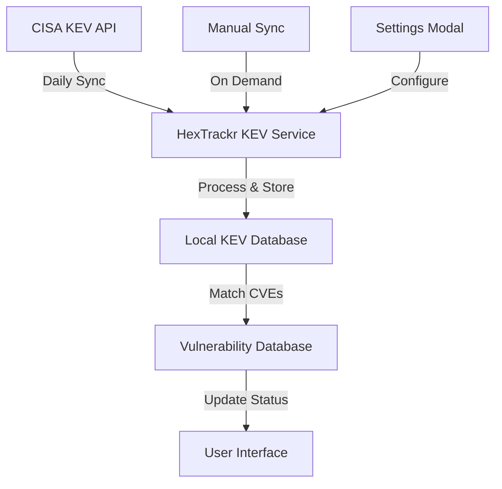

# CISA KEV Integration

> Comprehensive Known Exploited Vulnerabilities integration for enhanced threat intelligence and risk prioritization

## Overview

HexTrackr's CISA KEV (Known Exploited Vulnerabilities) integration provides real-time threat intelligence by automatically identifying which vulnerabilities in your environment are actively being exploited in the wild. This feature transforms HexTrackr from a passive vulnerability tracker to an active threat intelligence platform.

---

## What is CISA KEV?

The Cybersecurity and Infrastructure Security Agency (CISA) maintains a catalog of vulnerabilities that have been observed being exploited by threat actors. This catalog is updated regularly and includes:

- **CVE identifiers** of exploited vulnerabilities
- **Product information** affected by the vulnerabilities
- **Dates** when exploitation was first observed
- **Required actions** and remediation guidance
- **Due dates** for federal agencies (useful for all organizations)

---

## Key Features

### 🎯 Automatic Threat Intelligence

- **Daily Synchronization**: Automatic updates from CISA's public KEV API
- **Real-time Identification**: Instant recognition of exploited vulnerabilities
- **Zero Configuration**: No API keys or authentication required
- **Background Processing**: Updates happen without interrupting workflows

### 🔍 Enhanced Vulnerability Prioritization

- **Visual Indicators**: Clear YES/NO badges throughout the interface
- **Filtering Capabilities**: Dedicated KEV filters in all vulnerability views
- **Priority Highlighting**: Exploited vulnerabilities stand out visually
- **Combined Analysis**: KEV status works with VPR scores and severity levels

### 📊 Comprehensive Integration

- **Table Views**: Dedicated KEV column with sortable/filterable badges
- **Card Views**: KEV status visible on vulnerability cards
- **Modal Details**: Full KEV information with NIST NVD links
- **Search Integration**: KEV status included in all vulnerability searches

---

## User Interface Elements

### KEV Column Indicators

| Badge | Meaning | Action Required |
|-------|---------|-----------------|
| YES | Vulnerability is in CISA KEV catalog | **Urgent remediation required** |
| NO | Vulnerability not in KEV catalog | Standard prioritization applies |

### KEV Modal Features

When clicking on a KEV indicator, you'll access:

- **KEV Status Confirmation**: Clear indication of exploitation status
- **CISA Context**: Additional notes and guidance from CISA
- **NIST NVD Links**: Direct access to authoritative vulnerability information
- **CVE Navigation**: Seamless transition to full vulnerability details
- **External Resources**: Clickable links to additional security resources

### Filter Integration

KEV filtering is available in multiple locations:

1. **KEV Column Filter**: Direct filtering from the vulnerability table header
2. **Severity Dropdown**: "KEV" option alongside Critical, High, Medium, Low
3. **Advanced Search**: KEV status included in search criteria
4. **Combined Filters**: Use KEV with other filters for precise targeting

---

## Technical Implementation

### Data Synchronization

### Database Schema

The KEV integration adds dedicated tables for tracking exploited vulnerabilities:

- **`kev_catalog`**: Stores CISA KEV data with CVE mappings
- **`kev_sync_log`**: Tracks synchronization history and status
- **Enhanced `vulnerabilities`**: Includes `isKev` column for quick filtering

### API Endpoints

- `POST /api/kev/sync` - Manual synchronization trigger
- `GET /api/kev/status` - Current sync status and statistics
- `GET /api/kev/vulnerability/:cveId` - Detailed KEV information for specific CVE

---

## Security Implications

### Risk Assessment Impact

KEV integration fundamentally changes vulnerability risk assessment:

- **Exploitation Evidence**: Moves beyond theoretical risk to confirmed threats
- **Regulatory Compliance**: Many frameworks now require KEV tracking
- **Resource Allocation**: Helps justify urgent remediation efforts
- **Timeline Acceleration**: Exploited vulnerabilities demand immediate attention

### Compliance Benefits

- **CISA BOD 22-01**: Federal agencies must remediate KEV vulnerabilities
- **Cyber Insurance**: Many policies now consider KEV tracking
- **Industry Standards**: NIST and other frameworks increasingly reference KEV
- **Audit Requirements**: Demonstrate awareness of active threats

---

## Configuration and Settings

### Automatic Synchronization

Default configuration includes:

- **Sync Frequency**: Every 24 hours at 3:00 AM Eastern
- **Retry Logic**: Automatic retry on failure with exponential backoff
- **Error Handling**: Graceful degradation if CISA API is unavailable
- **Logging**: Comprehensive sync history for troubleshooting

### Settings Modal Configuration

Access KEV settings through **Settings > KEV Integration**:

#### Synchronization Settings
- ✅ Enable automatic KEV synchronization
- 🕐 Sync Schedule: Daily, Weekly, or Custom intervals
- 📊 Last Sync status and timestamp
- 🔄 Manual sync trigger
- 📋 Sync history and error logs

#### Display Options
- ✅ Show KEV badges on vulnerability cards
- ✅ Highlight KEV vulnerabilities in tables
- ✅ Show KEV column in vulnerability table
- ✅ Enable KEV filtering and sorting
- 🎨 Badge style customization

#### Notification Settings
- 📧 Email alerts for new KEV vulnerabilities
- ⚠️ Notifications for overdue KEV remediation
- 📊 Daily/weekly KEV summary reports

---

## Best Practices

### Remediation Workflow

1. **Immediate Triage**: Review all KEV vulnerabilities first
2. **Context Analysis**: Use KEV modal to understand exploitation details
3. **Resource Allocation**: Prioritize KEV remediation over non-exploited vulnerabilities
4. **Timeline Management**: Set aggressive timelines for KEV remediation
5. **Verification**: Confirm remediation removes KEV status

### Monitoring and Reporting

- **Daily Review**: Check for new KEV vulnerabilities each morning
- **Trend Analysis**: Monitor KEV counts and remediation rates
- **Executive Reporting**: Use KEV statistics in security briefings
- **Compliance Tracking**: Document KEV remediation for audit purposes

### Integration with Existing Processes

- **Incident Response**: Treat new KEV discoveries as security incidents
- **Change Management**: Expedite patches for KEV vulnerabilities
- **Risk Assessments**: Include KEV status in vulnerability scoring
- **Vendor Management**: Require KEV awareness from security vendors

---

## Troubleshooting

### Common Issues

#### KEV Sync Failures
- **Network Issues**: Check internet connectivity and firewall rules
- **API Unavailability**: CISA API may be temporarily unavailable
- **Storage Issues**: Ensure adequate disk space for KEV data

#### Missing KEV Data
- **Recent CVEs**: New vulnerabilities may not yet be in CISA catalog
- **Data Lag**: CISA updates may take time to reflect in HexTrackr
- **Sync Timing**: Manual sync may be needed for immediate updates

#### Display Issues
- **Cache Problems**: Browser refresh may resolve display issues
- **Filter Conflicts**: Check for conflicting filter settings
- **Theme Issues**: KEV badges should work in both light and dark modes

### Support Resources

- **Sync Logs**: Available in Settings > KEV Integration > View Sync Log
- **CISA KEV Catalog**: [https://www.cisa.gov/known-exploited-vulnerabilities-catalog](https://www.cisa.gov/known-exploited-vulnerabilities-catalog)
- **NIST NVD**: [https://nvd.nist.gov/](https://nvd.nist.gov/) for detailed CVE information

---

## Future Enhancements

### Planned Features

- **Threat Intelligence Integration**: Additional threat feeds beyond CISA
- **Automated Ticketing**: Automatic ticket creation for new KEV vulnerabilities
- **Advanced Analytics**: KEV trend analysis and prediction
- **API Expansion**: External access to HexTrackr KEV data
- **Custom Notifications**: Flexible alerting based on KEV criteria

### Integration Possibilities

- **SIEM Platforms**: Export KEV data to security information systems
- **Ticketing Systems**: Automatic high-priority tickets for KEV vulnerabilities
- **Communication Tools**: Slack/Teams notifications for new exploited vulnerabilities
- **Reporting Platforms**: Automated KEV dashboards and executive reports

---

*Last Updated: v1.0.22 - September 2025*