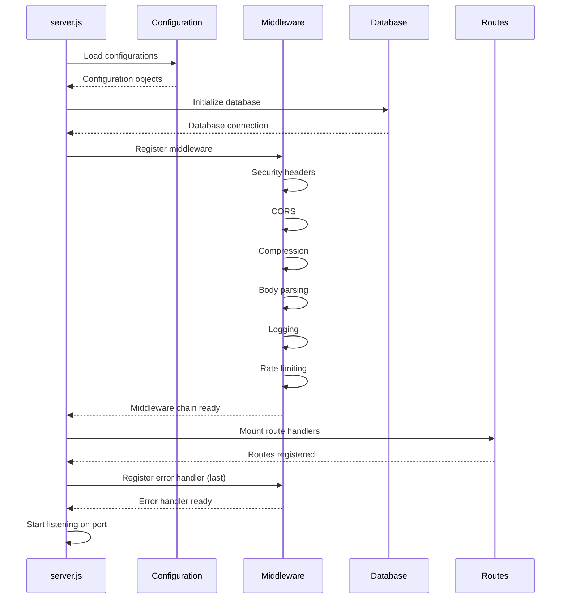

# Middleware & Configuration Reference

This document covers the middleware pipeline and configuration modules that provide the infrastructure for HexTrackr's backend.

## Middleware Pipeline

Middleware executes in the order it's registered in `server.js`. Each middleware can modify the request, response, or pass control to the next middleware.

### Execution Order

```javascript
// server.js middleware registration order
app.use(cors());                    // 1. CORS headers
app.use(compression());              // 2. Response compression
app.use(express.json({ limit: "100mb" }));     // 3. JSON parsing
app.use(express.urlencoded({ extended: true })); // 4. URL encoding
app.use(securityMiddleware);        // 5. Security headers
app.use(loggingMiddleware);          // 6. Request logging
app.use(rateLimiter);               // 7. Rate limiting
app.use(validationMiddleware);      // 8. Input validation
// Routes registered here
app.use(errorHandler);              // Last: Error handling
```

## Middleware Modules

### Security Middleware

**Location**: `/app/middleware/security.js`

Applies security headers and protections to all responses.

#### Implementation

```javascript
module.exports = function securityMiddleware(req, res, next) {
    // Security headers
    res.setHeader("X-Content-Type-Options", "nosniff");
    res.setHeader("X-Frame-Options", "DENY");
    res.setHeader("X-XSS-Protection", "1; mode=block");
    res.setHeader("Strict-Transport-Security", "max-age=31536000; includeSubDomains");
    res.setHeader("Content-Security-Policy", "default-src 'self'");

    // Remove sensitive headers
    res.removeHeader("X-Powered-By");
    res.removeHeader("Server");

    next();
};
```

#### Headers Applied

| Header | Value | Purpose |
| ------ | ----- | ------- |
| `X-Content-Type-Options` | `nosniff` | Prevents MIME sniffing |
| `X-Frame-Options` | `DENY` | Prevents clickjacking |
| `X-XSS-Protection` | `1; mode=block` | Enables XSS protection |
| `Strict-Transport-Security` | `max-age=31536000` | Forces HTTPS |
| `Content-Security-Policy` | `default-src 'self'` | Restricts resource loading |

---

### Logging Middleware

**Location**: `/app/middleware/logging.js`

Logs all incoming requests and outgoing responses.

#### Implementation

```javascript
const morgan = require("morgan");

// Custom format for detailed logging
const customFormat = ":method :url :status :response-time ms - :res[content-length]";

// Development logging (detailed)
const developmentLogger = morgan("dev");

// Production logging (combined)
const productionLogger = morgan("combined");

module.exports = process.env.NODE_ENV === "production"
    ? productionLogger
    : developmentLogger;
```

#### Log Format

**Development**:
```
GET /api/vulnerabilities 200 45.123 ms - 2048
POST /api/tickets 201 23.456 ms - 512
```

**Production** (Combined Log Format):
```
192.168.1.1 - - [15/Mar/2024:10:00:00 +0000] "GET /api/vulnerabilities HTTP/1.1" 200 2048 "https://example.com" "Mozilla/5.0"
```

---

### Error Handler Middleware

**Location**: `/app/middleware/errorHandler.js`

Centralized error handling for all routes.

#### Implementation

```javascript
module.exports = function errorHandler(err, req, res, next) {
    // Log error
    console.error(`Error: ${err.message}`);
    console.error(err.stack);

    // Determine status code
    const statusCode = err.statusCode || err.status || 500;

    // Prepare error response
    const errorResponse = {
        success: false,
        error: err.message || "Internal Server Error",
        code: err.code || "INTERNAL_ERROR"
    };

    // Add stack trace in development
    if (process.env.NODE_ENV === "development") {
        errorResponse.stack = err.stack;
    }

    // Send error response
    res.status(statusCode).json(errorResponse);
};
```

#### Error Types Handled

| Error Type | Status Code | Response |
| ---------- | ----------- | -------- |
| ValidationError | 400 | Bad Request with validation details |
| UnauthorizedError | 401 | Unauthorized access |
| ForbiddenError | 403 | Forbidden resource |
| NotFoundError | 404 | Resource not found |
| ConflictError | 409 | Resource conflict |
| InternalError | 500 | Internal server error |

---

### Validation Middleware

**Location**: `/app/middleware/validation.js`

Input validation for request data.

#### Implementation

```javascript
const { ValidationService } = require("../services/validationService");

module.exports = function validationMiddleware(req, res, next) {
    // Skip validation for GET requests
    if (req.method === "GET") {
        return next();
    }

    // Validate based on route
    const route = req.path;

    try {
        if (route.includes("/vulnerabilities")) {
            ValidationService.validateVulnerability(req.body);
        } else if (route.includes("/tickets")) {
            ValidationService.validateTicket(req.body);
        }

        // Sanitize all input
        req.body = ValidationService.sanitizeInput(req.body);

        next();
    } catch (error) {
        next(new ValidationError(error.message));
    }
};
```

---

## Configuration Modules

### Database Configuration

**Location**: `/app/config/database.js`

Database connection and initialization settings.

#### Configuration

```javascript
module.exports = {
    // Database file location
    path: process.env.DB_PATH || "./data/hextrackr.db",

    // Connection options
    options: {
        verbose: process.env.NODE_ENV === "development",
        fileMustExist: false,
        timeout: 5000
    },

    // Pool settings (future enhancement)
    pool: {
        min: 2,
        max: 10,
        idleTimeoutMillis: 30000
    },

    // Backup settings
    backup: {
        enabled: true,
        interval: "daily",
        retention: 7,
        path: "./backups/"
    },

    // Migration settings
    migrations: {
        directory: "./migrations",
        tableName: "schema_migrations"
    }
};
```

#### Environment Variables

| Variable | Default | Description |
| -------- | ------- | ----------- |
| `DB_PATH` | `./data/hextrackr.db` | Database file location |
| `DB_VERBOSE` | `false` | Enable SQL logging |
| `DB_TIMEOUT` | `5000` | Connection timeout (ms) |
| `DB_BACKUP_ENABLED` | `true` | Enable automatic backups |

---

### Middleware Configuration

**Location**: `/app/config/middleware.js`

Centralized middleware configuration.

#### Configuration

```javascript
module.exports = {
    // CORS settings
    cors: {
        origin: process.env.CORS_ORIGIN || "*",
        credentials: true,
        optionsSuccessStatus: 204,
        methods: ["GET", "POST", "PUT", "DELETE", "OPTIONS"],
        allowedHeaders: ["Content-Type", "Authorization"]
    },

    // Rate limiting
    rateLimit: {
        windowMs: 15 * 60 * 1000, // 15 minutes
        max: 100, // requests per window
        message: "Too many requests from this IP",
        standardHeaders: true,
        legacyHeaders: false,
        skip: (req) => {
            // Skip rate limiting for health checks
            return req.path === "/health";
        }
    },

    // File upload (Multer)
    upload: {
        dest: "uploads/",
        limits: {
            fileSize: 100 * 1024 * 1024, // 100MB
            files: 1
        },
        fileFilter: (req, file, cb) => {
            // Only allow CSV files for imports
            if (file.mimetype === "text/csv") {
                cb(null, true);
            } else {
                cb(new Error("Only CSV files allowed"));
            }
        }
    },

    // Compression
    compression: {
        level: 6,
        threshold: 1024,
        filter: (req, res) => {
            // Don't compress responses with this request header
            if (req.headers["x-no-compression"]) {
                return false;
            }
            // Use compression filter function
            return compression.filter(req, res);
        }
    },

    // JSON parsing
    json: {
        limit: "100mb",
        strict: true,
        type: "application/json"
    },

    // URL encoding
    urlencoded: {
        extended: true,
        limit: "100mb",
        parameterLimit: 10000
    }
};
```

---

### Server Configuration

**Location**: `/app/config/server.js`

Express server and application settings.

#### Configuration

```javascript
module.exports = {
    // Server settings
    port: process.env.PORT || 8080,
    host: process.env.HOST || "0.0.0.0",

    // Express settings
    express: {
        trustProxy: true,
        jsonSpaces: process.env.NODE_ENV === "development" ? 2 : 0,
        caseSensitiveRouting: false,
        strictRouting: false
    },

    // Static file serving
    static: {
        root: "./app/public",
        options: {
            index: ["index.html"],
            maxAge: "1d",
            etag: true,
            lastModified: true,
            setHeaders: (res, path) => {
                // Cache control for different file types
                if (path.endsWith(".html")) {
                    res.setHeader("Cache-Control", "no-cache");
                } else if (path.endsWith(".js") || path.endsWith(".css")) {
                    res.setHeader("Cache-Control", "public, max-age=86400");
                }
            }
        }
    },

    // Session settings (future enhancement)
    session: {
        secret: process.env.SESSION_SECRET || "change-this-secret",
        resave: false,
        saveUninitialized: false,
        cookie: {
            secure: process.env.NODE_ENV === "production",
            httpOnly: true,
            maxAge: 24 * 60 * 60 * 1000 // 24 hours
        }
    },

    // Monitoring
    monitoring: {
        healthCheckPath: "/health",
        metricsPath: "/metrics",
        readinessPath: "/ready",
        livenessPath: "/alive"
    }
};
```

---

### WebSocket Configuration

**Location**: `/app/config/websocket.js`

Socket.io WebSocket server configuration.

#### Configuration

```javascript
module.exports = {
    // WebSocket server settings
    port: process.env.WS_PORT || 8988,

    // Socket.io options
    socketIO: {
        cors: {
            origin: "*",
            methods: ["GET", "POST"]
        },
        transports: ["websocket", "polling"],
        pingTimeout: 60000,
        pingInterval: 25000,
        maxHttpBufferSize: 1e6
    },

    // Progress tracking
    progress: {
        throttleInterval: 100, // ms between updates
        sessionTimeout: 30 * 60 * 1000, // 30 minutes
        cleanupInterval: 5 * 60 * 1000, // 5 minutes
        maxSessions: 1000
    },

    // Event configuration
    events: {
        connection: "connection",
        disconnect: "disconnect",
        importProgress: "import-progress",
        importComplete: "import-complete",
        importError: "import-error",
        sessionCreated: "session-created",
        sessionCleanup: "session-cleanup"
    },

    // Room configuration
    rooms: {
        imports: "import-room",
        monitoring: "monitoring-room",
        admin: "admin-room"
    }
};
```

## Configuration Loading

### Environment-based Configuration

```javascript
// Load environment-specific config
const env = process.env.NODE_ENV || "development";
const config = require(`./config.${env}.js`);

// Merge with defaults
const finalConfig = {
    ...defaultConfig,
    ...config
};
```

### Configuration Validation

```javascript
function validateConfig(config) {
    // Check required fields
    if (!config.database.path) {
        throw new Error("Database path is required");
    }

    // Validate port
    if (config.server.port < 1 || config.server.port > 65535) {
        throw new Error("Invalid port number");
    }

    // Validate file size limits
    if (config.middleware.upload.limits.fileSize > 500 * 1024 * 1024) {
        console.warn("File size limit exceeds recommended 500MB");
    }

    return true;
}
```

## Utility Modules

### PathValidator

**Location**: `/app/utils/PathValidator.js`

Comprehensive path validation and safe file operations.

#### Static Methods

| Method | Purpose | Returns |
| ------ | ------- | ------- |
| `validatePath(path)` | Validates and normalizes path | Safe path string |
| `safeReadFileSync(path, options)` | Safely reads file | File content |
| `safeWriteFileSync(path, data, options)` | Safely writes file | Success boolean |
| `safeReaddirSync(path, options)` | Safely lists directory | File array |
| `safeStatSync(path)` | Safely gets file stats | Stats object |
| `safeExistsSync(path)` | Safely checks existence | Boolean |
| `safeUnlinkSync(path)` | Safely deletes file | Success boolean |

---

### ProgressTracker

**Location**: `/app/utils/ProgressTracker.js`

Session-based progress tracking for long operations.

#### Methods

| Method | Purpose | Parameters |
| ------ | ------- | ---------- |
| `createSession(metadata)` | Creates tracking session | Session metadata |
| `createSessionWithId(id, metadata)` | Creates session with specific ID | ID, metadata |
| `updateProgress(sessionId, progress, message)` | Updates progress | ID, percentage, message |
| `completeSession(sessionId, result)` | Marks session complete | ID, result data |
| `errorSession(sessionId, error)` | Marks session failed | ID, error details |
| `getSession(sessionId)` | Gets session details | Session ID |
| `cleanupSessions()` | Removes old sessions | None |

---

### Constants

**Location**: `/app/utils/constants.js`

Application-wide constants and enumerations.

```javascript
module.exports = {
    // Severity levels
    SEVERITY: {
        CRITICAL: "Critical",
        HIGH: "High",
        MEDIUM: "Medium",
        LOW: "Low"
    },

    // Ticket status
    TICKET_STATUS: {
        OPEN: "Open",
        IN_PROGRESS: "In Progress",
        RESOLVED: "Resolved",
        CLOSED: "Closed"
    },

    // Import status
    IMPORT_STATUS: {
        PENDING: "pending",
        PROCESSING: "processing",
        COMPLETED: "completed",
        FAILED: "failed"
    },

    // File types
    FILE_TYPES: {
        CSV: "text/csv",
        JSON: "application/json",
        XML: "application/xml"
    },

    // API versions
    API_VERSION: "v1",

    // Pagination
    DEFAULT_PAGE_SIZE: 50,
    MAX_PAGE_SIZE: 1000,

    // Cache TTL (seconds)
    CACHE_TTL: {
        SHORT: 60,
        MEDIUM: 300,
        LONG: 3600
    }
};
```

---

### Helpers

**Location**: `/app/utils/helpers.js`

Utility functions used throughout the application.

#### Key Functions

| Function | Purpose | Parameters | Returns |
| -------- | ------- | ---------- | ------- |
| `mapVulnerabilityRow(row, importId)` | Maps CSV to DB schema | CSV row, import ID | Mapped object |
| `generateUniqueKey(vulnerability)` | Generates dedup key | Vuln object | Unique key string |
| `normalizeHostname(hostname)` | Normalizes hostname | Hostname string | Normalized string |
| `normalizeIP(ip)` | Normalizes IP address | IP string | Normalized IP |
| `createDescriptionHash(text)` | Creates text hash | Description text | Hash string |
| `formatDate(date, format)` | Formats date | Date, format string | Formatted date |
| `parseCSVDate(dateStr)` | Parses CSV dates | Date string | Date object |
| `calculateVPRScore(cvss, age, exploited)` | Calculates VPR | CVSS, age, bool | VPR score |

## Initialization Flow



## Best Practices

### Middleware Development

1. **Order Matters**: Place middleware in correct order
2. **Error Handling**: Always call `next(error)` for errors
3. **Async Operations**: Use `async/await` or promises
4. **Performance**: Keep middleware lightweight
5. **Documentation**: Document side effects

### Configuration Management

1. **Environment Variables**: Use for sensitive data
2. **Validation**: Validate all configuration on startup
3. **Defaults**: Provide sensible defaults
4. **Documentation**: Document all configuration options
5. **Type Safety**: Consider using JSON schema

### Security Considerations

1. **Input Validation**: Validate all user input
2. **Path Traversal**: Use PathValidator for file operations
3. **Rate Limiting**: Apply to all endpoints
4. **Headers**: Set security headers appropriately
5. **Secrets**: Never commit secrets to repository