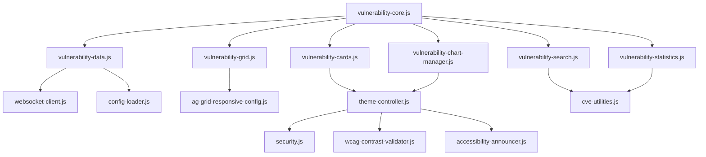

# JavaScript Modules Catalog

Complete inventory of all JavaScript modules in the HexTrackr application, providing detailed technical specifications for each component.

---

## Module Architecture Overview

HexTrackr uses a modular JavaScript architecture with 22+ specialized modules organized into three main categories:

- **Shared Components** - Reusable components used across multiple pages
- **Page-Specific Logic** - Dedicated modules for specific pages
- **Utility Functions** - Helper functions and utilities

---

## Shared Components (`/scripts/shared/`)

### Theme Management

#### `theme-controller.js` (1,664 lines)

**Purpose**: Complete dark/light theme system with accessibility support

**Key Features**:

- System preference detection with `prefers-color-scheme` media query
- Manual theme toggle with localStorage persistence
- WCAG AA contrast validation
- Screen reader announcements for theme changes
- Integration with AG-Grid and ApexCharts theming

**Public API**:

```javascript
class ThemeController {
  constructor()                          // Initialize theme system
  getCurrentTheme()                      // Get current theme ('light' or 'dark')
  setTheme(theme)                       // Set specific theme
  toggleTheme()                         // Toggle between themes
  addThemeChangeListener(callback)      // Register for theme change events
  removeThemeChangeListener(callback)   // Unregister listener
  applyTheme(theme)                     // Apply theme to DOM
  validateContrastCompliance()          // Check WCAG compliance
}
```

**Dependencies**:

- `../utils/security.js`
- `../utils/wcag-contrast-validator.js`
- `../utils/accessibility-announcer.js`

**Event System**:

- Emits `themeChange` events with theme data
- Listens to `storage` events for cross-tab synchronization
- Monitors system preference changes

---

### Data Management

#### `vulnerability-core.js` (571 lines)

**Purpose**: Central orchestration and coordination for vulnerability management

**Key Features**:

- Module lifecycle management
- Event coordination between components
- State synchronization
- Error boundary handling

**Public API**:

```javascript
class VulnerabilityCore {
  constructor(config)                   // Initialize with configuration
  initialize()                         // Start all subsystems
  destroy()                            // Clean shutdown
  getModule(name)                      // Access specific module
  broadcast(event, data)               // Send events to all modules
}
```

#### `vulnerability-data.js` (571 lines)

**Purpose**: Central data management and caching layer

**Key Features**:

- API communication with backend
- Data normalization and validation
- Intelligent caching with TTL
- Pagination handling
- WebSocket integration for real-time updates

**Public API**:

```javascript
class VulnerabilityData {
  async fetchVulnerabilities(options)   // Get vulnerability data
  async getStatistics()                 // Fetch dashboard stats
  invalidateCache(key)                  // Clear specific cache
  subscribeToUpdates(callback)          // Real-time notifications
  getFromCache(key)                     // Retrieve cached data
}
```

#### `vulnerability-statistics.js` (364 lines)

**Purpose**: VPR calculations and metrics generation

**Key Features**:

- Complex statistical calculations
- VPR score analysis
- Trend calculations
- Performance optimized aggregations

**Public API**:

```javascript
class VulnerabilityStatistics {
  calculateVPRDistribution(data)        // VPR score analysis
  generateTrendData(timeRange)          // Historical trends
  computeSeverityMetrics(vulnerabilities) // Severity breakdowns
  calculateRiskScore(vulnerability)     // Individual risk scoring
}
```

---

### User Interface Components

#### `vulnerability-grid.js` (195 lines)

**Purpose**: AG Grid table interface management

**Key Features**:

- AG Grid configuration and initialization
- Column definitions with custom renderers
- Sort and filter management
- Export functionality
- Responsive design adaptations

**Public API**:

```javascript
class VulnerabilityGrid {
  initialize(containerId, options)      // Create grid instance
  updateData(data)                      // Refresh grid data
  exportToCsv(filename)                 // Export functionality
  applyFilters(filterModel)             // Apply filtering
  destroy()                             // Cleanup resources
}
```

#### `vulnerability-cards.js` (345 lines)

**Purpose**: Card-based responsive layouts for mobile/tablet views

**Key Features**:

- Responsive card rendering
- Touch-friendly interactions
- Lazy loading optimization
- Custom card templates

**Public API**:

```javascript
class VulnerabilityCards {
  render(container, data, template)     // Render card layout
  updateCard(id, data)                  // Update individual card
  applyFilters(criteria)                // Filter visible cards
  setTemplate(templateName)             // Switch card template
}
```

#### `vulnerability-search.js` (348 lines)

**Purpose**: Advanced search and filtering functionality

**Key Features**:

- Multi-field search with debouncing
- Advanced filter combinations
- Search history and suggestions
- Export filtered results

**Public API**:

```javascript
class VulnerabilitySearch {
  initialize(searchInput, filterContainer) // Setup search UI
  performSearch(query, filters)         // Execute search
  saveSearchProfile(name, criteria)     // Save search preset
  loadSearchProfile(name)               // Load saved search
  getSearchHistory()                    // Retrieve search history
}
```

---

### Visualization Components

#### `vulnerability-chart-manager.js` (590 lines)

**Purpose**: ApexCharts visualization management

**Key Features**:

- Multiple chart types (line, bar, pie, donut)
- Real-time chart updates
- Interactive tooltips and legends
- Theme-aware color schemes
- Export capabilities (PNG, SVG, PDF)

**Public API**:

```javascript
class VulnerabilityChartManager {
  createChart(type, container, options) // Create new chart
  updateChart(chartId, data)            // Update existing chart
  setTheme(theme)                       // Apply theme colors
  exportChart(chartId, format)          // Export chart
  destroyChart(chartId)                 // Clean up chart
}
```

---

### Modal Systems

#### `vulnerability-details-modal.js` (935 lines)

**Purpose**: Comprehensive modal system for vulnerability details

**Key Features**:

- Dynamic content loading
- Tabbed interface for different views
- CVE data integration
- Related vulnerabilities display
- Action buttons for ticket creation

**Public API**:

```javascript
class VulnerabilityDetailsModal {
  show(vulnerabilityId)                 // Display modal with data
  hide()                                // Close modal
  switchTab(tabName)                    // Navigate between tabs
  loadRelatedData(type)                 // Load additional information
  createTicket(vulnerabilityData)       // Generate support ticket
}
```

#### `device-security-modal.js` (637 lines)

**Purpose**: Device-specific security information modal

**Key Features**:

- Device vulnerability aggregation
- Security posture visualization
- Remediation recommendations
- Compliance status reporting

#### `progress-modal.js` (649 lines)

**Purpose**: Long-running operation progress display

**Key Features**:

- WebSocket-driven progress updates
- File upload progress tracking
- Cancellable operations
- Error state handling

#### `settings-modal.js` (1,296 lines)

**Purpose**: Application settings and configuration management

**Key Features**:

- User preferences management
- Theme settings
- Grid configuration
- Export settings
- Data retention policies

---

### Utility Components

#### `ag-grid-responsive-config.js` (356 lines)

**Purpose**: AG Grid responsive configuration and theming

**Key Features**:

- Breakpoint-aware column visibility
- Mobile-optimized layouts
- Theme integration
- Performance optimizations

#### `config-loader.js` (105 lines)

**Purpose**: Application configuration management

**Key Features**:

- Environment-aware configuration loading
- Configuration validation
- Default value management
- Hot configuration reloading

#### `cve-utilities.js` (415 lines)

**Purpose**: CVE data processing and validation utilities

**Key Features**:

- CVE format validation
- CVSS score calculations
- NVD integration utilities
- CVE link generation

#### `footer-loader.js` (253 lines)

**Purpose**: Dynamic footer content management

#### `header-loader.js` (149 lines)

**Purpose**: Navigation header management

#### `header.js` (154 lines)

**Purpose**: Header interaction and state management

#### `modal-monitoring.js` (628 lines)

**Purpose**: Modal state monitoring and management system

#### `pagination-controller.js` (227 lines)

**Purpose**: Centralized pagination logic

#### `toast-manager.js` (434 lines)

**Purpose**: User notification system

#### `websocket-client.js` (225 lines)

**Purpose**: WebSocket communication layer

**Key Features**:

- Automatic reconnection logic
- Message queuing during disconnections
- Event-driven architecture
- Connection state management

**Public API**:

```javascript
class WebSocketClient {
  connect(url, options)                 // Establish connection
  disconnect()                          // Close connection
  send(event, data)                     // Send message
  on(event, callback)                   // Register event handler
  off(event, callback)                  // Unregister handler
  getConnectionState()                  // Get current state
}
```

---

## Page-Specific Modules (`/scripts/pages/`)

### `tickets.js` (Ticket Management System)

**Purpose**: Complete ticket management functionality

**Key Features**:

- CRUD operations for tickets
- Status workflow management
- Assignment and tracking
- Integration with vulnerability data
- Bulk operations

### `vulnerabilities.js` (Vulnerability Dashboard)

**Purpose**: Main vulnerability management interface

**Key Features**:

- Dashboard initialization
- Module coordination
- Event handling
- State management
- Performance monitoring

---

## Utility Functions (`/scripts/utils/`)

### Security Utilities

- **`security.js`**: Input validation and sanitization
- **`wcag-contrast-validator.js`**: Color accessibility validation
- **`accessibility-announcer.js`**: Screen reader support

### Helper Functions

- **`date-formatter.js`**: Date/time formatting utilities
- **`export-utilities.js`**: Data export functionality
- **`validation-helpers.js`**: Form and data validation

---

## Module Integration Patterns

### Event-Driven Architecture

All modules communicate through a centralized event system:

```javascript
// Event emission
VulnerabilityCore.broadcast('dataUpdated', { type: 'vulnerabilities', data: newData });

// Event listening
module.on('dataUpdated', (event) => {
  if (event.type === 'vulnerabilities') {
    this.refresh(event.data);
  }
});
```

### Dependency Injection

Modules receive dependencies through constructor injection:

```javascript
const chartManager = new VulnerabilityChartManager({
  themeController: this.themeController,
  dataManager: this.dataManager,
  containerSelector: '#charts-container'
});
```

### Lifecycle Management

All modules follow a consistent lifecycle:

1. **Initialize**: Setup DOM, event listeners, initial state
2. **Activate**: Begin normal operations
3. **Update**: Handle data/state changes
4. **Deactivate**: Pause operations
5. **Destroy**: Cleanup resources, remove listeners

---

## Performance Considerations

### Memory Management

- All modules implement proper cleanup in `destroy()` methods
- Event listeners are properly removed
- DOM references are cleared
- Timers and intervals are cancelled

### Lazy Loading

- Large modules are loaded on-demand
- Chart libraries loaded when first chart is created
- Modal content loaded when modal is opened

### Caching Strategy

- API responses cached with TTL
- Chart configurations cached
- Search results cached for pagination

---

## Testing Coverage

Each module includes:

- **Unit tests** for public API methods
- **Integration tests** for module interactions
- **E2E tests** for user workflows
- **Performance tests** for critical paths

Test files located in `__tests__/modules/` with corresponding module structure.

---

## Module Dependencies Graph



This modular architecture ensures maintainability, testability, and scalability while providing clear separation of concerns and well-defined interfaces between components.
