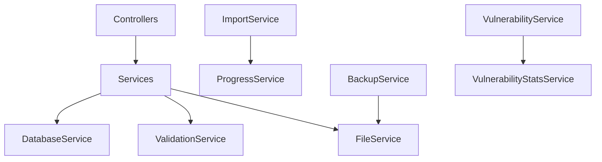

# Service Layer Reference

The service layer provides the business logic and data access operations for HexTrackr. Services are organized by domain and follow functional export patterns.

## Overview

Services handle:
- Database operations and transactions
- Business logic and data transformations
- File system operations
- External integrations
- Complex calculations and aggregations

## Service Architecture

```javascript
// Typical service structure
const db = require("../config/database");
const { validateInput } = require("../utils/helpers");

async function getItems(filters = {}) {
    // Business logic
    const query = buildQuery(filters);
    return await db.all(query);
}

module.exports = {
    getItems,
    // Other exports...
};
```

## Core Services

### DatabaseService

**Location**: `/app/services/databaseService.js`

Core database operations and connection management.

#### Methods

| Method | Parameters | Returns | Description |
| ------ | ---------- | ------- | ----------- |
| `getDb()` | None | Database instance | Returns active database connection |
| `runQuery(sql, params)` | SQL string, parameters | Query result | Executes parameterized query |
| `transaction(callback)` | Transaction callback | Transaction result | Wraps operations in transaction |
| `backup(path)` | Backup file path | Success boolean | Creates database backup |
| `restore(path)` | Backup file path | Success boolean | Restores from backup |

#### Usage Example

```javascript
const { runQuery, transaction } = require("../services/databaseService");

// Simple query
const results = await runQuery(
    "SELECT * FROM vulnerabilities WHERE severity = ?",
    ["Critical"]
);

// Transaction
await transaction(async (db) => {
    await db.run("INSERT INTO tickets ...");
    await db.run("UPDATE counters ...");
});
```

---

### VulnerabilityService

**Location**: `/app/services/vulnerabilityService.js`

Vulnerability CRUD operations and lifecycle management.

#### Methods

| Method | Parameters | Returns | Description |
| ------ | ---------- | ------- | ----------- |
| `getVulnerabilities(filters, pagination)` | Filter object, pagination | Vulnerability array | Retrieves filtered vulnerabilities |
| `getVulnerabilityById(id)` | Vulnerability ID | Vulnerability object | Gets single vulnerability |
| `createVulnerability(data)` | Vulnerability data | Created vulnerability | Creates new vulnerability |
| `updateVulnerability(id, data)` | ID, update data | Updated vulnerability | Updates existing vulnerability |
| `deleteVulnerability(id)` | Vulnerability ID | Success boolean | Deletes vulnerability |
| `getResolvedVulnerabilities(days)` | Days to look back | Resolved array | Gets recently resolved vulns |

#### Data Structures

```javascript
// Vulnerability object
{
    vulnerability_id: "VULN-001",
    unique_key: "plugin:123|host:server01|vendor:tenable",
    title: "Critical Security Update",
    severity: "Critical",
    cvss: 9.8,
    cve_id: "CVE-2024-1234",
    affected_hosts: "server01.example.com",
    port: 443,
    protocol: "tcp",
    service_name: "https",
    remediation: "Apply security patch",
    description: "Detailed vulnerability description",
    vendor: "Tenable",
    scan_date: "2024-03-15",
    first_seen: "2024-01-01",
    last_seen: "2024-03-15",
    state: "active"
}
```

---

### VulnerabilityStatsService

**Location**: `/app/services/vulnerabilityStatsService.js`

Statistics, aggregations, and trend analysis for vulnerabilities.

#### Methods

| Method | Parameters | Returns | Description |
| ------ | ---------- | ------- | ----------- |
| `getStats()` | None | Stats object | Overall vulnerability statistics |
| `getTrends(days)` | Number of days | Trend array | Daily vulnerability trends |
| `getRecentTrends()` | None | Trend object | Last 30 days trends |
| `getSeverityDistribution()` | None | Distribution object | Count by severity |
| `getVendorStats()` | None | Vendor stats | Stats grouped by vendor |
| `getHostStats()` | None | Host stats | Most vulnerable hosts |

#### Response Examples

```javascript
// getStats() response
{
    total: 5000,
    critical: 500,
    high: 1500,
    medium: 2000,
    low: 1000,
    activeHosts: 250,
    resolvedLast30Days: 300,
    newLast30Days: 450,
    avgCVSS: 6.5
}

// getTrends() response
[
    {
        date: "2024-03-15",
        total: 5000,
        critical: 500,
        high: 1500,
        new: 50,
        resolved: 30
    }
]
```

---

### ImportService

**Location**: `/app/services/importService.js`

Complex import operations for vulnerabilities and tickets.

#### Methods

| Method | Parameters | Returns | Description |
| ------ | ---------- | ------- | ----------- |
| `parseCSV(data)` | CSV string | Parsed object | Parses CSV using PapaParse |
| `extractDateFromFilename(filename)` | Filename string | Date string | Extracts scan date from filename |
| `extractVendorFromFilename(filename)` | Filename string | Vendor string | Identifies vendor from filename |
| `createImportRecord(metadata)` | Import metadata | Import record | Creates import tracking record |
| `processVulnerabilitiesWithLifecycle(rows, importId, filePath, scanDate)` | Data array, import ID, path, date | Processing result | Full vulnerability import with deduplication |
| `bulkLoadToStagingTable(rows, importId)` | Data array, import ID | Load result | High-performance staging load |
| `processStagingToFinalTables(importId, scanDate)` | Import ID, scan date | Processing result | Processes staged data to final tables |
| `mapVulnerabilityRow(row, importId)` | CSV row, import ID | Mapped object | Maps CSV columns to database schema |

#### Complex Operations

**processVulnerabilitiesWithLifecycle**: Handles the complete import lifecycle:
1. Marks existing vulnerabilities as potentially stale
2. Processes each row with deduplication
3. Generates unique keys (4-tier strategy)
4. Updates or inserts vulnerabilities
5. Removes stale entries not seen in current scan
6. Updates daily totals

**Unique Key Generation** (4-tier strategy):
```javascript
// Tier 1: Asset + Plugin (most reliable)
`asset:${assetId}|plugin:${pluginId}`

// Tier 2: CVE + Host
`cve:${cve}|host:${hostname}`

// Tier 3: Plugin + Host + Vendor
`plugin:${pluginId}|host:${hostname}|vendor:${vendor}`

// Tier 4: Description hash + Host (fallback)
`desc:${hash}|host:${hostname}`
```

---

### TicketService

**Location**: `/app/services/ticketService.js`

Ticket CRUD operations and device management.

#### Methods

| Method | Parameters | Returns | Description |
| ------ | ---------- | ------- | ----------- |
| `getAllTickets(filters)` | Filter object | Ticket array | Gets filtered tickets |
| `getTicketById(id)` | Ticket ID | Ticket object | Gets single ticket |
| `createTicket(data)` | Ticket data | Created ticket | Creates new ticket |
| `updateTicket(id, data)` | ID, update data | Updated ticket | Updates existing ticket |
| `deleteTicket(id)` | Ticket ID | Success boolean | Deletes ticket |
| `generateXTNumber()` | None | XT number string | Generates unique XT# |
| `migrateTickets(tickets)` | Ticket array | Migration result | Bulk ticket migration |

#### Data Structures

```javascript
// Ticket object
{
    id: 1,
    ticket_number: "INC0012345",
    xt_number: "XT24-001",
    title: "Network Maintenance",
    description: "Scheduled maintenance window",
    priority: "Medium",
    status: "Open",
    assignee: "John Doe",
    devices: ["switch01", "router02"], // JSON array
    location: "Data Center A",
    site: "Primary",
    created_date: "2024-03-15T10:00:00Z",
    updated_date: "2024-03-15T14:00:00Z",
    notes: "Additional notes"
}
```

---

### BackupService

**Location**: `/app/services/backupService.js`

Backup and restore operations for all data types.

#### Methods

| Method | Parameters | Returns | Description |
| ------ | ---------- | ------- | ----------- |
| `getBackupStats()` | None | Stats object | Backup statistics |
| `exportVulnerabilities()` | None | Vulnerability array | Exports all vulnerabilities |
| `exportTickets()` | None | Ticket array | Exports all tickets |
| `exportAll()` | None | Combined export | Exports all data |
| `restoreBackup(data, options)` | Backup data, options | Restore result | Restores from backup |
| `clearData(type)` | Data type string | Clear result | Clears specific data type |

#### Restore Options

```javascript
{
    clearExisting: true,  // Clear before restore
    skipValidation: false, // Skip data validation
    dataTypes: ["vulnerabilities", "tickets"], // Types to restore
    progressCallback: (progress) => {} // Progress updates
}
```

---

### DocsService

**Location**: `/app/services/docsService.js`

Documentation statistics and metadata generation.

#### Methods

| Method | Parameters | Returns | Description |
| ------ | ---------- | ------- | ----------- |
| `computeStats()` | None | Stats object | Documentation statistics |
| `computeApiEndpoints()` | None | Endpoint count | Counts API endpoints |
| `computeJsFunctionCount()` | None | Function count | Counts JS functions |
| `computeDocPages()` | None | Page count | Counts documentation pages |
| `getFileMetadata(path)` | File path | Metadata object | Gets file metadata |

---

### FileService

**Location**: `/app/services/fileService.js`

Safe file system operations using PathValidator.

#### Methods

| Method | Parameters | Returns | Description |
| ------ | ---------- | ------- | ----------- |
| `readFile(path, options)` | File path, read options | File content | Safely reads file |
| `writeFile(path, data, options)` | Path, data, write options | Success boolean | Safely writes file |
| `deleteFile(path)` | File path | Success boolean | Safely deletes file |
| `listDirectory(path, options)` | Directory path, options | File array | Lists directory contents |
| `createDirectory(path)` | Directory path | Success boolean | Creates directory |
| `fileExists(path)` | File path | Boolean | Checks file existence |

---

### ProgressService

**Location**: `/app/services/progressService.js`

WebSocket-based progress tracking for long-running operations.

#### Methods

| Method | Parameters | Returns | Description |
| ------ | ---------- | ------- | ----------- |
| `createSession(metadata)` | Session metadata | Session ID | Creates progress session |
| `updateProgress(sessionId, progress, message)` | ID, progress %, message | Success boolean | Updates session progress |
| `completeSession(sessionId, result)` | Session ID, result | Success boolean | Marks session complete |
| `errorSession(sessionId, error)` | Session ID, error | Success boolean | Marks session failed |
| `getSession(sessionId)` | Session ID | Session object | Gets session details |
| `cleanupSessions()` | None | Cleanup count | Removes old sessions |

---

### ValidationService

**Location**: `/app/services/validationService.js`

Input validation and sanitization for all data types.

#### Methods

| Method | Parameters | Returns | Description |
| ------ | ---------- | ------- | ----------- |
| `validateVulnerability(data)` | Vulnerability object | Validation result | Validates vulnerability data |
| `validateTicket(data)` | Ticket object | Validation result | Validates ticket data |
| `sanitizeInput(input, type)` | Input data, data type | Sanitized data | Sanitizes user input |
| `validateCSVHeaders(headers, type)` | Header array, CSV type | Validation result | Validates CSV structure |
| `normalizeHostname(hostname)` | Hostname string | Normalized hostname | Normalizes hostname format |
| `normalizeIP(ip)` | IP string | Normalized IP | Normalizes IP address |

#### Validation Rules

```javascript
// Vulnerability validation
{
    vulnerability_id: { required: true, maxLength: 100 },
    severity: { required: true, enum: ["Critical", "High", "Medium", "Low"] },
    cvss: { type: "number", min: 0, max: 10 },
    port: { type: "number", min: 0, max: 65535 },
    cve_id: { pattern: /^CVE-\d{4}-\d+$/ }
}

// Ticket validation
{
    ticket_number: { required: true, pattern: /^[A-Z]{3}\d{7}$/ },
    priority: { enum: ["Critical", "High", "Medium", "Low"] },
    status: { enum: ["Open", "In Progress", "Resolved", "Closed"] }
}
```

## Service Patterns

### Error Handling

All services follow consistent error handling:

```javascript
async function serviceMethod(params) {
    try {
        // Validate input
        const validation = validateInput(params);
        if (!validation.valid) {
            throw new ValidationError(validation.errors);
        }

        // Business logic
        const result = await performOperation(params);

        // Return success
        return {
            success: true,
            data: result
        };
    } catch (error) {
        // Log error
        console.error(`ServiceMethod failed:`, error);

        // Return error
        return {
            success: false,
            error: error.message,
            code: error.code || "UNKNOWN_ERROR"
        };
    }
}
```

### Database Transactions

For operations requiring atomicity:

```javascript
const { transaction } = require("./databaseService");

async function complexOperation(data) {
    return await transaction(async (db) => {
        // Multiple operations in transaction
        const id = await db.run("INSERT INTO table1 ...");
        await db.run("UPDATE table2 WHERE id = ?", [id]);
        await db.run("DELETE FROM table3 WHERE ...");

        return { success: true, id };
    });
}
```

### Pagination Pattern

```javascript
async function getPaginatedData(page = 1, limit = 50, filters = {}) {
    const offset = (page - 1) * limit;

    // Get data
    const query = buildQuery(filters) + ` LIMIT ? OFFSET ?`;
    const data = await db.all(query, [...filterParams, limit, offset]);

    // Get total count
    const countQuery = `SELECT COUNT(*) as total FROM (${buildQuery(filters)})`;
    const { total } = await db.get(countQuery, filterParams);

    return {
        data,
        pagination: {
            page,
            limit,
            total,
            totalPages: Math.ceil(total / limit)
        }
    };
}
```

## Service Dependencies



## Testing Services

Services should be tested in isolation:

```javascript
// Example service test
describe("VulnerabilityService", () => {
    beforeEach(() => {
        // Mock database
        jest.mock("../config/database");
    });

    test("getVulnerabilities returns filtered results", async () => {
        const filters = { severity: "Critical" };
        const result = await vulnerabilityService.getVulnerabilities(filters);

        expect(result).toHaveLength(10);
        expect(result[0].severity).toBe("Critical");
    });
});
```

## Performance Considerations

### Query Optimization

- Use indexes for frequently filtered columns
- Batch operations when possible
- Use staging tables for large imports
- Implement query result caching where appropriate

### Memory Management

- Stream large datasets instead of loading into memory
- Use pagination for large result sets
- Clean up temporary files after processing
- Implement session cleanup for progress tracking

## Future Enhancements

### Planned Improvements

| Service | Enhancement | Priority |
| ------- | ----------- | -------- |
| All Services | TypeScript migration | Medium |
| DatabaseService | Connection pooling | High |
| ImportService | Parallel processing | High |
| ValidationService | JSON schema validation | Medium |
| ProgressService | Redis-based sessions | Low |
| All Services | Unit test coverage | High |