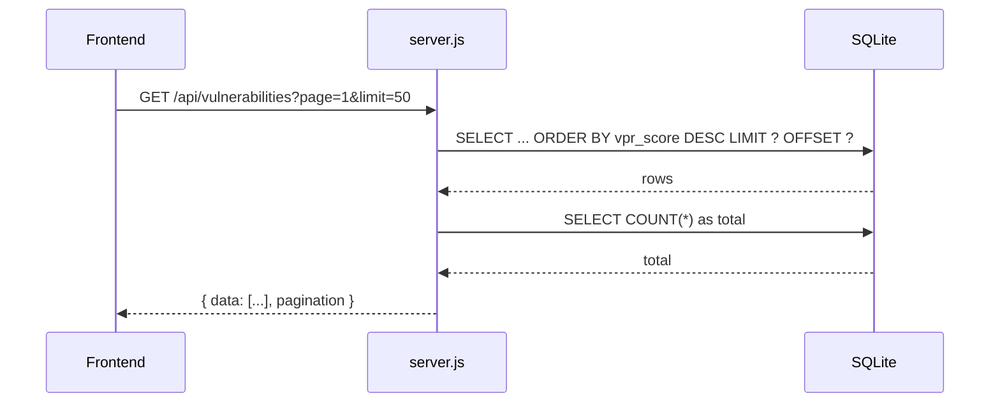
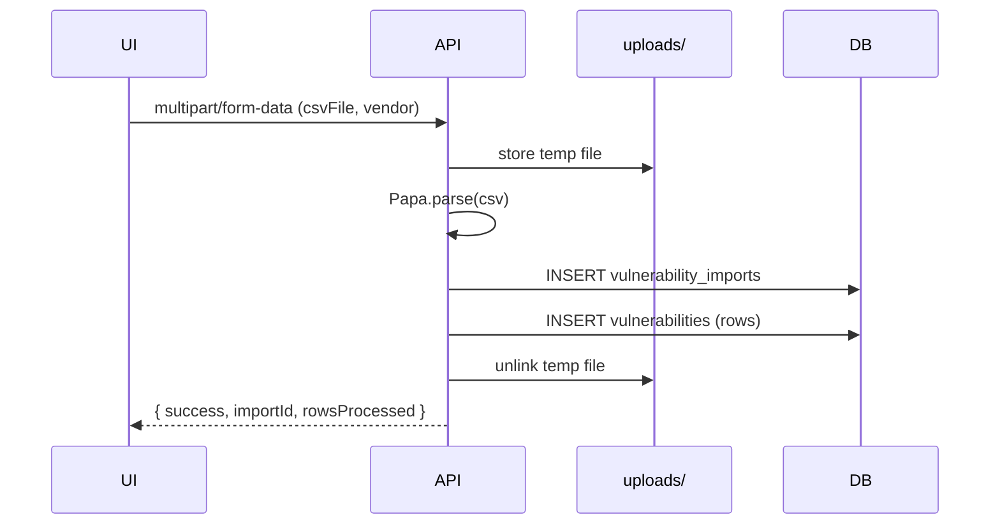
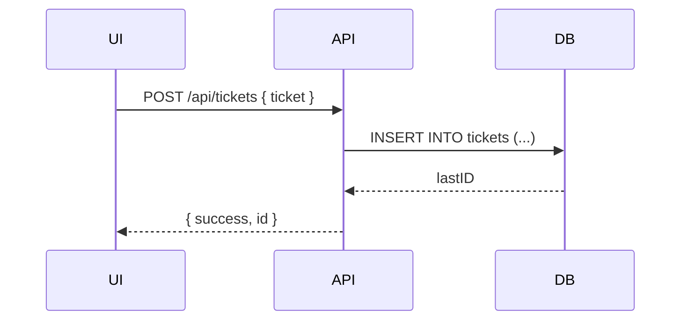

# Backend Architecture

<!-- markdownlint-disable-next-line MD013 -->
The backend is a Node.js/Express app providing REST endpoints, CSV processing, and SQLite persistence. It also serves static frontend assets.

## Modules

- server.js: Main entrypoint; initializes Express, SQLite, routes, and security headers.
- scripts/init-database.js: Creates initial tables and indexes.

## Core middleware

- cors(): Enables cross-origin requests
- compression(): Gzip responses
- express.json({ limit: '100mb' }): JSON parsing
- express.urlencoded({ extended: true, limit: '100mb' }): form parsing
- multer upload (dest: uploads/, 100MB): multipart CSV uploads
- Security headers: X-Content-Type-Options, X-Frame-Options, X-XSS-Protection
- express.static(__dirname, { maxAge: '1m' }): serve UI assets

## Persistence

- SQLite at data/hextrackr.db. See Database document for schema and ERD.
- initDb() runs on boot: calls init script when DB file missing and adds new columns to vulnerabilities table (idempotent ALTERs).

## API surface

<!-- markdownlint-disable MD013 -->

- Tickets: GET/POST/PUT/DELETE /api/tickets, POST /api/tickets/migrate, GET /api/sites, GET /api/locations, POST /api/import/tickets
- Vulnerabilities: GET /api/vulnerabilities, GET /api/vulnerabilities/stats, GET /api/vulnerabilities/trends, POST /api/vulnerabilities/import (multipart), POST /api/import/vulnerabilities, DELETE /api/vulnerabilities/clear, GET /api/imports
- Backup/Restore: GET /api/backup/stats, GET /api/backup/{tickets|vulnerabilities|all}, DELETE /api/backup/clear/:type, POST /api/restore (zip)

<!-- markdownlint-enable MD013 -->

Full details in API Reference.

## Symbol analysis (server.js)

- app (Express): configured with middleware and routes.
- db (sqlite3.Database): shared DB connection.
- upload (multer): single-file handler for csvFile.
- initDb(): Adds columns vendor, vulnerability_date, state, import_date to vulnerabilities; runs init script when DB absent.
- Route handlers (inline functions): Implement business logic per endpoint.

### Error handling and responses

- Uses 400 for bad input (missing file/data), 500 for DB/processing errors, otherwise JSON 200 payloads.

## Flows (Mermaid)

### GET /api/vulnerabilities (list)

### POST /api/vulnerabilities/import (CSV upload)

### POST /api/tickets (create)

## Security notes

- Security headers applied globally.
- Uploads capped at 100MB, temp files removed post-processing.
- Static assets cached for 1 minute during development.

## Symbol tables (server.js)

| Symbol | Type | Parameters | Returns | Description |
|-------|------|------------|---------|-------------|
| initDb | function | none | void | Initializes DB on boot and adds columns to vulnerabilities if missing. |
| GET /api/vulnerabilities | route handler | page, limit, search, severity (query) | JSON | Lists vulnerabilities with pagination. |
| GET /api/vulnerabilities/stats | route handler | none | JSON[] | Aggregated stats by severity with VPR totals/avg and date bounds. |
| GET /api/vulnerabilities/trends | route handler | none | JSON[] | 14‑day per‑day counts by severity. |
| POST /api/vulnerabilities/import | route handler | csvFile (multipart), vendor | JSON | Parses CSV, records import, inserts vulnerabilities. |
| POST /api/import/vulnerabilities | route handler | { data: any[] } | JSON | Imports vulnerabilities from JSON array. |
| DELETE /api/vulnerabilities/clear | route handler | type param | JSON | Clears vulnerability-related tables. |
| GET /api/tickets | route handler | none | JSON[] | Lists tickets ordered by created_at. Null id falls back to xt_number. |
| POST /api/tickets | route handler | ticket body | JSON | Inserts a ticket row. |
| PUT /api/tickets/:id | route handler | id param, ticket body | JSON | Updates a ticket row. |
| DELETE /api/tickets/:id | route handler | id param | JSON | Deletes a ticket row. |
| POST /api/tickets/migrate | route handler | { tickets: any[] } | JSON | Bulk INSERT OR REPLACE from legacy shape. |
| POST /api/import/tickets | route handler | { data: any[] } | JSON | Imports tickets from JSON array. |
| GET /api/backup/* | route handlers | none | JSON | Backup stats and dataset exports. |
| DELETE /api/backup/clear/:type | route handler | type param | JSON | Clear tickets, vulnerabilities, or all. |
| POST /api/restore | route handler | file (zip), type, clearExisting | JSON | Restores from backup zip. |

For full request/response schemas, see API Reference.
