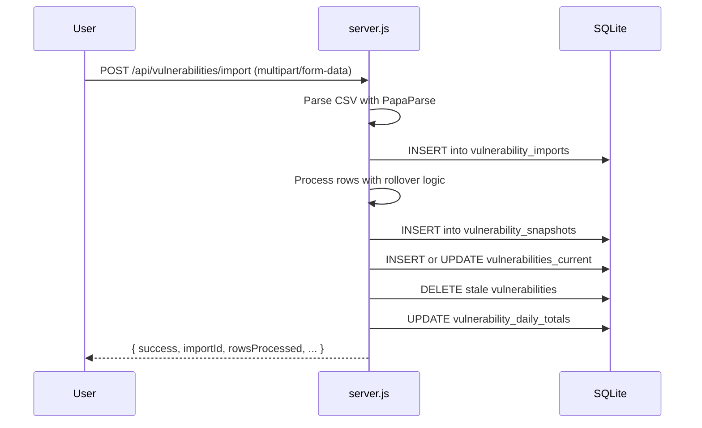
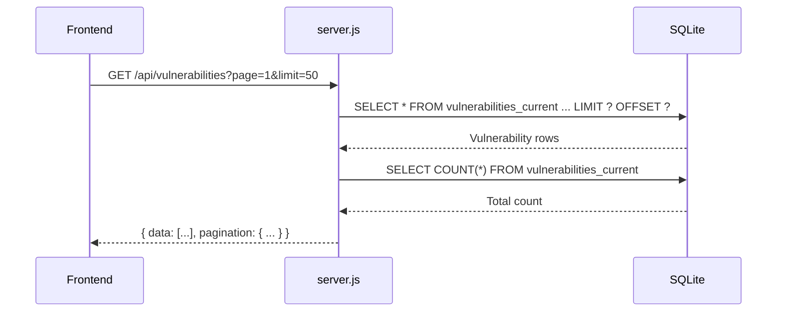

# Backend Architecture

The backend is a Node.js/Express monolithic server providing REST endpoints, data processing, and SQLite persistence. It also serves the static frontend assets and the documentation portal.

## Key Characteristics

- **Monolithic Architecture**: A single `server.js` file (over 1,200 lines) handles all backend concerns, including routing, database interaction, and business logic.
- **Dual Purpose**: Acts as both an API server and a static file server for the UI.
- **Database**: A single SQLite database file (`data/hextrackr.db`) with a shared connection pool.
- **Security**: Includes a built-in `PathValidator` class for secure file system operations and sets standard security headers.

## Core Components

- **`server.js`**: The main entry point. It initializes the Express app, configures middleware, sets up all API routes, and connects to the SQLite database.
- **`scripts/init-database.js`**: A script responsible for creating the initial database schema, including tables and indexes.
- **`PathValidator` Class**: A security utility class within `server.js` designed to prevent path traversal attacks when accessing the file system.

## Core Middleware

- **`cors`**: Enables Cross-Origin Resource Sharing.
- **`compression`**: Compresses response bodies for better performance.
- **`express.json`**: Parses incoming JSON requests (limit `100mb`).
- **`express.urlencoded`**: Parses URL-encoded data (limit `100mb`).
- **`multer`**: Handles `multipart/form-data` for file uploads, specifically for CSV imports.
- **Security Headers**: Sets `X-Content-Type-Options`, `X-Frame-Options`, and `X-XSS-Protection` headers on all responses.
- **`express.static`**: Serves static files (HTML, CSS, JS) from the project root and `docs-html` directories.

## Persistence and Data Management

### Database

The backend uses a file-based SQLite database. For a detailed schema, see the [Data Model documentation](./data-model.md).

- **Initialization**: On startup, the server checks if the database file exists. If not, it runs the `scripts/init-database.js` script to create it.
- **Schema Evolution**: The server performs idempotent `ALTER TABLE` operations on startup to add new columns to the `vulnerabilities` table, ensuring backward compatibility with older database files.

### Vulnerability Rollover Architecture

A key feature of the backend is the **rollover architecture** for managing vulnerability data. This system processes daily scans to maintain both a current snapshot and a historical trend of vulnerabilities. For a detailed explanation, see the [Vulnerability Rollover Architecture documentation](./rollover-mechanism.md).

## API Surface

The backend exposes a comprehensive REST API. For full request/response details, see the [API Reference](../api-reference/overview.md).

- **Tickets**: `GET, POST, PUT, DELETE /api/tickets`, `POST /api/tickets/migrate`, `POST /api/import/tickets`
- **Reference Data**: `GET /api/sites`, `GET /api/locations`
- **Vulnerabilities**: `GET /api/vulnerabilities`, `GET /api/vulnerabilities/stats`, `GET /api/vulnerabilities/recent-trends`, `GET /api/vulnerabilities/trends`, `POST /api/vulnerabilities/import`, `POST /api/import/vulnerabilities`, `DELETE /api/vulnerabilities/clear`
- **Imports**: `GET /api/imports`
- **Backup/Restore**: `GET /api/backup/stats`, `GET /api/backup/:type`, `POST /api/restore`, `DELETE /api/backup/clear/:type`
- **Internal**: `GET /health`, `GET /api/docs/stats`

## Key Business Logic Flows

### Vulnerability CSV Import

### Get Paginated Vulnerabilities

