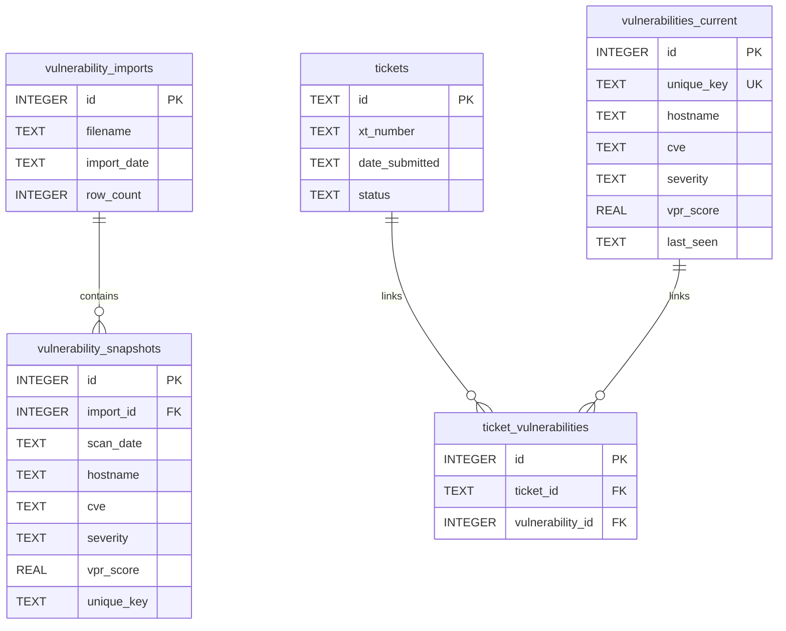
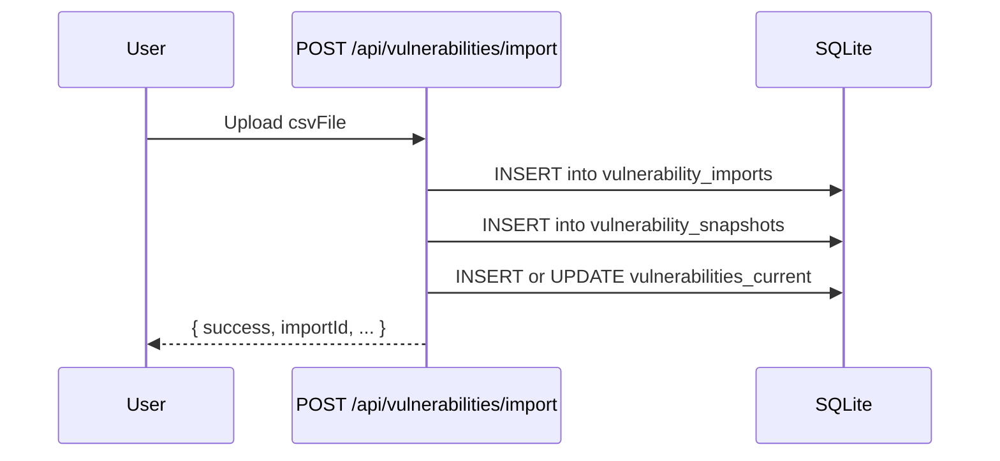
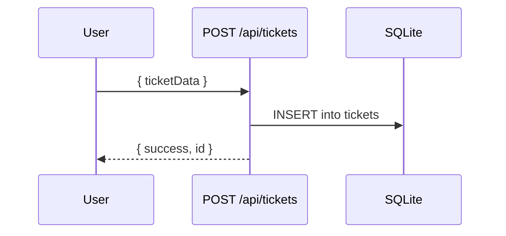

# Database Architecture

HexTrackr uses a file-based SQLite 3 database as its primary data store. This document provides a high-level overview of the database architecture, focusing on relationships and data flows.

**Note**: The definitive and most up-to-date information on the database schema, including table structures and column descriptions, can be found in the [Data Model documentation](./data-model.md).

## Engine

- **Type**: SQLite 3
- **Location**: `data/hextrackr.db`
- **Initialization**: The database is initialized by the `scripts/init-database.js` script.

---

## Entity Relationship Diagram

This diagram illustrates the relationships between the main tables in the database.

---

## Data Flows

### Vulnerability CSV Import

This flow shows how a CSV file upload is processed and stored in the database using the rollover architecture.

### Ticket Creation

This flow shows the simple process of creating a new ticket.

