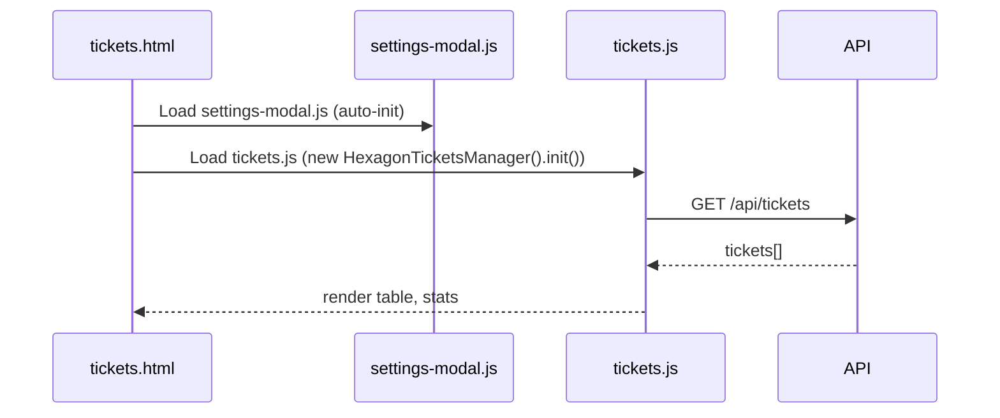

# Frontend Architecture

<!-- markdownlint-disable-next-line MD013 -->
The UI is split into Tickets (Bootstrap/Tabler) and Vulnerabilities (Tabler + AG Grid + ApexCharts). Shared components are loaded first, then page scripts.

## Pages and frameworks

- tickets.html: Bootstrap + Tabler styles; JS: scripts/shared/settings-modal.js, scripts/pages/tickets.js

<!-- markdownlint-disable-next-line MD013 -->

- vulnerabilities.html: Tabler + AG Grid + ApexCharts; JS embedded (ModernVulnManager) with migration target scripts/pages/vulnerabilities.js

## JavaScript layout

- scripts/shared/
  - settings-modal.js: Loads modal HTML, exposes actions (export/import/backup/restore, ServiceNow helpers) on window.
  - header-loader.js/footer-loader.js: Inject shared header/footer markup.
- scripts/pages/
  - tickets.js: HexagonTicketsManager class handles CRUD, rendering, device list interactions, filtering, and CSV/PDF exports.
  - vulnerabilities.js: Placeholder exposing window.refreshPageData and window.showToast for shared modal integration; main logic remains

        embedded in vulnerabilities.html.

## Key symbols

- HexagonTicketsManager (tickets.js)
  - init(), loadTicketsFromDB(), saveTicketToDB(), deleteTicketFromDB(), migrateFromLocalStorageIfNeeded()
  - Device helpers: addDeviceField(), reverseDeviceOrder(), updateDeviceNumbers(), drag handlers
  - Rendering: renderTickets(), pagination, filters, showToast

- Settings Modal (settings-modal.js IIFE)
  - exportData(), backupData(), importData(), clearData(), restoreData()
  - ServiceNow: load/save settings, testConnection, URL generation
  - CSV helpers: convertTicketsToCSV(), convertVulnerabilitiesToCSV(), exportAllDataAsCSV()

- ModernVulnManager (vulnerabilities.html embedded)
  - initializeGrid() with AG Grid responsive columns
  - initializeChart() with ApexCharts
  - handleCsvImport() -> POST /api/vulnerabilities/import
  - loadData() -> GET /api/vulnerabilities (+trends), loadStatistics() -> GET /api/vulnerabilities/stats

## Initialization flow

## Integration notes

- Shared settings modal functions call fetch endpoints and then notify the current page via window.refreshPageData(type) if provided.
- vulnerabilities.js currently provides integration hooks; the ModernVulnManager remains in the HTML and should be migrated incrementally.

## Symbol tables

### scripts/pages/tickets.js (HexagonTicketsManager)

<!-- markdownlint-disable MD013 -->
| Method | Params | Returns | Purpose |
|---|---|---|---|
| init | none | Promise<void> | Bootstraps page: loads tickets, binds events, renders UI. |
| loadTicketsFromDB | none | Promise<void> | Fetches tickets via GET /api/tickets and updates state. |
| saveTicketToDB | ticket | Promise<void> | POST/PUT ticket to API depending on edit state. |
| deleteTicketFromDB | id | Promise<void> | DELETE /api/tickets/:id and refreshes list. |
| migrateFromLocalStorageIfNeeded | none | Promise<void> | Migrates legacy tickets to DB via POST /api/tickets/migrate. |
| transformTicketData | ticket | ticket | Normalizes fields, computes overdue status, may update DB for overdue. |
| renderTickets | none | void | Renders table rows, stats, and pagination. |
| addDeviceField | name? | void | Adds a new device row to the modal form. |
| reverseDeviceOrder | none | void | Toggles device order and renumbers items. |
| updateDeviceNumbers | none | void | Ensures continuous numbering after changes. |
| showToast | msg,type | void | Displays a toast/snackbar. |
<!-- markdownlint-enable MD013 -->

### vulnerabilities.html (ModernVulnManager - embedded)

<!-- markdownlint-disable MD013 -->
| Method | Params | Returns | Purpose |
|---|---|---|---|
| setupEventListeners | none | void | Wires buttons (import, filters) and inputs. |
| initializeGrid | none | void | Creates AG Grid with responsive columns and handlers. |
| initializeChart | none | void | Configures ApexCharts for 14‑day trends. |
| handleCsvImport | File | Promise<void> | Uploads CSV to POST /api/vulnerabilities/import and refreshes grid/stats. |
| loadData | none | Promise<void> | Loads list and trend data from API; updates grid/chart. |
| loadStatistics | none | Promise<void> | Loads aggregated stats; updates dashboard. |
<!-- markdownlint-enable MD013 -->

### scripts/shared/settings-modal.js (IIFE)

<!-- markdownlint-disable MD013 -->
| Function (window.*) | Params | Returns | Purpose |
|---|---|---|---|
| exportData | type | Promise<void> | Export section or all as JSON/CSV. |
| backupData | type | Promise<void> | Fetch backup payloads from /api/backup/* and zip as needed. |
| importData | type,file | Promise<void> | Import CSV via /api/import/{type} (JSON pathway). |
| clearData | type | Promise<void> | DELETE /api/backup/clear/:type. |
| restoreData | type,zip,clearExisting | Promise<void> | POST /api/restore with zip. |
| saveSettings | none | void | Persist ServiceNow and app settings to localStorage. |
| testCiscoConnection/testTenableConnection | none | Promise<void> | Placeholder connectivity checks. |
| generateServiceNowUrl | ticketId | string | Build instance-specific ServiceNow link. |
<!-- markdownlint-enable MD013 -->

### scripts/pages/vulnerabilities.js (migration placeholder)

| Function (window.*) | Params | Returns | Purpose |
|---|---|---|---|
| refreshPageData | type | void | Hook for shared modal to trigger page refresh after imports/clears. |
| showToast | message,type | void | Fallback toast using alert() if no page-specific UI. |

## Known integration pitfalls

- settings-modal.js has a generic importData() path documented as /api/import, while server routes are /api/import/{tickets|vulnerabilities}. Use the specific endpoints listed in the API docs.
