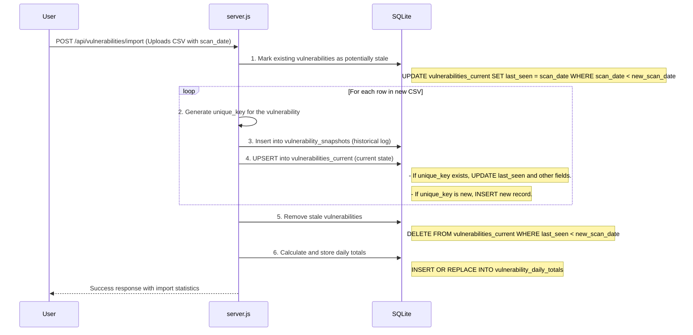

# Vulnerability Rollover Architecture

HexTrackr employs a sophisticated "rollover" mechanism to process daily vulnerability scans. This architecture is designed to provide both a current, deduplicated view of all active vulnerabilities and a complete historical record for trend analysis.

This system is crucial for understanding the vulnerability landscape over time, such as tracking the lifecycle of a specific vulnerability or analyzing the effectiveness of remediation efforts.

## Core Concepts

1. **Daily Snapshots**: Each CSV import is treated as a snapshot of the environment on a specific `scan_date`.
2. **Current State View**: The system maintains a table (`vulnerabilities_current`) that always reflects the most up-to-date state of all known vulnerabilities.
3. **Historical Log**: Another table (`vulnerability_snapshots`) keeps an immutable, append-only log of every vulnerability from every scan.
4. **Deduplication**: A `unique_key` is generated for each vulnerability to accurately identify and track it across different scans.

## The Rollover Process

The process is triggered every time a new vulnerability CSV is imported with a specific `scan_date`. Here’s how it works:

### Step-by-Step Explanation

1. **Mark as Stale (Precautionary)**: Before processing the new scan, the system assumes all existing vulnerabilities in the `vulnerabilities_current` table might be stale. It updates their `last_seen` date to their previous `scan_date`.

1. **Generate Unique Key**: For each vulnerability in the new CSV, a unique key is generated. The logic is:
    - If a CVE exists: `normalize(hostname)|CVE`
    - If no CVE: `normalize(hostname)|plugin_id|description`

    This ensures that the same vulnerability on the same host is treated as a single entity, even if other attributes change.

1. **Log to Snapshots**: The raw vulnerability record is always saved to the `vulnerability_snapshots` table. This creates the permanent historical record.

1. **Update Current State (UPSERT)**: The system then checks the `vulnerabilities_current` table for the `unique_key`.
    - **If it exists**: The existing record is **updated**. Its `last_seen` date is set to the new `scan_date`, indicating it is still active. Other details like `vpr_score` are also updated.
    - **If it's new**: A new record is **inserted** into `vulnerabilities_current`.

1. **Remove Stale Vulnerabilities**: After processing all rows from the new scan, any vulnerability in `vulnerabilities_current` whose `last_seen` date is still older than the new `scan_date` is considered resolved or no longer present. These records are deleted from the `vulnerabilities_current` table, but they remain in the `vulnerability_snapshots` table for historical purposes.

1. **Aggregate Daily Totals**: Finally, the system recalculates the total counts and VPR scores for each severity for the new `scan_date` and stores them in the `vulnerability_daily_totals` table. This table powers the fast-loading dashboard charts.

## Benefits of this Architecture

- **Efficiency**: The dashboard and API can query the small, indexed `vulnerabilities_current` and `vulnerability_daily_totals` tables for fast performance.
- **Accurate Trending**: The `vulnerability_snapshots` table provides a rich dataset for analyzing trends over time without being cluttered by the current state.
- **Resilience**: The append-only nature of the snapshots table makes the system resilient to data import errors.
- **State Management**: Automatically handles the lifecycle of vulnerabilities (new, active, resolved) without manual intervention.
