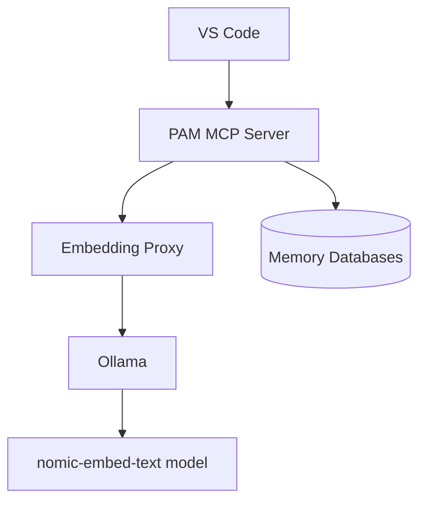

# PAM and Ollama Embedding Integration

> **🔍 Overview**: This document describes how Persistent AI Memory (PAM) integrates with Ollama's nomic-embed-text embedding model for semantic search capabilities.

## Architecture

The integration between PAM and Ollama consists of several components:

1. **Persistent AI Memory (PAM)** - The core memory system for storing unstructured memories
2. **Ollama Embedding Proxy** - A service that translates OpenAI embedding API calls to Ollama's nomic-embed-text
3. **PAM MCP Server** - Serves the MCP tools for accessing and manipulating memories



## Requirements

- Ollama installed and running
- nomic-embed-text model pulled in Ollama
- Embedding proxy running on port 3001
- PAM MCP server running

## Automatic Startup

The integration components are configured to start automatically:

1. **During Development**: Started by `start-dev-env.sh`
2. **System Boot**: Managed by the LaunchAgent `com.hextrackr.aimemory.plist`

## Installation

To install the automatic startup service:

```bash

# Navigate to the scripts directory

cd /Volumes/DATA/GitHub/HexTrackr/scripts

# Run the installation script

./install-ai-memory-service.sh
```

This will:

- Create a LaunchAgent that starts on system boot
- Set up proper logging
- Register the components in the Memento knowledge graph

## Manual Operations

If you need to manually start or stop the services:

```bash

# Start services

./start-ai-memory-services.sh

# Start through LaunchAgent

launchctl start com.hextrackr.aimemory

# Stop through LaunchAgent

launchctl stop com.hextrackr.aimemory
```

## Troubleshooting

### PAM Tools Showing as Disabled

If PAM tools show as "disabled by the user" in VS Code:

1. **Check Embedding Proxy**: Ensure the Ollama embedding proxy is running

   ```bash
   curl http://localhost:3001/health
   ```

1. **Check Ollama**: Verify Ollama is running

   ```bash
   curl http://localhost:11434/api/version
   ```

1. **Check PAM MCP Server**: Verify the server is running

   ```bash
   ps aux | grep mcp_server.py
   ```

1. **Check Logs**:

   ```bash
   cat /Volumes/DATA/GitHub/persistent-ai-memory/rmem-prototype/core/proxy.log
   cat /Volumes/DATA/GitHub/persistent-ai-memory/mcp_server.log
   ```

1. **Restart Services**:

   ```bash
   launchctl unload ~/Library/LaunchAgents/com.hextrackr.aimemory.plist
   launchctl load ~/Library/LaunchAgents/com.hextrackr.aimemory.plist
   ```

### Embedding Model Issues

If you encounter issues with the embedding model:

1. Pull the model manually:

   ```bash
   ollama pull nomic-embed-text:latest
   ```

1. Test the model directly:

   ```bash
   curl -X POST http://localhost:11434/api/embeddings \
      -d '{"model":"nomic-embed-text:latest","prompt":"test"}'
   ```

## Configuration

The system uses the following default configuration:

- Embedding Proxy Port: 3001
- Ollama Port: 11434
- Embedding Model: nomic-embed-text:latest
- Embedding Dimensions: 768

These settings can be modified in the `start-ai-memory-services.sh` script if needed.

## Memento Integration

The installation process creates the following entities and relationships in the Memento knowledge graph:

- Entity: `Ollama Embedding Proxy` (Service)
- Entity: `PAM MCP Server` (Service)
- Entity: `AI Memory Service LaunchAgent` (Configuration)
- Relationship: `PAM MCP Server` **DEPENDS_ON** `Ollama Embedding Proxy`
- Relationship: `AI Memory Service LaunchAgent` **MANAGES** `Ollama Embedding Proxy`
- Relationship: `AI Memory Service LaunchAgent` **MANAGES** `PAM MCP Server`

This documentation can be visualized in the Memento knowledge graph for a better understanding of the system architecture.
