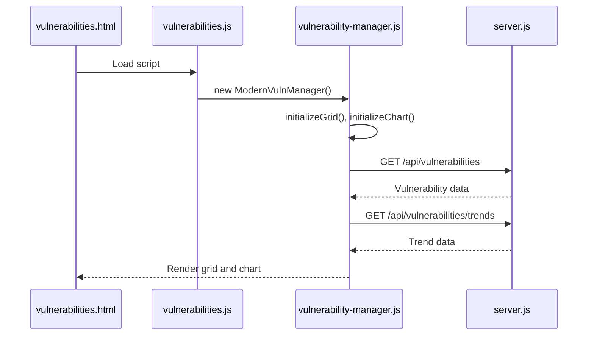

# Frontend Architecture

The frontend of HexTrackr is composed of two main pages, each with its own set of JavaScript modules and CSS styles. Shared components, such as the header, footer, and settings modal, are loaded dynamically on each page.

## Page Architecture

### `tickets.html`

- **Styling**: Uses a combination of Bootstrap 5 and Tabler.io for its UI components.
- **Core Logic**: Managed by `scripts/pages/tickets.js`, which contains the `HexagonTicketsManager` class.
- **Functionality**: Provides full CRUD operations for tickets, including filtering, pagination, and data export.

### `vulnerabilities.html`

- **Styling**: Uses the Tabler.io framework, with AG Grid for data tables and ApexCharts for visualizations.
- **Core Logic**: Managed by `scripts/pages/vulnerability-manager.js`, which contains the `ModernVulnManager` class.
- **Functionality**: A comprehensive dashboard for analyzing vulnerability data, with interactive charts, a powerful data grid, and multiple data views.

## JavaScript Module Layout

- **`scripts/shared/`**: Contains modules that are used across multiple pages.
  - `header-loader.js` / `footer-loader.js`: Dynamically inject the shared header and footer.
  - `settings-modal.js`: Manages the complex settings modal, including API configuration and data management tasks.
  - `ag-grid-responsive-config.js`: Provides a centralized configuration for the AG Grid component.
- **`scripts/pages/`**: Contains the main logic for each specific page.
  - `tickets.js`: The `HexagonTicketsManager` class for the tickets page.
  - `vulnerability-manager.js`: The `ModernVulnManager` class for the vulnerabilities dashboard.
  - `vulnerabilities.js`: A simple loader script that initializes the `ModernVulnManager`.
- **`scripts/utils/`**: Contains utility scripts, such as `purify.min.js` for security.

## Key Classes and Symbols

### `HexagonTicketsManager` (in `tickets.js`)

This class controls all functionality on the `tickets.html` page.

- **Core Methods**: `init()`, `loadTicketsFromDB()`, `saveTicketToDB()`, `deleteTicketFromDB()`
- **Device Management**: `addDeviceField()`, `reverseDeviceOrder()`, `updateDeviceNumbers()`, and drag-and-drop handlers.
- **UI Rendering**: `renderTickets()`, pagination, filtering, and toast notifications.
- **Data Migration**: `migrateFromLocalStorageIfNeeded()` to move legacy data to the database.

### `ModernVulnManager` (in `vulnerability-manager.js`)

This class is the engine for the `vulnerabilities.html` dashboard.

- **Initialization**: `initializeGrid()`, `initializeChart()`
- **Data Handling**: `loadData()`, `loadStatistics()`, `filterData()`
- **User Interaction**: `setupEventListeners()`, `switchView()`, `lookupCVE()`
- **Data Views**: `renderDeviceCards()`, `renderVulnerabilityCards()`

### Settings Modal (in `settings-modal.js`)

This is a shared, self-contained component that exposes global functions for data operations.

- **Data Operations**: `exportData()`, `backupData()`, `importData()`, `clearData()`, `restoreData()`
- **ServiceNow Integration**: `loadServiceNowSettings()`, `saveServiceNowSettings()`, `generateServiceNowUrl()`

## Initialization Flow (`vulnerabilities.html`)

## Integration Notes

- The shared settings modal (`settings-modal.js`) is designed to be self-sufficient. It can be dropped into any page and will provide its functionality globally.
- Page-specific scripts like `tickets.js` and `vulnerability-manager.js` are responsible for their own UI and data management but rely on the shared modal for global settings and data operations.
