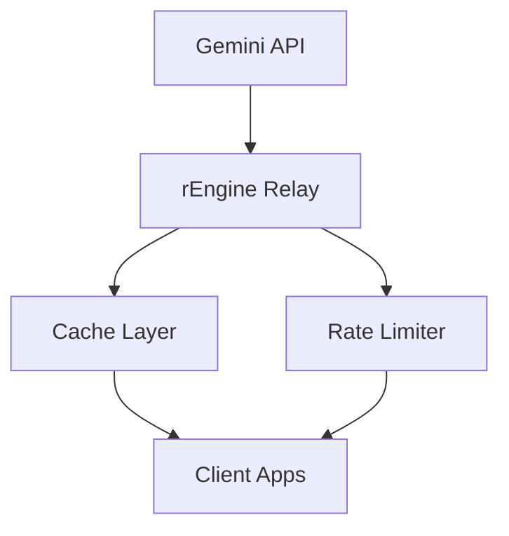

# Gemini-Powered API Strategy

## Overview

Our API strategy centers on leveraging Gemini's advanced capabilities, particularly its Google Search grounding, to provide real-time market intelligence that outperforms traditional static databases. This approach gives us a significant competitive advantage while maintaining cost-effectiveness.

## 🎯 Strategic Positioning

### StackTrackr vs Competition

| Feature | StackTrackr | Traditional Platforms |
|---------|-------------|---------------------|
| Data Currency | Real-time via Google Search | Historical/Manual updates |
| Price Discovery | AI-powered analysis | Community contributions |
| Market Intelligence | Dynamic synthesis | Static reference data |
| Update Frequency | Hourly | Weekly/Monthly |
| Cost Structure | $0-50/month | $500-2000/month |

## 🏗️ Technical Architecture

### API Infrastructure



### Integration Layers

1. **Data Ingestion**
   - Community data integration
   - Public market feeds
   - Real-time price sources
   - Auction results

1. **AI Processing**
   - Price validation
   - Data normalization
   - Market trend analysis
   - Predictive modeling

1. **Intelligence Cache**
   - Smart caching strategy
   - Tiered storage
   - Invalidation rules
   - Performance optimization

1. **API Gateway**
   - Rate limiting
   - Authentication
   - Load balancing
   - Error handling

1. **Application Layer**
   - Web interface
   - Mobile apps
   - Third-party integrations
   - Export capabilities

## 💰 Economic Strategy

### Cost Optimization

```yaml
Development:
  Free Tier: 0/month (15 RPM)
  Testing: $5-10/month

Production:
  Basic: $10-30/month
  Advanced: $50-200/month
  Enterprise: Custom pricing

Traditional Alternative:
  Bloomberg Terminal: $2000/month
  Reuters Feed: $500-1500/month
```

### Resource Management

1. **Idle Processing**
   - Build intelligence cache during off-peak
   - Pre-fetch predictable queries
   - Update static data overnight
   - Optimize cache warmth

1. **Token Optimization**
   - Smart prompt engineering
   - Response caching
   - Batch processing
   - Context recycling

1. **Request Management**
   - Intelligent routing
   - Priority queuing
   - Fallback strategies
   - Error recovery

## 🔍 Data Sources

### Primary Sources

- COMEX futures data
- LBMA fix prices
- Major dealer feeds
- Auction results

### Secondary Sources

- News analysis
- Market reports
- Social sentiment
- Trading volumes

### Community Data

- Purchase reports
- Premium tracking
- Local market prices
- Collection trends

## 🚀 Implementation Plan

### Phase 1: Core Integration

- [x] Gemini API setup
- [x] Basic price monitoring
- [ ] Cache infrastructure
- [ ] Rate limiting system

### Phase 2: Intelligence Layer

- [ ] Market trend analysis
- [ ] Price prediction models
- [ ] Dealer premium tracking
- [ ] Auction monitoring

### Phase 3: Advanced Features

- [ ] Custom alert engine
- [ ] Portfolio optimization
- [ ] Investment strategies
- [ ] Risk analysis

## 📊 Success Metrics

### Technical KPIs

- Update frequency: 95%+ hourly
- Data accuracy: <5% variance
- Response time: <2 seconds
- Uptime: 99.9%

### Business KPIs

- Cost per query: <$0.01
- User engagement: 3x increase
- Premium adoption: 25% conversion
- Market lead: 6+ months

## 🛡️ Competitive Moat

1. **Real-Time Intelligence**
   - Live market data
   - Instant price updates
   - Dynamic analysis
   - Predictive insights

1. **Cost Advantage**
   - 95% cost reduction
   - Efficient scaling
   - Optimized resources
   - Sustainable economics

1. **Technical Innovation**
   - AI-powered analysis
   - Smart caching
   - Intelligent routing
   - Automated optimization

1. **Market Coverage**
   - Comprehensive sources
   - Global perspective
   - Cross-market analysis
   - Complete dataset

## 🎯 Future Roadmap

### Near Term (3-6 months)

- Advanced predictive models
- Portfolio optimization
- Custom alert system
- Export capabilities

### Medium Term (6-12 months)

- Machine learning enhancements
- Advanced visualization
- API marketplace
- White-label solutions

### Long Term (12+ months)

- Additional asset classes
- Enterprise features
- Global expansion
- Strategic partnerships

This API strategy positions StackTrackr as the technology leader in numismatic market intelligence, creating an insurmountable competitive advantage through AI-powered, real-time data analysis at a fraction of traditional costs.
