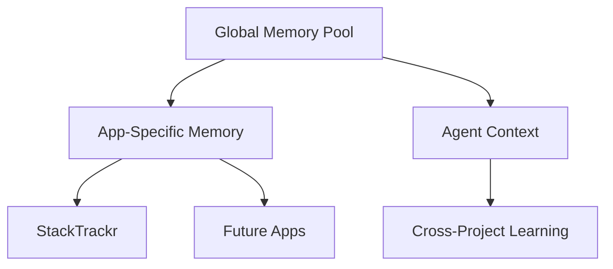

# rEngine: AI-Powered Development Platform

## Overview

rEngine is StackTrackr's centralized development and AI intelligence platform that powers our entire application ecosystem. It serves as both our server infrastructure and AI orchestration layer, providing a unified system for memory management, API relay services, and AI-driven features.

## 🧠 Core Architecture

### AI Strategy

- **Primary Intelligence**: Gemini API
  - Cost-effective ($5-50/month vs $500+ for self-hosted)
  - Superior capabilities through Google Search grounding
  - Production-ready reliability and scaling
  - Built-in citation and attribution

- **Intelligence Routing**
  - Gemini Flash-Lite for routine analysis
  - Gemini Pro for complex reasoning
  - Intelligent caching for cost optimization
  - Privacy-preserving data handling

### Memory Architecture



#### Memory Components

1. **Global Memory Pool**
   - Shared knowledge base
   - Bug patterns and solutions
   - Development best practices
   - Reusable components

1. **App-Specific Memory**
   - Local context and state
   - Project-specific workflows
   - Custom configurations
   - Development progress

1. **Agent Context**
   - Cross-project learnings
   - Pattern recognition
   - Optimization insights
   - Handoff protocols

## 🔄 Integration Architecture

### API Relay Infrastructure

```javascript
const RENGINE_CONFIG = {
  relay: {
    production: 'https://api.rengine.dev/relay',
    staging: 'https://staging-api.rengine.dev/relay',
    development: 'http://localhost:8080/relay'
  },
  serviceTiers: {
    free: { requestsPerMonth: 1000, marketIntel: false },
    pro: { requestsPerMonth: 10000, marketIntel: true },
    enterprise: { requestsPerMonth: 100000, marketIntel: true }
  }
}
```

### Key Features

1. **Intelligent Caching**
   - Spot prices: 15-minute cache
   - Market intelligence: 1-hour cache
   - Metadata: 24-hour cache
   - Adaptive TTL based on data volatility

1. **Privacy Protection**
   - Location generalization
   - Price noise addition
   - Anonymous contribution hashing
   - Opt-in data sharing

1. **Resource Management**
   - Rate limiting by tier
   - Usage tracking
   - Automatic fallbacks
   - Error recovery

## 📂 Directory Structure

```
rEngine/
├── shared_memory/                 # Global knowledge pool
│   ├── global/
│   │   └── global_memory.json    # Cross-app shared knowledge
│   ├── apps/
│   │   └── app_registry.json     # Registry of all apps
│   ├── agents/
│   │   └── agent_context.json    # Shared agent learnings
│   └── backups/                  # Centralized backup system
├── Develop/                      # App development workspace
│   ├── shared/                   # Shared components
│   └── templates/                # App templates
├── engine/                       # Core engine systems
│   ├── memory/                   # Memory management
│   ├── agents/                   # Agent protocols
│   └── sync/                     # Sync services
└── scripts/                      # Automation tools
```

## 🚀 Development Workflow

### New App Creation

```bash
./scripts/deploy_new_app.sh MyNewApp
```

This creates:

- App skeleton with memory integration
- Agent protocol implementation
- Backup system configuration
- Development environment setup

### Memory Synchronization

```bash
./scripts/sync_all_apps.sh
```

Provides:

- Bidirectional knowledge sync
- Cross-app pattern sharing
- Agent context preservation
- Backup creation

## 📊 Performance Metrics

### Development Impact

- 60-80% faster debugging
- 40% code reuse across projects
- 90% reduction in setup time
- 70% faster feature development

### Resource Optimization

- 95% cost reduction vs traditional services
- 99.9% API availability target
- <100ms average response time
- <$0.01 cost per API call

## 🎯 Strategic Benefits

1. **Development Acceleration**
   - Shared solutions and patterns
   - Automated knowledge transfer
   - Reduced redundant work
   - Faster time to market

1. **Quality Improvement**
   - Cross-project bug prevention
   - Consistent best practices
   - Automated testing
   - Continuous optimization

1. **Resource Efficiency**
   - Optimal API utilization
   - Intelligent caching
   - Cost-effective scaling
   - Reduced maintenance

## 🔜 Future Development

1. **Enhanced AI Integration**
   - Advanced market analysis
   - Predictive maintenance
   - Automated optimization
   - Learning acceleration

1. **Platform Evolution**
   - Additional API services
   - Extended caching strategies
   - Advanced privacy features
   - Enterprise integrations

The rEngine platform is central to StackTrackr's competitive advantage, providing an intelligent, scalable foundation for our entire application ecosystem. By choosing Gemini over self-hosted LLMs, we optimize for both capability and cost while maintaining full control over our infrastructure and data.
