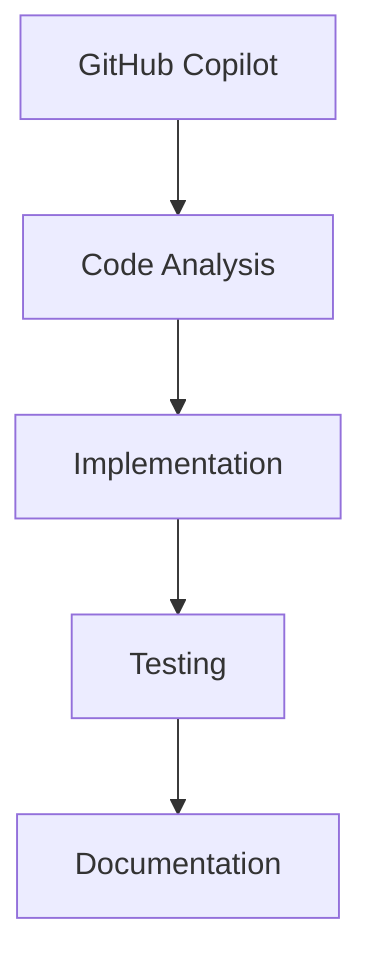
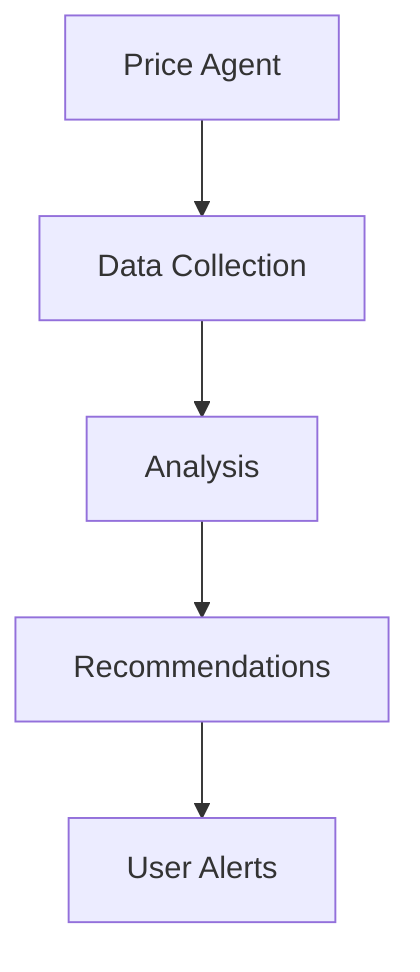

# rAgents - StackTrackr Agentic Operating System

## 🎯 Overview

The **rAgents** ecosystem is a comprehensive agentic operating system plugin for StackTrackr, providing AI agent coordination, memory management, and workflow automation. The entire system follows a consistent "r-prefix" naming convention for organized, scalable development.

## 🏗️ r-Ecosystem Architecture

### **Core Directories**

- **rEngine/**: Memory search, processing, and optimization systems
- **rDocs/**: Documentation, guides, and project management resources  
- **rScripts/**: Automation utilities and system maintenance
- **rTemplates/**: Ready-to-use templates and patterns
- **rTasks/**: Task management and coordination workflows
- **rMemory/**: Memory management and persistence layers
- **rBackups/**: Automated backup and recovery systems
- **rLab/**: Experimental features and prototypes
- **rConfig/**: System configuration and settings
- **rSchemas/**: Data structure definitions and validation

### **Quick Access Files**

- `tasks.json` - Master task database and project coordination
- `agents.json` - Agent definitions and capability matrix
- `memory.json` - Persistent agent memory store
- `version-manager.js` - Versioning and capability tracking
- `package.json` - rAgents plugin configuration and scripts

## 🚀 Getting Started

### **Essential Commands**

```bash

# Version and status

npm run version:status    # Check rAgents system health
npm run version:history   # View version evolution

# Memory and search  

npm run memory:stats      # Memory system performance
npm run search           # Interactive memory search

# Project management

npm run pm:guide         # Complete PM documentation
npm run prompts          # List ready-to-use agent prompts

# Documentation

npm run docs            # View VERSION.md
npm run prompts:list    # rPrompts usage guide
```

## 🎪 Agent Coordination

### **Capability Matrix**

- **Claude Sonnet**: Analysis, debugging, documentation, architecture
- **GPT-4**: Implementation, performance optimization, planning
- **Gemini Pro**: Testing, validation, methodical execution
- **GitHub Copilot**: Code completion, real-time assistance

### **Task Assignment Protocol**

1. **Create tasks** using standardized templates in `tasks.json`
2. **Assign agents** based on capability matrix
3. **Track progress** with automated status updates
4. **Ensure quality** through defined success criteria
5. **Escalate appropriately** when human expertise needed

## 📊 Current Status: rAgents v2.0.0

### **Active Capabilities**

- ✅ **Memory System**: 5/5 features (JSON + MCP integration)
- ✅ **Search Engine**: 5/5 features (100x performance improvement)  
- ✅ **Agent Coordination**: 4/4 features (optimal task assignment)
- ✅ **Workflow Automation**: 3/4 features (backup, export, task tracking)
- ✅ **Export Collaboration**: 4/4 features (ChatGPT, Claude, cross-platform)
- ✅ **Development Tools**: 4/4 features (Docker, testing, debugging)

### **Performance Metrics**

- **Memory Entities**: 17 tracked entities
- **Search Keywords**: 1,550+ indexed terms  
- **Build Time**: <5ms for complete index
- **Search Speed**: <1ms for complex queries
- **Files Managed**: 300+ configuration and data files

- `handoff.md` - Agent handoff protocols
- `handoff.json` - Structured handoff data
- `/docs` - Detailed agent documentation
- `/notes` - Architecture and development notes

### Development

- `/debug` - Debugging utilities and logs
- `/engine` - Core agent engine components
- `/lab` - Experimental features and testing
- `/templates` - Standard response templates

## 🤖 Agent Types

1. **Primary Agents**
   - GitHub Copilot (Development)
   - Market Intelligence (Price Analysis)
   - Portfolio Optimization (Investment)
   - User Assistance (Support)

1. **Utility Agents**
   - Memory Management
   - Task Coordination
   - Error Resolution
   - Performance Monitoring

1. **Specialized Agents**
   - Numismatic Analysis
   - Market Trend Detection
   - Data Validation
   - Security Monitoring

## 🔄 Agent Workflows

### Development Support



### Market Intelligence



## 🧠 Memory Architecture

### Persistence Layer

- Short-term operational memory
- Long-term knowledge base
- Cross-session context
- Learning patterns

### Context Management

- Task-specific context
- User preferences
- Historical decisions
- Error patterns

## 🛠️ Tool Integration

### Available Tools

- Code analysis and generation
- Market data retrieval
- Portfolio optimization
- Documentation management

### Access Patterns

- Direct function calls
- API integrations
- System commands
- File operations

## 📊 Performance Monitoring

### Metrics Tracked

- Response times
- Decision accuracy
- Learning efficiency
- Error rates

### Optimization

- Memory usage
- Context relevance
- Tool efficiency
- Response quality

## 🔐 Security

### Access Control

- Role-based permissions
- Function restrictions
- Data access limits
- Audit logging

### Data Protection

- Sensitive data handling
- Memory sanitization
- Secure handoffs
- Privacy controls

## 🎯 Best Practices

1. **Memory Management**
   - Regular context cleanup
   - Efficient data storage
   - Clear handoff protocols
   - Pattern recognition

1. **Error Handling**
   - Graceful degradation
   - Clear error messaging
   - Recovery procedures
   - Pattern logging

1. **Performance**
   - Context optimization
   - Efficient tool usage
   - Response caching
   - Load management

1. **Development**
   - Clear documentation
   - Consistent patterns
   - Testing protocols
   - Version control

## 📚 Documentation

### Key Resources

- [Agent Protocols](/agents/docs/protocols.md)
- [Development Guide](/agents/docs/development.md)
- [Security Guidelines](/agents/docs/security.md)
- [Best Practices](/agents/docs/best-practices.md)

### Related Files

- [rEngine Integration](/docs/brainstorming/RENGINE.md)
- [API Strategy](/docs/brainstorming/API-STRATEGY.md)

## 🔄 Updates

The agent system is continuously evolving. Key updates are documented in:

- [Patch Notes](/patchnotes/)
- [Changelog](/archive/changelog.md)
- [Roadmap](/archive/roadmap.md)

Last Updated: August 16, 2025
