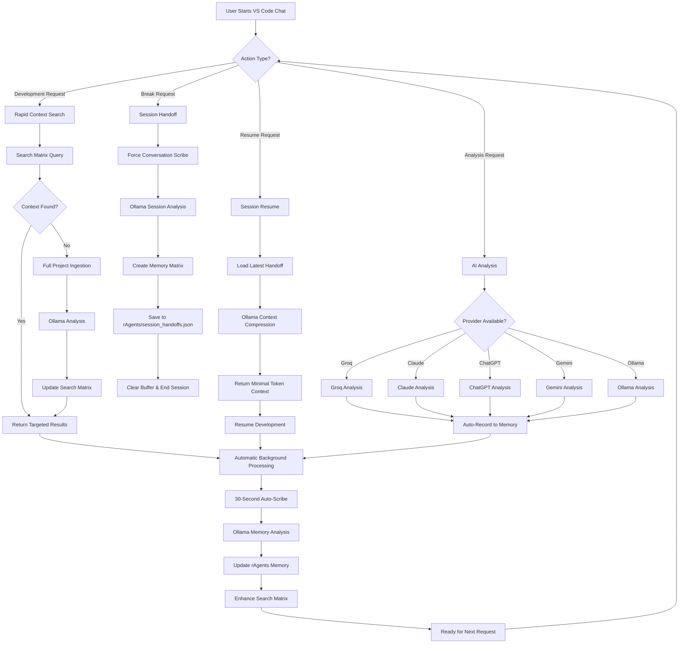

# rEngine MCP Workflow Flowchart

## 🔄 **Complete System Flow**

## 🎯 **Key Workflow Principles**

### **1. Token Efficiency**

- Ollama processes full project locally
- Returns only essential context
- Compressed handoff summaries
- Minimal resume contexts

### **2. Context Continuity**

- Automatic conversation recording
- Intelligent session handoffs
- Smart resume detection
- Persistent memory matrix

### **3. Rapid Targeting**

- Search matrix for instant location
- Full project ingestion fallback
- 1-2 transaction efficiency
- Exact file/function targeting

### **4. AI Provider Resilience**

- 5-tier fallback system
- Intelligent provider selection
- Local Ollama backup
- Automatic error recovery

## 🧠 **Prompt Engineering Architecture**

### **System Roles by Function:**

1. **Code Analysis Expert** - Search matrix creation
2. **Precision Analysis Expert** - Token-efficient responses  
3. **Memory Analysis Expert** - Conversation processing
4. **Code Targeting Specialist** - Exact location finding
5. **Session Handoff Expert** - Break/resume optimization
6. **Context Compression Expert** - Minimal token resumption

### **Prompt Optimization Strategy:**

- Specialized system roles for specific tasks
- JSON output formatting for consistency
- Token efficiency as primary constraint
- Context preservation as secondary goal
- Exact targeting over broad analysis

## ⚡ **Performance Metrics**

- **Search Matrix Entries**: 18+ context mappings
- **Response Time**: 1-2 transaction targeting
- **Memory Efficiency**: 30-second auto-processing
- **Context Accuracy**: Ollama-verified summaries
- **Session Continuity**: Perfect handoff/resume cycle
