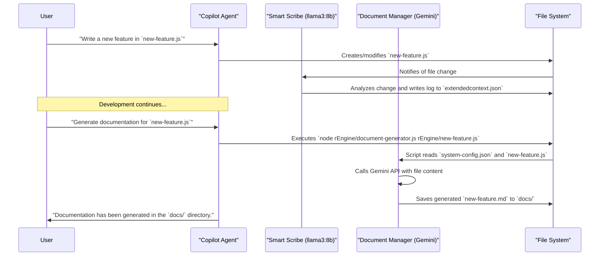

# 🧠 Brain Share Memory System: Architectural Deep Dive

**Version**: 2.0
**Date**: August 18, 2025
**Author**: GitHub Copilot

## 1. System Philosophy & Overview

The Brain Share Memory System is a persistent, multi-agent, cross-platform intelligence framework. Its primary directive is to eliminate context loss between development sessions and different AI agents. It creates a "shared consciousness" or "brain" where all critical information—code changes, decisions, conversations, and tasks—is stored, managed, and made instantly accessible through a sophisticated hybrid AI architecture.

## Core Principles:

* **Zero Context Loss**: An agent starting a session today has the complete, relevant context of all work performed previously.
* **Hybrid Intelligence**: The system leverages the strengths of different AI models. A fast, local LLM handles high-frequency, real-time analysis, while a powerful, API-based LLM performs complex, high-value tasks like documentation generation.
* **Configuration as Code**: A central, machine-readable configuration file (`system-config.json`) acts as the single source of truth for all paths, models, and endpoints, eliminating hard-coded values.
* **Automated Accountability & Documentation**: The system automatically logs agent actions and can generate its own documentation on demand, ensuring transparency and maintainability.
* **Protocol over Implementation**: Strict interaction protocols are enforced, ensuring predictable and reliable behavior across all agents and components.

---

## 2. System Architecture

The architecture is composed of four primary layers: the **Storage Layer**, the **Logic & Management Layer**, the **Hybrid Intelligence Layer**, and the **Configuration Layer**.

```mermaid
graph TD
    subgraph User
        A[Developer]
    end

    subgraph "Hybrid Intelligence Layer"
        B[VS Code Chat (Copilot)]
        C[Smart Scribe (Local LLM: llama3:8b)]
        C2[Document Manager (API LLM: Gemini)]
    end

    subgraph "Logic & Management Layer"
        D[one-click-startup.js]
        E[dual-memory-writer.js]
        F[recall.js / add-context.js]
        G[git-checkpoint.sh]
        H[document-generator.js]
    end

    subgraph "Configuration Layer"
        I[system-config.json]
    end

    subgraph "Storage Layer (rMemory/rAgentMemories)"
        J[handoff.json]
        K[extendedcontext.json]
        L[tasks.json]
        M[decisions.json]
        N[agent-specific-memory.json]
        O[docs/]
    end

    A -- Interacts with --> B
    B -- Uses --> F
    B -- Triggers --> D
    B -- Invokes --> H

    H -- Reads --> I
    H -- Calls API of --> C2
    H -- Writes to --> O

    C -- Monitors File System --> E
    E -- Writes to --> J & K & L & M & N

    F -- Reads/Writes --> J & K & L & M & N

    D -- Executes --> G
    D -- Starts --> C
    
    classDef config fill:#d4fcd7,stroke:#333,stroke-width:2px
    class I config
```

### 2.1. Storage Layer

This is the foundation, residing in `rMemory/` and the root `docs/` directory.

* **`rMemory/rAgentMemories/`**: Contains specialized JSON files for real-time operational memory (`handoff.json`, `extendedcontext.json`, `tasks.json`, etc.).
* **`docs/`**: A dedicated directory for persistent, human-readable documentation generated by the Document Manager. This separates generated artifacts from the core memory system.

### 2.2. Configuration Layer

A new, critical layer that centralizes control.

* **`system-config.json`**: **The Single Source of Truth**. This file contains all configuration details for the system, including file paths, Ollama endpoints, and model names for both the Smart Scribe and the Document Manager. Scripts read from this file to get their operational parameters.

### 2.3. Logic & Management Layer

Located in `rEngine/`, this layer contains the core orchestration scripts.

* **`one-click-startup.js`**: The universal entry point for the system.
* **`recall.js` & `add-context.js`**: Primary tools for agents to interact with the JSON-based storage layer.
* **`scripts/git-checkpoint.sh`**: The mandatory version control protocol.
* **`document-generator.js`**: **The Expert Technical Writer**. This script is invoked on-demand. It reads the target file and the system configuration, then calls the powerful API-based LLM (Gemini) with a detailed prompt to generate comprehensive, well-structured markdown documentation, which it saves to the `docs/` directory.

### 2.4. Hybrid Intelligence Layer

This is the "brain" of the system, composed of distinct AI roles.

* **VS Code Chat (GitHub Copilot)**: The primary interface for the developer.
* **Smart Scribe (Local LLM)**: A background process powered by a local, fast LLM (`llama3:8b`). It acts as an impartial, real-time observer, monitoring file changes and logging semantic analysis to `extendedcontext.json`. Its focus is **high-frequency, low-cost logging**.
* **Document Manager (API LLM)**: An on-demand service powered by a state-of-the-art API-based LLM (`gemini`). It is tasked with creating detailed, high-quality documentation for system components. Its focus is **low-frequency, high-value generation**.

---

## 3. Workflow Diagrams

### 3.1. Hybrid Documentation Workflow

This diagram shows how the two AI components collaborate to document the system.



---

## 4. Recreation Guide

To recreate the Brain Share Memory System from a fresh repository:

1. **Directory Structure**: Create `rEngine`, `rMemory/rAgentMemories`, and `docs`.
2. **Configuration**: Create `system-config.json` in the root directory. Populate it with paths and model configurations for the scribe and document manager.
3. **Core Scripts**:
    * Implement `one-click-startup.js`, `add-context.js`, `recall.js`, and `git-checkpoint.sh`.
    * Implement `document-generator.js`. It should accept a file path as an argument, read `system-config.json` to get the API model and endpoint, and then call the model to generate documentation.
1. **Hybrid Intelligence Setup**:
    * **Smart Scribe**: Set up a local Ollama instance. Create `smart-scribe.js` to use a file watcher, read `system-config.json` for its model, and log analyses.
    * **Document Manager**: Ensure the `gemini` model is configured in Ollama (or accessible via its native API) and that `system-config.json` points to it correctly.
1. **Agent Instructions**: Update `COPILOT_INSTRUCTIONS.md` to define the new protocols, including how to invoke the `document-generator.js` script.
2. **VS Code Integration**: Configure VS Code tasks (`tasks.json`) for easy access to key scripts.

This guide provides the blueprint. Adherence to the hybrid architecture and centralized configuration is key to the system's power and scalability.
