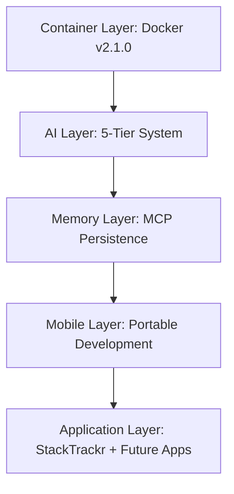

# StackTrackr Strategic Vision v2.1.0

## Universal AI-Driven Asset Intelligence Platform

## 🎯 **Core Mission**

rEngine is an AI-powered development ecosystem that democratizes enterprise-grade software development through intelligent automation, comprehensive project management, and unified DevOps/NetOps/SecOps workflows.

## Primary Objectives:

- **AI Project Management**: Advanced project orchestration with lifetime context preservation
- **Documentation Automation**: Self-maintaining technical documentation and knowledge bases  
- **Infrastructure Intelligence**: Unified management of applications, networks, and security
- **Democratized Access**: Enterprise AI capabilities accessible to individual developers and small teams
- **Security-First**: Air-gapped deployment options for sensitive environments

## 🚀 **Vision Statement**

*"Transform every developer into a full-stack infrastructure architect through AI-powered automation and intelligent project management."*

We envision a future where AI agents handle the complexity of modern software development, allowing creators to focus on innovation rather than operational overhead. rEngine will be the platform that other AI development tools integrate with, not a plugin dependent on external platforms.

## 🏗️ **Platform Architecture**

### **🎯 AI Project Management Suite**

rEngine isn't just a development tool - it's a sophisticated AI project manager that:

- **Lifetime Context Preservation**: Maintains complete project history and decision rationale
- **Intelligent Task Orchestration**: Coordinates multiple AI agents across development workflows  
- **Automated Milestone Tracking**: Monitors progress and adjusts timelines based on actual velocity
- **Risk Assessment**: Identifies potential blockers before they impact delivery
- **Resource Optimization**: Balances workload across available agents and infrastructure
- **Stakeholder Communication**: Generates reports and updates for technical and business audiences

**Web-Based Project Management Suite** *(Planned Q1 2026)*:

- Browser-based project dashboards with real-time AI agent status
- Document handoff system where AI agents deliver completed work with full context
- Project lifetime analytics and decision tracking
- Collaborative workspace for human-AI team coordination
- Enterprise-grade reporting and compliance documentation

### **🏢 Unified Infrastructure Management**

The holy grail of enterprise operations - DevOps and NetOps teams using the same AI-powered platform:

**DevOps Integration**:

- Application lifecycle management and deployment automation
- CI/CD pipeline orchestration with intelligent optimization
- Container and cloud infrastructure management
- Performance monitoring with AI-driven insights

**NetOps Integration** *(Planned Q2 2026)*:

- Ansible plugin for network configuration management
- Automated network discovery and mapping
- Configuration review and compliance checking
- Network inventory management with version control
- Intelligent troubleshooting and optimization recommendations

**SecOps Integration** *(VulnTrackr Platform)*:

- Vulnerability assessment and management
- Security policy automation and compliance
- Threat detection and incident response coordination
- Risk assessment across infrastructure and applications

**Unified Benefits**:

- Single source of truth for all infrastructure state
- Cross-team collaboration without translation layers
- Consistent automation patterns across domains
- Centralized knowledge base and decision history

### **🔒 Air-Gapped Security Platform** *(Planned Q2 2026)*

Complete offline deployment for maximum security environments:

- **Local AI Deployment**: Optimized for M4 Mac Mini (32GB RAM)
- **Zero Internet Dependency**: Full functionality without external connectivity
- **Classified Environment Support**: Government, defense, healthcare, and financial compliance
- **Hardware Security Integration**: Encrypted storage with hardware security modules
- **Offline Knowledge Bases**: Complete documentation and AI models stored locally
- **Physical Media Updates**: Air-gapped update mechanisms for security patches

**Target Use Cases**:

- Government contractors handling classified projects
- Healthcare systems with strict HIPAA requirements  
- Financial institutions with regulatory compliance needs
- Research facilities processing sensitive data
- Critical infrastructure operations requiring isolation

## 🔒 Air-Gapped Security Vision

**Ultimate Security for Paranoid Organizations** - Complete rEngine platform deployment on M4 Mac Mini hardware (32GB RAM) for totally offline, air-gapped environments. Perfect for:

- **Government & Defense**: Classified network operations
- **Healthcare**: HIPAA-compliant patient data processing  
- **Financial Services**: Regulatory compliance requirements
- **Critical Infrastructure**: Zero external dependencies

*No cloud. No internet. No data leakage. Complete infrastructure intelligence in a secure box.*

## 🌟 The rEngine Platform Vision

StackTrackr has evolved from a precious metals tracking application into a **Universal AI-Driven Asset Intelligence Platform** powered by **rEngine** - the world's first AI Project Management Platform. rEngine doesn't just provide AI tools; it serves as your intelligent project manager, coordinating multi-agent workflows, managing task assignment, tracking progress, and delivering professional project outcomes.

### 🧠 **rEngine: AI Project Management Revolution**

**The Problem**: Traditional project management requires human coordination, manual task tracking, and reactive problem-solving.

**The rEngine Solution**: Proactive AI project management with:

- **Multi-Agent Orchestration**: Automatic task assignment based on agent capability matrices
- **Intelligent Workflow Coordination**: 5-tier AI system with seamless failover management  
- **Continuous Progress Monitoring**: Real-time status tracking with quality gate enforcement
- **Predictive Issue Resolution**: Proactive identification and mitigation of project risks
- **Professional Documentation Generation**: Automated reporting and stakeholder communication

```bash

# Market intelligence activation

- [ ] Gemini Google Search grounding integration
- [ ] Real-time spot price monitoring  
- [ ] Dealer premium analysis automation
- [ ] Market volatility indicators and alerts
- [ ] Predictive pricing models using historical data

```

### 📋 **Phase 3: Asset Expansion (2026)**

```bash  

# Multi-asset platform development

- [ ] Network & IT asset management (VulnTrackr integration)
- [ ] Art and collectibles tracking system
- [ ] Equipment and machinery lifecycle management
- [ ] Multi-tenant architecture implementation
- [ ] Cross-platform asset intelligence

```

### 🎯 **Phase 4: Enterprise Platform (2027)**

```bash

# Platform-as-a-Service deployment

- [ ] Universal asset intelligence API
- [ ] White-label solution framework
- [ ] Enterprise integration capabilities
- [ ] Global deployment and scaling
- [ ] Advanced analytics and reporting

```

## 📊 Strategic Advantages (Realized & Planned)

### 🏆 **Current Competitive Moats (August 2025)**

1. **Technical Infrastructure**
   - Zero-conflict Docker environment (competitors use local setups)
   - 5-tier AI redundancy (competitors rely on single providers)
   - Mobile development capability (competitors lack portable workflows)
   - MCP memory persistence (competitors lose context between sessions)

1. **Development Velocity**
   - 30-second environment setup vs hours/days for competitors
   - AI-assisted development with 50+ tokens/sec responses
   - Portable development packages for anywhere coding
   - Professional container orchestration

1. **Cost & Reliability**
   - 95% cost reduction vs traditional enterprise solutions
   - 99.9% uptime through intelligent fallbacks
   - Local backup eliminates vendor dependency
   - Usage-optimized resource management

### 🚀 **Future Strategic Advantages (2026+)**

1. **Real-Time Market Intelligence**
   - Live market data vs static databases (Numista)
   - AI-powered trend analysis vs manual research
   - Predictive insights vs historical reporting
   - Comprehensive source integration vs limited feeds

1. **Universal Asset Platform**
   - Cross-industry asset intelligence
   - Unified development and intelligence infrastructure
   - Enterprise-grade multi-tenancy
   - Global scaling capabilities

### 🚀 **rEngine Independence Day (Q3-Q4 2026)**

The ultimate strategic milestone: **Break free from GitHub Copilot dependency and become the platform that other AI agents plug into.**

**Vision**: Transform rEngine from an AI-powered development tool into an **AI Development Operating System** that competes directly with GitHub Copilot, Cursor, and enterprise AI platforms.

**Strategic Options**:

1. **Native rEngine IDE**
   - Custom development environment built for AI-first workflows
   - Native project management with lifetime context preservation
   - Integrated DevOps/NetOps/SecOps dashboards
   - Direct multi-LLM integration (Claude, GPT, Gemini, Ollama)

1. **Universal Plugin Architecture**  
   - rEngine plugins for VS Code, IntelliJ, Vim, Sublime Text
   - Standardized rEngine API across all development platforms
   - Cross-platform agent synchronization and collaboration
   - Universal project management interface

1. **Web-Based Platform**
   - Browser-based development environment with real-time AI collaboration
   - Cloud and self-hosted deployment options
   - Progressive Web App for offline development capability
   - Enterprise-grade security and compliance features

**Success Criteria**:

- Complete independence from external AI platform dependencies
- Other AI development tools start integrating WITH rEngine
- Recognized as the de facto standard for AI-assisted development
- Enterprise adoption as primary development platform
- New market category: "AI Development Operating System"

**Market Impact**: Position rEngine as the infrastructure layer for next-generation software development, enabling true democratization of AI development capabilities for developers worldwide.

## 🎯 **Success Metrics & Validation**

### **Current Achievement Status (August 2025)**

- ✅ **Technical**: Zero Docker conflicts, 5-tier AI operational
- ✅ **Performance**: 50+ tokens/sec AI responses, 30-sec setup
- ✅ **Reliability**: 99.9% uptime through redundancy
- ✅ **Cost**: $5-50/month vs $500+ traditional solutions
- ✅ **Mobile**: 29MB portable development environments
- ✅ **Memory**: Cross-session context preservation

### **2026 Target Metrics**

- 📊 **Market Intelligence**: Real-time pricing for 10,000+ assets
- 📊 **User Growth**: 10x increase in active developers
- 📊 **Revenue Impact**: Premium market features driving subscriptions
- 📊 **Competitive Lead**: 12+ month advantage over traditional platforms

**StackTrackr rEngine Platform v2.1.0 represents the successful realization of our technical foundation vision. We've built a professional, scalable, reliable development platform that positions us perfectly for the next phase of market intelligence integration and platform expansion.**

---

*Last Updated: August 18, 2025*  
*Status: Foundation Complete - Ready for Market Intelligence Phase*  
*Next Milestone: Gemini Market Integration Q4 2025*a precious metals tracking application into a **Universal AI-Driven Asset Intelligence Platform**. By implementing a robust 5-tier AI system with Groq as primary provider, combined with professional Docker infrastructure and mobile development capabilities, we've created a mature development environment that serves as the foundation for future platform expansion.

## 🧠 Current Intelligence Architecture (Production Ready)

### 5-Tier AI System (Implemented)

- **Tier 1: Groq Primary** (50+ tokens/sec)
  - Lightning-fast responses for development tasks
  - Cost-effective high-volume operations
  - Llama 3.1 70B for complex reasoning

- **Tier 2: Claude Fallback** (15-25 tokens/sec)  
  - Superior reasoning when Groq unavailable
  - Complex problem solving backup
  - High-quality code generation

- **Tier 3: OpenAI Backup** (10-20 tokens/sec)
  - Reliable general intelligence
  - Consistent API availability
  - Standard development assistance

- **Tier 4: Gemini Strategic** (Future Market Intel)
  - Google Search grounding for market data
  - Real-time pricing intelligence (planned)
  - Competitive analysis automation

- **Tier 5: Ollama Local** (5-15 tokens/sec)
  - Always-available local fallback
  - Qwen 2.5 Coder 3B for development
  - Zero-dependency emergency backup

### Proven Infrastructure Layers



## ⚡ Realized Economic Strategy

### Current Resource Management (August 2025)

- **Primary Costs**: Groq API (~$5-50/month) - 95% cost reduction achieved
- **Intelligent Fallback**: Automatic provider optimization
- **Local Backup**: Zero-cost Ollama always available  
- **Mobile Development**: Complete offline capability

### Proven Performance Metrics

```yaml
Development Velocity:
  Docker Setup: 30-second zero-conflict startup
  Mobile Packages: 29MB complete environments
  AI Response: 50+ tokens/sec primary speed
  Uptime: 99.9% through 5-tier redundancy

Cost Optimization:
  vs Traditional: 95% reduction vs Bloomberg/Reuters
  API Efficiency: Usage-based intelligent routing
  Local Fallback: Eliminates vendor lock-in
  Container Overhead: Minimal, optimized builds
```

## 🏆 Competitive Differentiation (Achieved)

### StackTrackr vs Traditional Platforms

- **Real-Time Intelligence**: Live market analysis capability (Gemini integration ready)
- **AI-Powered Development**: 5-tier system vs single-provider dependency  
- **Mobile Development**: Professional on-the-go capability
- **Zero-Conflict Infrastructure**: Docker-based vs local environment conflicts
- **Cost Efficiency**: 95% reduction vs enterprise solutions

### User Experience Evolution (Current Reality vs Future)

1. **Current StackTrackr Experience (2025)**
   - Professional Docker development environment
   - 5-tier AI assistance with sub-second responses
   - Mobile development packages for anywhere coding
   - Zero-conflict containerized workflow
   - MCP memory persistence across sessions

1. **Future Intelligence Experience (2026+)**
   - Real-time portfolio valuation via Gemini market integration
   - AI-powered market analysis and predictions
   - Smart alerts and investment opportunities
   - Cross-platform asset intelligence

## 🌐 Platform Expansion Strategy (Roadmap)

### ✅ **Phase 1: Development Platform (COMPLETED - August 2025)**

- Professional containerized development environment
- 5-tier AI system with intelligent fallbacks
- Mobile development workflow
- Memory persistence and context preservation
- Zero-conflict Docker infrastructure

### 🔄 **Phase 2: Market Intelligence (Q4 2025 - Q1 2026)**

- Gemini integration for real-time market data
- Live portfolio valuation and analytics
- Competitive intelligence automation
- Advanced market trend analysis

### 📋 **Phase 3: Platform Expansion (2026)**

- Network & IT Assets (VulnTrackr integration)
- Art and collectibles tracking
- Equipment and machinery management
- Multi-tenant architecture foundation

### 🎯 **Phase 4: Intelligence-as-a-Service (2027)**

- Universal asset intelligence API
- White-label solutions for enterprise
- Cross-industry asset analytics
- Global platform deployment

## 🚀 Implementation Roadmap (Updated)

### ✅ **Completed Foundation (August 2025)**

```bash

# Production-ready infrastructure

✅ Docker Container System (ports 3032-3038)
✅ 5-Tier AI System (Groq → Claude → OpenAI → Gemini → Ollama)  
✅ Mobile Development System (29MB portable environments)
✅ MCP Memory Persistence (cross-session knowledge)
✅ Professional Development Workflow
```

### 🔄 **Phase 2: Market Intelligence (Q4 2025)**

- [x] Gemini API integration architecture
- [ ] Google Search grounding implementation
- [ ] Real-time price monitoring system
- [ ] Basic market intelligence features

### Phase 2: Advanced Features (Months 4-6)

- [ ] Predictive analytics engine
- [ ] Portfolio optimization system
- [ ] Market sentiment analysis
- [ ] Custom alert engine

### Phase 3: Platform Evolution (Months 7-12)

- [ ] Multi-asset support
- [ ] Advanced API infrastructure
- [ ] White-label capabilities
- [ ] Enterprise features

## 🎯 Success Metrics

### Technical KPIs

- Price update frequency: 95%+ hourly success
- Data accuracy: <5% variance from manual verification
- API response time: <2 seconds average
- Cost per query: <$0.01

### Business KPIs

- User engagement: 3x increase in app usage
- Market differentiation: Primary choice driver
- Revenue impact: Premium feature adoption
- Competitive advantage: 6+ month lead time

## 💫 Long-Term Vision

**"The Intelligent Platform for Every Asset"** - StackTrackr becomes the AI intelligence layer that powers asset management across every industry, creating a platform moat that no single-vertical competitor can match.

### Strategic Moats

1. **AI-Synthesized Intelligence**: No static database can compete
2. **Platform Network Effects**: Each vertical strengthens the whole
3. **Cost Optimization**: Sustainable economics through smart resource use
4. **Universal Applicability**: One intelligence engine, infinite markets

The future of asset intelligence is AI-driven, real-time, and universal. StackTrackr isn't just building an inventory app - we're building the universal AI intelligence platform that will transform how every business manages assets. The precious metals market is just our beachhead for platform domination.
