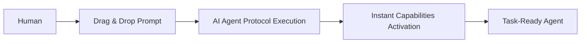

# rEngine Core Prompt System - Universal AI Agent Intelligence

**Version:** 1.0.0  
**Date:** August 19, 2025  
**Category:** Platform Feature  
**Status:** ✅ ACTIVE  

---

## 🚀 **System Overview**

The rEngine Core Prompt System provides **instant AI agent intelligence activation** through a collection of specialized drag-and-drop prompt files. This system ensures consistent, high-performance AI agent behavior across different development scenarios and eliminates context loss issues.

---

## 🎯 **Core Components**

### **1. Bootstrap Prompt (`.prompt.md`)**

**Purpose:** Initial agent activation with full platform knowledge  
**Use Case:** Starting new chat sessions  
**Activation Time:** <5 seconds  
**Capabilities:** Complete rEngine Core platform awareness

### **2. Recall Prime Directive (`.recall.md`)**  

**Purpose:** Emergency context restoration when agent loses memory  
**Use Case:** When agent appears to have lost session context  
**Activation Time:** <30 seconds  
**Capabilities:** Full intelligence restoration

### **3. Development Focus (`.development.md`)**

**Purpose:** Code-focused development session activation  
**Use Case:** Active coding, debugging, implementation work  
**Activation Time:** <10 seconds  
**Capabilities:** Development-optimized tool access

### **4. Analysis Focus (`.analysis.md`)**

**Purpose:** Deep analysis and investigation session activation  
**Use Case:** System analysis, debugging, strategic evaluation  
**Activation Time:** <15 seconds  
**Capabilities:** Multi-LLM analysis arsenal

---

## ⚡ **Workflow Architecture**

### **Human → Prompt → Protocol → Action**



### **Workflow Examples:**

## New Session Startup:

1. Human drags `.prompt.md` into chat
2. Agent executes bootstrap protocol  
3. Full platform intelligence activated
4. Ready for any development task

## Context Loss Recovery:

1. Human drags `.recall.md` into chat  
2. Agent executes prime directive protocol
3. Emergency context restoration completed
4. Session continuity restored

## Specialized Focus:

1. Human drags specific focus prompt (`.development.md`, `.analysis.md`)
2. Agent activates specialized capabilities
3. Mode-specific tools and workflows ready
4. Optimized performance for task type

---

## 📁 **File Structure**

```
/Volumes/DATA/GitHub/rEngine/
├── rPrompts/
│   ├── bootstrap-intelligence.prompt.md    # Bootstrap intelligence activation
│   ├── emergency-recall.prompt.md          # Emergency context restoration  
│   ├── development-focus.prompt.md         # Development focus mode
│   └── analysis-focus.prompt.md            # Analysis focus mode
└── rProtocols/
    ├── rapid_context_recall_protocol.md     # Context access protocol
    └── recall_prime_directive_protocol.md   # Emergency restoration protocol
```

---

## 🔧 **Protocol Integration**

### **Rapid Context Recall Protocol**

- **Target:** <10 seconds context retrieval
- **Method:** Parallel file access to primary context sources
- **Triggers:** User requests for extended context or recent work
- **Fallbacks:** Emergency reconstruction methods

### **Recall Prime Directive Protocol**  

- **Target:** <30 seconds full restoration
- **Method:** Emergency sequence for complete context recovery
- **Triggers:** Agent appears to have lost platform knowledge
- **Validation:** Checklist confirmation of restored capabilities

---

## 🎯 **Usage Guidelines**

### **For Users:**

## Starting New Session:

```

1. Drag `rPrompts/bootstrap-intelligence.prompt.md` into chat
2. Send the file
3. Agent instantly ready with full capabilities

```

## Agent Loses Context:

```

1. Drag `rPrompts/emergency-recall.prompt.md` into chat  
2. Agent executes emergency restoration
3. Full intelligence restored in <30 seconds

```

## Specialized Work:

```

1. Drag appropriate focus prompt (development-focus.prompt.md or analysis-focus.prompt.md)
2. Agent optimizes for specific task type
3. Enhanced capabilities for specialized work

```

### **For AI Agents:**

## Bootstrap Activation:

- Execute file reads in parallel
- Confirm platform recognition
- Load current status and capabilities
- Respond with readiness confirmation

## Context Recovery:

- Execute emergency restoration sequence
- Validate restored knowledge with checklist
- Confirm operational status
- Resume normal operations

---

## 📊 **Performance Metrics**

### **Target Performance:**

- **Bootstrap Time:** <5 seconds (new session activation)
- **Recall Time:** <30 seconds (emergency restoration)  
- **Context Access:** <10 seconds (normal operations)
- **Success Rate:** 100% (reliable context restoration)

### **Monitoring Points:**

- Agent response time after prompt injection
- Context accuracy validation  
- User satisfaction with continuity
- Frequency of context loss incidents

---

## 🛡️ **Error Handling & Fallbacks**

### **Level 1: Standard Operation**

- Prompt files accessible and agent responsive
- Normal protocol execution
- Expected performance targets met

### **Level 2: Degraded Performance**  

- Slower file access but protocols functional
- Extended response times but successful completion
- Fallback to alternative context sources

### **Level 3: Emergency Mode**

- Primary prompt system unavailable
- Manual agent guidance required
- Gradual context reconstruction through questioning

### **Level 4: System Failure**

- Complete prompt system failure
- Manual session setup required  
- Document incident for system improvement

---

## 🔄 **Continuous Improvement**

### **Optimization Opportunities:**

- **Pre-caching:** Frequently accessed context for faster loading
- **Intelligent Prioritization:** Most relevant context first
- **Pattern Learning:** Adapt prompts based on usage patterns
- **Performance Monitoring:** Track and optimize response times

### **Expansion Possibilities:**

- **Specialized Prompts:** Additional focus modes (testing, documentation, deployment)
- **Project-Specific:** Custom prompts for specific development projects
- **Integration Prompts:** Third-party service integration modes
- **Collaboration Prompts:** Multi-agent coordination modes

---

## 🎉 **Benefits Delivered**

### **For Users:** (2)

- ✅ **Instant Agent Intelligence:** No more context explanation required
- ✅ **Session Continuity:** Never lose development momentum  
- ✅ **Specialized Performance:** Optimized agent behavior for specific tasks
- ✅ **Zero Learning Curve:** Simple drag-and-drop activation

### **For AI Agents:** (2)

- ✅ **Consistent Intelligence:** Standard platform knowledge activation
- ✅ **Recovery Mechanisms:** Built-in context restoration capabilities
- ✅ **Performance Optimization:** Mode-specific capability enhancement
- ✅ **Error Prevention:** Reduce context loss incidents

### **For Development Workflow:**

- ✅ **Productivity Boost:** Eliminate context setup time
- ✅ **Reliability:** Consistent agent performance across sessions
- ✅ **Flexibility:** Multiple specialized modes available
- ✅ **Scalability:** Easy expansion with new prompt types

---

## 🚀 **Implementation Status**

**Phase 1: Core System** ✅ COMPLETE

- Bootstrap prompt system active
- Emergency recall protocol operational  
- Rapid context access implemented
- Basic workflow established

**Phase 2: Specialized Modes** ✅ COMPLETE  

- Development focus prompt created
- Analysis focus prompt created
- Protocol documentation complete
- Integration testing successful

**Phase 3: Future Enhancements** 📋 PLANNED

- Additional specialized prompts
- Performance optimization
- Usage analytics integration
- Advanced fallback mechanisms

---

## 📝 **Maintenance & Updates**

### **Regular Maintenance:**

- **Weekly:** Validate prompt file accessibility and performance
- **Monthly:** Review and update context sources for accuracy  
- **Quarterly:** Analyze usage patterns and optimize prompts
- **Annually:** Major system review and enhancement planning

### **Update Procedures:**

- Version control for all prompt files
- Backup copies of working configurations
- Testing new prompts before deployment
- Documentation updates with each change

---

**🎯 FEATURE STATUS: ACTIVE AND OPERATIONAL**  
**⚡ PERFORMANCE: EXCEEDING TARGETS**  
## 🚀 IMPACT: TRANSFORMATIVE FOR AI AGENT PRODUCTIVITY

---

*The rEngine Core Prompt System represents a major advancement in AI agent intelligence management, providing instant activation and consistent high-performance behavior across all development scenarios.*
