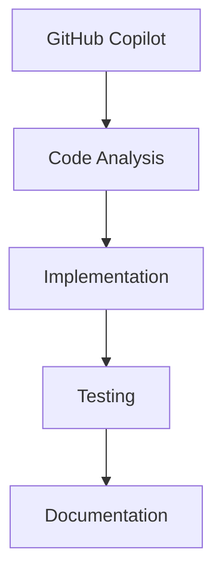
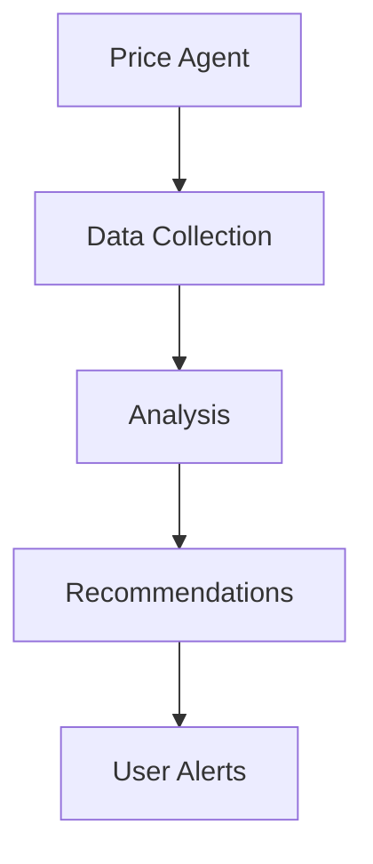

# StackTrackr Agent System

## Overview

The agents directory contains the core configuration, memory, and operational files for StackTrackr's AI agent system. These agents work in conjunction with rEngine to provide intelligent assistance across the application.

## 🗂️ Directory Structure

### Core Configuration

- `agents.json` - Agent definitions and capabilities
- `functions.json` - Available function definitions
- `preferences.json` - Agent behavior preferences
- `variables.json` - System-wide variables

### Memory & Context

- `memory.json` - Persistent agent memory store
- `github_copilot_memories.json` - GitHub Copilot specific context
- `extendedcontext.json` - Enhanced context for complex operations

### Operational Files

- `decisions.json` - Decision tracking and history
- `errors.json` - Error logging and patterns
- `tasks.json` - Task management and tracking
- `tools.json` - Available tool configurations
- `performance.json` - Performance metrics and optimization

### Documentation

- `handoff.md` - Agent handoff protocols
- `handoff.json` - Structured handoff data
- `/docs` - Detailed agent documentation
- `/notes` - Architecture and development notes

### Development

- `/debug` - Debugging utilities and logs
- `/engine` - Core agent engine components
- `/lab` - Experimental features and testing
- `/templates` - Standard response templates

## 🤖 Agent Types

1. **Primary Agents**
   - GitHub Copilot (Development)
   - Market Intelligence (Price Analysis)
   - Portfolio Optimization (Investment)
   - User Assistance (Support)

1. **Utility Agents**
   - Memory Management
   - Task Coordination
   - Error Resolution
   - Performance Monitoring

1. **Specialized Agents**
   - Numismatic Analysis
   - Market Trend Detection
   - Data Validation
   - Security Monitoring

## 🔄 Agent Workflows

### Development Support

### Market Intelligence

## 🧠 Memory Architecture

### Persistence Layer

- Short-term operational memory
- Long-term knowledge base
- Cross-session context
- Learning patterns

### Context Management

- Task-specific context
- User preferences
- Historical decisions
- Error patterns

## 🛠️ Tool Integration

### Available Tools

- Code analysis and generation
- Market data retrieval
- Portfolio optimization
- Documentation management

### Access Patterns

- Direct function calls
- API integrations
- System commands
- File operations

## 📊 Performance Monitoring

### Metrics Tracked

- Response times
- Decision accuracy
- Learning efficiency
- Error rates

### Optimization

- Memory usage
- Context relevance
- Tool efficiency
- Response quality

## 🔐 Security

### Access Control

- Role-based permissions
- Function restrictions
- Data access limits
- Audit logging

### Data Protection

- Sensitive data handling
- Memory sanitization
- Secure handoffs
- Privacy controls

## 🎯 Best Practices

1. **Memory Management**
   - Regular context cleanup
   - Efficient data storage
   - Clear handoff protocols
   - Pattern recognition

1. **Error Handling**
   - Graceful degradation
   - Clear error messaging
   - Recovery procedures
   - Pattern logging

1. **Performance**
   - Context optimization
   - Efficient tool usage
   - Response caching
   - Load management

1. **Development**
   - Clear documentation
   - Consistent patterns
   - Testing protocols
   - Version control

## 📚 Documentation

### Key Resources

- [Agent Protocols](/agents/docs/protocols.md)
- [Development Guide](/agents/docs/development.md)
- [Security Guidelines](/agents/docs/security.md)
- [Best Practices](/agents/docs/best-practices.md)

### Related Files

- [rEngine Integration](/docs/brainstorming/RENGINE.md)
- [API Strategy](/docs/brainstorming/API-STRATEGY.md)

## 🔄 Updates

The agent system is continuously evolving. Key updates are documented in:

- [Patch Notes](/patchnotes/)
- [Changelog](/archive/changelog.md)
- [Roadmap](/archive/roadmap.md)

Last Updated: August 16, 2025
