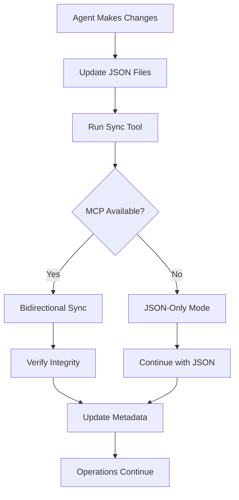

# MCP-JSON Synchronization System

This system ensures perfect 1:1 mapping and synchronization between JSON files and MCP Memory, providing both operational reliability and intelligent context management.

## 🎯 **System Architecture**

```
JSON Files (Operational Truth) ↔ MCP Memory (Contextual Intelligence)
                     ↕
            Perfect 1:1 Mapping
                     ↕
              Agent Operations
```

## 📁 **Synchronized Files**

| JSON File | MCP Entity Type | Priority | Purpose |
|-----------|----------------|----------|---------|
| `tasks.json` | TaskProject/TaskPhase | 1 | Active projects and phases |
| `memory.json` | MemoryEntity | 1 | Project memory and context |
| `agents.json` | Agent | 2 | Agent capabilities and profiles |
| `errors.json` | ErrorPattern | 3 | Error signatures and prevention |
| `decisions.json` | Decision | 3 | Architectural decisions |
| `functions.json` | Function | 4 | Function definitions and ownership |
| `preferences.json` | Preference | 5 | User preferences and settings |
| `styles.json` | Style | 5 | Visual styling definitions |

## 🔧 **Using the Sync System**

### Quick Status Check

```bash
./agents/scripts/sync_tool.sh status
```

### Sync JSON to MCP

```bash
./agents/scripts/sync_tool.sh sync json_to_mcp
```

### Sync MCP to JSON

```bash
./agents/scripts/sync_tool.sh sync mcp_to_json
```

### Validate JSON Files

```bash
./agents/scripts/sync_tool.sh validate
```

### Create Backup

```bash
./agents/scripts/sync_tool.sh backup
```

## 🤖 **Agent Integration**

### On Startup ("Hello")

1. Check sync status: `sync_tool.sh status`
2. Verify data consistency
3. Report sync status in initialization

### During Work

- Make changes to JSON files
- Run `sync_tool.sh sync` after significant updates
- MCP provides enhanced context queries

### After Completion

- Final sync: `sync_tool.sh sync`
- Ensure all changes are propagated

## 🔄 **Sync Workflow**



## 📊 **Sync Configuration**

The system uses `sync_config.json` to define:

- **Field mappings** between JSON and MCP entities
- **Relationship mappings** for cross-references
- **Validation rules** for data integrity
- **Conflict resolution** strategies

## 🛡️ **Data Safety**

- **Automatic backups** before each sync
- **Validation checks** for JSON syntax
- **Conflict detection** with manual resolution
- **Rollback procedures** for failed syncs
- **Integrity verification** after sync

## 🔍 **Monitoring**

The sync system tracks:

- Sync success/failure rates
- Entity counts and changes
- Validation errors
- Conflict occurrences
- Performance metrics

## 🚨 **Conflict Resolution**

When conflicts are detected:

1. System creates conflict report
2. Automatic backup of conflicted state
3. Manual review required
4. Resolution tools provided

## 📝 **Logs and Debugging**

- **Sync logs**: `agents/sync.log`
- **Metadata**: `agents/sync_metadata.json`
- **Conflicts**: `agents/sync_conflicts.json`
- **Backups**: `agents/backups/[timestamp]/`

## 🎛️ **Advanced Features**

### Auto-Sync

```bash
./agents/scripts/sync_tool.sh auto
```

### Scheduled Sync (cron example)

```bash

# Every 5 minutes

*/5 * * * * /path/to/sync_tool.sh auto
```

### Custom Validation

The system supports custom validation rules defined in `sync_config.json` for:

- Required fields
- Data type validation
- Cross-reference integrity
- Business logic validation

## 🔧 **Troubleshooting**

### MCP Unavailable

- System automatically falls back to JSON-only mode
- All operations continue normally
- Sync resumes when MCP becomes available

### Sync Failures

- Check `agents/sync.log` for errors
- Verify JSON file syntax
- Check MCP connectivity
- Review conflict reports

### Performance Issues

- Monitor sync duration metrics
- Implement incremental sync for large datasets
- Use async operations for large updates

## 🚀 **Future Enhancements**

- Real-time sync triggers
- Advanced conflict resolution AI
- Performance optimization
- Enhanced monitoring dashboard
- Multi-project sync coordination
