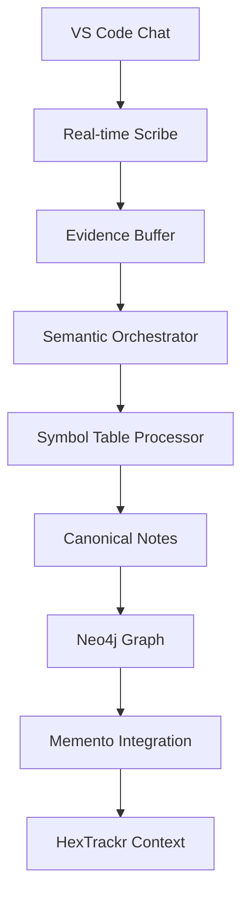

# HexTrackr Memory System Architecture

## Overview

The HexTrackr project utilizes a sophisticated **centralized memory system** located at `/Volumes/DATA/GitHub/.rMemory` that serves multiple projects including HexTrackr, StackTrackr, and memento-protocol-enhanced. This system implements a ChatGPT semantic approach with Evidence → Reconciliation → Canonical Notes methodology.

## Current System Status (August 30, 2025)

### Active Components

- **Neo4j Desktop**: Running on localhost:7475
- **Ollama**: Serve process active with qwen2.5-coder:7b and nomic-embed-text models
- **Real-time Scribe**: Operational (PID 75445)
- **Memento Integration**: 239 entities in memory graph

### Architecture Components

## Core Memory Engine (`/core/`)

### 1. Semantic Orchestrator (`semantic-orchestrator.js` - 28,792 bytes)

- **Main processing engine** implementing Evidence → Reconciliation → Canonical Notes
- Processes 2.5 weeks of development sessions + rEngine backups
- Manages evidence buffer, canonical notes, symbols table, and time summaries
- Uses Ollama qwen2.5-coder:7b for analysis
- Entry point: `core/semantic-orchestrator.js`

### 2. Embedding Indexer (`embedding-indexer.js` - 18,473 bytes)

- **Real-time embedding and search matrix generation**
- Uses nomic-embed-text:latest for embeddings
- Builds consolidated search matrices
- Integrates with semantic orchestrator for evidence processing

### 3. Hierarchical Memory Organizer (`hierarchical-memory-organizer.js` - 17,977 bytes)

- **Implements exact hierarchy structure** from user specifications
- Uses Neo4j for graph storage
- Ollama-powered intelligent organization with confidence ratings
- Temporal indexing capabilities

### 4. Extended Memory Indexer (`extended-memory-indexer.js` - 17,257 bytes)

- **Extended context processing** for comprehensive memory management
- Handles large-scale data indexing operations

### 5. Ollama Embedding Proxy (`ollama-embedding-proxy.js` - 7,261 bytes)

- **Proxy service** for Ollama embedding operations
- Manages embedding requests and responses

## Memory Scribes (`/scribes/`)

### Real-time Components

- **`real-time-scribe.js`** (29,106 bytes): Lightweight VS Code chat monitoring with continuous logging
- **`agent-context-loader.js`** (22,252 bytes): Context loading and management
- **`deep-chat-analysis.js`** (19,829 bytes): Deep analysis of chat sessions
- **`memory-importer.js`** (21,731 bytes): Memory data import operations

### Analysis Components

- **`memory-scribe-summarizer.js`** (19,292 bytes): Memory summarization
- **`vscode-log-analyzer.js`** (16,804 bytes): VS Code specific log analysis
- **`chat-db-extractor.js`** (13,893 bytes): Chat database extraction
- **`real-time-analysis.js`** (13,772 bytes): Real-time data analysis
- **`frustration-matrix.js`** (13,674 bytes): Frustration pattern analysis

## Memory Tools (`/tools/`)

### Core Tools

- **`opus-memory-reconstructor.js`** (23,558 bytes): Memory reconstruction using Claude Opus
- **`memory-audit-system.js`** (16,745 bytes): Comprehensive memory auditing
- **`core-memory-backup.js`** (12,647 bytes): Core memory backup operations
- **`symbol-table-processor.js`** (10,967 bytes): **BREAKTHROUGH COMPONENT**

### Symbol Table Processing Breakthrough

The `symbol-table-processor.js` is a critical component implementing:

#### GPT Memory MCP Integration

```javascript
// Entity Types Classification
entityTypes: [
    'FILE', 'CLASS', 'FUNCTION', 'METHOD', 'VAR', 'TICKET', 'COMMIT', 
    'API', 'ENV', 'DOC', 'NOTE', 'EVIDENCE', 'TODO', 'PLAN', 'PROTOCOL'
]
```

#### Processing Pipeline

1. **Evidence Collection** → Raw data intake
2. **Canonical Notes** → Structured knowledge
3. **Todos** → Actionable items

#### Deterministic Classification Rules

- **DECISION**: `/\b(decision|decided|chose|selected|picked)\b/i`
- **ACTION**: `/\b(todo|task|action|implement|build|create|fix)\b/i`
- **QUESTION**: `/\?|\b(question|wondering|unsure|clarify)\b/i`
- **STATUS**: `/\b(status|progress|update|current|state)\b/i`
- **CONTEXT**: `/\b(context|background|overview|summary)\b/i`

### Utility Tools

- **`memory-cleanup-analyzer.js`** (8,356 bytes): Memory cleanup operations
- **`pipeline-orchestrator.js`** (4,170 bytes): Pipeline coordination
- **`api-integrations.js`** (4,085 bytes): External API integrations

## Analysis Pipeline (`/analysis/`)

### Scheduled Analyzer (`scheduled-analyzer.js` - 11,145 bytes)

- **60-second interval heavy analysis** with Opus/Gemini integration
- Neo4j graph updates
- Batch processing (10 items at a time)
- Deep analysis and memory graph updates

## GUI Control Center (`/gui/`)

### Python Interface

- **`rmemory-control-center.py`**: Main GUI control interface
- **`launch-gui.py`**: GUI launcher
- Provides visual control over memory system operations

## Data Storage Architecture

### Neo4j Graph Database

- **Location**: localhost:7687 (bolt), localhost:7475 (HTTP)
- **Purpose**: Hierarchical memory organization and relationship mapping
- **Status**: Active with Neo4j Desktop

### SQLite Databases

- **Extended Memory**: `/sqlite/extended-memory.db`
- **Memory MCP**: `/sqlite/memory-mcp.db`
- **Purpose**: Structured data storage for processing pipeline

### JSON Data Files

- **Evidence**: `/json/chat-evidence.json`
- **Canonical Notes**: `/json/canonical-notes.json`
- **Symbols Table**: `/json/symbols-table.json`
- **Time Summaries**: `/json/time-summaries.json`
- **Memento Import**: `/json/memento-import.json`

## Integration with HexTrackr

### Current Integration Points

1. **Memento MCP Integration**: HexTrackr package.json includes `memento-mcp v0.3.9`
2. **Memory Entity Storage**: 239 entities in Memento system including 10 rMemory-related entities
3. **Development Session Tracking**: Memory of previous audit sessions and development work
4. **Backup System Integration**: rEngine backup system for variable management and workflow protocols

### Memory Workflow



## System Dependencies

### Package Configuration (`package.json`)

```json
{
  "name": "rmemory-system",
  "version": "1.0.0",
  "main": "core/semantic-orchestrator.js",
  "dependencies": {
    "dotenv": "^16.0.3",
    "node-fetch": "^3.3.0", 
    "neo4j-driver": "^5.11.0",
    "sqlite3": "^5.1.6"
  }
}
```

### External Services

- **Ollama**: qwen2.5-coder:7b, nomic-embed-text:latest
- **Neo4j**: Enterprise graph database
- **Claude Opus**: Deep analysis integration
- **Gemini**: Alternative LLM for analysis

## Memory Hierarchy Implementation

Based on user diagram specifications:

### Current Session and Handoff

- **Current Working Context**: active_development, current_issues, immediate_tasks
- **Last 5 summaries**: recent_chat_summaries
- **Agent Handoff Information**: continuity_notes, context_transfer

### Projects Structure

- **rMemory Core**: Architecture, Documentation, Roadmaps, Bugs and Issues
- **HexTrackr**: Features, Documentation, Issues, Development Sessions
- **StackTrackr**: Related project integration
- **Memento Protocol**: Enhanced memory capabilities

## Deprecated Components (`/deprecated/`)

### Deprecation Date: August 30, 2025

Components moved to `/deprecated/` folder with preserved structure:

- Legacy scripts not referenced by `install-memory-system.sh`
- Outdated core components replaced by streamlined architecture
- Test utilities and archaeology tools
- Legacy launcher scripts

### Active vs Deprecated Principle

Only components directly referenced by the installer dependency chain remain active, streamlining the system to essential, tested, and working components.

## Operational Commands

### System Control

```bash
npm start          # Start memory system
npm stop           # Stop memory system  
npm run status     # Check system status
npm run install-system  # Install memory system
```

### Manual Process Management

```bash

# Start semantic orchestrator

node core/semantic-orchestrator.js

# Start real-time scribe

node scribes/real-time-scribe.js

# Run scheduled analyzer

node analysis/scheduled-analyzer.js
```

## Current Development Status

### Completed

- ✅ Centralized architecture at `/Volumes/DATA/GitHub/.rMemory`
- ✅ Symbol Table Processing breakthrough
- ✅ Multi-project support (HexTrackr, StackTrackr, memento-protocol-enhanced)
- ✅ Neo4j integration with hierarchical organization
- ✅ Ollama embedding and LLM integration
- ✅ Real-time monitoring and analysis
- ✅ Deprecated component organization

### Currently Operational

- ✅ Neo4j Desktop (localhost:7475)
- ✅ Ollama serve process
- ✅ Real-time scribe monitoring
- ✅ Memento MCP integration (239 entities)

### Pending/Not Running

- ⏸️ Semantic orchestrator main process
- ⏸️ Scheduled heavy analysis pipeline
- ⏸️ GUI control center
- ⏸️ Memory reconstruction operations

## Future Roadmap Integration

The centralized rMemory system is positioned to support:

1. **Neo4j Memory Table Reconstruction**: Current audit provides foundation for clearing and rebuilding memory tables
2. **Enhanced Multi-project Support**: Architecture ready for additional project integration
3. **Improved Real-time Processing**: Symbol Table breakthrough enables better classification
4. **GUI Control Interface**: Python-based control center for system management
5. **Advanced Analysis Pipeline**: Opus/Gemini integration for deeper memory insights

## Security and Compliance

The memory system integrates with HexTrackr's security architecture:

- Path validation for file system operations
- Secure API endpoints for memory operations
- Audit trail maintenance through Memento integration
- Backup and recovery capabilities

---

*This documentation reflects the actual current state of the HexTrackr Memory System as of August 30, 2025, based on comprehensive audit findings.*
