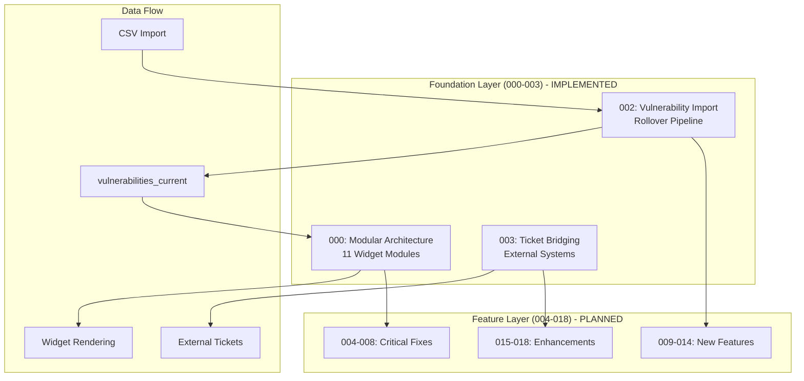
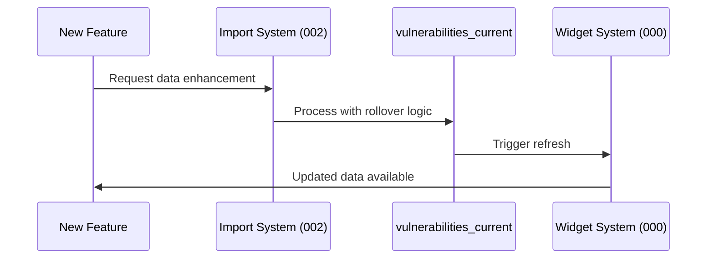

# HexTrackr Integration Guide: Foundation → Future Features

**Purpose**: Connect foundation systems (000-003) with upcoming features (004-018)  
**Audience**: Developers implementing sprint features  
**Context**: v1.0.11 modular architecture with widget-ready infrastructure

## Foundation Architecture Overview

### System Boundaries and Integration Points



## 1. Widget Architecture Integration (000)

### **Available Widget Infrastructure**

The modular architecture provides 11 specialized widgets ready for enhancement:

| Widget Module | Function | Integration Point | Lines |
|---------------|----------|------------------|-------|
| **vulnerability-statistics.js** | VPR metrics display | Statistics dashboard | 364 |
| **vulnerability-data.js** | Data management core | All data operations | 571 |
| **vulnerability-chart-manager.js** | Trend visualization | Chart enhancements | 590 |
| **vulnerability-details-modal.js** | Detail view system | Modal workflows | 935 |
| **vulnerability-cards.js** | Device card display | Card-based views | 395 |
| **vulnerability-search.js** | Search functionality | Search improvements | 348 |
| **vulnerability-grid.js** | Table display system | Grid enhancements | 529 |
| **vulnerability-core.js** | System orchestrator | Cross-widget coordination | 338 |

### **Widget Communication Protocol**

```javascript
// Standard widget interface for feature integration
class WidgetInterface {
    constructor(config) {
        this.config = config;
        this.initialized = false;
    }
    
    async init() {
        // Widget-specific initialization
        this.initialized = true;
    }
    
    refresh() {
        // Triggered by global refreshPageData()
    }
    
    destroy() {
        // Cleanup for hot reloading
        this.initialized = false;
    }
}

// Global communication hub
window.refreshPageData = function(type) {
    if (type === 'vulnerabilities') {
        vulnerabilityDataManager.refresh();
        vulnerabilityChartManager.updateCharts();
        vulnerabilityStatistics.updateDisplay();
    }
};
```

### **Feature Integration Pattern**

For upcoming features (004-018), use this pattern:

```javascript
// Example: 004-cve-link-system-fix integration
class CveLinkEnhancement {
    constructor() {
        // Connect to existing modal infrastructure
        this.modalManager = window.vulnerabilityDetailsModal;
        this.dataManager = window.vulnerabilityDataManager;
    }
    
    handleCveClick(cveId) {
        // Leverage existing modal system
        this.modalManager.openCveDetails(cveId);
    }
    
    enhanceEventDelegation() {
        // Fix event delegation issues in existing widgets
        document.addEventListener('click', this.handleDynamicCveClicks);
    }
}
```

## 2. Vulnerability Import Integration (002)

### **High-Performance Import Pipeline**

The rollover system provides these integration points for features:

```javascript
// Import system achievements: 99%+ performance improvement
const ImportCapabilities = {
    processingSpeed: '8,022ms → 65ms (12,542 rows)',
    deduplication: 'Advanced unique key generation',
    realTimeProgress: 'WebSocket progress updates',
    dataIntegrity: 'Historical snapshots maintained'
};
```

### **Data Flow Integration Points**



### **API Integration Contracts**

Features can extend the import system:

```javascript
// Example: 007-kev-integration connecting to import
class KevImportAdapter {
    async importKevData(kevCsv) {
        // Transform KEV CSV to standard format
        const transformedData = this.transformKevToStandard(kevCsv);
        
        // Use existing rollover pipeline
        return await vulnerabilityImportSystem.processImport({
            data: transformedData,
            source: 'CISA_KEV',
            scanDate: new Date().toISOString().split('T')[0],
            deduplicationStrategy: 'cve_only'
        });
    }
    
    transformKevToStandard(kevData) {
        // Map KEV format to HexTrackr schema
        return kevData.map(row => ({
            hostname: row.vendorProject,
            cve: row.cveID,
            description: row.vulnerabilityName,
            severity: this.mapKevSeverity(row.cvssScore)
        }));
    }
}
```

### **Database Integration Points**

```sql
-- Foundation tables available for feature integration
vulnerabilities_current        -- Deduplicated active state
vulnerability_snapshots       -- Historical audit trail  
vulnerability_daily_totals    -- Performance aggregations
vulnerability_imports         -- Import tracking
```

## 3. Ticket System Integration (003)

### **External System Bridge Architecture**

The ticket system provides integration for upcoming features:

```javascript
// Available integration points
const TicketIntegration = {
    crud: 'Full ticket lifecycle management',
    correlation: 'Vulnerability-ticket linking',
    external: 'ServiceNow + generic adapter pattern',
    attachments: 'Secure file handling with PathValidator',
    workflow: 'Configurable ticket states'
};
```

### **External System Adapter Pattern**

For features requiring external integration:

```javascript
// Generic adapter for new external systems
class ExternalSystemAdapter {
    async createTicket(ticket) { /* Implement */ }
    async updateTicket(ticketId, updates) { /* Implement */ }
    async getTicketStatus(externalId) { /* Implement */ }
    async syncTicket(ticketId) { /* Implement */ }
}

// Example: 012-automation-workflows integration
class AutomationWorkflowAdapter extends ExternalSystemAdapter {
    async createTicket(hexTrackrTicket) {
        const workflowData = this.transformToWorkflow(hexTrackrTicket);
        const response = await this.workflowApiCall('POST', '/tickets', workflowData);
        return response.workflowId;
    }
}
```

### **Ticket-Vulnerability Correlation**

Features can leverage existing correlation system:

```javascript
// Implemented correlation system
class TicketVulnerabilityCorrelator {
    async linkVulnerabilityToTicket(ticketId, vulnerabilityId) {
        // Uses JSON array storage in tickets table
        const ticket = await this.getTicket(ticketId);
        const updatedVulnIds = [...(ticket.vulnerability_ids || []), vulnerabilityId];
        return await this.updateTicket(ticketId, { vulnerability_ids: updatedVulnIds });
    }
    
    async getTicketsForVulnerability(vulnerabilityId) {
        // SQL query with JSON extraction
        const query = `
            SELECT * FROM tickets 
            WHERE json_extract(vulnerability_ids, '$') LIKE '%${vulnerabilityId}%'
        `;
        return await db.all(query);
    }
}
```

## 4. Critical Fixes Integration (004-008)

### **004: CVE Link System Fix**

Integrates with existing modal infrastructure:

- **Target**: vulnerability-details-modal.js (935 lines)
- **Fix**: Event delegation for dynamic CVE links
- **Integration**: Minimal impact, leverages existing modal system

### **005: Chart Tooltip Method**

Integrates with chart widget:

- **Target**: vulnerability-chart-manager.js (590 lines)
- **Fix**: ApexCharts tooltip configuration
- **Integration**: Chart widget enhancement, no cross-widget impact

### **006-008: Search and Grid Fixes**

Integrate with search and grid widgets:

- **Targets**: vulnerability-search.js (348 lines), vulnerability-grid.js (529 lines)
- **Integration**: Widget-level fixes, orchestrator coordination

## 5. New Features Integration (009-014)

### **Data Enhancement Features (009-011)**

These features extend the import and data systems:

```javascript
// Integration pattern for data enhancement
class DataEnhancementFeature {
    constructor() {
        this.importSystem = window.vulnerabilityImportSystem;
        this.dataManager = window.vulnerabilityDataManager;
    }
    
    async enhanceData(newDataType) {
        // Leverage existing rollover pipeline
        return await this.importSystem.processEnhancement({
            type: newDataType,
            deduplication: 'enhanced_strategy',
            integration: 'seamless'
        });
    }
}
```

### **Workflow Features (012-014)**

These features extend the ticket system:

```javascript
// Integration pattern for workflow features  
class WorkflowFeature {
    constructor() {
        this.ticketSystem = window.ticketBridgeSystem;
        this.externalRegistry = window.externalSystemRegistry;
    }
    
    async implementWorkflow(workflowType) {
        // Use existing external system adapter pattern
        const adapter = new WorkflowAdapter(workflowType);
        this.externalRegistry.register(workflowType, adapter);
        return adapter;
    }
}
```

## 6. Enhancement Features Integration (015-018)

### **UI/UX Enhancements (015-017)**

Integrate with widget architecture:

- **Target**: All widget modules for consistent enhancement
- **Pattern**: Widget interface compliance, orchestrator coordination
- **Benefits**: Modular boundaries enable parallel development

### **Reporting Features (018)**

Integrate with data and export systems:

```javascript
// Integration with existing export capabilities
class ReportingFeature {
    constructor() {
        this.dataManager = window.vulnerabilityDataManager;
        this.exportSystem = window.exportUtilities;
    }
    
    async generateReport(reportType) {
        // Leverage existing data access patterns
        const data = await this.dataManager.getReportData(reportType);
        return await this.exportSystem.generateReport(data, reportType);
    }
}
```

## 7. Development Workflow Integration

### **Sprint Development Pattern**

For each feature (004-018):

1. **Analyze Foundation**: Review relevant foundation spec (000-003)
2. **Identify Integration Points**: Use this guide to find connection points
3. **Leverage Existing Infrastructure**: Build on widget/import/ticket systems
4. **Maintain Contracts**: Follow established patterns and interfaces
5. **Test Integration**: Ensure cross-system compatibility

### **Quality Gates**

Before implementing features, verify foundation integration:

```javascript
const IntegrationChecklist = {
    widgets: 'Does feature use existing widget infrastructure?',
    data: 'Does feature leverage rollover import system?',
    tickets: 'Does feature integrate with ticket bridging?',
    patterns: 'Does feature follow established patterns?',
    testing: 'Does feature maintain system compatibility?'
};
```

### **Testing Strategy**

Integration testing patterns:

```javascript
// Widget integration testing
describe('Feature Widget Integration', () => {
    test('integrates with vulnerability-core orchestrator', () => {
        // Test cross-widget communication
    });
    
    test('maintains widget interface contract', () => {
        // Test init/refresh/destroy lifecycle  
    });
});

// Data integration testing
describe('Feature Data Integration', () => {
    test('uses rollover import pipeline', () => {
        // Test data flow through import system
    });
    
    test('maintains deduplication logic', () => {
        // Test unique key generation
    });
});
```

## 8. Future Architecture Considerations

### **v2.0 Dashboard Vision**

The modular architecture enables future dashboard customization:

- **Widget Marketplace**: Third-party widget development
- **Custom Dashboards**: User-configurable widget arrangements  
- **Hot Module Reloading**: Development efficiency improvements
- **Micro-Frontend Architecture**: Complete module independence

### **Scalability Patterns**

Foundation systems designed for growth:

- **Database Sharding**: SQLite → PostgreSQL migration path
- **API Gateway**: External system consolidation
- **Event Sourcing**: Enhanced audit trail capabilities
- **Service Mesh**: Microservice decomposition

---

## Quick Reference: Foundation Integration Points

| Feature Type | Primary Integration | Secondary Integration | Foundation Spec |
|--------------|-------------------|---------------------|-----------------|
| **UI Fixes (004-008)** | Widget Architecture | Modal/Chart Systems | 000 |
| **Data Features (009-011)** | Import Pipeline | Widget Refresh | 002 |
| **Workflow Features (012-014)** | Ticket System | External Adapters | 003 |
| **UI Enhancements (015-017)** | Widget Architecture | Cross-Widget Events | 000 |
| **Reporting (018)** | Data Export | Ticket Correlation | 002 + 003 |

**Next Steps**: Use this guide during sprint planning to ensure features build on foundation systems rather than duplicate functionality.
