# HexTrackr GitHub Workflow Diagrams

## Complete Development to Production Flow

## Agent Pipeline Flow

## Codacy Quality Gates

## Uhura's Communication Flow

## Configuration Sync Status

```mermaid
flowchart TB
    subgraph "Configuration Files"
        A[.codacy/codacy.yaml]
        B[.codacyrc]
        C[.codacyignore]
        D[.github/workflows/]
        E[docker-compose.yml]
        F[Dockerfile.node]
    end
    
    subgraph "Dev Repo"
        A1[Master Configs]
    end
    
    subgraph "Public Repo"
        A2[Synced Configs]
    end
    
    A & B & C & D & E & F --> A1
    A1 -->|release.sh| A2
    
    subgraph "Validation"
        V[Uhura Preflight]
        V -->|Check| A1
        V -->|Check| A2
        V -->|Compare| R{Match?}
        R -->|Yes| S[✅ Sync OK]
        R -->|No| T[⚠️ Drift Detected]
    end
    
    style S fill:#9f9,stroke:#333,stroke-width:2px
    style T fill:#f99,stroke:#333,stroke-width:2px
```

## Release Decision Tree

```mermaid
flowchart TD
    A[Ready to Release?] --> B{All Tests Pass?}
    B -->|No| C[Fix Tests]
    C --> A
    B -->|Yes| D{Codacy Grade A?}
    D -->|No| E[Fix Issues]
    E --> A
    D -->|Yes| F{Configs Synced?}
    F -->|No| G[Sync Configs]
    G --> A
    F -->|Yes| H{Version Bumped?}
    H -->|No| I[Bump Version]
    I --> A
    H -->|Yes| J{Changelog Updated?}
    J -->|No| K[Update Changelog]
    K --> A
    J -->|Yes| L[✅ Ready for Release]
    
    L --> M[Run release-to-public.sh]
    M --> N[Create PR]
    N --> O{PR Checks Pass?}
    O -->|No| P[Fix PR Issues]
    P --> N
    O -->|Yes| Q[Merge to Main]
    Q --> R[🎉 Released!]
    
    style L fill:#9f9,stroke:#333,stroke-width:2px
    style R fill:#9f9,stroke:#333,stroke-width:4px
```

---

*These diagrams can be rendered in any Markdown viewer that supports Mermaid (GitHub, VSCode, etc.)*