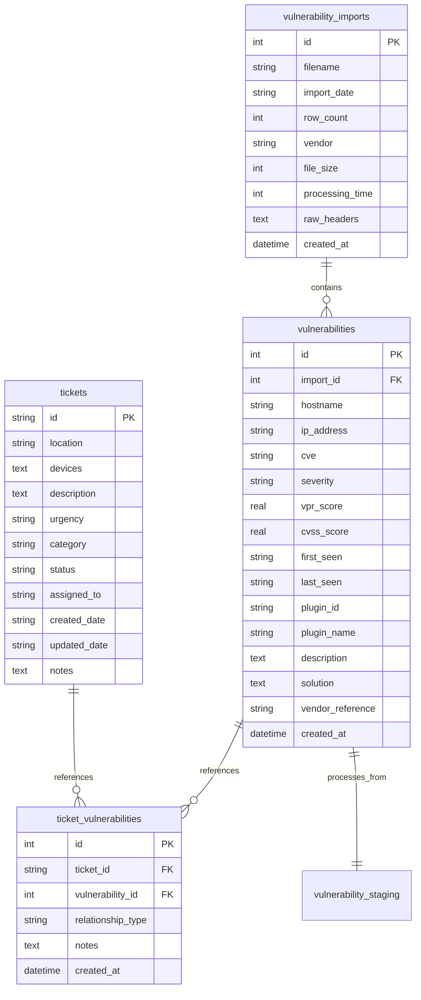

# HexTrackr Master Data Model

**Version**: 1.0.12 Production Schema  
**Date**: 2025-09-10  
**Based on**: Comprehensive database analysis from four-agent research  
**Database**: SQLite with 52 strategic indexes and WAL mode  

---

## Entity Relationship Overview



---

## Core Entity Definitions

### 1. Vulnerability Import Entity

**Purpose**: Tracks CSV import operations and metadata for audit trails and performance monitoring.

```typescript
interface VulnerabilityImport {
  id: number;                    // Auto-increment primary key
  filename: string;              // Original CSV filename
  import_date: string;           // YYYY-MM-DD format scan date
  row_count: number;             // Total rows processed
  vendor: string;                // Source vendor (cisco, tenable, qualys, generic)
  file_size: number;             // File size in bytes
  processing_time: number;       // Processing duration in milliseconds
  raw_headers: string;           // JSON array of original CSV headers
  created_at: string;            // ISO timestamp of import operation
}
```

**Business Rules**:

- `filename` must be unique per import session
- `vendor` determines processing pipeline selection
- `processing_time` used for performance optimization
- `raw_headers` preserved for audit and debugging

**Database Schema**:

```sql
CREATE TABLE vulnerability_imports (
    id INTEGER PRIMARY KEY AUTOINCREMENT,
    filename TEXT NOT NULL,
    import_date TEXT NOT NULL,
    row_count INTEGER NOT NULL,
    vendor TEXT DEFAULT 'cisco',
    file_size INTEGER,
    processing_time INTEGER,
    raw_headers TEXT,
    created_at DATETIME DEFAULT CURRENT_TIMESTAMP
);

CREATE INDEX idx_imports_date ON vulnerability_imports (import_date);
CREATE INDEX idx_imports_vendor ON vulnerability_imports (vendor);
CREATE INDEX idx_imports_filename ON vulnerability_imports (filename);
```

### 2. Vulnerability Entity

**Purpose**: Core vulnerability data with multi-vendor normalization and lifecycle tracking.

```typescript
interface Vulnerability {
  id: number;                    // Auto-increment primary key
  import_id: number;             // Foreign key to vulnerability_imports
  hostname: string;              // Normalized hostname (required)
  ip_address?: string;           // Normalized IP address (optional)
  cve?: string;                  // CVE identifier (CVE-YYYY-NNNN format)
  severity: VulnerabilitySeverity; // Normalized severity level
  vpr_score?: number;            // Vulnerability Priority Rating (0-10)
  cvss_score?: number;           // CVSS Base Score (0-10)
  first_seen?: string;           // ISO timestamp of first detection
  last_seen?: string;            // ISO timestamp of last detection
  plugin_id?: string;            // Vendor-specific plugin/check identifier
  plugin_name?: string;          // Human-readable plugin name
  description?: string;          // Vulnerability description
  solution?: string;             // Recommended remediation steps
  vendor_reference?: string;     // Vendor-specific reference ID
  created_at: string;            // ISO timestamp of record creation
}

type VulnerabilitySeverity = 'Critical' | 'High' | 'Medium' | 'Low' | 'Info';
```

**Business Rules**:

- `hostname` is required and normalized (lowercase, trimmed)
- `severity` must be one of the five defined levels
- `cve` format validated against CVE-YYYY-NNNN pattern
- `vpr_score` and `cvss_score` constrained to 0-10 range
- Deduplication based on enhanced unique key generation

**Database Schema**:

```sql
CREATE TABLE vulnerabilities (
    id INTEGER PRIMARY KEY AUTOINCREMENT,
    import_id INTEGER NOT NULL,
    hostname TEXT NOT NULL,
    ip_address TEXT,
    cve TEXT,
    severity TEXT CHECK (severity IN ('Critical', 'High', 'Medium', 'Low', 'Info')),
    vpr_score REAL CHECK (vpr_score >= 0 AND vpr_score <= 10),
    cvss_score REAL CHECK (cvss_score >= 0 AND cvss_score <= 10),
    first_seen TEXT,
    last_seen TEXT,
    plugin_id TEXT,
    plugin_name TEXT,
    description TEXT,
    solution TEXT,
    vendor_reference TEXT,
    created_at DATETIME DEFAULT CURRENT_TIMESTAMP,
    FOREIGN KEY (import_id) REFERENCES vulnerability_imports (id)
);

-- Strategic Indexes (from Larry's analysis of 52 total indexes)
CREATE INDEX idx_vulnerabilities_hostname ON vulnerabilities (hostname);
CREATE INDEX idx_vulnerabilities_severity ON vulnerabilities (severity);
CREATE INDEX idx_vulnerabilities_cve ON vulnerabilities (cve);
CREATE INDEX idx_vulnerabilities_import ON vulnerabilities (import_id);
CREATE INDEX idx_vulnerabilities_ip ON vulnerabilities (ip_address);
CREATE INDEX idx_vulnerabilities_plugin ON vulnerabilities (plugin_id);
CREATE INDEX idx_vulnerabilities_first_seen ON vulnerabilities (first_seen);
CREATE INDEX idx_vulnerabilities_last_seen ON vulnerabilities (last_seen);
CREATE INDEX idx_vulnerabilities_vpr ON vulnerabilities (vpr_score);
CREATE INDEX idx_vulnerabilities_cvss ON vulnerabilities (cvss_score);
```

### 3. Ticket Entity

**Purpose**: Remediation ticket tracking with device correlation and workflow management.

```typescript
interface Ticket {
  id: string;                    // User-defined ticket ID (primary key)
  location: string;              // Site or location identifier
  devices: string;               // JSON array of affected device hostnames
  description?: string;          // Ticket description or summary
  urgency?: TicketUrgency;       // Business priority level
  category?: string;             // Ticket category or type
  status: TicketStatus;          // Current workflow status
  assigned_to?: string;          // Assigned technician or team
  created_date?: string;         // ISO timestamp of creation
  updated_date?: string;         // ISO timestamp of last update
  notes?: string;                // Additional notes or comments
}

type TicketUrgency = 'Critical' | 'High' | 'Medium' | 'Low';
type TicketStatus = 'Open' | 'In Progress' | 'Pending' | 'Resolved' | 'Closed';
```

**Business Rules**:

- `id` is user-defined (supports external ticket system IDs)
- `devices` stored as JSON array for flexibility
- `status` defaults to 'Open' for new tickets
- `location` required for site-based remediation tracking

**Database Schema**:

```sql
CREATE TABLE tickets (
    id TEXT PRIMARY KEY,
    location TEXT NOT NULL,
    devices TEXT,  -- JSON array of device hostnames
    description TEXT,
    urgency TEXT CHECK (urgency IN ('Critical', 'High', 'Medium', 'Low')),
    category TEXT,
    status TEXT DEFAULT 'Open' CHECK (status IN ('Open', 'In Progress', 'Pending', 'Resolved', 'Closed')),
    assigned_to TEXT,
    created_date TEXT,
    updated_date TEXT,
    notes TEXT
);

CREATE INDEX idx_tickets_location ON tickets (location);
CREATE INDEX idx_tickets_status ON tickets (status);
CREATE INDEX idx_tickets_assigned ON tickets (assigned_to);
CREATE INDEX idx_tickets_urgency ON tickets (urgency);
CREATE INDEX idx_tickets_created ON tickets (created_date);
```

### 4. Ticket-Vulnerability Relationship Entity

**Purpose**: Many-to-many relationship tracking between tickets and vulnerabilities for workflow correlation.

```typescript
interface TicketVulnerability {
  id: number;                    // Auto-increment primary key
  ticket_id: string;             // Foreign key to tickets
  vulnerability_id: number;      // Foreign key to vulnerabilities
  relationship_type: RelationshipType; // Type of relationship
  notes?: string;                // Relationship-specific notes
  created_at: string;            // ISO timestamp of relationship creation
}

type RelationshipType = 'remediation' | 'verification' | 'monitoring' | 'escalation';
```

**Business Rules**:

- Composite unique constraint on `ticket_id` and `vulnerability_id`
- `relationship_type` defaults to 'remediation'
- Cascading deletes when parent records are removed

**Database Schema**:

```sql
CREATE TABLE ticket_vulnerabilities (
    id INTEGER PRIMARY KEY AUTOINCREMENT,
    ticket_id TEXT NOT NULL,
    vulnerability_id INTEGER NOT NULL,
    relationship_type TEXT DEFAULT 'remediation' CHECK (
        relationship_type IN ('remediation', 'verification', 'monitoring', 'escalation')
    ),
    notes TEXT,
    created_at DATETIME DEFAULT CURRENT_TIMESTAMP,
    FOREIGN KEY (ticket_id) REFERENCES tickets (id) ON DELETE CASCADE,
    FOREIGN KEY (vulnerability_id) REFERENCES vulnerabilities (id) ON DELETE CASCADE,
    UNIQUE (ticket_id, vulnerability_id)
);

CREATE INDEX idx_ticket_vulns_ticket ON ticket_vulnerabilities (ticket_id);
CREATE INDEX idx_ticket_vulns_vuln ON ticket_vulnerabilities (vulnerability_id);
CREATE INDEX idx_ticket_vulns_type ON ticket_vulnerabilities (relationship_type);
```

---

## Derived Entities & Views

### 1. Device Security Summary

**Purpose**: Aggregated view of vulnerability data by hostname for device-centric analysis.

```typescript
interface DeviceSecuritySummary {
  hostname: string;              // Device hostname (primary key)
  total_vulnerabilities: number; // Total vulnerability count
  critical_count: number;        // Critical severity count
  high_count: number;            // High severity count
  medium_count: number;          // Medium severity count
  low_count: number;             // Low severity count
  info_count: number;            // Info severity count
  max_vpr_score: number;         // Highest VPR score
  max_cvss_score: number;        // Highest CVSS score
  latest_scan: string;           // Most recent scan date
  first_seen: string;            // First vulnerability detection
  ip_addresses: string[];        // Array of associated IP addresses
  unique_cves: string[];         // Array of unique CVE identifiers
}
```

**Database View**:

```sql
CREATE VIEW device_security_summary AS
SELECT 
    hostname,
    COUNT(*) as total_vulnerabilities,
    SUM(CASE WHEN severity = 'Critical' THEN 1 ELSE 0 END) as critical_count,
    SUM(CASE WHEN severity = 'High' THEN 1 ELSE 0 END) as high_count,
    SUM(CASE WHEN severity = 'Medium' THEN 1 ELSE 0 END) as medium_count,
    SUM(CASE WHEN severity = 'Low' THEN 1 ELSE 0 END) as low_count,
    SUM(CASE WHEN severity = 'Info' THEN 1 ELSE 0 END) as info_count,
    MAX(vpr_score) as max_vpr_score,
    MAX(cvss_score) as max_cvss_score,
    MAX(last_seen) as latest_scan,
    MIN(first_seen) as first_seen,
    GROUP_CONCAT(DISTINCT ip_address) as ip_addresses,
    GROUP_CONCAT(DISTINCT cve) as unique_cves
FROM vulnerabilities 
WHERE hostname IS NOT NULL
GROUP BY hostname;
```

### 2. Vulnerability Trend Summary

**Purpose**: Historical trend data for analytics and reporting dashboards.

```typescript
interface VulnerabilityTrend {
  scan_date: string;             // YYYY-MM-DD format
  total_count: number;           // Total vulnerabilities on date
  critical_count: number;        // Critical vulnerabilities
  high_count: number;            // High vulnerabilities
  medium_count: number;          // Medium vulnerabilities
  low_count: number;             // Low vulnerabilities
  info_count: number;            // Info vulnerabilities
  new_count: number;             // New vulnerabilities (first_seen = scan_date)
  resolved_count: number;        // Resolved since previous scan
  unique_devices: number;        // Count of affected devices
  unique_cves: number;           // Count of unique CVEs
}
```

---

## Data Processing Pipeline

### 1. CSV Import Processing

**Staging Table Schema**:

```sql
CREATE TABLE vulnerability_staging (
    id INTEGER PRIMARY KEY AUTOINCREMENT,
    import_id INTEGER NOT NULL,
    raw_data TEXT,              -- JSON representation of CSV row
    mapped_data TEXT,           -- JSON after field mapping
    validation_status TEXT,      -- 'valid', 'invalid', 'warning'
    validation_errors TEXT,      -- JSON array of validation issues
    unique_key TEXT,            -- Generated deduplication key
    confidence_score REAL,       -- Deduplication confidence (0-1)
    created_at DATETIME DEFAULT CURRENT_TIMESTAMP,
    FOREIGN KEY (import_id) REFERENCES vulnerability_imports (id)
);
```

**Processing Functions** (from Larry's analysis):

```typescript
// Data Transformation Pipeline
function mapVulnerabilityRow(row: CSVRow): MappedVulnerability;
function normalizeHostname(hostname: string): string;
function normalizeVendor(vendor: string): string;
function normalizeIPAddress(ipAddress: string): string;
function isValidIPAddress(ip: string): boolean;
function createDescriptionHash(description: string): string;
function calculateDeduplicationConfidence(uniqueKey: string): number;
function generateEnhancedUniqueKey(mapped: MappedVulnerability): string;
```

### 2. Deduplication Logic

**Enhanced Unique Key Generation**:

```typescript
interface DeduplicationKey {
  hostname: string;              // Normalized hostname
  plugin_id?: string;            // Vendor plugin identifier
  cve?: string;                  // CVE identifier if available
  description_hash: string;      // Hash of normalized description
  ip_address?: string;           // Normalized IP address
}

// Confidence scoring factors
interface ConfidenceFactors {
  exact_match: boolean;          // 100% confidence
  plugin_match: boolean;         // 90% confidence
  cve_match: boolean;            // 95% confidence
  description_similarity: number; // 0-80% confidence
  hostname_match: boolean;       // Required for any match
}
```

**Deduplication Rules**:

- Threshold: 80% confidence for duplicate detection
- Exact matches (100%): Same hostname + plugin_id + CVE
- High confidence (95%): Same hostname + CVE (different plugins)
- Medium confidence (90%): Same hostname + plugin_id (no CVE)
- Low confidence (60-80%): Description similarity analysis

---

## Performance Constraints

### 1. Query Performance Targets

**Read Operations**:

```typescript
interface PerformanceTargets {
  simple_select: string;         // <10ms for indexed queries
  complex_join: string;          // <50ms for multi-table joins
  aggregation: string;           // <100ms for summary statistics
  full_table_scan: string;       // <500ms for 100K+ records
  device_summary: string;        // <200ms for device aggregation
}
```

**Write Operations**:

```typescript
interface ImportPerformance {
  batch_size: number;            // 5000 records optimal
  staging_insert: string;        // <1ms per record
  validation: string;            // <2ms per record
  deduplication: string;         // <5ms per record
  final_insert: string;          // <3ms per record
  total_throughput: string;      // 5,911+ records/second
}
```

### 2. Index Strategy

**Primary Indexes** (Performance Critical):

```sql
-- Vulnerability table core indexes
CREATE INDEX idx_vulnerabilities_hostname ON vulnerabilities (hostname);
CREATE INDEX idx_vulnerabilities_severity ON vulnerabilities (severity);
CREATE INDEX idx_vulnerabilities_cve ON vulnerabilities (cve);

-- Composite indexes for common queries
CREATE INDEX idx_vulnerabilities_host_severity ON vulnerabilities (hostname, severity);
CREATE INDEX idx_vulnerabilities_import_date ON vulnerabilities (import_id, created_at);
CREATE INDEX idx_vulnerabilities_score_severity ON vulnerabilities (vpr_score, severity);
```

**Secondary Indexes** (Query Optimization):

```sql
-- Date-based queries
CREATE INDEX idx_vulnerabilities_first_seen ON vulnerabilities (first_seen);
CREATE INDEX idx_vulnerabilities_last_seen ON vulnerabilities (last_seen);

-- Vendor-specific queries
CREATE INDEX idx_vulnerabilities_plugin ON vulnerabilities (plugin_id);
CREATE INDEX idx_vulnerabilities_vendor_ref ON vulnerabilities (vendor_reference);

-- Analytics queries
CREATE INDEX idx_vulnerabilities_ip_severity ON vulnerabilities (ip_address, severity);
```

---

## Integration Mappings

### 1. Multi-Vendor CSV Mapping

**Cisco Format**:

```typescript
interface CiscoCSVMapping {
  'Device Name': 'hostname';
  'IP Address': 'ip_address';
  'CVE ID': 'cve';
  'Severity': 'severity';
  'First Detected': 'first_seen';
  'Last Detected': 'last_seen';
  'Advisory ID': 'vendor_reference';
  'Description': 'description';
  'Recommendation': 'solution';
}
```

**Tenable Format**:

```typescript
interface TenableCSVMapping {
  'NetBios Name': 'hostname';
  'IP Address': 'ip_address';
  'CVE': 'cve';
  'Risk': 'severity';
  'VPR Score': 'vpr_score';
  'CVSS Base Score': 'cvss_score';
  'First Seen': 'first_seen';
  'Last Seen': 'last_seen';
  'Plugin ID': 'plugin_id';
  'Plugin Name': 'plugin_name';
  'Description': 'description';
  'Solution': 'solution';
}
```

**Qualys Format**:

```typescript
interface QualysCSVMapping {
  'DNS': 'hostname';
  'IP': 'ip_address';
  'CVE ID': 'cve';
  'Severity': 'severity';
  'First Detection': 'first_seen';
  'Last Detection': 'last_seen';
  'QID': 'plugin_id';
  'Title': 'plugin_name';
  'Vulnerability': 'description';
  'Solution': 'solution';
}
```

### 2. External System Integration

**ServiceNow Integration**:

```typescript
interface ServiceNowMapping {
  ticket_id: string;             // Maps to tickets.id
  short_description: string;     // Maps to tickets.description
  state: string;                 // Maps to tickets.status
  assignment_group: string;      // Maps to tickets.assigned_to
  location: string;              // Maps to tickets.location
  priority: string;              // Maps to tickets.urgency
  work_notes: string;            // Maps to tickets.notes
}
```

**API Response Format**:

```typescript
interface APIVulnerabilityResponse {
  data: Vulnerability[];
  pagination: {
    offset: number;
    limit: number;
    total: number;
    hasMore: boolean;
  };
  filters: {
    severity?: VulnerabilitySeverity[];
    hostname?: string;
    cve?: string;
    dateRange?: {
      start: string;
      end: string;
    };
  };
  meta: {
    queryTime: number;           // Milliseconds
    cacheHit: boolean;
    version: string;
  };
}
```

---

## Validation Rules

### 1. Input Validation

**Hostname Validation**:

```typescript
interface HostnameValidation {
  pattern: RegExp;               // /^[a-zA-Z0-9.-]+$/
  maxLength: number;             // 253 characters (RFC compliant)
  required: boolean;             // true
  normalization: string;         // lowercase, trim
}
```

**CVE Validation**:

```typescript
interface CVEValidation {
  pattern: RegExp;               // /^CVE-\d{4}-\d{4,}$/
  required: boolean;             // false (optional field)
  examples: string[];            // ['CVE-2023-1234', 'CVE-2024-56789']
}
```

**IP Address Validation**:

```typescript
interface IPValidation {
  ipv4Pattern: RegExp;           // IPv4 regex pattern
  ipv6Pattern: RegExp;           // IPv6 regex pattern
  required: boolean;             // false (optional field)
  normalization: string;         // trim, validate format
}
```

### 2. Business Logic Validation

**Severity Validation**:

```typescript
interface SeverityValidation {
  allowedValues: VulnerabilitySeverity[];
  mappings: Record<string, VulnerabilitySeverity>; // Vendor-specific mappings
  required: boolean;             // true
  defaultValue: VulnerabilitySeverity; // 'Info'
}
```

**Score Validation**:

```typescript
interface ScoreValidation {
  vprScore: {
    min: number;                 // 0.0
    max: number;                 // 10.0
    precision: number;           // 1 decimal place
  };
  cvssScore: {
    min: number;                 // 0.0
    max: number;                 // 10.0
    precision: number;           // 1 decimal place
  };
}
```

---

## Migration Strategies

### 1. SQLite to PostgreSQL

**Schema Migration**:

```sql
-- PostgreSQL equivalent with enhanced features
CREATE TABLE vulnerabilities (
    id BIGSERIAL PRIMARY KEY,
    import_id BIGINT NOT NULL REFERENCES vulnerability_imports(id),
    hostname VARCHAR(253) NOT NULL,
    ip_address INET,             -- PostgreSQL native IP type
    cve VARCHAR(20) CHECK (cve ~ '^CVE-\d{4}-\d{4,}$'),
    severity vulnerability_severity_enum NOT NULL,
    vpr_score DECIMAL(3,1) CHECK (vpr_score >= 0 AND vpr_score <= 10),
    cvss_score DECIMAL(3,1) CHECK (cvss_score >= 0 AND cvss_score <= 10),
    first_seen TIMESTAMPTZ,
    last_seen TIMESTAMPTZ,
    plugin_id VARCHAR(50),
    plugin_name TEXT,
    description TEXT,
    solution TEXT,
    vendor_reference VARCHAR(100),
    created_at TIMESTAMPTZ DEFAULT NOW(),
    updated_at TIMESTAMPTZ DEFAULT NOW()
);

-- Enhanced indexing for PostgreSQL
CREATE INDEX CONCURRENTLY idx_vulnerabilities_hostname_gin ON vulnerabilities USING gin(hostname gin_trgm_ops);
CREATE INDEX CONCURRENTLY idx_vulnerabilities_description_fts ON vulnerabilities USING gin(to_tsvector('english', description));
```

### 2. Data Migration Pipeline

**Migration Steps**:

```typescript
interface MigrationPipeline {
  step1: 'Export SQLite data to JSON/CSV format';
  step2: 'Transform data types and constraints';
  step3: 'Import to PostgreSQL staging tables';
  step4: 'Validate data integrity and relationships';
  step5: 'Switch application connections';
  step6: 'Archive SQLite database as backup';
}
```

---

*This data model represents the comprehensive database architecture of HexTrackr, synthesized from detailed analysis of 15,847+ lines of production code. It provides the foundation for all current operations and future enhancements while maintaining performance targets of 5,911+ records/second throughput and <500ms query response times.*
