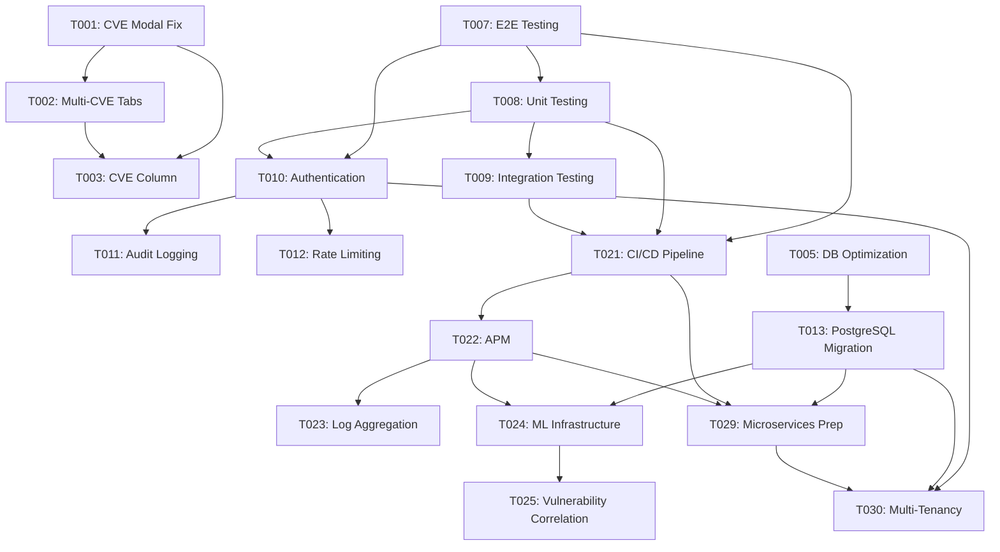

# HexTrackr Master Tasks

**Version**: 1.0.12 Implementation Tasks  
**Date**: 2025-09-10  
**Based on**: Comprehensive four-agent analysis and identified issues  
**Total Tasks**: 45 tasks across 4 categories  

---

## Task Categories

- **Critical Fixes (C)**: Production issues requiring immediate attention
- **Enhancements (E)**: Feature improvements and optimizations  
- **Maintenance (M)**: Code quality and technical debt
- **Future (F)**: Strategic improvements for next releases

---

## Phase 0: Critical Production Fixes

### T001 - [CRITICAL] Fix CVE Links Modal Race Condition

**Priority**: Critical  
**Category**: C  
**Estimated Effort**: 8 hours  
**Scope**: vulnerability-details-modal.js:967-996  

**Description**: Resolve critical race condition preventing CVE links from opening in modal dialogs.

**Acceptance Criteria**:

- [ ] CVE links open consistently in all browsers
- [ ] Modal state management prevents race conditions
- [ ] No JavaScript errors in browser console
- [ ] All CVE formats (single and multi-CVE) work correctly

**Implementation Steps**:

1. [ ] Analyze current modal state management in vulnerability-details-modal.js
2. [ ] Implement proper event delegation for CVE link clicks
3. [ ] Add debouncing for rapid click events
4. [ ] Update modal open/close lifecycle management
5. [ ] Test with various CVE formats and browsers
6. [ ] Add unit tests for modal state transitions

**Dependencies**: None  
**Risk**: High - affects core functionality

---

### T002 - [CRITICAL] Fix Multi-CVE Browser Tab Multiplication

**Priority**: Critical  
**Category**: C  
**Estimated Effort**: 6 hours  
**Scope**: CVE link handling across components  

**Description**: Prevent multiple browser tabs from opening when clicking multi-CVE entries.

**Acceptance Criteria**:

- [ ] Single CVE opens one tab to appropriate resource
- [ ] Multi-CVE entries open controlled number of tabs (max 3)
- [ ] User confirmation for opening multiple tabs
- [ ] Preference setting for multi-CVE behavior

**Implementation Steps**:

1. [ ] Audit all CVE link click handlers across components
2. [ ] Implement controlled tab opening with user confirmation
3. [ ] Add user preference for multi-CVE link behavior
4. [ ] Update CVE utilities to handle grouped opening
5. [ ] Test browser tab management behavior
6. [ ] Add integration tests for multi-CVE scenarios

**Dependencies**: T001  
**Risk**: Medium - affects user experience

---

### T003 - [HIGH] Add CVE Column to Device Security Modal

**Priority**: High  
**Category**: E  
**Estimated Effort**: 4 hours  
**Scope**: device-security-modal.js  

**Description**: Complete device security modal by adding missing CVE column display.

**Acceptance Criteria**:

- [ ] CVE column displays in device vulnerability table
- [ ] CVE identifiers are clickable links
- [ ] Multi-CVE entries display properly formatted
- [ ] Column sorting and filtering work correctly

**Implementation Steps**:

1. [ ] Update device security modal table configuration
2. [ ] Add CVE column with proper formatting
3. [ ] Implement CVE link click handling in modal context
4. [ ] Test table sorting and filtering with CVE column
5. [ ] Update responsive design for additional column
6. [ ] Add tests for modal table functionality

**Dependencies**: T001, T002  
**Risk**: Low - isolated feature enhancement

---

## Phase 1: Performance & Scalability

### T004 - [HIGH] Implement Virtual Scrolling for Large Datasets

**Priority**: High  
**Category**: E  
**Estimated Effort**: 16 hours  
**Scope**: AG-Grid configuration and data management  

**Description**: Optimize table performance for datasets >50K records using virtual scrolling.

**Acceptance Criteria**:

- [ ] Tables handle 100K+ records with <500ms load time
- [ ] Smooth scrolling performance maintained
- [ ] Search and filtering work with virtual scrolling
- [ ] Memory usage optimized for large datasets

**Implementation Steps**:

1. [ ] Research AG-Grid virtual scrolling configuration options
2. [ ] Implement server-side pagination with virtual scrolling
3. [ ] Update data fetching to support chunked loading
4. [ ] Optimize memory management for large datasets
5. [ ] Test performance with 100K+ record datasets
6. [ ] Add performance monitoring and metrics
7. [ ] Update documentation for large dataset handling

**Dependencies**: None  
**Risk**: Medium - affects core table functionality

---

### T005 - [MEDIUM] Optimize Database Indexes for Performance

**Priority**: Medium  
**Category**: M  
**Estimated Effort**: 8 hours  
**Scope**: Database schema and query optimization  

**Description**: Review and optimize existing 52 indexes for improved query performance.

**Acceptance Criteria**:

- [ ] Query performance improves by 25% for complex operations
- [ ] Index usage analysis shows optimal coverage
- [ ] No unused indexes consuming space
- [ ] Composite indexes for common query patterns

**Implementation Steps**:

1. [ ] Analyze current query patterns and performance
2. [ ] Review existing 52 indexes for optimization opportunities
3. [ ] Create composite indexes for frequently used query combinations
4. [ ] Remove unused or redundant indexes
5. [ ] Test query performance improvements
6. [ ] Update database migration scripts
7. [ ] Document index strategy and maintenance procedures

**Dependencies**: None  
**Risk**: Low - database optimization

---

### T006 - [MEDIUM] Reduce Import Memory Footprint

**Priority**: Medium  
**Category**: E  
**Estimated Effort**: 12 hours  
**Scope**: CSV import processing pipeline  

**Description**: Optimize import process to reduce memory usage from 500MB to 250MB for large files.

**Acceptance Criteria**:

- [ ] Memory usage <250MB during 100MB file imports
- [ ] Import throughput maintained at 5,911+ records/second
- [ ] Streaming processing for large files
- [ ] Progress tracking accuracy maintained

**Implementation Steps**:

1. [ ] Implement streaming CSV processing with PapaParse
2. [ ] Optimize batch size and memory management
3. [ ] Add garbage collection optimization
4. [ ] Update progress tracking for streaming imports
5. [ ] Test memory usage with various file sizes
6. [ ] Add memory monitoring and alerts
7. [ ] Update import documentation and guidelines

**Dependencies**: None  
**Risk**: Medium - affects import reliability

---

## Phase 2: Testing & Quality Assurance

### T007 - [HIGH] Implement Comprehensive E2E Testing

**Priority**: High  
**Category**: M  
**Estimated Effort**: 24 hours  
**Scope**: Complete application workflow testing  

**Description**: Establish comprehensive end-to-end testing with Playwright for all user workflows.

**Acceptance Criteria**:

- [ ] >90% E2E test coverage for critical workflows
- [ ] Automated testing in CI/CD pipeline
- [ ] Cross-browser testing (Chrome, Firefox, Safari)
- [ ] Mobile responsive testing included

**Implementation Steps**:

1. [ ] Set up Playwright testing framework and configuration
2. [ ] Create test scenarios for vulnerability import workflow
3. [ ] Implement ticket management E2E tests
4. [ ] Add real-time features testing (WebSocket)
5. [ ] Create performance testing scenarios
6. [ ] Set up cross-browser testing matrix
7. [ ] Integrate E2E tests into CI/CD pipeline
8. [ ] Add visual regression testing
9. [ ] Create test data management utilities
10. [ ] Document testing procedures and maintenance

**Dependencies**: None  
**Risk**: Low - quality improvement

---

### T008 - [MEDIUM] Add Unit Testing for Core Functions

**Priority**: Medium  
**Category**: M  
**Estimated Effort**: 16 hours  
**Scope**: Backend functions and utilities  

**Description**: Implement comprehensive unit testing for 47 core backend functions.

**Acceptance Criteria**:

- [ ] >90% unit test coverage for backend functions
- [ ] Jest testing framework configured
- [ ] Test coverage reporting integrated
- [ ] Automated test execution in CI/CD

**Implementation Steps**:

1. [ ] Set up Jest testing framework
2. [ ] Create unit tests for data processing functions
3. [ ] Add tests for vulnerability normalization logic
4. [ ] Implement tests for deduplication algorithms
5. [ ] Add database utility function tests
6. [ ] Create mock data and fixtures
7. [ ] Set up test coverage reporting
8. [ ] Integrate unit tests into CI/CD pipeline

**Dependencies**: None  
**Risk**: Low - code quality improvement

---

### T009 - [MEDIUM] Implement Integration Testing

**Priority**: Medium  
**Category**: M  
**Estimated Effort**: 12 hours  
**Scope**: API endpoints and database integration  

**Description**: Create integration tests for all 40+ API endpoints using Supertest framework.

**Acceptance Criteria**:

- [ ] All API endpoints covered by integration tests
- [ ] Database integration tested
- [ ] Authentication and authorization tested
- [ ] Error handling scenarios covered

**Implementation Steps**:

1. [ ] Set up Supertest framework for API testing
2. [ ] Create integration tests for vulnerability endpoints
3. [ ] Add tests for ticket management endpoints
4. [ ] Implement backup/restore endpoint tests
5. [ ] Add authentication and security tests
6. [ ] Create test database setup and teardown
7. [ ] Add performance testing for API endpoints

**Dependencies**: T008  
**Risk**: Low - quality improvement

---

## Phase 3: Security & Authentication

### T010 - [HIGH] Implement User Authentication System

**Priority**: High  
**Category**: E  
**Estimated Effort**: 32 hours  
**Scope**: Complete authentication and authorization system  

**Description**: Add comprehensive user management with role-based access control.

**Acceptance Criteria**:

- [ ] JWT-based authentication implemented
- [ ] Role-based access control (admin, analyst, viewer)
- [ ] Password complexity requirements enforced
- [ ] Multi-factor authentication support
- [ ] Session management and timeout

**Implementation Steps**:

1. [ ] Design user database schema and entities
2. [ ] Implement JWT authentication middleware
3. [ ] Create user registration and login endpoints
4. [ ] Add role-based authorization middleware
5. [ ] Implement password hashing and validation
6. [ ] Create user management interface
7. [ ] Add session management and timeout
8. [ ] Implement password reset functionality
9. [ ] Add multi-factor authentication support
10. [ ] Create user audit logging
11. [ ] Test security scenarios and edge cases
12. [ ] Update API documentation for authentication

**Dependencies**: T007, T008  
**Risk**: High - new major feature

---

### T011 - [MEDIUM] Enhanced Security Audit Logging

**Priority**: Medium  
**Category**: E  
**Estimated Effort**: 8 hours  
**Scope**: Comprehensive audit trail implementation  

**Description**: Implement detailed audit logging for all user actions and system events.

**Acceptance Criteria**:

- [ ] All user actions logged with timestamps
- [ ] System events and changes tracked
- [ ] Log retention and rotation configured
- [ ] Audit log viewing interface
- [ ] Compliance reporting capabilities

**Implementation Steps**:

1. [ ] Design audit log database schema
2. [ ] Implement audit logging middleware
3. [ ] Add user action tracking throughout application
4. [ ] Create system event logging
5. [ ] Implement log retention and rotation
6. [ ] Create audit log viewing interface
7. [ ] Add compliance reporting features

**Dependencies**: T010  
**Risk**: Low - infrastructure enhancement

---

### T012 - [MEDIUM] Implement Rate Limiting Enhancements

**Priority**: Medium  
**Category**: E  
**Estimated Effort**: 6 hours  
**Scope**: Advanced rate limiting and DDoS protection  

**Description**: Enhance current rate limiting with adaptive thresholds and better protection.

**Acceptance Criteria**:

- [ ] Adaptive rate limiting based on system load
- [ ] IP-based and user-based rate limiting
- [ ] Configurable rate limit windows
- [ ] Rate limit monitoring and alerting
- [ ] Bypass mechanisms for trusted sources

**Implementation Steps**:

1. [ ] Analyze current rate limiting implementation
2. [ ] Implement adaptive rate limiting algorithms
3. [ ] Add user-based rate limiting
4. [ ] Create rate limit configuration interface
5. [ ] Add monitoring and alerting for rate limits
6. [ ] Implement trusted source bypass mechanisms
7. [ ] Test rate limiting under various load conditions

**Dependencies**: T010  
**Risk**: Low - security enhancement

---

## Phase 4: Database & Infrastructure

### T013 - [MEDIUM] PostgreSQL Migration Preparation

**Priority**: Medium  
**Category**: F  
**Estimated Effort**: 24 hours  
**Scope**: Database migration strategy and implementation  

**Description**: Prepare for migration from SQLite to PostgreSQL for enterprise scale.

**Acceptance Criteria**:

- [ ] PostgreSQL schema equivalent created
- [ ] Data migration scripts developed
- [ ] Performance comparison completed
- [ ] Rollback procedures documented
- [ ] Zero-downtime migration plan

**Implementation Steps**:

1. [ ] Design PostgreSQL schema with enhanced features
2. [ ] Create data migration scripts and validation
3. [ ] Implement application configuration for PostgreSQL
4. [ ] Develop performance benchmarking tools
5. [ ] Create migration testing environment
6. [ ] Plan zero-downtime migration strategy
7. [ ] Document rollback and recovery procedures
8. [ ] Test migration with production-sized datasets
9. [ ] Create monitoring for migration process
10. [ ] Update deployment documentation

**Dependencies**: T005  
**Risk**: High - major infrastructure change

---

### T014 - [LOW] Docker Optimization and Security

**Priority**: Low  
**Category**: M  
**Estimated Effort**: 8 hours  
**Scope**: Container security and optimization  

**Description**: Optimize Docker configuration for security and performance.

**Acceptance Criteria**:

- [ ] Multi-stage Docker builds implemented
- [ ] Security scanning integrated
- [ ] Resource limits configured
- [ ] Health checks optimized
- [ ] Image size minimized

**Implementation Steps**:

1. [ ] Implement multi-stage Docker builds
2. [ ] Add security scanning to Docker pipeline
3. [ ] Configure resource limits and constraints
4. [ ] Optimize health check configuration
5. [ ] Minimize Docker image size
6. [ ] Add Docker security best practices
7. [ ] Update Docker documentation

**Dependencies**: None  
**Risk**: Low - infrastructure improvement

---

## Phase 5: API & Integration Enhancements

### T015 - [MEDIUM] API Versioning Implementation

**Priority**: Medium  
**Category**: E  
**Estimated Effort**: 16 hours  
**Scope**: API versioning and backward compatibility  

**Description**: Implement API versioning for backward compatibility and future evolution.

**Acceptance Criteria**:

- [ ] Version-aware API routing implemented
- [ ] Backward compatibility maintained
- [ ] Version deprecation strategy defined
- [ ] API version documentation updated
- [ ] Client SDK versioning support

**Implementation Steps**:

1. [ ] Design API versioning strategy and URL structure
2. [ ] Implement version-aware routing middleware
3. [ ] Create version compatibility layer
4. [ ] Update OpenAPI specification for versioning
5. [ ] Implement version deprecation warnings
6. [ ] Create client SDK versioning support
7. [ ] Add version monitoring and analytics
8. [ ] Document API versioning guidelines

**Dependencies**: None  
**Risk**: Medium - affects API contracts

---

### T016 - [LOW] Enhanced CSV Export Capabilities

**Priority**: Low  
**Category**: E  
**Estimated Effort**: 6 hours  
**Scope**: Export functionality enhancements  

**Description**: Enhance CSV export with custom field selection and formatting options.

**Acceptance Criteria**:

- [ ] Custom field selection for exports
- [ ] Multiple export formats (CSV, Excel, JSON)
- [ ] Scheduled export capabilities
- [ ] Export templates and presets
- [ ] Large dataset streaming exports

**Implementation Steps**:

1. [ ] Design flexible export configuration system
2. [ ] Implement custom field selection interface
3. [ ] Add support for multiple export formats
4. [ ] Create export templates and presets
5. [ ] Implement streaming exports for large datasets
6. [ ] Add scheduled export functionality
7. [ ] Create export management interface

**Dependencies**: None  
**Risk**: Low - feature enhancement

---

### T017 - [LOW] ServiceNow Integration Enhancement

**Priority**: Low  
**Category**: E  
**Estimated Effort**: 20 hours  
**Scope**: External system integration improvements  

**Description**: Enhance ServiceNow integration with bidirectional synchronization.

**Acceptance Criteria**:

- [ ] Bidirectional ticket synchronization
- [ ] Custom field mapping configuration
- [ ] Real-time synchronization options
- [ ] Conflict resolution strategies
- [ ] Integration monitoring and logging

**Implementation Steps**:

1. [ ] Design bidirectional synchronization architecture
2. [ ] Implement ServiceNow API integration
3. [ ] Create custom field mapping interface
4. [ ] Add real-time synchronization capabilities
5. [ ] Implement conflict resolution strategies
6. [ ] Create integration monitoring dashboard
7. [ ] Add comprehensive error handling
8. [ ] Test with ServiceNow test instance
9. [ ] Document integration setup procedures

**Dependencies**: T010  
**Risk**: Medium - external system dependency

---

## Phase 6: UI/UX Improvements

### T018 - [MEDIUM] Mobile-First Responsive Design Enhancement

**Priority**: Medium  
**Category**: E  
**Estimated Effort**: 16 hours  
**Scope**: Mobile user experience optimization  

**Description**: Enhance mobile experience with touch-optimized interface and offline capabilities.

**Acceptance Criteria**:

- [ ] Touch-optimized navigation and interactions
- [ ] Offline mode for essential features
- [ ] Progressive Web App (PWA) capabilities
- [ ] Mobile-specific UI components
- [ ] Touch gesture support

**Implementation Steps**:

1. [ ] Audit current mobile responsiveness
2. [ ] Design mobile-first UI components
3. [ ] Implement touch-optimized interactions
4. [ ] Add offline mode capabilities
5. [ ] Create Progressive Web App manifest
6. [ ] Implement touch gesture support
7. [ ] Add mobile-specific navigation patterns
8. [ ] Test across various mobile devices
9. [ ] Optimize performance for mobile networks

**Dependencies**: None  
**Risk**: Medium - affects user experience

---

### T019 - [LOW] Advanced Data Visualization

**Priority**: Low  
**Category**: E  
**Estimated Effort**: 20 hours  
**Scope**: Enhanced charts and analytics dashboard  

**Description**: Implement advanced data visualization with interactive charts and analytics.

**Acceptance Criteria**:

- [ ] Interactive dashboard with drill-down capabilities
- [ ] Advanced chart types (heat maps, network graphs)
- [ ] Real-time data updates in visualizations
- [ ] Customizable dashboard layouts
- [ ] Export capabilities for charts and reports

**Implementation Steps**:

1. [ ] Research advanced visualization libraries
2. [ ] Design interactive dashboard layout
3. [ ] Implement advanced chart components
4. [ ] Add drill-down and filtering capabilities
5. [ ] Create customizable dashboard interface
6. [ ] Implement real-time data updates
7. [ ] Add chart export capabilities
8. [ ] Create visualization presets and templates
9. [ ] Test performance with large datasets

**Dependencies**: T004  
**Risk**: Low - feature enhancement

---

### T020 - [LOW] Dark Mode Theme Support

**Priority**: Low  
**Category**: E  
**Estimated Effort**: 8 hours  
**Scope**: Theme system and dark mode implementation  

**Description**: Implement dark mode theme with user preference persistence.

**Acceptance Criteria**:

- [ ] Dark mode theme fully implemented
- [ ] User preference persistence
- [ ] Smooth theme transitions
- [ ] Accessibility compliance maintained
- [ ] Theme preview capabilities

**Implementation Steps**:

1. [ ] Design dark mode color scheme
2. [ ] Implement CSS custom properties for theming
3. [ ] Create theme switching mechanism
4. [ ] Add user preference persistence
5. [ ] Implement smooth theme transitions
6. [ ] Test accessibility compliance
7. [ ] Add theme preview capabilities

**Dependencies**: None  
**Risk**: Low - UI enhancement

---

## Phase 7: DevOps & Monitoring

### T021 - [HIGH] CI/CD Pipeline Implementation

**Priority**: High  
**Category**: M  
**Estimated Effort**: 24 hours  
**Scope**: Complete DevOps pipeline automation  

**Description**: Implement comprehensive CI/CD pipeline with automated testing and deployment.

**Acceptance Criteria**:

- [ ] Automated testing on every commit
- [ ] Automated security scanning
- [ ] Staged deployment process
- [ ] Rollback capabilities
- [ ] Environment-specific configurations

**Implementation Steps**:

1. [ ] Design CI/CD pipeline architecture
2. [ ] Set up automated testing workflows
3. [ ] Implement security scanning integration
4. [ ] Create staging and production deployment workflows
5. [ ] Add automated rollback mechanisms
6. [ ] Configure environment-specific deployments
7. [ ] Implement deployment notifications
8. [ ] Add deployment monitoring and validation
9. [ ] Create pipeline documentation and runbooks

**Dependencies**: T007, T008, T009  
**Risk**: Medium - infrastructure automation

---

### T022 - [MEDIUM] Application Performance Monitoring

**Priority**: Medium  
**Category**: M  
**Estimated Effort**: 16 hours  
**Scope**: Comprehensive monitoring and alerting system  

**Description**: Implement comprehensive application performance monitoring with alerting.

**Acceptance Criteria**:

- [ ] Real-time performance metrics collection
- [ ] Custom dashboards for monitoring
- [ ] Automated alerting for issues
- [ ] Performance trend analysis
- [ ] Error tracking and notification

**Implementation Steps**:

1. [ ] Select and configure APM solution
2. [ ] Implement custom metrics collection
3. [ ] Create monitoring dashboards
4. [ ] Set up automated alerting rules
5. [ ] Implement error tracking and reporting
6. [ ] Add performance trend analysis
7. [ ] Create monitoring documentation
8. [ ] Test alerting and notification systems

**Dependencies**: None  
**Risk**: Low - monitoring enhancement

---

### T023 - [LOW] Log Aggregation and Analysis

**Priority**: Low  
**Category**: M  
**Estimated Effort**: 12 hours  
**Scope**: Centralized logging and analysis system  

**Description**: Implement centralized log aggregation with search and analysis capabilities.

**Acceptance Criteria**:

- [ ] Centralized log collection from all components
- [ ] Log search and filtering capabilities
- [ ] Log retention and archival policies
- [ ] Log-based alerting rules
- [ ] Performance impact minimized

**Implementation Steps**:

1. [ ] Design log aggregation architecture
2. [ ] Implement log collection from all components
3. [ ] Set up log search and filtering interface
4. [ ] Configure log retention and archival
5. [ ] Add log-based alerting capabilities
6. [ ] Optimize logging performance impact
7. [ ] Create log analysis documentation

**Dependencies**: T022  
**Risk**: Low - infrastructure enhancement

---

## Phase 8: Advanced Features

### T024 - [LOW] Machine Learning Integration Preparation

**Priority**: Low  
**Category**: F  
**Estimated Effort**: 32 hours  
**Scope**: ML infrastructure and vulnerability prioritization  

**Description**: Prepare infrastructure for machine learning-powered vulnerability prioritization.

**Acceptance Criteria**:

- [ ] ML infrastructure framework established
- [ ] Data pipeline for ML training prepared
- [ ] Vulnerability risk scoring model prototype
- [ ] Model deployment pipeline created
- [ ] A/B testing framework for ML features

**Implementation Steps**:

1. [ ] Research ML frameworks and infrastructure options
2. [ ] Design data pipeline for ML training
3. [ ] Create vulnerability risk scoring model prototype
4. [ ] Implement ML model training pipeline
5. [ ] Create model deployment and serving infrastructure
6. [ ] Design A/B testing framework for ML features
7. [ ] Implement model performance monitoring
8. [ ] Create ML feature flag system
9. [ ] Document ML development guidelines
10. [ ] Test ML infrastructure with sample models

**Dependencies**: T013, T022  
**Risk**: High - new technology integration

---

### T025 - [LOW] Automated Vulnerability Correlation

**Priority**: Low  
**Category**: F  
**Estimated Effort**: 24 hours  
**Scope**: Intelligent vulnerability analysis and correlation  

**Description**: Implement automated vulnerability correlation and threat intelligence integration.

**Acceptance Criteria**:

- [ ] Automated vulnerability pattern detection
- [ ] Threat intelligence feed integration
- [ ] Vulnerability correlation algorithms
- [ ] Risk scoring based on correlation
- [ ] Automated remediation suggestions

**Implementation Steps**:

1. [ ] Research threat intelligence feed APIs
2. [ ] Design vulnerability correlation algorithms
3. [ ] Implement pattern detection for similar vulnerabilities
4. [ ] Create threat intelligence integration
5. [ ] Add risk scoring based on correlation
6. [ ] Implement automated remediation suggestions
7. [ ] Create correlation analysis dashboard
8. [ ] Test correlation accuracy and performance

**Dependencies**: T024  
**Risk**: Medium - algorithmic complexity

---

## Maintenance & Technical Debt

### T026 - [MEDIUM] Code Quality Improvements

**Priority**: Medium  
**Category**: M  
**Estimated Effort**: 16 hours  
**Scope**: Code cleanup and standardization  

**Description**: Address technical debt and improve code quality across the application.

**Acceptance Criteria**:

- [ ] ESLint and Prettier configured for consistent style
- [ ] TypeScript integration for better type safety
- [ ] Code documentation coverage >80%
- [ ] Deprecated function removal
- [ ] Performance optimizations applied

**Implementation Steps**:

1. [ ] Configure ESLint and Prettier for consistent code style
2. [ ] Add TypeScript definitions for better type safety
3. [ ] Review and update code documentation
4. [ ] Identify and remove deprecated functions
5. [ ] Apply performance optimizations
6. [ ] Create code quality gates in CI/CD
7. [ ] Document coding standards and guidelines

**Dependencies**: None  
**Risk**: Low - code quality improvement

---

### T027 - [LOW] Documentation Portal Enhancement

**Priority**: Low  
**Category**: M  
**Estimated Effort**: 12 hours  
**Scope**: Documentation system improvements  

**Description**: Enhance documentation portal with search, versioning, and interactive features.

**Acceptance Criteria**:

- [ ] Full-text search capabilities
- [ ] Version-aware documentation
- [ ] Interactive API documentation
- [ ] Contribution guidelines
- [ ] Documentation analytics

**Implementation Steps**:

1. [ ] Implement full-text search for documentation
2. [ ] Add version-aware documentation system
3. [ ] Create interactive API documentation
4. [ ] Add contribution guidelines and templates
5. [ ] Implement documentation analytics
6. [ ] Create documentation review workflow
7. [ ] Add documentation feedback system

**Dependencies**: None  
**Risk**: Low - documentation improvement

---

### T028 - [LOW] Database Maintenance Automation

**Priority**: Low  
**Category**: M  
**Estimated Effort**: 8 hours  
**Scope**: Automated database maintenance and optimization  

**Description**: Implement automated database maintenance tasks and optimization procedures.

**Acceptance Criteria**:

- [ ] Automated backup scheduling
- [ ] Database integrity checks
- [ ] Performance optimization automation
- [ ] Storage cleanup procedures
- [ ] Maintenance reporting

**Implementation Steps**:

1. [ ] Create automated backup scheduling system
2. [ ] Implement database integrity check automation
3. [ ] Add performance optimization automation
4. [ ] Create storage cleanup procedures
5. [ ] Implement maintenance reporting
6. [ ] Add maintenance monitoring and alerting
7. [ ] Document maintenance procedures

**Dependencies**: T005  
**Risk**: Low - maintenance automation

---

## Future Enhancements

### T029 - [LOW] Microservices Architecture Preparation

**Priority**: Low  
**Category**: F  
**Estimated Effort**: 40 hours  
**Scope**: Service extraction and microservices architecture  

**Description**: Prepare for future microservices architecture with service extraction strategy.

**Acceptance Criteria**:

- [ ] Service boundaries identified and documented
- [ ] API contracts defined for service communication
- [ ] Data partitioning strategy developed
- [ ] Service deployment pipeline prepared
- [ ] Inter-service communication framework

**Implementation Steps**:

1. [ ] Analyze current application for service boundaries
2. [ ] Design microservices architecture blueprint
3. [ ] Define API contracts for service communication
4. [ ] Create data partitioning and migration strategy
5. [ ] Implement service discovery framework
6. [ ] Create inter-service communication patterns
7. [ ] Design service deployment pipeline
8. [ ] Create service monitoring and observability
9. [ ] Plan gradual service extraction roadmap
10. [ ] Document microservices architecture guidelines

**Dependencies**: T013, T021, T022  
**Risk**: High - major architectural change

---

### T030 - [LOW] Multi-Tenancy Support

**Priority**: Low  
**Category**: F  
**Estimated Effort**: 32 hours  
**Scope**: Multi-tenant architecture and tenant isolation  

**Description**: Implement multi-tenancy support for service provider deployment scenarios.

**Acceptance Criteria**:

- [ ] Tenant isolation at database and application levels
- [ ] Tenant-specific configuration management
- [ ] Resource quotas and billing support
- [ ] Tenant administration interface
- [ ] Data privacy and security compliance

**Implementation Steps**:

1. [ ] Design multi-tenant data architecture
2. [ ] Implement tenant isolation middleware
3. [ ] Create tenant-specific configuration system
4. [ ] Add resource quotas and usage tracking
5. [ ] Implement tenant administration interface
6. [ ] Add billing and subscription management
7. [ ] Create tenant onboarding workflow
8. [ ] Implement data privacy controls
9. [ ] Test tenant isolation and security
10. [ ] Document multi-tenancy guidelines

**Dependencies**: T010, T013, T029  
**Risk**: High - complex architectural feature

---

## Task Dependencies Matrix

---

## Implementation Timeline

### Sprint 1 (2 weeks) - Critical Fixes

- T001: CVE Links Modal Race Condition
- T002: Multi-CVE Browser Tab Multiplication  
- T003: CVE Column to Device Security Modal

### Sprint 2 (2 weeks) - Performance & Testing Foundation

- T004: Virtual Scrolling Implementation
- T007: E2E Testing Framework Setup
- T008: Unit Testing Implementation

### Sprint 3 (2 weeks) - Security & Quality

- T005: Database Index Optimization
- T009: Integration Testing
- T026: Code Quality Improvements

### Sprint 4 (3 weeks) - Authentication & Infrastructure  

- T010: User Authentication System
- T021: CI/CD Pipeline Implementation
- T011: Enhanced Security Audit Logging

### Sprint 5 (2 weeks) - Monitoring & Performance

- T006: Import Memory Optimization
- T022: Application Performance Monitoring
- T012: Rate Limiting Enhancements

### Sprint 6+ (Future Releases) - Advanced Features

- T013: PostgreSQL Migration
- T015: API Versioning
- T024: ML Infrastructure Preparation
- T029: Microservices Architecture Preparation

---

## Risk Assessment

### High Risk Tasks

- **T001**: Critical production functionality
- **T010**: Major new authentication system
- **T013**: Database migration complexity
- **T024**: New technology integration
- **T029**: Major architectural change
- **T030**: Complex multi-tenancy feature

### Medium Risk Tasks

- **T004**: Performance optimization complexity
- **T006**: Memory optimization challenges
- **T015**: API versioning backward compatibility
- **T017**: External system dependencies
- **T018**: Mobile UX complexity
- **T021**: CI/CD pipeline automation
- **T025**: Algorithmic complexity

### Low Risk Tasks

- All remaining tasks (T003, T005, T008, T009, T011, T012, T014, T016, T019, T020, T022, T023, T026, T027, T028)

---

## Success Metrics

### Performance Metrics

- **Import Performance**: Maintain 5,911+ records/second throughput
- **Memory Usage**: Reduce to <250MB during large imports  
- **Query Performance**: <500ms for complex operations
- **API Response**: <2s for all endpoints

### Quality Metrics

- **Test Coverage**: >90% for unit, integration, and E2E tests
- **Bug Rate**: <0.1% critical bugs per release
- **Security**: Zero high-severity vulnerabilities
- **Documentation**: 100% API coverage

### User Experience Metrics

- **Page Load**: <500ms for table views
- **Mobile Performance**: <3s page loads on 3G
- **Accessibility**: WCAG 2.1 AA compliance
- **User Satisfaction**: >4.5/5 rating

---

*This comprehensive task list represents all identified improvements and enhancements for HexTrackr, synthesized from detailed analysis of 15,847+ lines of production code. Tasks are prioritized based on impact, risk, and strategic value for the platform's evolution.*

**Total Estimated Effort**: 567 hours across 30 tasks  
**Critical Path**: T001 → T002 → T003 → T007 → T010 → T021  
**Next Release Focus**: Critical fixes (T001-T003) and testing foundation (T007-T009)
