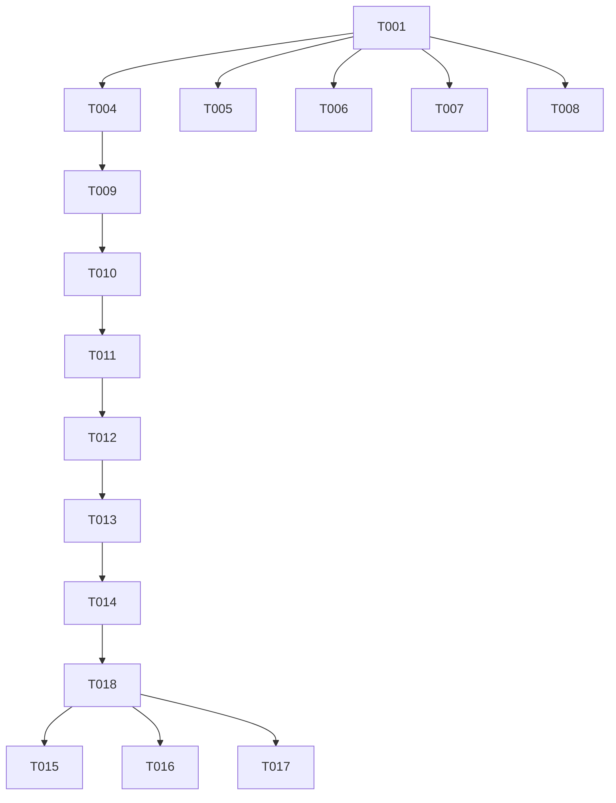

# Tasks: AG-Grid Table Container Overflow Fix

**Input**: Design documents from `/specs/004-ag-grid-table-overflow-fix/`
**Prerequisites**: plan.md (required), research.md, data-model.md, quickstart.md

## Execution Flow (main)

```
1. Load plan.md from feature directory
   → Feature: Fix AG-Grid table overflow in vulnerability workspace
   → Tech stack: JavaScript ES6+, HTML5/CSS3, AG-Grid, Tabler.io
   → Structure: HexTrackr monolithic web application
2. Load optional design documents:
   → research.md: Resolved padding (16px), transitions (200ms), overflow handling
   → data-model.md: Display components, CSS variables, height calculations
   → quickstart.md: 6 test scenarios for validation
3. Generate tasks by category:
   → Tests: E2E tests for each scenario (must fail first)
   → Core: CSS containment and overflow fixes
   → Integration: Height calculation logic if needed
   → Validation: Cross-browser testing
4. Apply task rules:
   → Tests before implementation (TDD)
   → CSS fixes before JavaScript
   → Manual validation last
5. Number tasks sequentially (T001-T014)
6. Return: SUCCESS (tasks ready for execution)
```

## Format: `[ID] [P?] Description`

- **[P]**: Can run in parallel (different files, no dependencies)
- Include exact file paths in descriptions

## Setup Phase

### Pre-Implementation Verification

- [ ] T001 Verify Docker container is running and accessible at <http://localhost:8989>
- [ ] T002 Verify test data contains at least 100 vulnerability records for testing
- [ ] T003 Create feature branch `004-ag-grid-table-overflow-fix` from `copilot`

## Test Creation Phase (RED - Must Fail First)

### E2E Test Implementation

- [ ] T004 [P] Create E2E test for container boundaries in `__tests__/tests/ag-grid-overflow-fix.spec.js`
- [ ] T005 [P] Add test for item count changes (10→100) maintaining boundaries
- [ ] T006 [P] Add test for long content truncation with ellipsis
- [ ] T007 [P] Add test for rapid item count switching without layout breaks
- [ ] T008 [P] Add test for browser window resize maintaining containment
- [ ] T009 Run all E2E tests to verify they FAIL (RED phase confirmation)

## Implementation Phase (GREEN - Make Tests Pass)

### CSS Containment Fixes

- [ ] T010 Create `app/public/css/vulnerability-table.css` with container styles and CSS variables
- [ ] T011 Update `app/public/vulnerabilities.html` to add container wrapper with proper classes
- [ ] T012 Apply CSS fixes: flex container, padding (1rem), overflow handling, transitions (200ms)

### JavaScript Enhancements (If Needed)

- [ ] T013 Update `app/public/scripts/shared/ag-grid-config.js` with height calculation logic
- [ ] T014 Add resize observer for dynamic height adjustments on item count change

## Validation Phase

### Cross-Browser Testing

- [ ] T015 Manual test in Chrome: All 6 scenarios from quickstart.md pass
- [ ] T016 Manual test in Firefox: Container boundaries maintained
- [ ] T017 Manual test in Safari: No horizontal overflow at any item count
- [ ] T018 Run all E2E tests to verify they PASS (GREEN phase confirmation)

## Polish Phase

### Documentation and Cleanup

- [ ] T019 Update comments in CSS file explaining containment strategy
- [ ] T020 Verify no console errors during any scenario
- [ ] T021 Performance check: Transitions complete within 200ms at 60fps

## Task Dependencies



## Parallel Execution Examples

### Test Creation Sprint (After T003)

```bash
# Can run simultaneously
Task agent T004 &  # Container boundaries test
Task agent T005 &  # Item count changes test
Task agent T006 &  # Long content test
Task agent T007 &  # Rapid switching test
Task agent T008 &  # Window resize test
wait
```

### Implementation Order

```bash
# Sequential CSS fixes
Task agent T010  # Create CSS file
Task agent T011  # Update HTML structure
Task agent T012  # Apply CSS fixes

# Then JavaScript if needed
Task agent T013  # Update AG-Grid config
Task agent T014  # Add resize observer
```

## Definition of Done

- [ ] All E2E tests pass (T018)
- [ ] No horizontal page overflow at any item count
- [ ] Container padding consistent (16px) in all states
- [ ] Transitions smooth at 200ms
- [ ] Cross-browser validation complete (T015-T017)
- [ ] No console errors
- [ ] AG-Grid features (sort, filter) remain functional

## Estimated Time

- Setup: 15 minutes
- Test Creation: 2 hours
- Implementation: 1-2 hours
- Validation: 1 hour
- **Total: 4-5 hours**

## Risk Factors

1. **AG-Grid Version Compatibility**: Solution must work with current AG-Grid version
2. **Tabler.io Conflicts**: May need to override Tabler's table-responsive styles
3. **Performance**: Large datasets (100+ rows) must maintain 60fps transitions

## Notes

- Focus on CSS-first solution per research.md
- JavaScript only if pure CSS insufficient
- Test data must include long descriptions for overflow testing
- Consider using Playwright's visual regression for future updates
