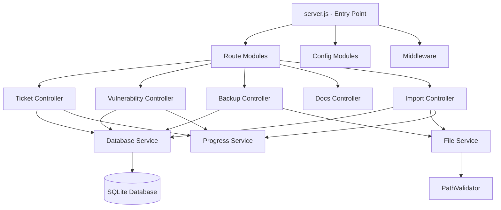

# Data Model: Backend Modularization

**Date**: 2025-09-16
**Feature**: Backend Modularization

## Module Architecture

### Core Module Relationships



## Module Entities

### 1. Route Module

**Purpose**: Define HTTP endpoints and route to controllers
**Properties**:

- `path`: string - The URL path pattern
- `method`: enum (GET, POST, PUT, DELETE, PATCH)
- `middleware`: array - Route-specific middleware
- `controller`: function - Handler reference

**Invariants**:

- Each route must map to exactly one controller method
- Routes cannot contain business logic
- Routes must preserve existing API contracts

### 2. Controller Module

**Purpose**: Handle request/response flow and orchestrate services
**Properties**:

- `request`: Express.Request - Incoming request
- `response`: Express.Response - Outgoing response
- `services`: object - Injected service dependencies

**State Transitions**:

- Receive Request → Validate Input → Call Service → Format Response → Send Response

**Invariants**:

- Controllers cannot directly access database
- Controllers must handle errors appropriately
- Controllers coordinate but don't implement business logic

### 3. Service Module

**Purpose**: Implement business logic and data access
**Properties**:

- `database`: Database - Database connection
- `config`: object - Service configuration
- `cache`: Map - Internal caching if needed

**Operations**:

- `create()`: Create new entity
- `read()`: Retrieve entity
- `update()`: Modify entity
- `delete()`: Remove entity
- `query()`: Complex queries

**Invariants**:

- Services are stateless between requests
- Services handle transactions internally
- Services validate business rules

### 4. Middleware Module

**Purpose**: Cross-cutting concerns applied to requests
**Properties**:

- `order`: number - Execution order priority
- `global`: boolean - Applied to all routes
- `config`: object - Middleware configuration

**Types**:

- Security: Headers, CORS, authentication
- Validation: Input sanitization, schema validation
- Utility: Logging, compression, parsing

### 5. Configuration Module

**Purpose**: Centralize application configuration
**Properties**:

- `database`: Database configuration
- `server`: Server settings (port, host)
- `middleware`: Middleware settings
- `features`: Feature flags

**Invariants**:

- Configuration is loaded once at startup
- Configuration is immutable during runtime
- Environment variables override defaults

## Dependency Rules

### Allowed Dependencies

```
Routes      → Controllers
Controllers → Services
Services    → Database, Utilities
Middleware  → Utilities
Config      → (none)
Utilities   → (none)
```

### Forbidden Dependencies (Prevent Circular)

```
Services    ✗ Controllers
Controllers ✗ Routes
Utilities   ✗ Services
Database    ✗ Services
Config      ✗ Any module
```

## Module Size Constraints

Per FR-009 requirement (max 500 lines):

| Module Type | Target Lines | Max Lines |
|------------|-------------|-----------|
| Route      | 50-100      | 200       |
| Controller | 100-200     | 300       |
| Service    | 200-400     | 500       |
| Middleware | 20-50       | 100       |
| Config     | 50-100      | 150       |
| Utility    | 50-150      | 200       |

## Database Schema (Unchanged)

The modularization does not change the database schema. Services will use the existing tables:

- `tickets` - Maintenance ticket records
- `vulnerabilities` - Security vulnerability records
- `vulnerability_imports` - Import history
- `vulnerability_snapshots` - Point-in-time snapshots

## Service Layer Patterns

### 1. Repository Pattern

```javascript
class BaseRepository {
  constructor(tableName, db) {
    this.table = tableName;
    this.db = db;
  }

  findAll(filters) { /* ... */ }
  findById(id) { /* ... */ }
  create(data) { /* ... */ }
  update(id, data) { /* ... */ }
  delete(id) { /* ... */ }
}
```

### 2. Transaction Management

```javascript
class TransactionManager {
  async executeInTransaction(operations) {
    await this.db.run("BEGIN");
    try {
      const result = await operations();
      await this.db.run("COMMIT");
      return result;
    } catch (error) {
      await this.db.run("ROLLBACK");
      throw error;
    }
  }
}
```

### 3. Query Builder

```javascript
class QueryBuilder {
  constructor(table) {
    this.table = table;
    this.conditions = [];
    this.orderBy = null;
    this.limitValue = null;
  }

  where(condition) { /* ... */ }
  order(field, direction) { /* ... */ }
  limit(count) { /* ... */ }
  build() { /* ... */ }
}
```

## Module Communication

### Event Flow

1. HTTP Request → Express Router
2. Router → Route Module
3. Route Module → Controller
4. Controller → Service(s)
5. Service → Database/FileSystem
6. Response flows back through same path

### Error Propagation

- Services throw domain-specific errors
- Controllers catch and transform to HTTP errors
- Global error middleware formats final response

### Shared State

- No shared mutable state between modules
- Configuration is read-only after initialization
- Database connection pool is managed centrally

## Performance Characteristics

### Module Loading

- Lazy loading: Modules loaded on first use
- Cached after initial load
- Estimated overhead: <50ms total startup

### Memory Usage

- Base Express app: ~30MB
- Per module overhead: ~0.5-1MB
- Total estimated: ~35MB (within 5% limit)

### Request Processing

- Additional layer overhead: <2ms per request
- Maintains <200ms response time requirement

---

*Data model defines the modular structure while preserving all existing functionality and meeting performance constraints.*
