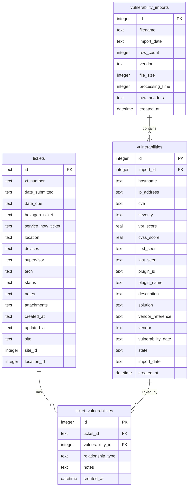
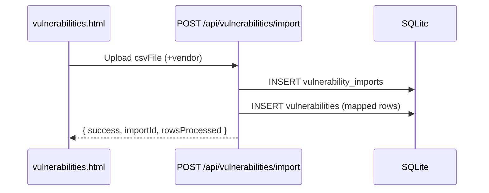
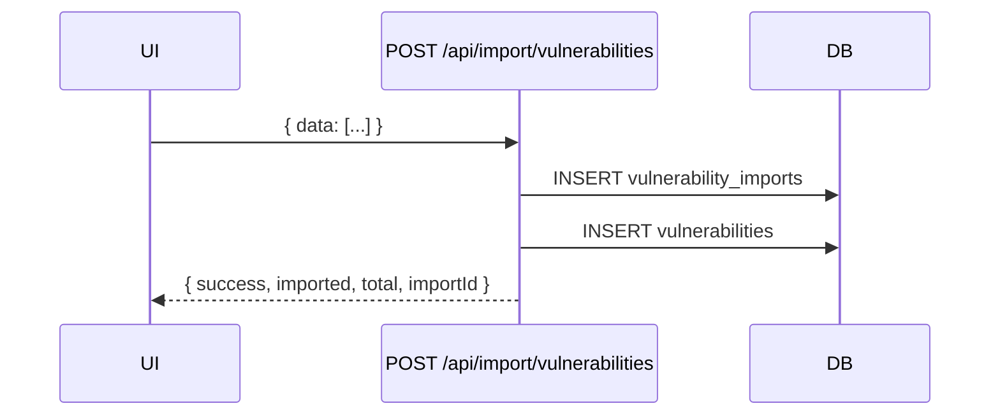

# Database Architecture

<!-- markdownlint-disable-next-line MD013 -->
HexTrackr uses SQLite as its primary storage at `data/hextrackr.db`, initialized by `scripts/init-database.js` with runtime schema evolution in `server.js`.

**Note**: The `data/schema.sql` file contains a simplified demo schema for testing purposes. The production schema is defined in `scripts/init-database.js`.

## Engine

- SQLite 3 (file-backed). Chosen for simplicity and zero-ops embedded deployment.

## Tables

### tickets

Created initially to mirror earlier localStorage fields; the server currently reads/writes additional columns. Expect schema evolution.

Initial columns (init-database.js):

- id TEXT PRIMARY KEY
- location TEXT NOT NULL
- devices TEXT (JSON array as string)
- description TEXT
- urgency TEXT
- category TEXT
- status TEXT DEFAULT 'Open'
- assigned_to TEXT
- created_date TEXT
- updated_date TEXT
- notes TEXT

Observed fields used by API (server.js):

- xt_number TEXT
- date_submitted TEXT
- date_due TEXT
- hexagon_ticket TEXT
- service_now_ticket TEXT
- supervisor TEXT
- tech TEXT
- attachments TEXT (JSON string)
- created_at TEXT
- updated_at TEXT
- site TEXT
- site_id INTEGER
- location_id INTEGER

Note: Some deployments may not yet have all observed columns. API may return nulls; migrations are in progress.

### vulnerability_imports

- id INTEGER PRIMARY KEY AUTOINCREMENT
- filename TEXT NOT NULL
- import_date TEXT NOT NULL
- row_count INTEGER NOT NULL
- vendor TEXT
- file_size INTEGER
- processing_time INTEGER
- raw_headers TEXT (JSON array of CSV headers)
- created_at DATETIME DEFAULT CURRENT_TIMESTAMP

### vulnerabilities

Initial columns (init-database.js):

- id INTEGER PRIMARY KEY AUTOINCREMENT
- import_id INTEGER NOT NULL (FK -> vulnerability_imports.id)
- hostname TEXT
- ip_address TEXT
- cve TEXT
- severity TEXT
- vpr_score REAL
- cvss_score REAL
- first_seen TEXT
- last_seen TEXT
- plugin_id TEXT
- plugin_name TEXT
- description TEXT
- solution TEXT
- vendor_reference TEXT
- created_at DATETIME DEFAULT CURRENT_TIMESTAMP

Runtime ALTERs added by server.js (idempotent):

- vendor TEXT DEFAULT ''
- vulnerability_date TEXT DEFAULT ''
- state TEXT DEFAULT 'open'
- import_date TEXT DEFAULT ''

### ticket_vulnerabilities

- id INTEGER PRIMARY KEY AUTOINCREMENT
- ticket_id TEXT NOT NULL (FK -> tickets.id)
- vulnerability_id INTEGER NOT NULL (FK -> vulnerabilities.id)
- relationship_type TEXT DEFAULT 'remediation'
- notes TEXT
- created_at DATETIME DEFAULT CURRENT_TIMESTAMP

## Indexes

- idx_vulnerabilities_hostname (vulnerabilities.hostname)
- idx_vulnerabilities_severity (vulnerabilities.severity)
- idx_vulnerabilities_cve (vulnerabilities.cve)
- idx_vulnerabilities_import (vulnerabilities.import_id)
- idx_ticket_vulns_ticket (ticket_vulnerabilities.ticket_id)

## Entity Relationships

<!-- markdownlint-disable MD013 MD010 -->

<!-- markdownlint-enable MD013 MD010 -->

## Data flows

### CSV import (multipart)

<!-- markdownlint-disable MD013 MD010 -->

<!-- markdownlint-enable MD013 MD010 -->

### JSON import (CSV parsed client-side)

<!-- markdownlint-disable MD013 MD010 -->

<!-- markdownlint-enable MD013 MD010 -->

## Notes and caveats

- Tickets schema drift: server endpoints expect additional columns not present in

  the initial table. Migrations will align these over time. Client code handles
  absent fields gracefully.

- Vulnerabilities table gains extra columns at runtime; re-running server on an

  existing DB is safe due to duplicate column guards.
